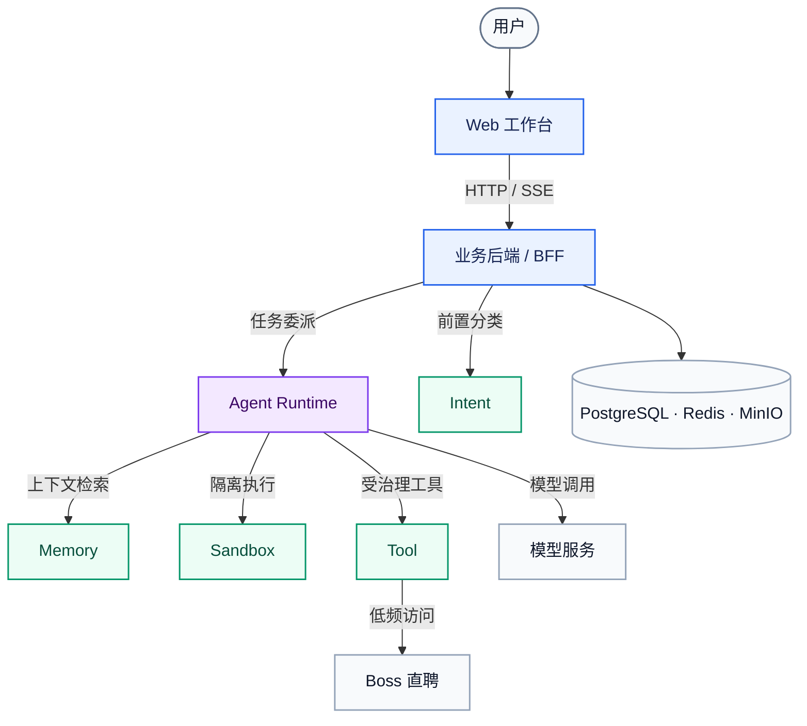
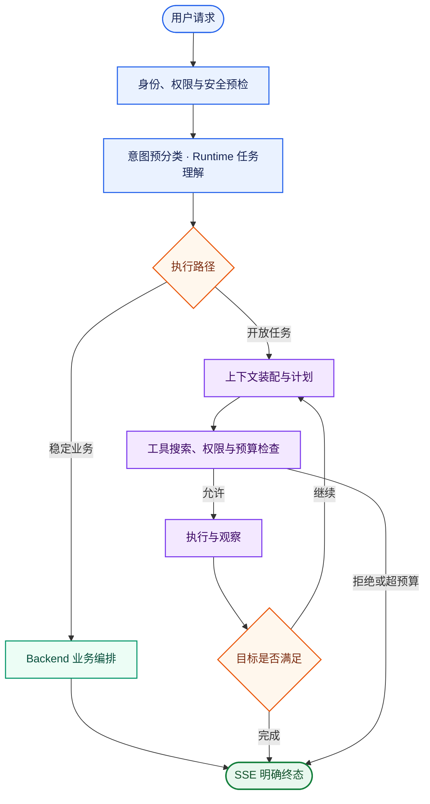

# JobBuddy

智能求职协同平台是一款覆盖求职全流程的本地 Agent 应用。平台将简历管理、岗位筛选、投递跟踪、面试准备和项目复盘集中在 Web 工作台，并由 Agent 串联信息检索、分析判断与任务执行。

系统采用 Vue 3、Spring Boot 和 Python Agent Runtime 构建。前端只访问 Java Backend；业务数据和事务由 Backend 管理，智能任务由 Runtime 执行，外部能力通过独立工具服务接入。

## 主要能力

| 场景       | 能力                                                        |
| ---------- | ----------------------------------------------------------- |
| 简历与画像 | PDF 简历库、简历撰写、求职画像、Boss 在线简历同步           |
| 岗位与决策 | 岗位检索、条件过滤、简历匹配、推荐质量门、收藏与详情快照    |
| 求职过程   | 求职旅程、投递记录、面试题库、代码练习、项目深挖            |
| Agent 协作 | 对话问答、任务规划、工具调用、长期记忆、Trace 与 Checkpoint |

## 系统架构



- 总图展示常规在线主链路；Backend 对 Memory、Sandbox 的专项调用以及 Tool 的内部依赖见详细架构文档。
- 浏览器不直接访问内部 Agent 服务。
- Backend 负责认证、权限、业务事务、文件与数据管理。
- Runtime 负责任务理解、规划、上下文装配、工具治理和执行状态。
- Harness 与 Eval 构成离线验证闭环，不进入常规对话的同步链路。

完整的服务边界、部署拓扑和降级策略见 [系统架构与核心链路](agent-doc/架构设计/系统架构与核心链路.md)。

## Agent 执行链路



Intent 提供前置分类提示，Runtime 负责执行期任务理解。稳定、确定的业务流程由 Backend 编排；开放式任务进入 Agent Loop，并在上下文、预算和权限约束下完成工具调用与结果验证。

Agent Loop 同时受最大轮次、工具调用数、失败次数和 Token 预算限制。成功、拒绝、中断、超时和异常路径都必须产生明确终态。

## 模块一览

| 模块                                         | 默认端口 | 技术与职责                                                             |
| -------------------------------------------- | -------: | ---------------------------------------------------------------------- |
| [`agent-frontend`](agent-frontend/README.md) |     5173 | Vue 3、Vite、Pinia；Web 工作台、状态管理和 SSE 增量渲染                |
| [`agent-backend`](agent-backend/README.md)   |     8080 | Java 17、Spring Boot；认证、RBAC、业务 API、文件与数据管理             |
| [`agent-runtime`](agent-runtime/README.md)   |     8010 | FastAPI、LangGraph；任务理解、Planner、Agent Loop、Trace 与 Checkpoint |
| [`agent-intent`](agent-intent/README.md)     |     8020 | FastAPI；意图预分类、澄清提示和高风险 Transcript 复核                  |
| [`agent-memory`](agent-memory/README.md)     |     8030 | FastAPI；长期记忆的写入、检索、更新、回滚、删除和过期清理              |
| [`agent-tool`](agent-tool/README.md)         |     8040 | FastAPI；工具注册与执行，包含 `boss_browser`                           |
| [`agent-eval`](agent-eval/README.md)         |     8050 | FastAPI；Trace、运行结果、能力和 LLM Judge 评估                        |
| [`agent-sandbox`](agent-sandbox/README.md)   |     8061 | FastAPI、`srt`；命令与代码隔离执行                                     |

`agent-doc/` 保存架构与能力文档，`.agent-harness/` 提供验证、评估、质量门禁、Goal 和 Loop，`scripts/` 提供环境同步、服务启停、格式化和产物清理。

模块之间通过 HTTP/SSE 契约协作，不直接依赖其他模块的内部实现。

## 环境要求

| 工具          | 要求                                    |
| ------------- | --------------------------------------- |
| Java          | JDK 17+                                 |
| Maven         | 3.8+；仓库不提供 Maven Wrapper          |
| Python        | 3.10+；`agent-runtime` 固定使用 3.10.16 |
| Python 包管理 | `uv`                                    |
| Node.js       | `^20.19.0` 或 `>=22.12.0`               |
| 数据服务      | PostgreSQL、Redis、MinIO                |
| 容器运行      | Docker Engine 与 Docker Compose，可选   |

本地运行 Sandbox 还需要安装上游 CLI：

```bash
npm install -g @anthropic-ai/sandbox-runtime
```

macOS 需要 `ripgrep`；Linux 还需要 `bubblewrap`、`socat` 和 `ripgrep`。

## 快速开始

### 1. 准备配置

```bash
cp .env.example .env
# 填写 .env 后校验配置项
./scripts/sync-env.sh
```

`.env` 只允许位于仓库根目录，且不得提交。请将示例密码、模型配置和密钥替换为实际值。

| 配置类别     | 代表变量                                                 |
| ------------ | -------------------------------------------------------- |
| 数据库与缓存 | `SPRING_DATASOURCE_*`、`SPRING_REDIS_*`                  |
| 对象存储     | `JOB_BUDDY_MINIO_*`                                      |
| 模型服务     | `JOB_BUDDY_LLM_*`                                        |
| 内部服务     | `AGENT_*_URL`、`AGENT_INTERNAL_SERVICE_TOKEN`            |
| Runtime 状态 | `AGENT_RUNTIME_DATABASE_URL`、`JOB_BUDDY_RUNTIME_*`      |
| Boss 凭据    | `JOB_BUDDY_BOSS_CREDENTIAL_ENCRYPTION_KEY`、`BOSS_CLI_*` |

全部配置项及说明以 [.env.example](.env.example) 为准。

### 2. 启动容器环境

如果 PostgreSQL、Redis 和 MinIO 已独立部署，`docker-compose.yml` 会直接使用环境文件中的外部连接，仅启动八个应用服务：

```bash
unset COMPOSE_PROJECT_NAME
docker compose --env-file .env -f docker-compose.yml up -d --build --wait
```

如果需要同时部署 PostgreSQL、Redis 和 MinIO，叠加 `docker-compose-infra.yml`，一次启动完整的 11 个服务：

```bash
unset COMPOSE_PROJECT_NAME
docker compose --env-file .env \
  -f docker-compose.yml \
  -f docker-compose-infra.yml \
  up -d --build --wait
```

停止时使用与启动相同的文件组合；默认不会删除 PostgreSQL、Redis 和 MinIO 的命名卷：

```bash
docker compose --env-file .env \
  -f docker-compose.yml \
  -f docker-compose-infra.yml \
  down
```

仅应用模式直接使用 `.env` 中的 `SPRING_DATASOURCE_URL`、`SPRING_REDIS_HOST`、
`JOB_BUDDY_MINIO_ENDPOINT`、`AGENT_RUNTIME_DATABASE_URL` 和
`AGENT_MEMORY_DATABASE_URL`，地址必须能从 Docker 容器访问，不能填写容器自身的
`127.0.0.1` 或 `localhost`。

生产环境的网络、密钥、持久卷和备份要求见 [应用与基础设施容器化部署](agent-doc/运维部署/应用与基础设施容器化部署.md)。

### 3. 启动本地开发环境

确保 `.env` 指向可用的 PostgreSQL、Redis 和 MinIO，然后执行：

```bash
./scripts/start-all.sh
./scripts/status-all.sh
```

| 入口             | 默认地址                            |
| ---------------- | ----------------------------------- |
| Web 工作台       | <http://127.0.0.1:5173>             |
| Backend 健康检查 | <http://127.0.0.1:8080/api/health>  |
| Knife4j API 文档 | <http://127.0.0.1:8080/doc.html>    |
| OpenAPI JSON     | <http://127.0.0.1:8080/v3/api-docs> |

停止本地应用服务：

```bash
./scripts/stop-all.sh
```

日志写入 `.run/logs/YYYYMMDD/`，PID 写入 `.run/pids/`。启停脚本会检查端口占用进程的仓库归属，不会主动终止其他项目或系统服务。各服务的独立启动方式见“模块一览”中的对应 README。

## 关键安全边界

Boss 默认使用二维码或恢复 Backend 已保存的登录态，浏览器 Cookie 导入默认关闭。Cookie 由 Backend 使用 AES-256-GCM 加密后保存到 PostgreSQL `auth_state`，调用时仅注入 agent-tool 内存，不创建本地凭证目录；真实访问保持人工低频，遇到验证码、限速或账号异常立即停止。完整契约见 [Boss 直聘集成与岗位检索](agent-doc/业务功能/Boss直聘集成与岗位检索.md)。

Flyway 脚本位于 `agent-backend/src/main/resources/db/migration/`。已发布迁移不可修改、删除、重命名或复用版本，结构变化只能追加更高版本；禁止通过 repair、baseline 或手工历史表绕过校验，用户私有业务数据不得作为迁移种子。

提交迁移前运行：

```bash
./.agent-harness/scripts/check_flyway_migrations.py
```

完整规则见 [AGENTS.md](AGENTS.md) 和 [Harness Flyway 检查](.agent-harness/README.md#flyway-检查)。

## 开发与验证

提交前检查代码格式：

```bash
./scripts/format-code.sh --check
```

使用 Harness 执行环境检查、模块验证和交付门禁：

```bash
./.agent-harness/scripts/doctor.sh
./.agent-harness/scripts/verify.sh --list
./.agent-harness/scripts/verify.sh agent-runtime --quick
./.agent-harness/scripts/gate.sh all --quick
```

修改核心链路、SSE、工具事件、Intent、Trace 或用户流程时，必须同步检查 `.agent-harness` 与 `agent-eval`。

修改前端交互、登录、岗位卡片、简历预览或会话恢复时，还必须启动真实服务并完成浏览器验证。

运行产物清理默认为预览模式：

```bash
./scripts/clean-artifacts.sh --dry-run
```

详细验证分层和浏览器证据要求见 [.agent-harness/README.md](.agent-harness/README.md)。

## 文档导航

| 主题                   | 文档                                                                       |
| ---------------------- | -------------------------------------------------------------------------- |
| 文档总览               | [agent-doc/README.md](agent-doc/README.md)                                 |
| 系统边界与核心链路     | [系统架构与核心链路](agent-doc/架构设计/系统架构与核心链路.md)             |
| 认证与权限             | [账号认证与权限体系](agent-doc/架构设计/账号认证与权限体系.md)             |
| 意图、工具与安全       | [意图路由与工具安全](agent-doc/核心能力/意图路由与工具安全.md)             |
| 模型与上下文           | [模型接入与上下文治理](agent-doc/核心能力/模型接入与上下文治理.md)         |
| Trace、Eval 与 Harness | [Trace 可观测与质量评估](agent-doc/核心能力/Trace可观测与质量评估.md)      |
| 容器化部署             | [应用与基础设施容器化部署](agent-doc/运维部署/应用与基础设施容器化部署.md) |

接口、配置、端口、服务职责或目录结构发生变化时，应同步更新根 README、对应模块 README、主题文档和 `.env.example`。文档只描述有代码、配置、接口或测试支撑的正式能力。
