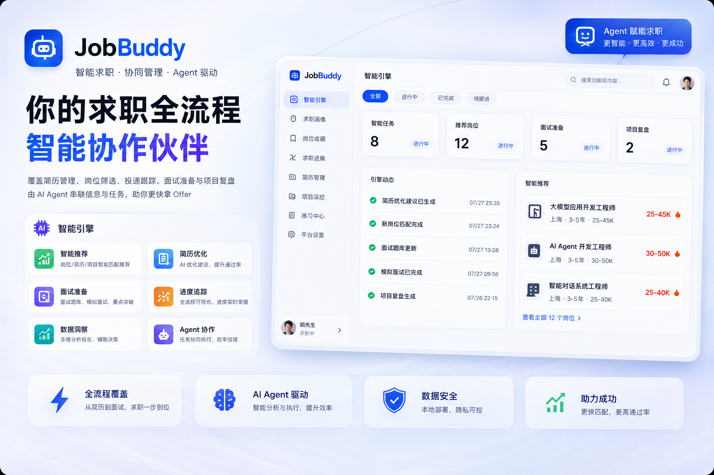
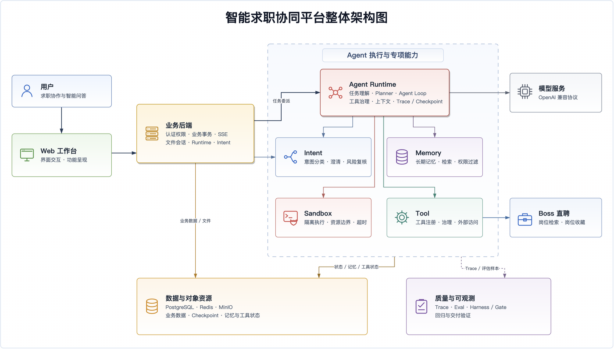
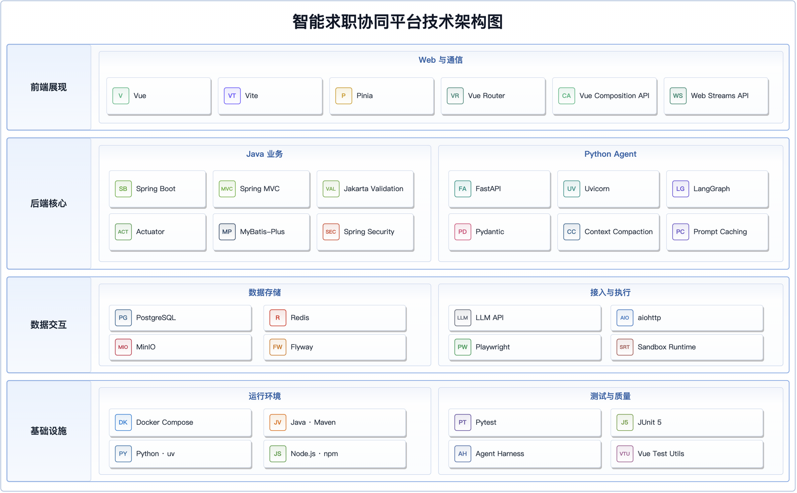

# JobBuddy

智能求职协同平台（JobBuddy）是一款覆盖求职全流程的本地 Agent 应用。平台将简历管理、岗位筛选、投递跟踪、面试准备和项目复盘集中到统一的 Web 工作台，并由 Agent 串联信息检索、分析判断与任务执行。



## 主要能力

平台能力围绕求职准备、岗位决策、过程管理和智能协作四类场景展开：

| 场景       | 能力                                                        |
| ---------- | ----------------------------------------------------------- |
| 简历与画像 | PDF 简历库、简历撰写、求职画像、Boss 在线简历同步           |
| 岗位与决策 | 岗位检索、条件过滤、简历匹配、推荐质量门、收藏与详情快照    |
| 求职过程   | 求职旅程、投递记录、面试题库、代码练习、项目深挖            |
| Agent 协作 | 对话问答、任务规划、工具调用、长期记忆、Trace 与 Checkpoint |

## 系统架构

平台以 Web 工作台作为统一入口，前端请求由 Backend 完成认证、权限校验、业务事务处理和 SSE 中继。Backend 调用 Intent 进行前置分类，并将智能任务委派给 Runtime；Runtime 在执行期协调 Intent 风险复核、Memory、Sandbox 和 Tool 等专项能力，并按需访问模型服务；Tool 负责接入 Boss 直聘等外部能力。



图中聚焦主要职责和调用方向，具体边界如下：

- Backend 对 Memory、Sandbox 的专项调用，以及 Tool 的内部依赖，见详细架构文档。
- Backend 负责认证、权限、业务事务、文件与数据管理。
- Runtime 负责任务理解、规划、上下文装配、工具治理和执行状态管理。
- Harness 与 Eval 构成离线验证闭环，不进入常规对话的同步链路。

完整的服务边界、部署拓扑和降级策略见 [系统架构与核心链路](agent-doc/架构设计/系统架构与核心链路.md)。

## 技术选型

系统前端采用 Vue 3、Vite、Pinia 和 Vue Router，Java 业务后端采用 Spring Boot，Agent 服务采用 FastAPI、Uvicorn 和 LangGraph。数据层使用 PostgreSQL、Redis 与 MinIO，基础设施由 Docker Compose、Maven、uv、npm 及配套工具支撑。



## 执行链路

系统按照“请求预检、任务分流、受控执行、结果收敛”的顺序处理用户请求：

- 请求预检：完成身份、权限和内容安全检查，不符合要求的请求直接拦截。
- 任务分流：Intent 提供前置分类与路由提示，Runtime 完成执行期任务理解；确定性业务进入 Backend 工作流，开放式任务进入 Runtime Agent Loop。
- 受控执行：Agent Loop 在上下文、权限和预算约束下循环执行、观察与验证，并通过最大轮次、工具调用次数、连续失败次数和 Token 预算限制运行边界。
- 结果收敛：任务完成、被拒绝、人工中断、执行超时或发生异常时，系统均生成明确终态，确保流式响应正常结束并保留可追踪的执行结果。

执行链路如下：


## 模块一览

仓库按能力边界拆分为八个独立服务模块，各模块通过 HTTP 或 SSE 契约协作，不直接访问其他模块的内部数据结构：

| 模块                                         | 默认端口 | 技术与职责                                                             |
| -------------------------------------------- | -------: | ---------------------------------------------------------------------- |
| [`agent-frontend`](agent-frontend/README.md) |     5173 | Vue 3、Vite、Pinia；Web 工作台、状态管理和 SSE 增量渲染                |
| [`agent-backend`](agent-backend/README.md)   |     8080 | Java 17、Spring Boot；认证、RBAC、业务 API、文件与数据管理             |
| [`agent-runtime`](agent-runtime/README.md)   |     8010 | FastAPI、LangGraph；任务理解、Planner、Agent Loop、Trace 与 Checkpoint |
| [`agent-intent`](agent-intent/README.md)     |     8020 | FastAPI；意图预分类、澄清提示和高风险 Transcript 复核                  |
| [`agent-memory`](agent-memory/README.md)     |     8030 | FastAPI；长期记忆的写入、检索、更新、回滚、删除和过期清理              |
| [`agent-tool`](agent-tool/README.md)         |     8040 | FastAPI；工具注册与执行，包含 `boss_browser`                           |
| [`agent-eval`](agent-eval/README.md)         |     8050 | FastAPI；Trace、运行结果、能力和 LLM Judge 评估                        |
| [`agent-sandbox`](agent-sandbox/README.md)   |     8061 | FastAPI、`srt`；命令与代码隔离执行                                     |

`agent-doc/` 保存架构与能力文档，`.agent-harness/` 提供验证、评估、质量门禁、Goal 和 Loop，`scripts/` 提供环境同步、服务启停、格式化和产物清理。

## 快速开始

### 1. 准备环境

本地开发需要满足以下基础运行环境；仅使用本地进程启动时，Docker 不是必需项：

| 工具          | 要求                                    |
| ------------- | --------------------------------------- |
| Java          | JDK 17+                                 |
| Maven         | 3.8+；仓库不提供 Maven Wrapper          |
| Python        | 3.10+；`agent-runtime` 固定使用 3.10.16 |
| Python 包管理 | `uv`                                    |
| Node.js       | `^20.19.0` 或 `>=22.12.0`               |
| 数据服务      | PostgreSQL、Redis、MinIO                |
| 容器运行      | Docker Engine 与 Docker Compose，可选   |

本地运行 Sandbox 还需要安装上游 CLI：

```bash
$ npm install -g @anthropic-ai/sandbox-runtime
```

macOS 需要 `ripgrep`；Linux 还需要 `bubblewrap`、`socat` 和 `ripgrep`。

### 2. 准备配置

```bash
$ cp .env.example .env
# 填写 .env 后校验配置项
$ ./scripts/sync-env.sh
```

`.env` 只允许位于仓库根目录，且不得提交。请将示例密码、模型配置和密钥替换为实际值。

核心配置按用途划分如下，完整变量集合仍以根目录环境模板为准：

| 配置类别     | 代表变量                                                 |
| ------------ | -------------------------------------------------------- |
| 数据库与缓存 | `SPRING_DATASOURCE_*`、`SPRING_REDIS_*`                  |
| 对象存储     | `JOB_BUDDY_MINIO_*`                                      |
| 模型服务     | `JOB_BUDDY_LLM_*`                                        |
| 内部服务     | `AGENT_*_URL`、`AGENT_INTERNAL_SERVICE_TOKEN`            |
| Runtime 状态 | `AGENT_RUNTIME_DATABASE_URL`、`JOB_BUDDY_RUNTIME_*`      |
| Boss 凭据    | `JOB_BUDDY_BOSS_CREDENTIAL_ENCRYPTION_KEY`、`BOSS_CLI_*` |

全部配置项及说明以 [.env.example](.env.example) 为准。

### 3. 启动服务

根据基础设施条件和开发需求，选择容器环境或本地开发环境启动服务。

**[1] 容器环境**

如果 PostgreSQL、Redis 和 MinIO 已独立部署，`docker-compose.yml` 会直接使用环境文件中的外部连接，仅启动八个应用服务：

```bash
$ unset COMPOSE_PROJECT_NAME
$ docker compose --env-file .env -f docker-compose.yml up -d --build --wait
```

如果需要同时部署 PostgreSQL、Redis 和 MinIO，叠加 `docker-compose-infra.yml`，一次启动完整的 11 个服务：

```bash
$ unset COMPOSE_PROJECT_NAME
$ docker compose --env-file .env \
  -f docker-compose.yml \
  -f docker-compose-infra.yml \
  up -d --build --wait
```

停止时使用与启动相同的文件组合；默认不会删除 PostgreSQL、Redis 和 MinIO 的命名卷：

```bash
$ docker compose --env-file .env \
  -f docker-compose.yml \
  -f docker-compose-infra.yml \
  down
```

生产环境的网络、密钥、持久卷和备份要求见 [应用与基础设施容器化部署](agent-doc/运维部署/应用与基础设施容器化部署.md)。

**[2] 本地环境**

确保 `.env` 指向可用的 PostgreSQL、Redis 和 MinIO，然后执行：

```bash
$ ./scripts/start-all.sh
$ ./scripts/status-all.sh
```

服务就绪后，可通过以下默认入口访问工作台、健康检查和接口文档：

| 入口             | 默认地址                            |
| ---------------- | ----------------------------------- |
| Web 工作台       | <http://127.0.0.1:5173>             |
| Backend 健康检查 | <http://127.0.0.1:8080/api/health>  |
| Knife4j API 文档 | <http://127.0.0.1:8080/doc.html>    |
| OpenAPI JSON     | <http://127.0.0.1:8080/v3/api-docs> |

停止本地应用服务：

```bash
$ ./scripts/stop-all.sh
```

日志写入 `.run/logs/YYYYMMDD/`，PID 写入 `.run/pids/`。启停脚本会检查端口占用进程的仓库归属，不会主动终止其他项目或系统服务。各服务的独立启动方式见“模块一览”中的对应 README。

### 4. 提交验证

提交前检查代码格式：

```bash
$ ./scripts/format-code.sh --check
```

使用 Harness 执行环境检查、模块验证和交付门禁：

```bash
$ ./.agent-harness/scripts/doctor.sh
$ ./.agent-harness/scripts/verify.sh --list
$ ./.agent-harness/scripts/verify.sh agent-runtime --quick
$ ./.agent-harness/scripts/gate.sh all --quick
```

修改核心链路、SSE、工具事件、Intent、Trace 或用户流程时，必须同步检查 `.agent-harness` 与 `agent-eval`。

修改前端交互、登录、岗位卡片、简历预览或会话恢复时，还必须启动真实服务并完成浏览器验证。

运行产物清理默认为预览模式：

```bash
$ ./scripts/clean-artifacts.sh --dry-run
```

详细验证分层和浏览器证据要求见 [.agent-harness/README.md](.agent-harness/README.md)。

## 文档导航

项目文档按架构、核心能力、业务能力和运维部署组织，常用入口如下：

| 主题                   | 文档                                                                       |
| ---------------------- | -------------------------------------------------------------------------- |
| 文档总览               | [项目总览文档](agent-doc/README.md)                                        |
| 系统边界与核心链路     | [系统架构与核心链路](agent-doc/架构设计/系统架构与核心链路.md)             |
| 认证与权限             | [账号认证与权限体系](agent-doc/架构设计/账号认证与权限体系.md)             |
| 意图、工具与安全       | [意图路由与工具安全](agent-doc/核心能力/意图路由与工具安全.md)             |
| 模型与上下文           | [模型接入与上下文治理](agent-doc/核心能力/模型接入与上下文治理.md)         |
| Trace、Eval 与 Harness | [Trace 可观测与质量评估](agent-doc/核心能力/Trace可观测与质量评估.md)      |
| 容器化部署             | [应用与基础设施容器化部署](agent-doc/运维部署/应用与基础设施容器化部署.md) |

接口、配置、端口、服务职责或目录结构发生变化时，应同步更新根 README、对应模块 README、主题文档和 `.env.example`。文档只描述有代码、配置、接口或测试支撑的正式能力。
