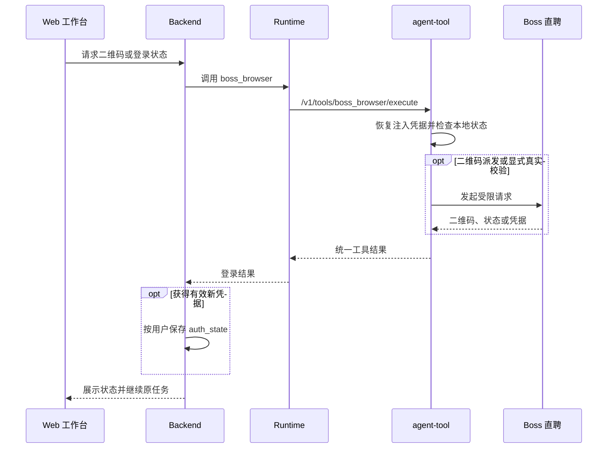

# Boss 直聘集成与岗位检索

## 能力边界

- Boss 能力由 agent-tool 的 `boss_browser` 实现，底层复用 jackwener/boss-cli 的 Cookie、HTTP Client、请求抖动、退避和上游错误分类。
- Runtime 负责工具发现、权限与代理，Backend 负责登录状态、业务 API、候选池和 SSE，前端负责扫码、岗位卡片与错误反馈；
- 系统不通过 Chrome CDP 持久控制用户浏览器。

- Cookie 由 Backend 按租户和用户加密保存到 PostgreSQL `auth_state`，调用时连同可信属主键注入 Tool 内存。
- Tool 使用有界、可过期的属主会话和同属主锁隔离凭据；
- 缺少属主或凭据时失败关闭，不复用进程全局残留，也不创建 `credential.json` 或持久浏览器 Profile。
- 日志、Trace 和聊天不得包含 Cookie，Redis 只保存限速窗口、连续失败和风控冷却。

## 登录流程

- 默认路径是恢复 PostgreSQL 中的有效凭据，否则使用二维码登录。
- 登录作用域固定为“租户 + 用户”，不绑定具体页面或会话；
- 任一入口成功后都写入同一 `auth_state`，未过期的二维码会话也按属主复用。

- 运行参数设置页在展示“已登录”时只提供刷新状态与退出登录，不再展示或触发扫码弹窗；
- 扫码入口在打开弹窗前必须重新确认登录状态，避免后端返回已登录时出现短暂弹窗闪烁。
- 退出登录只清除当前租户和用户在 PostgreSQL 中保存的 Boss 凭据、认证缓存与未完成二维码会话，不退出 JobBuddy，也不影响其他用户；
- 退出后下一次 Tool 调用以空凭据覆盖该属主的进程内状态。

- Tool 为二维码生成不可猜测的精确会话 ID，并把 Cookie、上游标识、过期时间和版本封装为 AES-GCM 内部状态令牌。
- Tool 按 boss-cli 协议将 randkey 返回的原始 `qrId` 在本地编码为 PNG 二维码；不得调用
  `getqrcode` 图片接口替换二维码内容，否则 Boss App 扫描后无法推进该 `qrId` 的状态。
- Backend 只在属主绑定的 `boss_qr_login_session` 中保存令牌，不下发前端；
- 轮询和取消必须同时提交属主键、会话 ID 与令牌，Tool 校验后轮换令牌，成功、过期、取消或错误终态立即删除会话。
- 共享内部密钥使不同 Worker 可恢复同一会话，而不依赖进程全局状态。

- 浏览器 Cookie 导入默认关闭，只有显式启用 `BOSS_CLI_AUTO_IMPORT_BROWSER_COOKIES` 才能访问本机凭据。
- 二维码 dispatch 缺少必要 Web Cookie 时，可用一次性 headless Chromium 和临时 Profile 补齐并立即清理；
- `wt2`、`zp_at` 等持久身份 Cookie 完整时即完成登录并加密保存；`__zp_stoken__` 等临时 Web Cookie
  无法立即补齐时标记搜索尚未就绪，由首次业务请求使用已保存身份静默重生，不得要求用户重复扫码；
- 持久身份 Cookie 本身不完整时才返回 `auth_required`。

- 扫码状态必须按 `waiting`、`scanned`、`confirmed`、`logged_in` 逐阶段返回。
- 扫码与手机确认遵循 boss-cli 的 35 秒有界长轮询契约；前端等待当前请求完成后再调度下一轮，
  不得以数秒级客户端读超时反复中断上游长轮询，也不得并发堆积状态请求。
- 二维码生成后，前端必须立即发起首轮扫码状态请求，并在该请求持续进行、扫码监听稳定建立后才实际绘制二维码；
  准备期间显示明确的连接状态，禁止先展示二维码再建立监听，否则用户首次扫码可能命中尚未监听的会话。
- 页面初始化、扫码入口预检和活动二维码复用必须读取 Tool 状态令牌中的本地快照，不得进入上游长轮询；
  只有携带明确二维码会话标识的弹窗后台检测才等待扫码结果，避免多个串行检查把二维码展示拖慢到几十秒。
- Tool 检测到扫码或手机确认后应先结束当前轮询并轮换会话令牌，下一轮再执行确认检查或凭据派发与补齐，禁止把多个可能阻塞的上游步骤合并到一次状态请求中。
- 同属主的多个入口复用二维码时，Backend 必须按属主串行轮询，并以数据库版本条件原子轮换状态令牌，
  防止旧阶段覆盖新阶段或在终态后继续轮询已删除会话。
- 扫码检查、手机确认和凭据派发遇到 TLS 握手、连接或读取超时时应保留当前阶段并自动重试；
  临时网络超时不得映射为 `error` 终态或删除二维码会话。
- 前端在对话续跑、收藏岗位导入和运行参数设置三个入口复用同一状态组件，以自动轮询、阶段进度和显著状态卡展示变化；
- 手动检查只作为自动轮询的补充，不得并发堆积请求。

- `__zp_stoken__` 是搜索和详情所需的临时网页令牌，不等于登录身份。
- 若它过期而 `wt2`、`zp_at` 等持久 Cookie 仍有效，Tool 使用 Backend 注入的同属主凭据访问首页和登录岗位页，静默重生后重试当前请求，不读取本机浏览器、清除登录态或要求重复扫码。

- 临时令牌失效时先静默补齐；
- 页面安全脚本在 `DOMContentLoaded` 后异步生成临时令牌，Tool 应使用配置的导航超时并对 Cookie 做最多约 3 秒的有界轮询，令牌出现后立即收口；
- 一次性 Chromium 页面提前关闭，或页面正常结束但仍未生成临时令牌时，可以用全新临时上下文重试一次；
- 业务请求使用新令牌成功后，Tool 只通过 Runtime 直连代理把更新后的凭据交回 Backend；Backend 在客户端边界按当前租户和用户加密回写 PostgreSQL 并立即剥离敏感字段，禁止凭据进入业务 Service、前端、聊天、日志或 Trace。服务重启后必须注入已回写的新凭据，不能反复恢复旧令牌；
- 补齐链路自身失败属于可重试依赖错误，应保留持久凭据；
- 本地节流只抑制连续失败的补齐尝试；上一次补齐成功后，若后续真实请求再次明确返回临时令牌失效，应允许当前请求再执行一次有界恢复；补齐失败仍在节流窗口，或本轮补齐未返回新临时令牌时，只要持久身份 Cookie 仍在，都不得切换为 `auth_required`；
- 只有上游明确要求登录或出现登录重定向，且补齐链路正常执行后仍无法恢复，Backend 才标记登录失效。
- Runtime/Tool 超时或不可达不能清除凭据或误导用户扫码。

## 搜索、分页与详情

### 候选池与分页

- 首次搜索只抓取一页，确定性过滤后的目标候选规模按“每批展示数 × 候选池倍率”计算，并受 `maxJobsPerScoring` 总评分上限约束。
- 默认首批展示 5 个岗位、候选池倍率为 3、总评分上限为 30；常规首屏只需准备约 15 个候选。候选达到两个批次时，Backend 以最多 4 路并发请求执行每批不超过 4 个岗位的 Runtime 模型预筛，并按原候选顺序归并完整性与质量漏斗；少量候选仍按剩余展示槽位自适应评分。更多结果由质量门续评或“换一批”按需消费。
- 候选不足时按配置的单批页数和最大深度补充；默认每批最多 3 页、最深 15 页，页深只是按需续抓上限，不会在首次请求中一次性访问；
- 重复或不合格页面不阻断下一页，但不得无界翻页。

- 候选池按用户和检索条件保存原始去重标识、下一页、已消费游标与上游枯竭状态。
- “换一批”在 UI 和历史记录中是新的用户轮次：追加一条“换一批”用户消息，并由本轮生成独立助手消息；旧批次岗位消息不被覆盖。
- “换一批”的执行层仍复用上一轮关键词、城市、筛选条件和候选池，只从游标之后继续读取，并短路重复任务理解；
- 缓存不足时仅访问尚未请求的后续页面，不回绕、重评已消费岗位或重复执行任务理解。
- 同一租户、用户和检索条件的并发缓存未命中或并发补页通过按精确缓存键登记的进行中 Future 合并，等待首个请求写入候选池后复用结果；等待方会按自己的消费游标重新检查候选规模，仍不足时竞争下一轮补页。Future 在成功或异常后立即清理，不同租户或不同检索条件不共享网络等待。
- Boss 上游访问仍保持串行、低频和有界，并发只用于合并本地重复工作，不能以并行抓取换取速度或扩大风控暴露。

### 条件与硬过滤

- `search` 接收 `query`、`city`、`page`，以及 `experience`、`salary`、`degree`、`industry`、`scale`、`stage` 六类筛选。
- 筛选值可以使用 boss-cli 常量表中的语义名称或代码，无法识别的值按未设置处理，不直接透传上游。
- 字段必须在 Runtime、Backend、工具契约和无网络测试中保持一致。

- Backend 将本轮明确条件与求职画像、当前简历合并，本轮条件优先。
- Runtime 未识别薪资槽位时，Backend 兜底解析 `40-50K`、`40K-50K`、`月薪 4-5 万` 和元/月区间，并写回会话供扫码续跑与换一批复用。
- 用户给出闭区间时，候选月薪必须可解析并至少覆盖目标区间的 50%；
- 仅边界相交不算匹配，年终薪数不折算月薪。
- 以目标 `40-50K` 为例，`35-55K` 可保留，`21-35K·13薪`、`15-25K`、日结、时薪、面议和无法解析薪资均剔除；
- 只有用户未限制薪资时才允许未知值。

岗位族、专项能力、经验和排除项同样执行硬过滤。岗位明确要求多模态、视觉、语音或推荐算法等专项能力，而画像与简历没有对应证据时不得进入推荐。

### 匹配质量门

- Backend 在进入 Boss 搜索前并行读取画像、当前简历和黑名单；确定性 `job.recommend` 不检索不会参与筛选槽位计算的长期记忆，避免旁路超时阻塞首屏。
- SSE 过程按“画像与简历上下文 → Boss 候选搜索 → 画像与简历预筛”顺序闭合；候选搜索返回后先把 `job_search` 标记成功，再进入质量门，禁止两个步骤长时间同时显示为运行中。质量门触发续搜时，Backend 使用相同 `job_search` 事件 ID 回写最终累计候选数，前端和持久化层原位合并，确保搜索数与评估数口径一致。各阶段完成事件携带 `elapsedMs` 供页面与验收定位时延。
- 通过硬过滤的候选使用当前简历按最多 4 个岗位的小批次执行 `resume_match`，证据模式固定为 `recommendation_list`；两个及以上批次在 Backend 的有界线程池中并发调用 Runtime，调用线程必须传播当前租户与用户身份，合并结果仍按输入顺序执行完整性和质量校验。Boss 搜索、分页与详情读取不进入该并发池。
- Runtime 在调用模型前把当前批次映射为 `job_0`、`job_1` 等短别名，只用短别名校验返回数量、完整覆盖、缺失、重复和未知项；Boss `securityId` 等外部岗位标识不进入模型提示词，对齐成功后按输入位置重排并恢复真实标识，Backend 的完整性契约保持不变。
- 岗位名称、技能、标签、经验、学历、城市和薪资可作为预筛证据；
- 缺少完整 JD 时置信度最高为 medium，并必须说明证据限制，不能臆测列表未声明的要求。

- 60–74 分的可靠列表匹配可标记“可尝试”，75 分及以上且证据充分时可标记“推荐”。
- 只有达到最低推荐分、置信度不为 low，且投递建议不是谨慎、不建议或证据不足的岗位才能进入 `job_cards`。
- “换一批”在新结果通过质量门前不改写旧批次助手消息；若本轮候选搜索或质量门失败，新助手消息说明本轮失败原因并标记旧岗位消息仍保留，禁止把旧卡片表述成本轮新结果。首次推荐失败时仍不生成卡片。
- 合格数量不足时继续评估下一批，直到展示数、候选池倍率、总评分上限、最大检索深度或上游结果耗尽；
- 预算耗尽仍无达标岗位时返回空结果，不用低质量岗位凑数。
- 质量门完成排序与展示数截断后，Backend 只对最终即将下发的岗位串行补齐 JD；候选池中未展示的岗位不读取详情。已有 JD 的岗位直接复用；已登录且详情 payload 瞬时为空或临时安全令牌刷新失败时，当前岗位可使用本批次唯一的补偿额度再请求一次，不占用最终岗位数量预算。因此 N 个展示岗位最多产生 N+1 次详情请求。登录失效、验证码、风控、限流、定位参数错误或补偿仍失败时立即停手，不继续累积外部请求。

- 每批输出的岗位 ID 集合必须与输入完整一致。
- 重复、未知、缺失或数量不一致都属于契约失败，Backend 只允许一次有界拆分重试；
- 仍失败则整批关闭且不推进游标。
- 成功漏斗必须同时满足“请求评分数 = 完成评分数”和“完成评分数 = 通过数 + 各拒绝原因数”。

### 详情与工具契约

- Boss 搜索分页仍只产生基础候选信息；自动推荐在质量门选出最终展示岗位后，于同一检索轮次中串行补齐这些岗位的 JD，再通过 `job_cards` 下发完整卡片快照。不得为未通过质量门的候选批量读取详情。
- 卡片已有 JD 时“查看职位描述”只展开或收起本地文本；缺少 JD 时按钮显示“加载职位描述”，仅该动作调用岗位详情接口并更新当前卡片。“分析此岗位”只把岗位标识、名称、公司、条件标签、原链接和已有的最多 2400 字 JD 等必要字段发送到聊天流，不调用详情接口，也不与描述按钮共享加载态。
- Backend 使用强类型 DTO 再次校验并忽略上游原始对象；分析入口只合并当前卡片与会话候选快照，不二次请求 Boss 详情。若检索阶段因外部失败仍未取得 JD，分析入口按岗位列表结构化证据执行并明确置信度限制；“加载职位描述”是独立的详情动作。
- 卡片正文展示岗位基础信息和业务标签；
- 匹配分、置信度、投递建议、推荐理由与证据限制统一放入默认收起的“推荐依据”。推荐评分先于最终 JD 补齐执行时，证据级别仍标记为列表预筛，不能因卡片后续携带 JD 就宣称已完成 JD 级推荐验证。

- 工具入口为 `POST /v1/tools/boss_browser/execute`，Runtime 代理入口为 `POST /v1/runtime/tools/boss_browser/invoke`。
- 允许操作固定为 `status`、`refresh_auth`、`qr_start`、`qr_status`、`qr_cancel`、`search`、`favorite_list`、`detail`、`profile` 和 `rate`，Registry 描述与执行白名单必须一致。

## 岗位收藏选择性导入

- Boss 文档只定义 `favorite_list` 的上游访问、固定 tag、登录与风控边界。
- 收藏岗位响应中的 `happenTime` 是收藏动作毫秒时间戳，Tool 将其规范化为 ISO 8601 `favoritedAt`；
- 缺失或非法时可使用明确的 `actionDateDesc`，两者都不可用时不推测收藏时间。
- 用户选择、分页交互、去重、摘要导入、详情补全和持久化语义统一由 [岗位分析与收藏管理](岗位分析与收藏管理.md) 定义，避免在工具集成文档中复制业务事务规则。

## 风控、安全与验证

- 所有真实访问必须串行、低频、有抖动并限制页数；
- 出现验证码、安全验证、访问异常、限速或账号异常时立即停止并进入冷却。
- 搜索保留默认每小时 60、每日 120 的本地配额；职位详情不设置小时或每日固定配额，既有 Redis 详情计数仅用于观测，不得阻止用户按需加载。详情请求仍串行执行拟人抖动，遇到上游限流、连续失败或风控信号时立即停手并进入既定保护边界。
- 本地依赖故障、需要登录和真实上游风控必须分别归类，不能相互消耗错误配额。
- 系统不尝试绕过平台风控，真实联调只能由人工在正常账号下执行最小请求。

- 自动化测试不得访问 Boss，按四组覆盖：身份与二维码隔离；
- 筛选、分页、候选池与详情契约；
- 同条件并发缓存未命中只产生一次 Boss 调用，等待请求读取同一候选池；
- 评分 ID 完整性、重试和固定 23 候选漏斗守恒；
- 限速、遇险停手、错误分类和 Runtime 代理。
- 真实 Boss 只允许人工低频验证，且不能以“必须产生岗位”诱导质量门降级。

前端变更需要验证扫码续跑只保留一个用户轮次、换一批、职位描述独立按需加载、分析按钮不请求详情且不受详情加载态影响、当前页选择、同窗二维码、登录后单次首屏加载、部分成功、错误收尾和凭据不落盘。

## 运行边界

该能力依赖第三方平台协议和用户有效登录态，不承诺高频抓取。请求必须保持低频、可控、可降级且不暴露凭据；平台协议变化或风控拒绝必须返回可解释错误。
