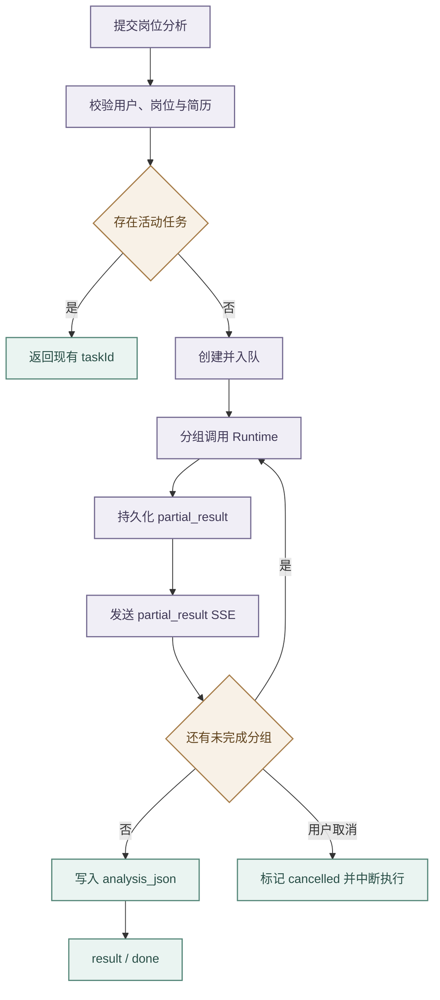

# 岗位分析与收藏管理

## 能力范围

- Web 工作台支持推荐岗位的定向分析、岗位收藏、详情快照和持久化报告。
- 岗位键、收藏与分析任务按租户和用户隔离。
- 简历撰写器草稿与 PDF 简历库是不同数据源，岗位分析只使用用户选择或默认的 PDF 简历/画像，不读取未导出的草稿。

## 推荐质量门与匹配边界

- `minimumRecommendedMatchScore` 是完成简历匹配后的最低推荐分，默认 60、范围 0–100。
- 系统先做确定性过滤、证据校验和分数归一化，只保留达标、置信度不为 low、且建议不是谨慎、不建议或证据不足的岗位。
- 候选不足时可以在候选池倍率、`maxJobsPerScoring` 和最大检索页深内继续评估，但不能降低质量门或用低质量岗位凑数。

自动推荐使用 `recommendation_list` 证据模式：结构化列表字段可用于候选预筛，缺少完整 JD 只把置信度上限限制为 medium，不自动判定为证据不足。

- 单岗位卡片已有完整 JD 时使用 `full_jd_analysis`，要求逐项 JD—简历证据链；未加载完整 JD 时使用 `recommendation_list`，只根据岗位列表结构化信息分析并限制置信度，不隐式读取详情。
- 未执行简历匹配时，关键词和薪资等本地规则分不能展示为匹配度；
- 单岗位分析也不受推荐阈值过滤，低分岗位仍可获得差距分析。

Runtime 工具契约单次 `resume_match` 最多允许 15 个岗位，自动推荐链路由 Backend 按最多 4 个岗位的小批次顺序评估。进入模型前，Runtime 把外部岗位标识替换为 `job_0` 等短别名，严格校验别名完整覆盖后再恢复原始岗位 ID，避免模型抄写超长 `securityId` 造成伪缺失。

岗位匹配不能只消费结构化解析器的固定字段。Backend 在当前请求内从用户原始 PDF 提取有界的公开链接、开源项目、技术写作和 AI 原生研发证据，过滤联系方式和普通正文后以 `supplemental_evidence` 交给 Runtime；Runtime 与摘要、技能、工作、项目和标签一起压缩装配。生成缺口前必须逐项核对这些来源，已明确出现的工具、公开作品或写作证据不得表述为“未提及”或“没有”。补充提取失败时保留既有结构化解析结果降级执行，不写回或篡改用户简历。

返回别名缺失、重复、未知或计数不一致时只允许一次有界重试，仍失败则整批报错。未评分候选不计为低分也不推进游标，“换一批”从实际完成评分的位置之后继续；在 UI 和历史记录中，“换一批”必须追加新的用户消息和独立助手消息，旧批次岗位消息不被覆盖。若换批失败，则在新助手轮次说明失败原因并明确旧批次岗位消息仍保留，首次推荐失败仍保持空结果。

## Boss 收藏选择性导入

岗位收藏支持从 Boss 直聘单向选择性导入。

- 弹窗首次打开直接请求第一页并由同一接口判断登录；
- 未登录时在弹窗内扫码，成功后只加载一次首屏。
- Backend 一次读取本地身份集合，过滤已收藏和页内重复项；
- 岗位身份优先使用稳定的 `encryptJobId`，历史 `securityId` 收藏通过已有 JSON 提取稳定 ID 参与去重。

- 弹窗在 Boss 返回有效收藏动作时间时展示“收藏于”，导入后以规范化的 `favoritedAt` 保留该时间，收藏页继续展示 Boss 原始收藏时间而不是本地导入时间。
- 上游未返回可靠时间或字段非法时不补造时间，导入流程和岗位展示保持原有降级行为。

分页按“上一页、第 N / M 页、下一页”替换当前页，`M` 使用 Boss 实际总页数，不设置人工浏览上限；后续页必须由用户触发，页面初始化和后台任务不预读，也不提供全量同步。

- 勾选数量不设业务上限。
- Backend 按选择顺序串行导入：已有 JD 时规范化保存，缺失时先读详情。
- 该过程不触发分析，只写本地 `job_favorite`。
- 遇到登录失效、风控、限速、网络、详情或数据库错误时立即停止，保留成功项、标记剩余项为未处理，不回滚，也不修改 Boss 收藏状态。

- `GET /api/jobs/favorites/boss?page=1` 返回去重单页、页码、总页数、`hasMore` 和只读配额；
- `POST /api/jobs/favorites/boss/import` 接收 `{ "jobs": [...] }`，返回导入、已存在、失败、未处理计数，以及停手、登录和逐项结果。
- 外部岗位对象在 Backend 用 `JsonNode` 隔离，不在跨层接口新增无 Schema 的 Map DTO。

## 定向分析与收藏快照

- 自动推荐先按结构化列表证据完成质量门，Backend 可以在同一轮次内对最终展示岗位做有界、串行的 JD 补全；外部详情暂时失败时仍允许下发达标列表快照，不能把岗位卡片整体抹掉。
- 卡片已有完整 JD 时，“查看职位描述”只切换本地展开态；卡片只有列表摘要时，用户点击“加载职位描述”才通过统一岗位详情接口补齐当前卡片。普通详情错误显示在当前卡片，登录失效进入扫码续跑，不得后台并发或自动重试。
- 用户已加载的职位详情按当前登录身份和岗位键保留在前端详情快照中；分析完成后的会话历史回读不得用原始列表卡片把该 JD 覆盖掉，退出登录时必须清空详情快照。
- 点击“分析此岗位”时，前端立即发送当前卡片必要的结构化 `selectedJob`，不得调用岗位详情接口，也不得读取或复用“加载职位描述”的 loading/error 状态。卡片已有完整 JD 时进入完整证据分析；没有完整 JD 时进入列表证据分析并明确置信度限制。
- Backend 只提取岗位名、公司、薪资、要求和 JD 等分析字段，与当前用户简历或画像一起进入业务处理器，避免把完整外部对象无界注入 Prompt。

`selectedJob` 表示用户已经选定岗位，Backend 直接进入定向分析，不重新分类、搜索或请求 Boss 详情。Backend 只合并请求中的快照与当前会话候选快照，并根据完整 JD 是否存在选择 `full_jd_analysis` 或 `recommendation_list`；切换 PDF 简历后沿用同一证据模式复评，旧报告只作历史展示。

- 岗位工作台收藏和 BOSS 选择性导入在持久化收藏前必须形成完整岗位快照；聊天定向分析可以使用列表证据独立执行。列表结果已有 JD 时直接标准化为 `jobDescription`；
- 缺失时在收藏或导入请求内根据 `securityId` 或原岗位链接调用详情能力，详情定位信息缺失、登录失效、采集失败或结果仍无 JD 时不写入当前岗位。

- 历史摘要收藏在查看 JD 或发起分析时按需补全并回写 `job_json`，查询列表和页面初始化不得访问 Boss。
- 分析结果独立写入 `analysis_json` 与 `analyzed_at`，收藏页不能复用工作台全局结果或按列表下标推断归属。

## 异步分析与恢复

- `POST /api/jobs/favorites/analysis-tasks` 在完成参数、归属和快照校验后立即返回任务标识，由有界线程池执行。
- 同一租户、用户、任务类型和岗位键只允许一个活动任务，重复提交复用现有任务。

- 前端订阅 `GET /api/analysis-tasks/{taskId}/stream` 的快照、进度、部分结果和终态。
- 关窗或断线只停止观察；
- 显式取消先校验归属，再原子标记 `cancelled` 并中断线程，禁止写最终结果但可保留已持久化部分。
- latest 接口负责页面恢复，服务重启后幂等重提 queued/running 任务。

- 报告按“投递结论与关键证据”“能力维度与风险”“简历补强与面试方案”分组生成，每组完成后立即写 `partial_result_json` 并发送 SSE，全部完成才更新收藏。
- 不能把完整报告延迟切片或用占位文本伪造部分结果。

## 报告与错误边界

- 分析结果是投递决策辅助，包含岗位和简历上下文、匹配分、建议、置信度、六维拆解、优势、缺口、证据对照、简历补强、面试重点、风险和限制。
- 置信度表示岗位与简历输入及逐项证据链对分析结论的支撑程度，不表示匹配分高低，也不因存在缺口、风险或不建议投递而自动降低；完整 JD 与简历形成至少三条具体要求—证据对照时为高置信度，只有部分要求可核实时为中等，仅在 JD、简历核心信息或证据链明显缺失时为低置信度。
- 六维固定为技术栈匹配、经验与级别、学历与资质、项目相关性、业务领域契合、地点与约束。
- 学历与资质维度始终输出数值分，综合学历层次、专业相关性和岗位明确要求评估；专业名称不要求严格一致，相近专业、交叉学科以及项目或工作经历能够证明的相关知识均按相关程度计分。
- 岗位未明确学历、专业或资质要求时不得据此扣分，简历信息不完整时使用 50 分保守中性分并明确缺口；历史报告中的空分也按同一中性分展示。
- 其他维度没有足够证据时保留结构、空分数和明确缺口，不把缺失信息当成零分；其他可选分析字段缺失时仅展示已有内容，不虚构缺失部分。
- Runtime 返回空 matches、模型失败或简历为空时按明确错误处理，不写“已完成”占位结果。
- 模型响应能解析但缺少有效 `matches` 时，Runtime 追加结构修复指令并有界重新生成一次；修复请求使用不同缓存键，避免工具重试反复命中同一份语义无效响应，修复后仍无有效结果则失败关闭。

- 推荐与后续分析保持同一质量语义。
- 卡片下发前严格剔除低于门槛、low 置信度、谨慎/不建议/证据不足，或违反方向、专项能力、经验和薪资硬约束的岗位。
- 分析链路可以保留最高分并明确警告，但推荐没有合格项时必须返回空结果。

收藏失败时前端回滚乐观状态；Boss 登录失效进入扫码流程，普通详情错误显示在对应岗位卡片。外部 JD 属于不可信内容，简历文本和报告可能含个人信息，日志与 Trace 不输出全文。

## 验证

- 自动化测试按收藏快照、Boss 选择性导入、去重与部分成功、历史 JD 修复、用户隔离、任务复用与取消、部分结果恢复、六维评分、补充简历证据保真和最终覆盖分组。
- 前端验证收藏回滚、分页与选择、已导入过滤、同窗扫码、首屏单次加载、分析归属隔离、加载与空态、取消、六维报告、错误、响应式布局、重试和刷新恢复。
