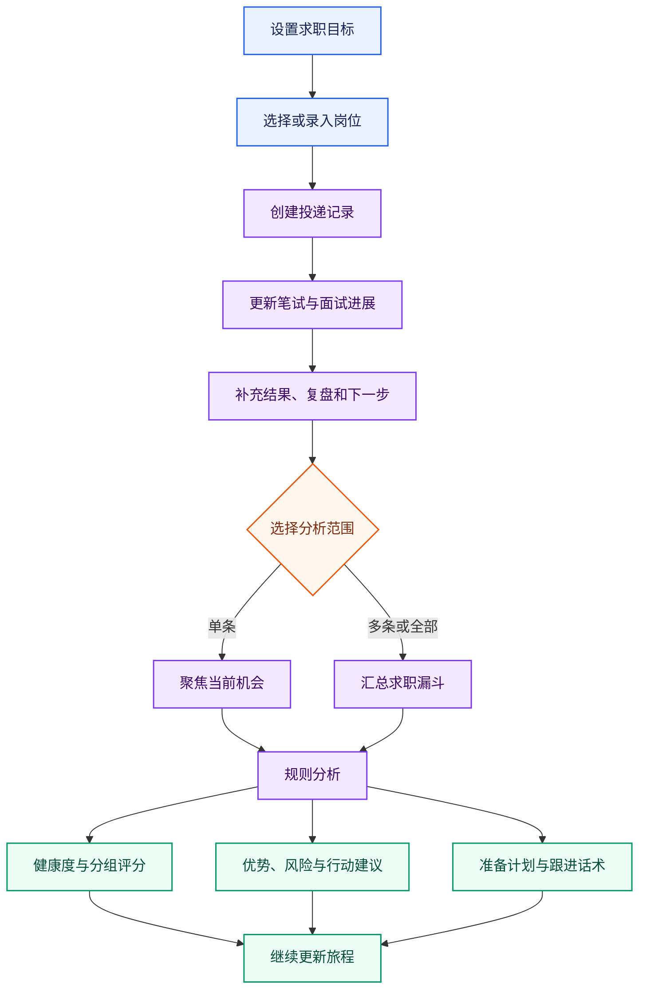

# 求职旅程与投递管理

## 能力范围

求职旅程维护当前用户的求职目标、投递与面试记录，并基于结构化台账生成可解释复盘。页面和接口要求 `journey:use`，属主只取认证上下文，不能由请求体切换或跨租户读取。该能力属于 Backend 业务事务，Runtime 不直接写库。

求职目标包括公司性质、公司规模、地点、薪资范围、业务方向、目标岗位、偏好公司和补充说明。

投递记录包含公司与岗位快照、收藏关联键、业务方向、面试轮次和时间、内容与形式、结果、复盘、JD、流程、下一步、状态、优先级和标签。记录可以独立创建，也可通过 `favoriteKey` 关联收藏；关联不改变所有权，删除收藏不会级联删除旅程。

## 核心业务流程

- 前端通过 `GET /api/journey/target` 读取目标，通过 `PUT /api/journey/target` 保存目标；通过 `GET /api/journey/records` 按 `keyword`、`status` 和 `result` 筛选记录，并使用 `POST /api/journey/records`、`PUT /api/journey/records/{recordId}`、`DELETE /api/journey/records/{recordId}` 完成增删改。
- `POST /api/journey/analysis` 可以接收单个 `recordId` 或多个 `recordIds`；未指定时分析当前用户的全部记录。

## 分析语义

进展分析当前由 Java Backend 使用确定性规则完成，不调用模型，也不把旅程正文发送到 Runtime。

分析统计总数、推进中、通过、未通过、待反馈和 Offer，结合高优先级机会、转化与记录完整度计算 35–95 的推进健康度。该分数反映台账质量与推进状态，不是岗位匹配分或 Offer 概率。

结果包含摘要、指标、分组评分、优势、风险、下一步、准备计划、跟进话术和时间。缺少面试内容、复盘或下一步属于弱信号，待反馈和跟进中记录进入跟进建议；无记录时只返回补录建议。单条分析聚焦指定机会，多条用于观察整体转化、主要轮次和业务方向。

旅程数据可作为复盘、面试准备和申请材料的受控上下文。Backend 只装配当前用户最近的有限记录；JD、面试内容和外部反馈均视为不可信文本，不能成为系统指令，也不得在日志和 Trace 中输出全文。

## 数据与风险边界

Flyway 只管理 `journey_target` 与 `journey_record` 的结构，私有记录只能通过受鉴权 API 写入。更新和删除先校验属主，列表筛选与分析选择只能缩小当前用户数据集。

确定性分析依赖记录完整度，页面应引导补充 JD、过程、结果、复盘和下一步。建议只作决策辅助，不能包装为模型预测或录用承诺。模型分析不属于当前契约；改变这一边界前必须同步更新接口、隐私、Trace、Eval、Harness 和本主题文档。

## 验证

后端测试覆盖目标、记录 CRUD 与筛选、跨用户拒绝、单条/多条范围、空记录、分组解释、弱信号、跟进和标签映射。前端验证目标编辑、筛选、关联岗位、分析范围、空态、错误和刷新恢复；浏览器还要确认接口只携带 Cookie 身份，不传可替换用户标识。
