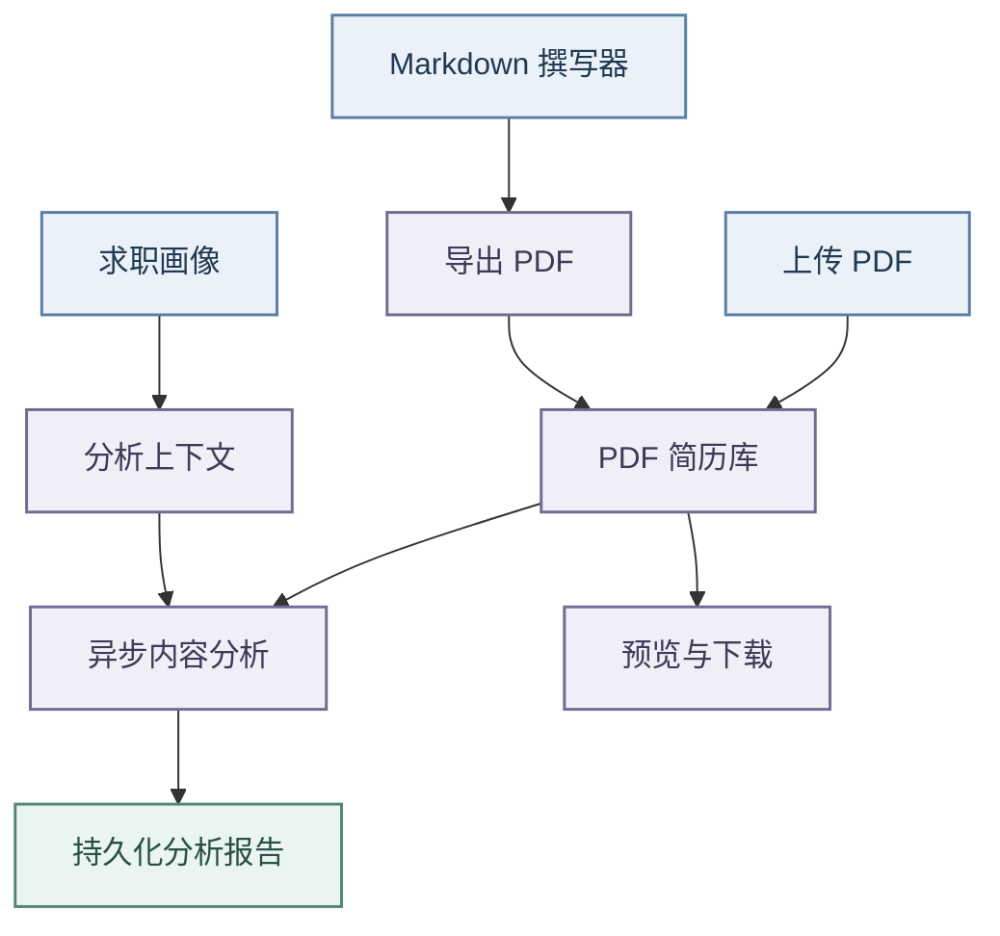
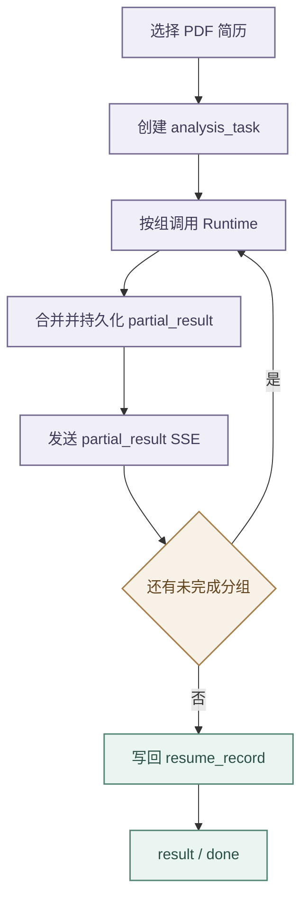

# 简历管理、画像与分析

## 模块边界

- 前端 `/resumes` 包含列表、撰写和分析三个子视图。
- 简历库只接受 PDF：元数据保存在 `resume_record`，文件进入 MinIO，供预览、下载、标签、分组和分析。
- 撰写器是独立 Markdown 工作区，草稿保存在 Workspace State 的 `resume.writer`，可导出 PDF、Markdown 或 HTML，但不直接写入简历库；
- 需要分析时先导出 PDF 再上传。

- 求职画像通过 `/api/resume/profile` 维护结构化基本信息、教育、工作、项目、求职期望和技能。
- 画像摘要是这些来源的派生信息，可由用户编辑或通过 `POST /api/resume/profile/summary` 生成，最终仍随完整画像统一保存，不建立第二套摘要实体。

## 简历库与资源

- `ResumeController` 与 `ResumeWriterController` 受 `resume:use` 保护，查询按租户和用户隔离，上传、列表和分析执行 PDF-only 校验。
- 照片等资源通过 `POST /api/resume/assets/upload` 写入 MinIO，数据库只保存随机标识、对象路径、类型、大小和 SHA-256；
- 读取 `/api/resume/assets/{assetId}` 时校验当前用户所有权，不暴露对象键。

相同文件或同名照片可以形成独立资源记录，SHA-256 作为完整性元数据而非全局去重键。前端使用稳定 `assetId` 引用资源。

- `POST /api/resume/upload` 只做校验、对象写入和记录落库，随后返回 `parseStatus=pending`。
- 上传请求不调用 Runtime，也不让工作区保存或列表对账占用“上传中”；
- 内容解析与竞争力分析由持久化后台任务完成，聊天和岗位匹配可在自身边界内按需解析。

## 撰写器与版本历史

`/api/resume/writer/versions` 提供版本列表、详情、创建、恢复和删除。

- 版本表保存 writerState JSON，包括 Markdown、排版、照片设置、标签和画像引用，不复制二进制资源或令牌。
- 版本按租户和用户隔离，默认保留 30 条；
- 恢复目标或导入覆盖前先备份当前状态。

前端草稿自动保存不等于创建版本。只有手动保存、导入备份、恢复备份或达到显著变化与时间阈值时才创建快照，避免高频细小编辑挤占版本额度。简历列表、撰写和分析统一使用 `/resumes` 下的子路由。

## 求职画像

| 区域       | 保存与交互契约                                                                                                                                  |
| ---------- | ----------------------------------------------------------------------------------------------------------------------------------------------- |
| 个人简介   | 维护期望岗位、求职状态、求职期望和技能；到岗时间可为“不确定”，期望薪资与行业允许候选值或自定义值，重新加载不得丢失自定义内容                    |
| 教育经历   | 保存学校、学院、专业、学历、全日制状态、学历状态和起止月份；月份选择不限制最大年份，不重复保存可由起止时间推导的在校时长                        |
| 工作与项目 | 项目保存名称、角色、起止月份、`techStack`、`responsibility` 和 `achievement`，结束月份为空表示“至今”；读取时兼容 camelCase、snake_case 和旧字段 |
| 画像概览   | 用户可直接编辑摘要，也可基于包含未保存字段的当前表单调用 AI 提取；已有摘要需经差异确认，失败不能覆盖当前内容                                    |

摘要属于 `parsed.summary`，与结构化画像共同保存。模型只负责提炼，不应使用固定字符切片破坏完整语义，也不能自动覆盖用户人工修订。关闭概览弹窗不撤销当前编辑，页面必须保留未保存提示。

## 内容分析与异步任务

- 简历分析聚焦招聘竞争力和面试价值，不根据 PDF 抽取文本推断排版、字体、错别字或标点质量。
- `resume_analyze` 返回总体判断、优势、风险、问题、内容完整性与说服力、经历价值、面试深挖点、行动建议以及评分明细；
- 所有判断必须引用实际简历证据，信息不足时说明缺失，不补写成果、数据或职责。

综合分不直接采用模型单一标量。Runtime 校验六个维度的得分与证据，按固定权重加权并四舍五入生成 `overall_score`。

| 评分规则 | 正式契约                                                                                                                       |
| -------- | ------------------------------------------------------------------------------------------------------------------------------ |
| 维度权重 | 内容完整性 15%、成果证据 25%、经历影响力 20%、业务与技术复杂度 15%、个人贡献 15%、一致性与可信度 10%                           |
| 分段解释 | 95–100 为证据充分且竞争力突出，85–94 为内容扎实的常规优秀简历，75–84 为整体良好但有局部缺口，65–74 为核心信息可用但说服力有限  |
| 有限校准 | 65 分及以上维度补偿 3 分，45–64 分补偿 2 分，最高不超过 100，随后再应用证据上限                                                |
| 证据上限 | 缺少可验证成果时成果证据不高于 74，无法区分个人贡献时该维度不高于 74，存在明确矛盾时一致性不高于 70，完全无依据的维度不高于 70 |

评分明细保存为 `score_breakdown`，包含中文标签、维度得分、权重和证据。前端先展示总体判断，再提供默认收起的评分依据，展开后显示等级、进度与证据层级。

- 前端通过 `POST /api/resume/analysis-tasks` 创建持久化后台任务并立即获得 `taskId`。
- Backend 按“总体判断与风险、内容质量与经历价值、面试深挖与行动建议”分组调用 Runtime；
- 每组结果合并到 `resume_record.parsed.analysis`，同步写入 `analysis_task.partial_result_json` 并发送 `partial_result`。
- 重新进入页面时通过最近任务接口恢复进度和部分报告，最终结果仍回写原简历记录，不建立第二份事实来源。

岗位推荐阈值、批量评分契约、选中岗位复评和“换一批”统一见 [岗位分析与收藏管理](岗位分析与收藏管理.md)。本文件只定义简历、画像和简历内容分析。

## 风险与验证

- PDF 抽取可能丢失表格顺序、图形和特殊字体，报告只能依据实际文本与结构化信息。
- 评分只作辅助，不能替代 JD 匹配和人工面试；
- 简历、画像、照片与报告均属敏感数据，不得进入 Flyway、普通日志或未脱敏 Trace。

- 验证应覆盖 PDF-only、租户和用户隔离、资源所有权、版本裁剪与恢复、画像摘要编辑与差异确认、异步任务复用、部分结果恢复、评分加权与边界归一化、评分证据门槛、不同维度输入的分数区分度和模型禁止编造。
- 前端交付必须用浏览器验证三视图、预览、上传、版本回退、画像概览、分析加载及刷新恢复。

Markdown 撰写器与 PDF 简历库是相互独立的事实来源，不提供双向内容覆盖。
