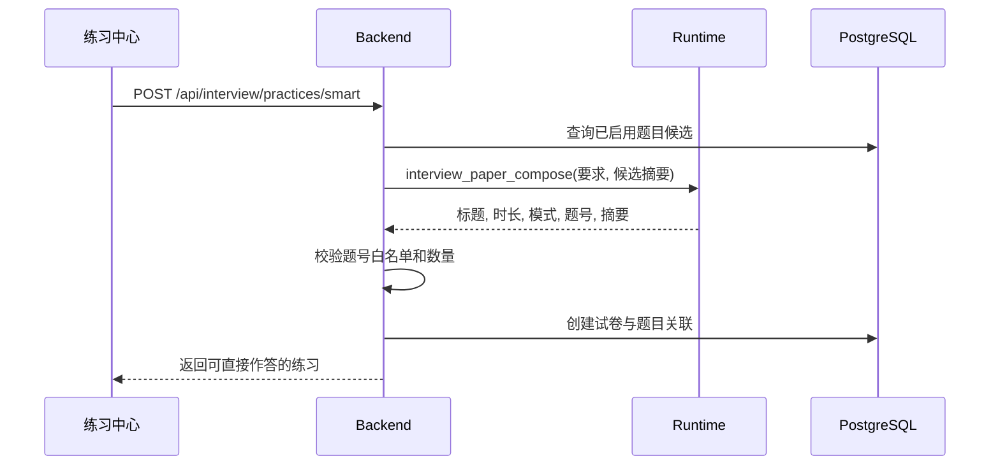
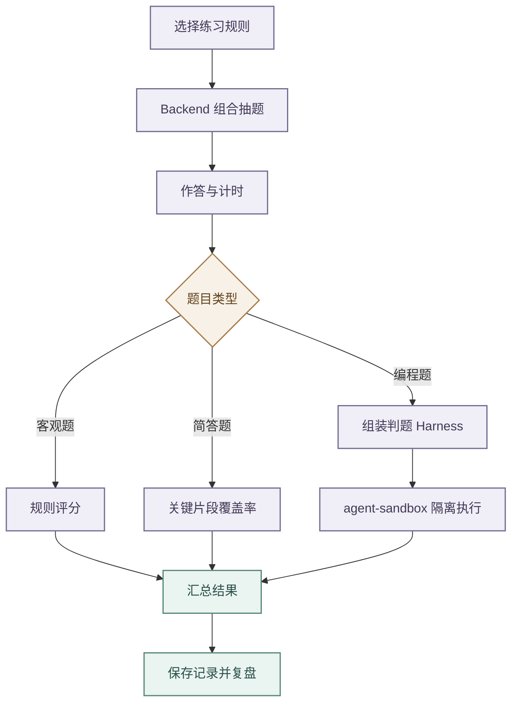
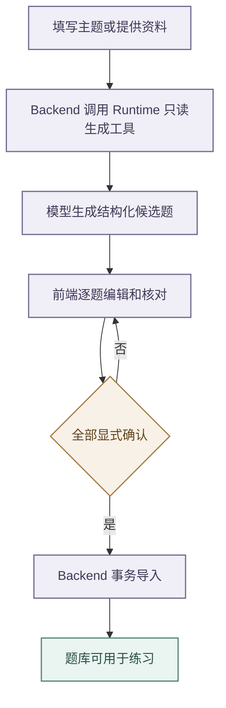

# 面试题库与模拟练习

## 能力范围

- 面试模块管理算法编程题、选择题、判断题和简答题，并提供规则组卷、智能组卷、限时作答、答案模式、提交评分和历史。
- `bank_type` 使用 `leetcode` 或 `qa` 区分题库，`category` 表示技术分类，`question_type` 表示题型。当前简答题规范值为 `简答`；读取、筛选、编辑和评分时将存量 `问答`、`问答题`、`简答题` 兼容归一为 `简答`，新增或更新时只写规范值；
- 编程语言、函数签名、模板和测试保存在结构化 `codingMeta`。

- 练习中心以“题库 / 练习台”为一级入口。
- 练习台首页以练习记录为主体，展示全部、进行中和已完成数量，支持按练习名称搜索、按状态筛选，并在每条记录上明确提供继续练习、查看复盘和删除操作。
- 首次进入时直接展示稳定的记录加载状态，数据返回前不渲染为零的统计与筛选区域，避免错误内容和布局跳变。
- 页面只保留一个“创建练习”主按钮，点击后以弹窗打开智能组卷与规则组卷；
- 创建成功直接进入新练习，关闭弹窗仍停留在记录首页。
- 进入作答页后可返回练习记录或创建新练习，切换未提交练习前必须提示页面会话答案可能丢失。

- 题库行内的单题练习属于临时练习，请求使用 `recorded=false`。
- 临时练习仍由 Backend 创建并支持详情、计时、提交和评分，但不进入练习记录列表；
- 勾选题目后创建的手动练习、智能组卷和规则组卷默认 `recorded=true`。
- 为兼容 `recorded` 字段引入前的数据，列表层会识别标题以“单题练习”结尾、仅含一道题且策略未声明 `recorded` 的旧行内练习并隐藏，不通过迁移改写用户业务数据。
- `showAnswer`、`durationMinutes` 与规则随记录保存，服务端返回剩余时间。
- 记录查询和删除都按租户和用户隔离，删除练习时依赖外键级联清理练习题目关系；
- 失败时保留当前界面并显示可重试错误。
- 未提交答案只属于页面会话草稿，刷新或重新登录不保证恢复。

## 智能组卷

- 智能组卷接收一段自然语言要求，例如“从现有题库选择 8 道 Agent 工具调用、RAG 与模型评测中等难度题，45 分钟考试模式”。
- Backend 读取已启用题目的题号、标题、题库、分类、难度、题型、标签和受限长度题干摘要，调用 Runtime 的只读工具 `interview_paper_compose` 完成要求理解与选题。
- 题目答案、完整代码元数据和用户历史作答不进入选题 Prompt；
- Runtime 不访问数据库，也不创建练习记录。

- Runtime 只返回试卷标题、时长、答案展示模式、题号列表和选题摘要。
- Backend 必须确认题号全部来自本次候选集、去重后为 1–50 道，并再次按题号读取当前启用题目后创建练习。
- 模型返回未知题号、空试卷、重复题号、非法时长或不完整结构时直接拒绝，不允许静默换题或回退为随机组卷。

- 试卷 `strategy` 保存 `mode=smart`、原始要求、最终题号、时长、答案展示模式和选题摘要，支持练习记录复盘。
- 自然语言要求长度为 10–1000 字；
- 候选题不足时模型可以选择少于用户期望的题量，但必须至少选择一道相关题，并在摘要中说明取舍。
- 题库为空时 Backend 在调用模型前返回可操作提示。

- 规则组卷支持按题库、分类、难度和题型配置多条抽题规则，单条规则和整张规则试卷最多选择 100 道题；
- Backend 对重复题目去重，并在题库数量不足时按实际可用题目创建练习。
- 智能组卷仍维持 1–50 道题的模型输出与白名单复核边界，手动勾选组卷仍维持最多 50 道题。

## 编程题执行

- 编程题支持 Python、Java 和 JavaScript。
- Backend 根据结构化测试数据组装判题 Harness，并调用 Sandbox；
- `sample=true` 用于样例运行，全部正式用例用于提交评分。
- 自定义调试可修改输入和预期但不参与评分，页面不得从题干或答案用正则推导测试数据。

- 算法题手动录入、导入和生成必须提供 `language`、`functionName`、`parameterCount`、`template` 和非空 `tests`，每个测试含 `args` 与 `expected`。
- Backend 统一校验，缺失即拒绝入库；
- Python 判题兼容全局函数和 `class Solution` 同名方法。

题目维护页面不要求用户直接编辑整段 `codingMeta` 或测试用例数组。

算法题录入采用三步向导：基础信息、题面与代码、可视化测试用例。参数个数由首条有效用例推导，模板可按语言和入口重建；每步先校验，只有最后一步可保存，错误定位到具体步骤和用例。

| 题库类型  | 维护语义与必填信息                                                                               |
| --------- | ------------------------------------------------------------------------------------------------ |
| 算法题    | 使用算法场景的标题、分类、题面和标签，维护输入输出、约束、函数入口、代码模板、测试用例与解题思路 |
| 简答题    | 使用知识问答语义维护题干、资料来源、参考答案与评分要点                                           |
| 单选/多选 | 题干与选项分开维护，至少两个有效选项，正确答案引用已有选项编号                                   |

题型切换时，步骤标题、字段说明、占位文字和校验错误必须同步变化，不能用一套泛化提示混用算法题与问答题，也不能把选项重复写入题干。

算法题智能生成采用“候选生成、人工审核、确认入库”三阶段流程。

- 前端把主题、分类、难度、语言、数量、可选来源链接和用户资料提交 Backend，再由 `interview_question_generate` 只读工具调用 Runtime。
- 接口只返回无 `questionId` 的结构化候选，不写数据库；
- 候选必须含题面、答案、模板、函数入口和至少三条覆盖样例、边界与典型情况的测试。

- 系统不依赖 LeetCode 内部 GraphQL、网页抓取或绕过限制的导入。
- `sourceUrl` 只是来源标识，Runtime 不访问链接；
- 忠实转换原题时用户必须提供合法取得的题面，否则只能按主题生成原创或改编题。
- 生成后用户逐题编辑并显式确认题干、代码和预期，再调用 `/questions/import` 事务导入，任一题不合约则整批失败。

- 问答题智能生成沿用候选审核和事务导入边界，但生成设置与审核字段随题型变化。
- 知识主题、参考文本、上传资料或具体要求任一项即可作为来源；
- 简答候选需包含参考答案和评分要点，单选、多选需包含独立选项与正确答案编号。
- Runtime 以标准编号行把选择题选项放入统一 `content`，前端在审核页解析为可编辑选项并从题干移除重复内容。
- 候选被编辑后自动取消确认，重新核对题干、选项和答案后才能导入。

- 生成服务不可用、模型输出不是完整 JSON、测试用例参数不一致或请求不合法时，页面必须停留在生成来源步骤并保留已填内容，返回可操作的错误提示。
- 候选审核失败时必须定位到具体题号和字段，不得清空已经修改的候选内容。

## 页面与接口

| 分组 | 契约                                                                                                                                                                                                                               |
| --------- | ---------------------------------------------------------------------------------------------------------------------------------------------------------------------------------------------------------------------------------- |
| 题库      | `/api/interview/questions` 及 `/questions/meta` 提供查询和维护，`/questions/import` 事务导入人工确认的候选                                                                                                                         |
| 生成      | `/questions/generate` 调用 Runtime 的 `/v1/runtime/tools/interview_question_generate/invoke`；HTTP 成功只表示生成候选，不表示已入库                                                                                                |
| 判题      | `/code/run` 执行样例或自定义调试，正式练习提交仍由练习接口统一评分                                                                                                                                                                 |
| 练习      | `/practices` 提供记录列表，`DELETE /practices/{examId}` 删除所属记录；随机创建支持 `recorded` 控制是否进入列表，详情和提交对临时练习仍可用；`/practices/smart` 根据自然语言从现有题库智能选题，完整页面能力统一使用 `practice:use` |

- 智能生成数量为 1–20。
- 算法生成请求可指定 `language` 和 `sourceUrl`；
- 语言只接受 `python`、`java`、`javascript`，缺省为 Python，来源只接受 `leetcode.com` 或 `leetcode.cn` 的标准 HTTPS 题目地址。
- 问答生成必须明确 `questionType`，并可用 `topic`、`documentText` 或 `requirements` 提供知识范围。

练习台采用页面级主滚动，桌面端以题目和作答区双栏展示，题号导航收敛到可展开概览，避免多层独立滚动。Markdown 代码块和编辑器提供复制操作，复制失败应有可见反馈。

## 风险与验证

代码执行必须经过 Sandbox 的文件、网络和子进程限制；服务不可用时应明确失败，不能回退 Backend 宿主机。选择和判断题按标准答案评分，简答题及其存量别名采用轻量规则评分，不能包装为语义级可靠评估。

- 测试按题库与抽题、存量问答题型归一、智能选题白名单与失败边界、计时与评分、编程参数、候选生成零持久化、人工确认事务导入、非法来源、无效模型响应、Sandbox 失败、租户隔离、记录删除和临时单题练习过滤分组；容器集成测试必须通过真实 srt 分别执行 Python、Java 和 JavaScript，并验证文件、网络与 Unix socket 隔离。
- 前端执行 lint、test、build，并在真实页面验证算法题/问答题字段差异、题型切换、候选审核与确认导入、练习记录首页、搜索筛选、继续练习、删除确认、智能组卷输入与错误保留、编辑回填、单题练习不进入记录、倒计时、样例、自定义调试、提交和复盘。
