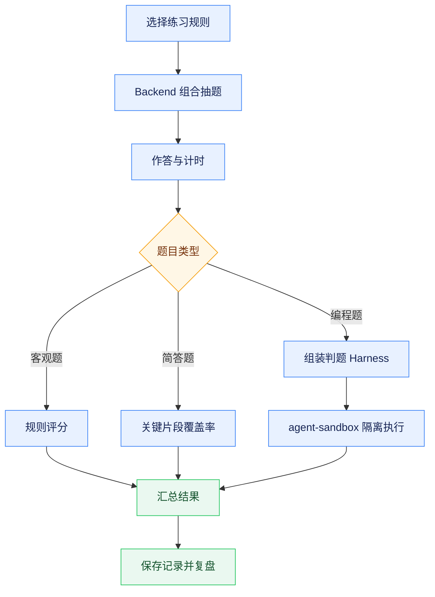
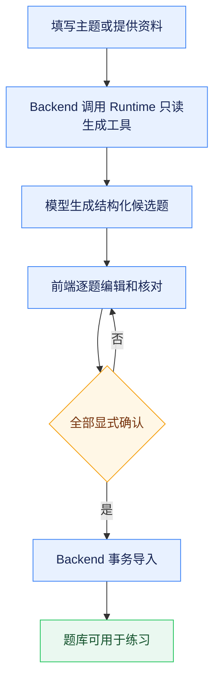

# 面试题库与模拟练习

## 能力范围

面试模块管理算法编程题、选择题、判断题和简答题，并提供组合抽题、限时作答、答案模式、提交评分和历史。`bank_type` 使用 `leetcode` 或 `qa` 区分题库，`category` 表示技术分类，`question_type` 表示题型；编程语言、函数签名、模板和测试保存在结构化 `codingMeta`。

练习接口接收 rules，可按题库、分类、难度、题型和数量组合抽题。`showAnswer`、`durationMinutes` 与规则随记录保存，服务端返回剩余时间。记录按租户和用户隔离，失败时显示错误和重试；未提交答案只属于页面会话草稿，刷新或重新登录不保证恢复。

## 编程题执行

编程题支持 Python、Java 和 JavaScript。Backend 根据结构化测试数据组装判题 Harness，并调用 Sandbox；`sample=true` 用于样例运行，全部正式用例用于提交评分。自定义调试可修改输入和预期但不参与评分，页面不得从题干或答案用正则推导测试数据。

算法题手动录入、导入和生成必须提供 `language`、`functionName`、`parameterCount`、`template` 和非空 `tests`，每个测试含 `args` 与 `expected`。Backend 统一校验，缺失即拒绝入库；Python 判题兼容全局函数和 `class Solution` 同名方法。

题目维护页面不要求用户直接编辑整段 `codingMeta` 或测试用例数组。

算法题录入采用三步向导：基础信息、题面与代码、可视化测试用例。参数个数由首条有效用例推导，模板可按语言和入口重建；每步先校验，只有最后一步可保存，错误定位到具体步骤和用例。

| 题库类型  | 维护语义与必填信息                                                                               |
| --------- | ------------------------------------------------------------------------------------------------ |
| 算法题    | 使用算法场景的标题、分类、题面和标签，维护输入输出、约束、函数入口、代码模板、测试用例与解题思路 |
| 简答题    | 使用知识问答语义维护题干、资料来源、参考答案与评分要点                                           |
| 单选/多选 | 题干与选项分开维护，至少两个有效选项，正确答案引用已有选项编号                                   |

题型切换时，步骤标题、字段说明、占位文字和校验错误必须同步变化，不能用一套泛化提示混用算法题与问答题，也不能把选项重复写入题干。

算法题智能生成采用“候选生成、人工审核、确认入库”三阶段流程。

前端把主题、分类、难度、语言、数量、可选来源链接和用户资料提交 Backend，再由 `interview_question_generate` 只读工具调用 Runtime。接口只返回无 `questionId` 的结构化候选，不写数据库；候选必须含题面、答案、模板、函数入口和至少三条覆盖样例、边界与典型情况的测试。

系统不依赖 LeetCode 内部 GraphQL、网页抓取或绕过限制的导入。`sourceUrl` 只是来源标识，Runtime 不访问链接；忠实转换原题时用户必须提供合法取得的题面，否则只能按主题生成原创或改编题。生成后用户逐题编辑并显式确认题干、代码和预期，再调用 `/questions/import` 事务导入，任一题不合约则整批失败。

问答题智能生成沿用候选审核和事务导入边界，但生成设置与审核字段随题型变化。知识主题、参考文本、上传资料或具体要求任一项即可作为来源；简答候选需包含参考答案和评分要点，单选、多选需包含独立选项与正确答案编号。Runtime 以标准编号行把选择题选项放入统一 `content`，前端在审核页解析为可编辑选项并从题干移除重复内容。候选被编辑后自动取消确认，重新核对题干、选项和答案后才能导入。

生成服务不可用、模型输出不是完整 JSON、测试用例参数不一致或请求不合法时，页面必须停留在生成来源步骤并保留已填内容，返回可操作的错误提示。候选审核失败时必须定位到具体题号和字段，不得清空已经修改的候选内容。

## 页面与接口

| 接口组 | 契约                                                                                                                                |
| ------ | ----------------------------------------------------------------------------------------------------------------------------------- |
| 题库   | `/api/interview/questions` 及 `/questions/meta` 提供查询和维护，`/questions/import` 事务导入人工确认的候选                          |
| 生成   | `/questions/generate` 调用 Runtime 的 `/v1/runtime/tools/interview_question_generate/invoke`；HTTP 成功只表示生成候选，不表示已入库 |
| 判题   | `/code/run` 执行样例或自定义调试，正式练习提交仍由练习接口统一评分                                                                  |
| 练习   | `/practices` 提供列表、随机创建、详情和提交，完整页面能力统一使用 `practice:use`                                                    |

智能生成数量为 1–20。算法生成请求可指定 `language` 和 `sourceUrl`；语言只接受 `python`、`java`、`javascript`，缺省为 Python，来源只接受 `leetcode.com` 或 `leetcode.cn` 的标准 HTTPS 题目地址。问答生成必须明确 `questionType`，并可用 `topic`、`documentText` 或 `requirements` 提供知识范围。

练习台采用页面级主滚动，桌面端以题目和作答区双栏展示，题号导航收敛到可展开概览，避免多层独立滚动。Markdown 代码块和编辑器提供复制操作，复制失败应有可见反馈。

## 风险与验证

代码执行必须经过 Sandbox 的文件、网络和子进程限制；服务不可用时应明确失败，不能回退 Backend 宿主机。选择和判断题按标准答案评分，简答题采用轻量规则评分，不能包装为语义级可靠评估。

测试按题库与抽题、计时与评分、编程参数、候选生成零持久化、人工确认事务导入、非法来源、无效模型响应、Sandbox 失败、租户隔离和记录恢复分组。前端执行 lint、test、build，并在真实页面验证算法题/问答题字段差异、题型切换、候选审核与确认导入、编辑回填、练习创建、倒计时、样例、自定义调试、提交和复盘。
