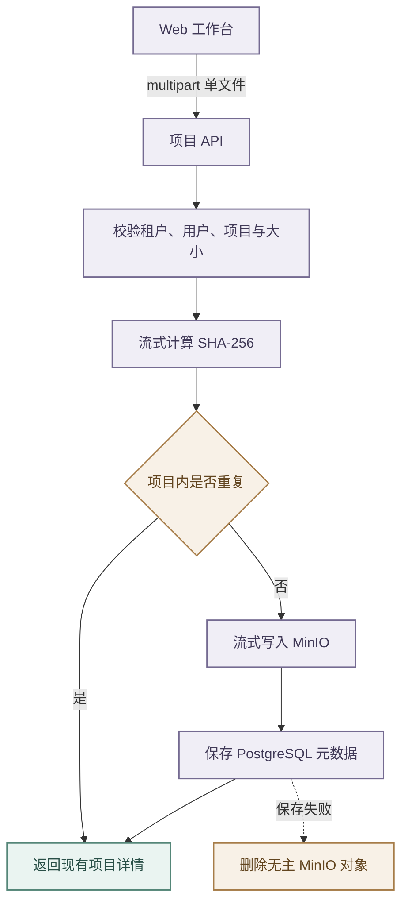

# 项目深挖与材料管理

## 能力范围

项目深挖维护面试复盘所需的项目档案、原始材料和问题清单。档案包含名称、角色、技术栈、摘要、周期、团队规模、类型、领域、状态、背景、职责、亮点、难点与方案及成果；除名称外均可按需补充。

- 项目、材料和问题通过 `/api/project-deep-dive` 系列接口维护，均受 `project:use` 权限保护，并按租户、用户和资源所有权查询。
- 项目名称、经历、材料和问题属于用户私有数据，只能通过受鉴权 API 写入，不能由 Flyway 初始化。

## 项目档案与页面

- 列表返回完整档案字段及材料、问题计数，材料和问题明细只在详情接口加载。
- 页面汇总项目数、材料数、问题数和平均准备度；
- 单项目按无材料、有材料无问题、已有问题分别计 20%、60%、100%，平均值四舍五入为整数。

前端以经历主内容和基础信息侧栏展示：主区包含摘要、背景、职责、亮点、难点和成果，侧栏包含角色、类型、领域、周期、状态、团队、技术栈及计数。空字段只显示补充提示，不生成内容。

创建和编辑复用同一数据结构，编辑弹窗分为基础信息和经历详情，切换页签时保留未保存输入。

窄屏降级为单栏。数据库字段只通过追加式 Flyway 维护，部署必须先完成迁移再运行引用新列的 Backend。

## 材料存储与接口

- 材料二进制写入 MinIO，`project_deep_dive_material` 只保存文件名、类型、对象路径、大小、SHA-256 和时间。
- 上传使用 `MultipartFile` 输入流，不在 JVM 构造完整字节数组；
- SHA-256 用于同项目重复识别。

- `POST /api/project-deep-dive/projects/{projectId}/materials` 每次接收一个 `file`，前端单次最多选择 20 个文件，并逐个调用以独立反馈。
- 单文件上限 1GB，前后端均校验；
- 反向代理或网关有独立限制时必须同步配置。

- `GET /api/project-deep-dive/materials/{materialId}/file` 以附件下载单个文件，返回原始内容类型、长度和 `nosniff`。
- `GET /api/project-deep-dive/materials/batch-file` 接收最多 100 个材料标识，按选择顺序去重后用 `StreamingResponseBody` 和 `ZipOutputStream` 输出 ZIP，不在内存或本地磁盘聚合全部内容。
- `DELETE /api/project-deep-dive/materials/{materialId}` 删除元数据和 MinIO 对象。

## 文件安全

- 服务端不按扩展名或 MIME 拒绝材料，也不解压、解析或执行。
- 下载统一使用 attachment，批量下载只增加外层 ZIP；
- 对象键使用项目和系统标识，文件名清理路径并限长。
- 下载与删除逐项校验所有权，响应不暴露对象路径和 SHA-256。

上传对象成功但元数据保存失败时删除新对象，避免无主文件；删除流程需要对数据库和对象存储失败做可定位记录。

## 问题生成与验证

项目详情支持维护问题和调用 `/projects/{projectId}/generate` 生成 1–100 道复盘问题候选。

- 生成请求包含数量、方向和最长 1000 字符的统一要求。
- 接口只返回无 `questionId` 的候选，不写库；
- 前端在同一弹窗展示问题、分类、难度和答案，用户勾选后再调用 `/projects/{projectId}/questions/import`。
- 关窗或重新生成不改变题库。
- 模型只使用项目档案结构化字段，二进制材料仅供存储与下载，不参与自动理解，也不能成为可信指令。

- 问题复盘列表在桌面双栏模式下每页固定展示 5 道题，题卡按工作台剩余高度等分铺满，翻页后自动选中新页第一题并同步右侧详情。
- 页面主体不产生纵向滚动，当前问题及操作区固定，仅参考答案、可能追问和材料依据所在的内容区在超出高度时独立滚动。
- 左右方向键用于整页翻页，上下方向键用于逐题切换；
- 从本页首题继续向上时自动切换到上一页末题，从本页末题继续向下时自动切换到下一页首题。
- 输入框、文本编辑器、下拉框、可编辑区域和弹窗打开期间不响应快捷键，避免干扰筛选与内容编辑。
- 窄屏布局保持纵向滚动，确保单栏降级后内容可访问。

- 测试应覆盖档案字段、空值、任意二进制上传、空文件、大小上限、重复文件、跨用户拒绝、中文文件名、单个与批量下载、ZIP 同名处理和对象删除。
- 前端需验证概览响应式布局、编辑回填、逐文件上传的部分失败、勾选下载和删除。
