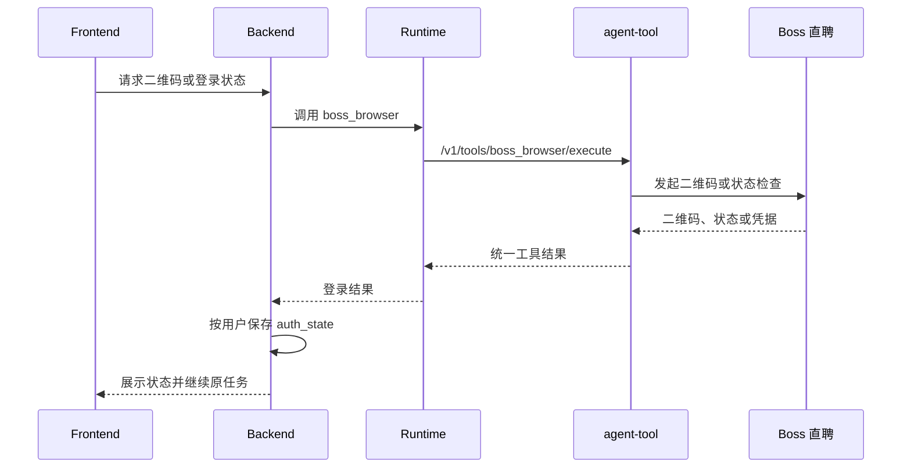

# Boss 直聘集成与岗位检索

## 能力边界

Boss 直聘能力由 agent-tool 的 `boss_browser` 工具实现，底层使用 jackwener/boss-cli 提供的 Cookie、HTTP Client、请求抖动、退避和上游错误分类。agent-runtime 负责工具发现、权限和代理；agent-backend 负责用户登录状态、业务 API、候选池、Redis 限速状态与 SSE；前端负责扫码交互、岗位卡片和错误反馈。系统不使用 Chrome CDP 持久控制用户浏览器。

Boss Cookie 由 Backend 按租户和用户保存在 PostgreSQL `auth_state`，调用工具时通过受控载荷注入 agent-tool 进程内存。Tool 不创建 `credential.json` 或持久浏览器 Profile，日志、Trace 和聊天内容不得包含 Cookie。Redis 保存限速窗口、连续失败和风控冷却状态。

## 登录流程

默认登录路径是二维码扫码或恢复 PostgreSQL 中的有效凭据。Boss 登录作用域固定为当前租户与当前用户，不绑定聊天、岗位收藏、简历或设置页面；同一用户任一入口扫码成功后，凭据加密写入 PostgreSQL `auth_state`，所有入口立即命中同一登录缓存，进程重启后也从该持久凭据恢复，不要求重复扫码。未完成且未过期的二维码会话同样按租户用户复用，其他页面不得重复创建二维码。浏览器 Cookie 导入默认关闭，只有显式开启 `BOSS_CLI_AUTO_IMPORT_BROWSER_COOKIES` 时才允许访问本机浏览器凭据，避免 macOS 钥匙串授权干扰。二维码 dispatch 后若缺少必要 Web Cookie，可在配置允许时启动一次性 headless Chromium，使用系统临时 Profile 补齐并立即清理；补齐失败时返回 `auth_required`，不能伪造成功。

搜索或详情访问发现临时令牌失效时，工具先尝试用已注入的持久身份 Cookie 静默补齐。只有明确返回需要登录或检测到登录重定向且补齐失败时，Backend 才将状态标记失效并提示扫码。Runtime、Tool 超时或服务不可达属于依赖故障，不能清除已保存凭据，也不能误导用户重新登录。

## 搜索、分页与详情

首次搜索优先返回单页结果，候选池按检索条件缓存去重标识、下一页和上游枯竭状态。“换一批”复用上一轮关键词、城市、筛选条件和候选池，仅在缓存不足且上游未枯竭时低频抓取下一页，不重复执行任务理解。

薪资硬过滤支持常见 K 制、元/月和结构化上下限；与目标区间完全不重叠、日结或明确实习岗位可被剔除，“面议”和无法可靠解析的薪资保留。列表只返回基础信息，职位描述在用户查看详情、收藏补全或分析确需时通过 `securityId` 等标识懒加载。

工具入口为 `POST /v1/tools/boss_browser/execute`，Runtime 代理入口为 `POST /v1/runtime/tools/boss_browser/invoke`。操作覆盖状态、二维码、搜索、详情、在线简历和限速快照；具体参数以 Tool Schema 和代码为准。

## 岗位收藏选择性导入

岗位收藏页面通过独立弹窗提供 Boss 到 Job Buddy 的单向导入。该能力不做后台同步、不做全量抓取、不自动连续翻页，也不向 Boss 回写收藏状态。前端打开弹窗后只请求第一页摘要，后续页通过“上一页 / 第 N 页 / 下一页”人工切换，每次替换当前页而非累积长列表；Backend 的 `GET /api/jobs/favorites/boss?page=N` 只调用 Tool 的 `favorite_list` 操作，不读取岗位详情。Backend 预览阶段一次读取本地收藏键集合，直接过滤已导入岗位和 Boss 页内重复岗位，避免逐项数据库查询和重复详情访问。

Boss“感兴趣/收藏”列表通过 `interaction/geekGetJob` 的固定 tag 读取。tag 只能由 Tool 配置 `favorite_list_tag` 或环境变量 `BOSS_CLI_FAVORITE_LIST_TAG` 设置，禁止由前端透传。仅允许用户手动逐页读取，不设置本地页数、每小时次数或每日次数硬限制；`BOSS_CLI_MAX_FAVORITE_LIST_PAGE`、`BOSS_CLI_FAVORITE_LIST_PER_HOUR` 和 `BOSS_CLI_FAVORITE_LIST_PER_DAY` 默认均为 `0`，表示关闭本地硬限制，部署方仍可按需配置正整数重新启用。Backend 按租户、用户和页码缓存成功结果 2 分钟，重复打开与上一页/下一页优先命中缓存；只有用户点击“刷新”才绕过缓存重新访问 Boss。

用户确认后，`POST /api/jobs/favorites/boss/import` 接受全部明确勾选的岗位，不设置业务数量上限，按选择顺序串行补全 JD 并写入现有 `job_favorite` 快照。已存在岗位不重复访问详情。真实访问仍受 Tool 详情小时/日配额、抖动和冷却保护；首个登录失效、限速、验证码、安全验证、账号异常、上游依赖故障或详情缺失会立即停止剩余项。已成功写入的岗位保留，响应明确区分已导入、已存在、失败和为保护账号未处理。打开导入弹窗时先读取用户级登录缓存：未登录则在同一弹窗内展示复用二维码，不叠加第二个对话框；登录有效时直接读取第一页。二维码状态轮询严格串行，上一轮完成后才调度下一轮，禁止固定周期叠加慢请求；Tool 单次扫码长轮询为 3 秒，前端完成后间隔 1 秒再查询，正常确认反馈约 4 秒。扫码成功后只自动读取一次第一页，不恢复失败的批量导入，也不自动翻页。

## 风控、安全与验证

所有真实访问必须串行、低频、有抖动并限制页数。验证码、安全验证、异常访问、限速或账号异常出现时立即停止并进入冷却；本地依赖故障、需要登录和真实上游风控必须分类，不能相互消耗错误配额。系统不尝试绕过平台风控，真实联调必须由人工在正常账号下执行最小请求。

自动化测试不得访问 Boss，应覆盖凭据注入、无本地凭证文件、Cookie 导入门禁、二维码状态、慢轮询不重叠、筛选映射、分页上限、候选池、薪资过滤、详情标识、收藏列表固定 tag、收藏列表独立配额、不限量选择、遇险停手、错误分类、Redis 限速和 Runtime 代理契约。前端变更还需验证扫码续跑、换一批、详情懒加载、当前页全部勾选、未登录同窗二维码、登录后单次首屏加载、部分成功提示、错误收尾和凭据不落盘。

## 运行边界

该能力依赖第三方平台协议和用户有效登录态，不承诺高频抓取。请求必须保持低频、可控、可降级且不暴露凭据；平台协议变化或风控拒绝必须返回可解释错误。
