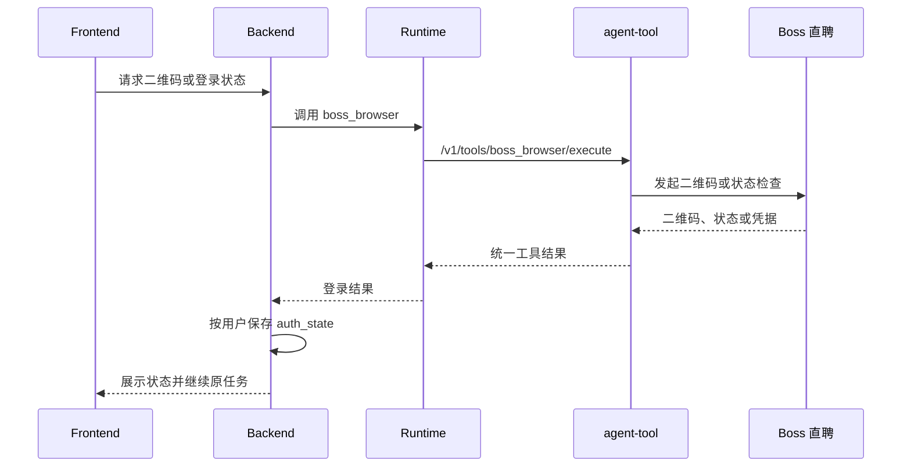

# Boss 直聘集成与岗位检索

## 能力边界

Boss 直聘能力由 agent-tool 的 `boss_browser` 工具实现，底层使用 jackwener/boss-cli 提供的 Cookie、HTTP Client、请求抖动、退避和上游错误分类。agent-runtime 负责工具发现、权限和代理；agent-backend 负责用户登录状态、业务 API、候选池、Redis 限速状态与 SSE；前端负责扫码交互、岗位卡片和错误反馈。系统不使用 Chrome CDP 持久控制用户浏览器。

Boss Cookie 由 Backend 按租户和用户保存在 PostgreSQL `auth_state`，调用工具时同时注入凭据和由可信 Backend 生成的属主键。agent-tool 以有界、可过期的属主会话注册表隔离内存凭据，并在同一属主锁内完成凭据选择和实际调用；缺少属主或凭据时失败关闭，不能复用其他请求留下的进程全局状态。Tool 不创建 `credential.json` 或持久浏览器 Profile，日志、Trace 和聊天内容不得包含 Cookie。Redis 保存限速窗口、连续失败和风控冷却状态。

## 登录流程

默认登录路径是二维码扫码或恢复 PostgreSQL 中的有效凭据。Boss 登录作用域固定为当前租户与当前用户，不绑定聊天、岗位收藏、简历或设置页面；同一用户任一入口扫码成功后，凭据加密写入 PostgreSQL `auth_state`，所有入口立即命中同一登录缓存，进程重启后也从该持久凭据恢复，不要求重复扫码。未完成且未过期的二维码会话同样按租户用户复用，其他页面不得重复创建二维码。

二维码由 Tool 生成不可猜测的精确会话 ID，并把二维码 Cookie、上游标识、过期时间和版本封装为 AES-GCM 认证加密的内部状态令牌。Backend 只把该令牌保存在属主绑定的 `boss_qr_login_session`，不返回前端；每次轮询和取消都同时提交属主键、精确会话 ID 与令牌，Tool 验证三者一致后才恢复状态。轮询返回轮换后的令牌，成功、过期、取消或错误终态立即删除会话。状态令牌使用生产环境共享内部密钥派生，因此不同 Tool Worker 不依赖某个进程的全局二维码状态。

浏览器 Cookie 导入默认关闭，只有显式开启 `BOSS_CLI_AUTO_IMPORT_BROWSER_COOKIES` 时才允许访问本机浏览器凭据，避免 macOS 钥匙串授权干扰。二维码 dispatch 后若缺少必要 Web Cookie，可在配置允许时启动一次性 headless Chromium，使用系统临时 Profile 补齐并立即清理；补齐失败时返回 `auth_required`，不能伪造成功。

搜索和详情使用的 `__zp_stoken__` 属于临时网页安全令牌，不代表平台登录身份。该令牌过期但 `wt2`、`zp_at` 等持久身份 Cookie 仍有效时，Tool 必须复用 Backend 注入的同一属主凭据，依次访问首页和已登录岗位页静默重生令牌后重试当前请求；不得读取本机浏览器 Cookie、清除平台登录态或要求用户重复扫码。

搜索或详情访问发现临时令牌失效时，工具先尝试用已注入的持久身份 Cookie 静默补齐。一次性 Chromium 页面提前关闭时应使用全新临时上下文做一次有界重试；仍失败则返回可重试的依赖错误并保留持久凭据，不能降级为 `auth_required`。只有明确返回需要登录或检测到登录重定向、且令牌补齐已正常执行但无法恢复时，Backend 才将状态标记失效并提示扫码。Runtime、Tool 超时或服务不可达属于依赖故障，不能清除已保存凭据，也不能误导用户重新登录。

## 搜索、分页与详情

首次搜索先抓取单页结果；确定性过滤后的候选规模按“每批展示岗位数 × 候选池倍率”计算，并受 `maxJobsPerScoring` 总评分上限约束。候选不足时按页补充，单次补充页数和最大检索页深仍由风控配置限制；重复或不合格页不阻断下一补充页，但不得无界翻页凑数。候选池按用户与检索条件缓存原始去重标识、下一页、已消费候选游标和上游枯竭状态。“换一批”复用上一轮关键词、城市、筛选条件和候选池，从已消费游标之后继续读取；缓存不足且上游未枯竭时只抓取未访问的后续 Boss 页，不回绕、重评或重新请求已经消费的岗位，也不重复执行任务理解。

岗位搜索采用“召回不等于推荐”的严格两阶段策略。Backend 先将用户本轮明确条件与求职画像、当前简历合并；本轮条件优先于画像默认值。Runtime 薪资槽位缺失时，Backend 从原始请求兜底解析 `40-50K`、`40K-50K`、`月薪 4-5 万` 和元/月区间，并把结果写回会话槽位，供扫码续跑和换一批复用。

薪资硬过滤支持常见 K 制、元/月和结构化上下限。用户明确给出闭区间时，候选月薪必须可解析且至少覆盖目标区间的 50%；仅边界相交不算匹配。`35-55K` 对目标 `40-50K` 可保留，`21-35K·13薪`、`15-25K`、日结、时薪、面议和无法解析薪资均剔除；`13薪/14薪` 不折算为更高月薪。用户没有薪资约束时才允许保留未知薪资岗位。

候选元数据还需经过岗位族、专项能力、经验和排除项硬过滤。岗位明确要求多模态、视觉、语音、推荐算法等专项能力，而画像与简历没有对应证据时不得进入推荐。确定性过滤后的候选使用当前简历分批执行 `resume_match`，并显式声明 `recommendation_list` 证据模式；达到本轮展示数量后立即停止，合格数量不足时继续评估候选池中的下一批，直到候选池倍率、总评分上限、最大检索页深或上游结果耗尽。列表模式将岗位名称、技能、标签、经验、学历、城市和薪资等结构化字段视为有效的预筛证据，缺少完整 JD 只限制置信度最高为 medium 并写入限制说明，不能自动将结果判为“证据不足”，也不能把列表中没有声明的要求推断成候选人的能力缺口。60–74 分的可靠列表匹配可给出“可尝试”，75 分及以上且证据充分时可给出“推荐”；只有达到最低推荐分、置信度不为 low、投递建议不是谨慎/不建议/证据不足的岗位才发送 `job_cards`。

每次 `resume_match` 返回的岗位 ID 集合必须与本次输入完整一致，重复 ID、未知 ID、缺失 ID 或计数不一致均属于评分契约失败，不属于低分淘汰。Backend 可对不完整批次执行一次有界拆分重试；重试后仍不完整时整批明确失败，不推进候选游标，也不得把未评分岗位统计为“未达到最低匹配分”。成功漏斗必须满足“请求评分数 = 完成评分数”和“完成评分数 = 通过数 + 各拒绝原因数”。该推荐质量门失败关闭；预算耗尽后仍没有岗位达标时返回空结果说明，不保留最高分低质量岗位凑数。

列表仍只使用 Boss 分页基础信息，职位描述在用户查看详情、收藏补全或分析确需时通过 `securityId` 等标识懒加载。自动推荐不会为预筛逐个读取 JD，以免放大真实访问频率和风控风险；卡片正文只展示岗位基础信息和业务标签，匹配分、置信度、投递建议、推荐理由、证据限制和证据层级统一放入默认收起的“推荐依据”，仅在用户点击后于操作区下方展示。列表证据有限时不得宣称已完成完整 JD 级验证。

工具入口为 `POST /v1/tools/boss_browser/execute`，Runtime 代理入口为 `POST /v1/runtime/tools/boss_browser/invoke`。操作覆盖状态、二维码、搜索、详情、在线简历和限速快照；具体参数以 Tool Schema 和代码为准。

## 岗位收藏选择性导入

岗位收藏页面通过独立弹窗提供 Boss 到 Job Buddy 的单向导入。该能力不做后台同步、不做全量抓取、不自动连续翻页，也不向 Boss 回写收藏状态。前端打开弹窗后只请求第一页摘要，后续页通过“上一页 / 第 N 页 / 下一页”人工切换，每次替换当前页而非累积长列表；Backend 的 `GET /api/jobs/favorites/boss?page=N` 只调用 Tool 的 `favorite_list` 操作，不读取岗位详情。Backend 预览阶段一次读取本地收藏键集合，直接过滤已导入岗位和 Boss 页内重复岗位，避免逐项数据库查询和重复详情访问。

Boss“感兴趣/收藏”列表通过 `interaction/geekGetJob` 的固定 tag 读取。tag 只能由 Tool 配置 `favorite_list_tag` 或环境变量 `BOSS_CLI_FAVORITE_LIST_TAG` 设置，禁止由前端透传。仅允许用户手动逐页读取，不设置本地页数、每小时次数或每日次数硬限制；`BOSS_CLI_MAX_FAVORITE_LIST_PAGE`、`BOSS_CLI_FAVORITE_LIST_PER_HOUR` 和 `BOSS_CLI_FAVORITE_LIST_PER_DAY` 默认均为 `0`，表示关闭本地硬限制，部署方仍可按需配置正整数重新启用。Backend 按租户、用户和页码缓存成功结果 2 分钟，重复打开与上一页/下一页优先命中缓存；只有用户点击“刷新”才绕过缓存重新访问 Boss。

用户确认后，`POST /api/jobs/favorites/boss/import` 接受全部明确勾选的岗位，不设置业务数量上限，只清洗列表摘要并按选择顺序写入现有 `job_favorite`，导入请求内不访问岗位详情、不创建分析任务，也不调用模型。已存在岗位直接跳过；数据库写入异常时保留已完成项并停止剩余项。岗位 JD 改为显式按需补全：用户点击“职位描述”时调用 Tool 的 `detail` 操作，成功后将完整快照回写收藏；用户点击“分析岗位”且快照缺少 JD 时，分析任务先补全并持久化详情，再调用 Runtime。详情访问仍受 Tool 小时/日配额、串行抖动、冷却和遇险停手保护，但这些等待不再阻塞导入动作。打开导入弹窗时先读取用户级登录缓存：未登录则在同一弹窗内展示复用二维码，不叠加第二个对话框；登录有效时直接读取第一页。二维码状态轮询严格串行，上一轮完成后才调度下一轮，禁止固定周期叠加慢请求；Tool 单次扫码长轮询为 3 秒，前端完成后间隔 1 秒再查询，正常确认反馈约 4 秒。扫码成功后只自动读取一次第一页，不自动翻页。

## 风控、安全与验证

所有真实访问必须串行、低频、有抖动并限制页数。验证码、安全验证、异常访问、限速或账号异常出现时立即停止并进入冷却；本地依赖故障、需要登录和真实上游风控必须分类，不能相互消耗错误配额。系统不尝试绕过平台风控，真实联调必须由人工在正常账号下执行最小请求。

自动化测试不得访问 Boss，应覆盖双属主顺序与并发凭据隔离、空凭据失败关闭、无本地凭证文件、Cookie 导入门禁、二维码精确匹配、跨 Worker 状态恢复、重放、过期、取消、慢轮询不重叠、筛选映射、分页上限、候选池、薪资过滤、列表证据预筛、评分 ID 完整性、部分返回重试、详情标识、收藏列表固定 tag、收藏列表独立配额、不限量选择、遇险停手、错误分类、Redis 限速和 Runtime 代理契约。默认门禁还必须包含固定的 23 候选推荐漏斗回归，验证评分完整覆盖、ID 一一对应以及“评估数 = 通过数 + 各拒绝原因数”；真实 Boss 用例只允许人工低频执行，不能以在线结果必须产生至少一个岗位为条件诱导质量门降级。前端变更还需验证扫码续跑只保留一个用户轮次、换一批、详情懒加载、当前页全部勾选、未登录同窗二维码、登录后单次首屏加载、部分成功提示、错误收尾和凭据不落盘。

## 运行边界

该能力依赖第三方平台协议和用户有效登录态，不承诺高频抓取。请求必须保持低频、可控、可降级且不暴露凭据；平台协议变化或风控拒绝必须返回可解释错误。
