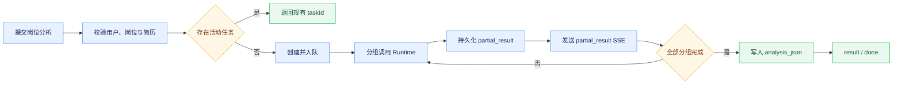

# 岗位分析与收藏管理

## 能力范围

工作台支持推荐岗位的定向分析、岗位收藏、详情快照和持久化分析报告。岗位键、收藏记录和分析任务均按租户与用户隔离。简历撰写器的 Markdown 草稿与 PDF 简历库是不同数据源，岗位分析使用用户选择或默认的 PDF 简历/画像上下文，不隐式读取未导出的草稿。

## Boss 收藏选择性导入

岗位收藏支持从 Boss 直聘单向选择性导入。用户从岗位收藏页打开独立弹窗后，系统直接读取第一页岗位摘要，并由同一接口判定登录状态，避免先串行请求状态接口；未登录时在同一弹窗内展示二维码，扫码成功后也只读取一次第一页。Backend 一次读取本地收藏身份集合，过滤已存在岗位和 Boss 页内重复项，前端只展示可导入岗位。Boss 返回的 `securityId` 可能随列表请求轮换，因此岗位身份优先使用稳定的 `encryptJobId`；历史上按 `securityId` 保存的收藏无需迁移，Backend 会从已有岗位 JSON 中提取稳定 ID 参与去重。弹窗采用“上一页、第 N / M 页、下一页”的分页格式，每次只渲染当前页，不把多页结果追加成长列表；`M` 为 Boss 返回的实际总页数，不设置本地人工浏览页数上限；到达实际最后一页后必须禁用下一页且不得发起越界请求。后续分页必须由用户手动触发，系统不在岗位收藏页面初始化或后台任务中读取，不提供全量同步。

勾选数量不设业务上限。确认导入后 Backend 按选择顺序清洗并保存当前页摘要，不在导入请求中读取岗位详情或触发岗位分析，因此导入时延不随 Boss 详情请求和模型调用累积。数据库写入异常时保留已完成项并停止剩余项；已完成项不回滚，并返回逐项状态与最新本地收藏列表。该流程只写本地 `job_favorite`，不会修改 Boss 收藏状态。

接口契约为：`GET /api/jobs/favorites/boss?page=1` 返回去重后的单页摘要、`page`、`totalPages`、`hasMore` 和只读配额摘要；`POST /api/jobs/favorites/boss/import` 请求体为 `{ "jobs": [...] }`，响应包含 `importedCount`、`existingCount`、`failedCount`、`unprocessedCount`、`stopped`、`authRequired`、`items` 与 `favorites`。为保持接口兼容保留 `authRequired` 等停手字段，但摘要导入本身不访问 Boss 详情，正常情况下不会产生详情登录或风控错误。外部岗位对象在 Backend 以 `JsonNode` 明确隔离，不在 Controller、Service 或 Client 新增无 schema 的 Map DTO。

## 定向分析与收藏快照

从岗位卡片发起分析时，前端把必要的结构化 `selectedJob` 随 `/api/chat/stream` 发送。Backend 只提取岗位名、公司、薪资、要求和 JD 等分析字段，与当前用户简历或画像一起进入业务处理器，避免把完整外部对象无界注入 Prompt。

聊天推荐或岗位工作台中的普通收藏仍必须形成完整岗位快照：列表结果已有 JD 时直接标准化为 `jobDescription`；缺失时在收藏请求内根据 `securityId` 或原岗位链接调用详情能力，详情定位信息缺失、登录失效、采集失败或结果仍无 JD 时不写入收藏。BOSS 选择性导入是唯一例外，先保存可去重、可展示的岗位摘要，以避免用户在导入阶段等待逐项详情请求。

导入后的摘要在用户点击“职位描述”时按需读取详情并回写 `job_json`；用户直接点击“分析岗位”时，分析任务若发现固化快照缺少 JD，也必须先通过收藏中的定位信息补全并持久化，再调用 Runtime。除此之外，查询收藏、页面初始化和导入动作均不得临时访问 Boss。分析结果写入独立的 `analysis_json` 和 `analyzed_at`，不得混入岗位快照；收藏页不得复用岗位工作台的全局匹配结果或按列表下标推断分析归属。

## 异步分析与恢复

收藏岗位分析通过 `POST /api/jobs/favorites/analysis-tasks` 创建持久化后台任务。Backend 完成参数、归属和快照校验后立即返回任务标识，由有界线程池执行；同一租户、用户、任务类型和岗位键只允许一个活动任务，重复提交复用现有任务。

前端订阅 `GET /api/analysis-tasks/{taskId}/stream`，处理 `snapshot`、`progress`、`partial_result`、`result`、`error`、`done` 和 `heartbeat`。关闭弹窗或断线只停止观察，不取消任务；返回页面时通过 latest 接口恢复最近任务。服务启动时重新提交数据库中遗留的 queued/running 任务，执行逻辑以幂等覆盖为目标。

报告按“投递结论与关键证据”“能力维度与风险”“简历补强与面试方案”分组生成。每组模型调用完成后立即写入 `analysis_task.partial_result_json` 并通过 SSE 发送，全部完成后才更新收藏记录。禁止把完整报告延迟切片或用占位文本伪造成部分结果。

## 报告与错误边界

分析结果是投递决策辅助，包含岗位和简历上下文、匹配分、建议、置信度、维度拆解、优势、缺口、证据对照、简历补强、面试重点、风险和限制。可选分析字段缺失时仅展示已有内容，不虚构缺失部分。Runtime 返回空 matches、模型失败或简历为空时按明确错误处理，不写“已完成”占位结果。

收藏失败时前端回滚乐观状态；Boss 登录失效进入扫码流程，普通详情错误显示在对应岗位卡片。外部 JD 属于不可信内容，简历文本和报告可能含个人信息，日志与 Trace 不输出全文。

## 验证

测试覆盖普通收藏已有 JD 不重复采集与缺失 JD 时补全、BOSS 摘要导入不访问详情、不限量选择、本地收藏整页去重、Boss 页内去重、数据库异常部分成功、显式查看或分析时补全并持久化 JD、历史快照修复、跨用户拒绝、空结果不写入、活动任务复用、部分结果持久化、断线恢复和最终覆盖。前端需验证收藏回滚、导入弹窗逐项勾选、分页替换、全部勾选、已导入隐藏、未登录同窗二维码、扫码轮询不重叠、登录后单次首屏加载、收藏页不串入工作台旧分析、加载与错误状态、报告响应式布局、重试和刷新恢复。
