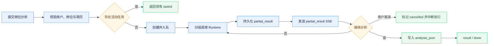

# 岗位分析与收藏管理

## 能力范围

工作台支持推荐岗位的定向分析、岗位收藏、详情快照和持久化分析报告。岗位键、收藏记录和分析任务均按租户与用户隔离。简历撰写器的 Markdown 草稿与 PDF 简历库是不同数据源，岗位分析使用用户选择或默认的 PDF 简历/画像上下文，不隐式读取未导出的草稿。

## 推荐质量门与匹配边界

平台运行参数 `minimumRecommendedMatchScore` 是完成简历匹配后的最低推荐分，默认 60，允许范围为 0–100。系统先完成确定性条件过滤、证据校验和分数归一化，再保留达到阈值、置信度不为 low、投递建议不是谨慎、不建议或证据不足的岗位。候选不足时可以在候选池倍率、部署级 `maxJobsPerScoring` 总评分上限和 Boss 最大检索页深内继续检索与评估，但不得降低质量门或用最高分低质量岗位凑数。

自动推荐使用 `recommendation_list` 证据模式：结构化列表字段可用于候选预筛，缺少完整 JD 只把置信度上限限制为 medium，不自动判定为证据不足。完整岗位分析使用 `full_jd_analysis`，要求逐项 JD 与简历证据链。未执行简历匹配时，系统不能把关键词、薪资等本地规则分数展示为简历匹配度；单岗位分析不使用推荐阈值过滤，低分岗位仍可以获得差距分析。

Runtime 单次 `resume_match` 最多处理 15 个岗位，Backend 分批顺序评估并校验返回 ID 完整覆盖。缺失、重复、未知或计数不一致只允许一次有界拆分重试，仍失败则整批报错；未评分候选不计为低分，也不推进游标。“换一批”从实际完成评分的游标之后继续，不能重复评分已消费候选。

## Boss 收藏选择性导入

岗位收藏支持从 Boss 直聘单向选择性导入。用户从岗位收藏页打开独立弹窗后，系统直接读取第一页岗位摘要，并由同一接口判定登录状态，避免先串行请求状态接口；未登录时在同一弹窗内展示二维码，扫码成功后也只读取一次第一页。Backend 一次读取本地收藏身份集合，过滤已存在岗位和 Boss 页内重复项，前端只展示可导入岗位。Boss 返回的 `securityId` 可能随列表请求轮换，因此岗位身份优先使用稳定的 `encryptJobId`；历史上按 `securityId` 保存的收藏无需迁移，Backend 会从已有岗位 JSON 中提取稳定 ID 参与去重。弹窗采用“上一页、第 N / M 页、下一页”的分页格式，每次只渲染当前页，不把多页结果追加成长列表；`M` 为 Boss 返回的实际总页数，不设置本地人工浏览页数上限；到达实际最后一页后必须禁用下一页且不得发起越界请求。后续分页必须由用户手动触发，系统不在岗位收藏页面初始化或后台任务中读取，不提供全量同步。

勾选数量不设业务上限。确认导入后 Backend 按选择顺序串行处理：快照已有职位描述时直接规范化保存，缺少时先通过岗位定位信息读取详情并补全，再写入本地收藏；导入不会触发岗位分析。详情读取复用 Boss 工具的低频抖动、小时/每日限额和有界网络重试，任一岗位遇到登录失效、风控、限速、网络异常、详情缺失或数据库写入失败时立即停止后续访问，保留已经成功写入的岗位并把剩余项标记为未处理，不做回滚。该流程只写本地 `job_favorite`，不会修改 Boss 收藏状态。

接口契约为：`GET /api/jobs/favorites/boss?page=1` 返回去重后的单页摘要、`page`、`totalPages`、`hasMore` 和只读配额摘要；`POST /api/jobs/favorites/boss/import` 请求体为 `{ "jobs": [...] }`，响应包含 `importedCount`、`existingCount`、`failedCount`、`unprocessedCount`、`stopped`、`authRequired`、`items` 与 `favorites`。逐项详情补全失败时通过既有停手字段和逐项状态向前端返回可解释结果。外部岗位对象在 Backend 以 `JsonNode` 明确隔离，不在 Controller、Service 或 Client 新增无 schema 的 Map DTO。

## 定向分析与收藏快照

从岗位卡片发起分析时，前端把必要的结构化 `selectedJob` 随 `/api/chat/stream` 发送。Backend 只提取岗位名、公司、薪资、要求和 JD 等分析字段，与当前用户简历或画像一起进入业务处理器，避免把完整外部对象无界注入 Prompt。

`selectedJob` 表示用户已经明确选择岗位，Backend 应直接进入定向岗位分析，不再把请求退回通用意图分类或重新执行岗位搜索。用户在分析界面切换 PDF 简历后，前端使用同一岗位快照和新的简历标识重新发起分析；旧报告只能作为历史展示，不能继续标注为当前简历的分析结果。

聊天推荐、岗位工作台收藏和 BOSS 选择性导入都必须形成完整岗位快照：列表结果已有 JD 时直接标准化为 `jobDescription`；缺失时在收藏或导入请求内根据 `securityId` 或原岗位链接调用详情能力，详情定位信息缺失、登录失效、采集失败或结果仍无 JD 时不写入当前岗位。

历史摘要收藏在用户点击“职位描述”时仍按需读取详情并回写 `job_json`；用户直接点击“分析岗位”时，分析任务若发现固化快照缺少 JD，也必须先通过收藏中的定位信息补全并持久化，再调用 Runtime。查询收藏和页面初始化不得临时访问 Boss。分析结果写入独立的 `analysis_json` 和 `analyzed_at`，不得混入岗位快照；收藏页不得复用岗位工作台的全局匹配结果或按列表下标推断分析归属。

## 异步分析与恢复

收藏岗位分析通过 `POST /api/jobs/favorites/analysis-tasks` 创建持久化后台任务。Backend 完成参数、归属和快照校验后立即返回任务标识，由有界线程池执行；同一租户、用户、任务类型和岗位键只允许一个活动任务，重复提交复用现有任务。

前端订阅 `GET /api/analysis-tasks/{taskId}/stream`，处理 `snapshot`、`progress`、`partial_result`、`result`、`cancelled`、`error`、`done` 和 `heartbeat`。关闭弹窗或断线只停止观察，不取消任务；用户点击“取消分析”时调用 `POST /api/analysis-tasks/{taskId}/cancel`，Backend 先以任务归属条件校验访问权限，再将活动任务原子更新为 `cancelled` 并中断对应执行线程。取消后不得写入最终岗位分析结果，已持久化的部分报告可以保留用于说明已完成的阶段。返回页面时通过 latest 接口恢复最近任务。服务启动时重新提交数据库中遗留的 queued/running 任务，执行逻辑以幂等覆盖为目标。

报告按“投递结论与关键证据”“能力维度与风险”“简历补强与面试方案”分组生成。每组模型调用完成后立即写入 `analysis_task.partial_result_json` 并通过 SSE 发送，全部完成后才更新收藏记录。禁止把完整报告延迟切片或用占位文本伪造成部分结果。

## 报告与错误边界

分析结果是投递决策辅助，包含岗位和简历上下文、匹配分、建议、置信度、六维拆解、优势、缺口、证据对照、简历补强、面试重点、风险和限制。置信度表示岗位与简历输入及逐项证据链对分析结论的支撑程度，不表示匹配分高低，也不因存在缺口、风险或不建议投递而自动降低；完整 JD 与简历形成至少三条具体要求—证据对照时为高置信度，只有部分要求可核实时为中等，仅在 JD、简历核心信息或证据链明显缺失时为低置信度。六维固定为技术栈匹配、经验与级别、学历与资质、项目相关性、业务领域契合、地点与约束。学历与资质维度始终输出数值分，综合学历层次、专业相关性和岗位明确要求评估；专业名称不要求严格一致，相近专业、交叉学科以及项目或工作经历能够证明的相关知识均按相关程度计分。岗位未明确学历、专业或资质要求时不得据此扣分，简历信息不完整时使用 50 分保守中性分并明确缺口；历史报告中的空分也按同一中性分展示。其他维度没有足够证据时保留结构、空分数和明确缺口，不把缺失信息当成零分；其他可选分析字段缺失时仅展示已有内容，不虚构缺失部分。Runtime 返回空 matches、模型失败或简历为空时按明确错误处理，不写“已完成”占位结果。

推荐与后续分析必须保持质量语义一致。岗位卡片下发前执行严格预筛：低于最低推荐分、置信度为 low、建议为谨慎/不建议/证据不足，或命中方向、专项能力、经验、薪资硬约束的岗位不得进入推荐。分析链路为避免完全空结果可保留最高分岗位并明确警告，但该放宽策略禁止用于推荐链路；推荐没有合格岗位时宁可返回空结果，也不能把后续分析会判定为低质量的岗位展示为“推荐”。

收藏失败时前端回滚乐观状态；Boss 登录失效进入扫码流程，普通详情错误显示在对应岗位卡片。外部 JD 属于不可信内容，简历文本和报告可能含个人信息，日志与 Trace 不输出全文。

## 验证

测试覆盖普通收藏已有 JD 不重复采集与缺失 JD 时补全、BOSS 导入已有 JD 不重复采集、缺失 JD 时按选择顺序补全、首个详情失败后停止后续访问、不限量选择、本地收藏整页去重、Boss 页内去重、数据库异常部分成功、显式查看或分析时补全并持久化历史摘要 JD、历史快照修复、跨用户拒绝、空结果不写入、活动任务复用、部分结果持久化、断线恢复、任务取消、学历与资质数值评分和相近专业评估规则，以及最终覆盖。前端需验证收藏回滚、导入弹窗逐项勾选、分页替换、全部勾选、已导入隐藏、未登录同窗二维码、扫码轮询不重叠、登录后单次首屏加载、收藏页标签去重、收藏页不串入工作台旧分析、加载态与未分析空态铺满内容区、空态标题和说明纵向排列、取消按钮右对齐且可停止活动任务、六维报告、错误状态、报告响应式布局、重试和刷新恢复。
