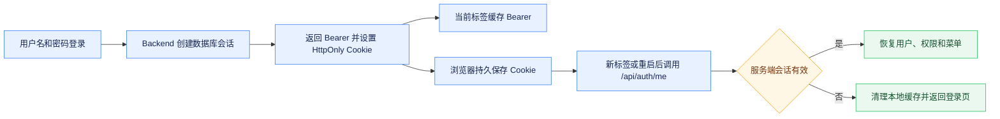

# 工作台认证与会话管理

## 会话模型

工作台使用 Backend 持久化登录会话。认证成功后，服务端签发随机访问令牌并创建数据库会话，同时设置名为 `job_buddy_session` 的持久 Cookie。Cookie 默认有效期七天、路径为 `/`、使用 `HttpOnly` 和 `SameSite=Lax`，HTTPS 下启用 `Secure`。浏览器端无法读取 HttpOnly Cookie，真实登录状态始终以后端会话和 `GET /api/auth/me` 的校验结果为准。

浏览器会话只使用 HttpOnly Cookie 作为凭据，前端不在 Web Storage、URL 或 JavaScript 状态中保存令牌。`sessionStorage` 仅缓存非敏感用户展示信息；新标签页或浏览器重启后，由浏览器携带 Cookie 调用 `/api/auth/me` 恢复用户、角色、权限和菜单。缓存信息不能绕过服务端鉴权。

## 认证与恢复流程

认证拦截器按 Authorization Bearer 和会话 Cookie 的顺序解析令牌。Bearer 用于程序化 API 客户端，不签发浏览器 Cookie；工作台、SSE 和同源文件访问统一使用 `credentials: include` 携带 Cookie。跨源部署必须配置明确 Origin 和凭据策略，不能使用通配 Origin 搭配凭据。

## 退出与跨标签同步

`POST /api/auth/logout` 注销数据库会话并返回同名零有效期 Cookie。退出不能以当前标签是否存在 Bearer 为前提：通过 Cookie 恢复的新标签仍必须请求服务端注销。前端清理 Pinia 和 `sessionStorage` 后，通过同源 `BroadcastChannel` 发送不包含令牌、用户资料或权限的退出通知，其他标签收到后立即清理本地状态并进入登录页。

## 安全边界

Cookie 只承载随机会话令牌，不包含用户资料、权限或业务数据，也不延长服务端会话寿命。HttpOnly 降低脚本直接读取令牌的风险，SameSite 限制常见跨站请求，但所有有副作用接口仍需要权限控制，并应结合来源校验、HTTPS 和部署级 CSRF 策略。日志和 URL 不得包含完整令牌。

## 默认账号与内部服务鉴权

全新数据库完成 Flyway 后创建 `admin` 管理员和 `user` 普通用户，并分别关联默认管理员角色和普通用户角色；角色、菜单及角色菜单授权由共享授权目录迁移统一初始化。两个账号的初始密码均为 `12345678`，迁移脚本只保存 BCrypt 哈希，不保存明文。管理员可通过平台设置的用户管理接口重置任一账号密码，重置后该用户的既有会话立即失效。公开部署必须在首次登录后立即修改默认密码。数据库必须由 Flyway 在空 Schema 中初始化，禁止通过 repair、baseline 或手工覆盖绕过版本校验。

Backend 调用 Runtime、Intent、Memory、Tool、Eval 和 Sandbox 时使用 `X-Internal-Service-Token`。生产环境由 `AGENT_INTERNAL_SERVICE_TOKEN` 提供共享密钥，缺失时相关 Python 服务拒绝启动；健康检查保持匿名，其他内部 API 未携带正确令牌时返回 401。该令牌只用于服务身份，不能替代 tenant/user/operator 业务作用域，各服务仍必须验证并传播这些字段。

## 验证

回归测试应覆盖 Cookie 属性、Bearer 优先级、Cookie 访问受保护接口、无本地令牌时 `/api/auth/me` 恢复、无 Bearer 时仍可退出、退出清除 Cookie、跨标签同步、无效会话清理和受保护路由恢复。多租户、角色和菜单加载规则见[多租户账号与权限体系](../架构设计/多租户账号与权限体系.md)。
