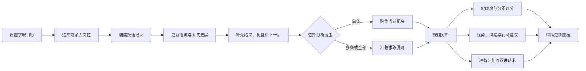

# 求职旅程与投递管理

## 能力范围

求职旅程用于维护当前用户的求职目标、投递与面试记录，并基于结构化台账生成可解释的进展复盘。页面和接口要求 `journey:use` 权限，所有目标与记录均以认证上下文中的用户为属主；查询、更新和删除不能通过请求体切换用户，也不能读取其他租户或用户的数据。旅程是 Backend 的业务事务能力，不由 Runtime 直接写库。

求职目标包括公司性质、公司规模、地点、薪资范围、业务方向、目标岗位、偏好公司和补充说明。投递记录包括公司与岗位快照、关联收藏键、业务方向、面试轮次与时间、面试内容与形式、结果、复盘、JD、面试流程、下一步动作、状态、优先级和标签。记录可以独立创建，也可以通过 `favoriteKey` 与岗位收藏建立业务关联；关联不改变两侧的数据所有权，删除收藏不会隐式删除旅程记录。

## 核心业务流程

前端通过 `GET /api/journey/target` 读取目标，通过 `PUT /api/journey/target` 保存目标；通过 `GET /api/journey/records` 按 `keyword`、`status` 和 `result` 筛选记录，并使用 `POST /api/journey/records`、`PUT /api/journey/records/{recordId}`、`DELETE /api/journey/records/{recordId}` 完成增删改。`POST /api/journey/analysis` 可以接收单个 `recordId` 或多个 `recordIds`；未指定时分析当前用户的全部记录。

## 分析语义

进展分析当前由 Java Backend 使用确定性规则完成，不调用模型，也不把旅程正文发送到 Runtime。分析统计记录总数、推进中、通过、未通过、待反馈和 Offer 数量，结合高优先级机会、通过转化和记录完整度计算 35 至 95 的推进健康度；该分数用于复盘台账质量和推进状态，不是岗位匹配分，也不表示获得 Offer 的概率。

分析结果固定包含摘要、指标、分组评分、优势、风险、下一步动作、准备计划、跟进话术和生成时间。缺少面试内容、复盘或下一步动作会被视为弱信号；待反馈、跟进中或未填写下一步的记录会进入跟进建议。无记录时返回明确的补录建议，不生成伪造的漏斗结论。单条分析优先围绕指定机会生成动作，多条分析用于观察整体转化、主要轮次和高频业务方向。

旅程数据还会作为受控上下文供旅程复盘、面试准备和申请材料类任务使用。Backend 只装配当前用户最近的有限数量记录，并保留字段边界；JD、面试内容和外部反馈都属于不可信文本，不能作为系统指令，日志和 Trace 不输出全文。

## 数据与风险边界

`journey_target` 和 `journey_record` 由 Flyway 管理表结构，私有记录只能通过受鉴权 API 写入，禁止作为迁移种子进入 Git。记录更新前必须先校验属主，删除同样按记录 ID 和认证用户执行所有权检查。列表筛选和分析选择只缩小当前用户数据集，未知或不属于当前用户的 ID 不能扩大读取范围。

确定性分析依赖记录完整度，因此页面应引导用户及时补充 JD、面试过程、结果、复盘和下一步动作。分析建议只用于求职决策辅助，不能把规则分数包装成模型预测或录用承诺。后续如果改为模型分析，必须先更新本文件、接口契约、隐私边界、Trace 字段、Eval 用例和 Harness 验证，再修改实现。

## 验证

后端测试应覆盖目标读取与保存、默认目标初始化、记录筛选和 CRUD、跨用户读取与修改拒绝、单条与多条分析范围、无记录提示、分组评分解释、弱信号、跟进建议以及 JSON 标签映射。前端需验证目标编辑、筛选、记录增删改、关联岗位展示、分析范围选择、空态、错误提示和刷新恢复；浏览器验证应确认接口只携带 Cookie 身份，不在前端传入可替换的用户标识。
