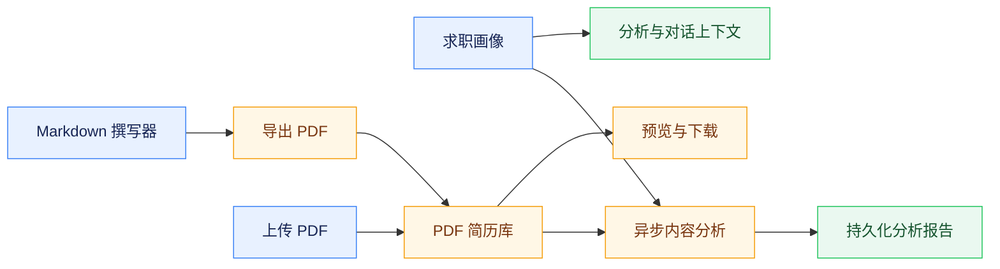
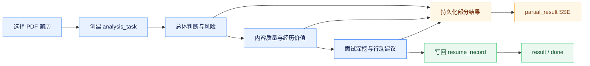

# 简历管理、画像与分析

## 模块边界

前端 `/resumes` 模块包含简历列表、简历撰写和简历分析三个子视图。简历库与分析链路只接受 PDF，记录存储在 `resume_record`，文件保存于 MinIO，供列表、预览、下载、标签、分组和模型分析使用。撰写器是独立的 Markdown 工作区，草稿保存在 Workspace State 的 `resume.writer`，可导出 PDF、Markdown 或 HTML，但不直接写入 PDF 简历库；需要分析撰写成果时，用户先导出 PDF 再上传。

求职画像通过 `/api/resume/profile` 维护结构化基本信息、教育、工作、项目、求职期望和技能。画像摘要是这些来源的派生信息，可由用户编辑或通过 `POST /api/resume/profile/summary` 生成，最终仍随完整画像统一保存，不建立第二套摘要实体。

## 简历库与资源

`ResumeController` 和 `ResumeWriterController` 受 `resume:use` 权限保护，查询按租户和用户隔离。上传、列表和分析均执行 PDF-only 校验。简历照片等资源通过 `POST /api/resume/assets/upload` 写入 MinIO，数据库只保存随机资源标识、对象路径、类型、大小和 SHA-256；读取 `/api/resume/assets/{assetId}` 时按当前用户校验所有权，不暴露对象键。

相同文件或同名照片可以形成独立资源记录，SHA-256 作为完整性元数据而非全局去重键。前端使用稳定 `assetId` 引用资源。

## 撰写器与版本历史

`/api/resume/writer/versions` 提供版本列表、详情、创建、恢复和删除。版本表保存 writerState 的 JSON 快照，包括 Markdown、排版、照片设置、标签和画像引用，不复制二进制资源，也不保存认证令牌。版本按租户和用户隔离，默认保留最近 30 条；恢复目标版本前先保存当前状态，导入覆盖前也创建备份。

前端草稿自动保存不等于创建版本。只有手动保存、导入备份、恢复备份或达到显著变化与时间阈值时才创建快照，避免高频细小编辑挤占版本额度。简历列表、撰写和分析统一使用 `/resumes` 下的子路由。

## 求职画像

画像页面默认展示个人简介、教育、工作和项目经历，技能位于个人简介区域。个人简介维护期望岗位、求职状态和求职期望；到岗时间允许标记为“不确定”，期望薪资与期望行业既可从常用候选值中选择，也可直接填写自定义内容，保存和重新加载时不得因不在候选列表中而丢失。画像概览通过页面入口打开，用户可直接编辑摘要，也可基于当前表单调用 AI 提取；未保存的表单字段同样参与生成。已有摘要时通过差异确认决定是否采用新结果，AI 失败不得覆盖当前内容。

教育经历保存学校、学院、专业、学历、全日制状态、学历状态和起止月份。入学与毕业月份使用不设置最大年份的日期选择器，不额外保存可由起止月份推导的“在校时间”。项目经历保存名称、角色、起止月份、技术栈、项目职责和主要贡献；结束月份为空表示“至今”。技术栈在界面上按标签逐个添加或删除，对外仍以兼容现有画像 JSON 的 `techStack` 字段保存；项目职责与主要贡献分别使用 `responsibility` 和 `achievement` 字段。读取既有画像时继续兼容 camelCase、snake_case 以及旧 `description` 字段。

摘要属于 `parsed.summary`，与结构化画像共同保存。模型只负责提炼，不应使用固定字符切片破坏完整语义，也不能自动覆盖用户人工修订。关闭概览弹窗不撤销当前编辑，页面必须保留未保存提示。

## 内容分析与异步任务

简历内容分析聚焦招聘竞争力和面试价值，不根据 PDF 抽取结果输出排版、字体、错别字或标点结论。Runtime 的 `resume_analyze` 返回综合评分、评分明细、总体判断、优势、风险、问题、内容完整性与说服力、经历含金量、面试深挖点和行动建议。模型必须引用实际简历证据，信息不足时明确指出缺失，不能补写不存在的成果、数据或职责。

综合评分不直接采用模型给出的单一标量。模型分别评估内容完整性、成果证据、经历影响力、业务与技术复杂度、个人贡献、一致性与可信度，固定权重依次为 15%、25%、20%、15%、15%、10%；Runtime 校验各维度分数与证据后确定性加权并四舍五入得到 `overall_score`。评分以正常可投递简历而非完美简历为基准：95–100 表示证据非常充分且竞争力突出，85–94 表示内容扎实、证据较充分并属于常规优秀简历，75–84 表示整体良好但仍有局部缺口，65–74 表示核心信息可用但说服力有限。Runtime 对模型常见的保守评分执行有限校准：65 分及以上维度补偿 3 分，45–64 分维度补偿 2 分，最高不超过 100，校准后再执行证据上限。完全缺少量化或可验证成果时成果证据不高于 74，无法区分个人与团队成果时个人贡献不高于 74，存在明确时间或技能矛盾时一致性不高于 70；维度完全没有可核验依据时程序上限为 70。评分明细以 `score_breakdown` 保存，包含中文标签、维度得分、权重和证据；前端先展示总体判断，再展示默认折叠的评分依据，用户展开后可查看带等级、进度和证据层级的维度卡片。

前端通过 `POST /api/resume/analysis-tasks` 创建后台任务并立即获得 `taskId`。任务按“总体判断、优势与风险”“内容质量与经历价值”“面试深挖与行动建议”分组调用 Runtime；每组完成后合并到 `resume_record.parsed.analysis`，同时写入 `analysis_task.partial_result_json` 并发送 `partial_result`。重新进入页面时使用 latest 接口恢复任务和部分报告，最终结果仍写回原简历记录，不建立第二份事实来源。

## 岗位匹配推荐阈值

平台运行参数 `minimumRecommendedMatchScore` 表示真实岗位完成简历匹配后的最低推荐分数，默认 60 分，允许范围为 0–100。系统先完成证据校验和分数归一化，再保留达到阈值的岗位；首批候选不足或合格数量不足时，在候选池倍率、总评分上限和 Boss 检索页深预算内继续检索尚未访问的页并评估后续候选，但不得放宽匹配分、置信度或投递建议门槛，也不得保留最高分低质量岗位凑数。该阈值不作用于仅依据检索条件执行的岗位列表排序；未执行简历匹配时，系统不得把关键词、薪资等本地规则分数展示为简历匹配度。自动推荐使用 `recommendation_list` 证据模式：结构化列表字段足以支持候选预筛，缺少完整 JD 只将置信度上限限制为 medium，不自动导向“证据不足”；完整岗位分析使用 `full_jd_analysis`，继续要求逐项 JD 与简历证据链。

`maxJobsPerScoring` 继续作为后端内部的候选总评分安全上限，不在普通用户设置界面展示。Runtime 单次 `resume_match` 最多处理 15 个岗位，Backend 按 15 个一批顺序评估，累计达到每批展示数量即停止；“换一批”从本轮实际完成评分的游标之后继续，不重复评分已消费候选。Runtime 与 Backend 都必须校验返回 ID 覆盖率；缺失、重复、未知或计数不一致时只允许一次有界拆分重试，仍失败则整批报错，未评分候选不计为低分且不推进游标。聊天链路只请求评分、置信度、建议、理由、证据、命中、差距和限制等实际消费字段，避免未展示的复杂结构使同步请求超过模型预算。单岗位分析不使用推荐阈值过滤，避免低分岗位无法获得差距分析。

聊天中通过岗位卡片执行“分析此岗位”时，Backend 先把列表卡片与当前会话岗位合并；仍缺少 JD 且存在 `securityId` 或原岗位链接时，只在这次用户明确分析动作中按需加载一次岗位详情。规范化后的岗位 ID、名称、公司、链接、技能和 JD 作为选中岗位上下文持久化。首次分析与后续复评必须共用 `resume_match` 的结构化证据链，禁止首次自由生成精确高分、后续又因缺少 JD 返回证据不足。详情无法取得时不得仅凭岗位名称输出精确分数，应明确说明已识别的岗位引用及真实证据缺口。

用户切换简历后使用“现在这份简历呢”“现在这个6年的简历呢”等省略式追问时，在没有提供新 JD 或新岗位方向的前提下，应使用当前选择的简历复评上一轮明确选中的岗位，而不是退化为整批候选岗位匹配。该高频语义通过 Profile 中带 `_selected_job` 前置条件的会话捷径确定性识别；缺少可靠岗位引用时仍进入任务理解或澄清，用户本轮明确给出的新岗位、新 JD 或新方向始终优先。最终回答必须显式展示当前简历名称和被复用的公司/岗位，并基于工具返回的真实评分、置信度、理由、命中、差距和 `limitations` 生成文案，不得把所有低置信结果统一改写成“岗位缺少完整 JD”。任务理解阶段只接收近期消息、结构化槽位和精简上下文目录，完整简历经历与 JD 正文仅在实际匹配执行阶段使用。Runtime 工具超时必须返回包含工具名和预算的非空错误，Backend 与 Frontend 不得把结构化错误对象直接拼接为用户文案。

## 风险与验证

PDF 文本抽取可能丢失表格顺序、图形和特殊字体，报告只能依据实际取得的文本与结构化信息。评分是辅助判断，不能替代岗位 JD 匹配和人工面试。简历、画像、照片和报告都属于个人敏感数据，不得进入 Flyway、普通日志或未脱敏 Trace。

验证应覆盖 PDF-only、租户和用户隔离、资源所有权、版本裁剪与恢复、画像摘要编辑与差异确认、异步任务复用、部分结果恢复、评分加权与边界归一化、评分证据门槛、不同维度输入的分数区分度和模型禁止编造。前端交付必须用浏览器验证三视图、预览、上传、版本回退、画像概览、分析加载及刷新恢复。

Markdown 撰写器与 PDF 简历库是相互独立的事实来源，不提供双向内容覆盖。
