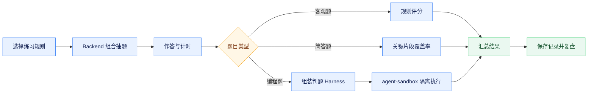

# 面试题库与模拟练习

## 能力范围

面试模块管理 LeetCode 编程题、选择题、判断题和简答题，并通过模拟练习提供组合抽题、限时作答、答案模式、提交评分和历史记录。`bank_type` 区分题库，取值统一使用英文标识：`leetcode` 表示算法题库，`qa` 表示问答题库；`category` 表示技术分类，`question_type` 表示题型。编程题的语言、函数签名、模板和测试用例保存在结构化 `codingMeta` 中。

练习创建接口接收 rules 策略数组，可按题库、分类、难度、题型和题数组合抽题。`showAnswer`、`durationMinutes` 和规则随练习记录保存，服务端返回剩余时间，前端可恢复进行中的倒计时。练习记录按租户和用户隔离，加载失败必须显示错误和重试入口，不能伪装成空列表。未提交答案目前属于页面会话草稿，刷新或重新登录后不保证恢复，离开前需要明确提示。

## 编程题执行

编程题支持 Python、Java 和 JavaScript。Java Backend 根据题目的结构化测试数据组装判题 Harness，并调用 agent-sandbox 隔离执行。标记 `sample=true` 的用例用于运行样例，全部正式用例用于提交评分。自定义调试允许修改输入和期望输出，但不参与最终评分；页面不能从题干或参考答案中用正则表达式推导测试数据。

算法题手动录入、`POST /api/interview/questions/import` 导入和 `POST /api/interview/questions/generate` 生成必须提供或产出 `language`、`functionName`、`parameterCount`、`template` 和非空 `tests`，每个测试包含 `args` 与 `expected`。Backend 统一校验契约，缺失时拒绝入库。Python 判题兼容全局函数和 LeetCode 常见的 `class Solution` 同名方法。

题目维护页面不要求用户直接编辑整段 `codingMeta` 或测试用例数组。算法题手动录入采用三步受控向导：先维护标题、分类、难度和标签，再维护题目描述、编程语言、函数入口和初始代码，最后通过可视化用例卡片分别填写参数、期望结果及样例标记。参数个数由第一条有效用例自动推导，代码模板可按语言和函数入口一键重建。向导进入下一步前校验当前步骤，最终步骤才允许保存，错误必须定位到具体步骤和具体用例。

算法题库和问答题库使用不同的维护语义，不共享一套泛化提示。算法题表单围绕算法任务组织，标题、分类、题面和标签分别使用算法场景示例，核心字段为输入输出、约束、函数入口、代码模板、测试用例和解题思路。问答题表单围绕知识考查组织，标题、分类、题干、资料来源和生成要求使用知识问答示例，并提供简答、单选和多选题型选择。简答题必须填写参考答案和评分要点；单选、多选题将题干与选项分开维护，至少提供两个有效选项，并以现有选项编号填写正确答案。切换题型后，步骤标题、字段说明、占位文字和校验错误必须同步变化，避免用户按算法题方式填写问答题，或把选项重复写入题干。

算法题智能生成采用“候选生成、人工审核、确认入库”三阶段流程。前端将主题、分类、难度、编程语言、数量、可选 LeetCode 题目链接和用户提供的资料提交给 Java Backend；Backend 通过 `interview_question_generate` 只读工具调用 Agent Runtime，由 Runtime 的 Prompt 资产和模型生成结构化候选题。生成接口只返回候选对象，不生成 `questionId`，也不写数据库。候选题必须包含题目描述、参考答案、初始代码模板、函数入口以及至少三条覆盖公开样例、边界情况和典型情况的测试用例。

LeetCode 没有作为本系统依赖的正式公开题目导入接口，且不得依赖站点内部 GraphQL、网页抓取或绕过访问限制实现导入。`sourceUrl` 仅作为用户提供的来源标识传递给模型，Runtime 不访问该地址，也不能声称读取了链接正文。需要忠实转换原题时，用户必须同时粘贴题面或上传合法取得的资料；没有题面时只能按主题生成原创或改编题。模型生成完成后，前端进入审核页，允许逐题修改标题、分类、难度、题干、代码模板、函数入口、参考答案和测试用例。每道题都必须显式勾选“已核对题干、代码和预期结果”，随后才调用 `/questions/import` 批量入库；导入操作使用事务，任一道题不符合结构化契约时整批失败，避免部分入库。

问答题智能生成沿用候选审核和事务导入边界，但生成设置与审核字段按问答题型变化。用户可以只提供知识主题、参考文本、上传资料或具体出题要求中的任意一种来源；简答候选题需生成参考答案和评分要点，单选、多选候选题需生成独立选项和正确答案编号。Runtime 使用统一结构输出选择题时，选项以标准编号行附在 `content` 中；前端进入审核页后将其解析为可增删修改的选项输入项，并从题干中移除重复选项。候选一旦被编辑就自动取消确认，只有重新核对题干、选项和正确答案后才能导入。

生成服务不可用、模型输出不是完整 JSON、测试用例参数不一致或请求不合法时，页面必须停留在生成来源步骤并保留已填内容，返回可操作的错误提示。候选审核失败时必须定位到具体题号和字段，不得清空已经修改的候选内容。

## 页面与接口

主要接口包括 `/api/interview/questions`、`/questions/meta`、题目新增更新删除、`/questions/import`、`/questions/generate`、`/code/run`，以及 `/practices` 的列表、随机创建、详情和提交。`/questions/generate` 的算法题请求可额外指定 `language` 和 `sourceUrl`；`language` 取值为 `python`、`java` 或 `javascript`，未提供时默认使用 Python，`sourceUrl` 只接受 `leetcode.com` 或 `leetcode.cn` 的标准 HTTPS 题目地址。问答题请求必须明确 `questionType`，可以使用 `topic`、`documentText` 或 `requirements` 提供知识范围。Backend 调用 Runtime 的 `/v1/runtime/tools/interview_question_generate/invoke` 获取候选题，HTTP 成功只表示候选生成成功，不表示已经入库。练习中心菜单包含题库维护、练习和考试的完整页面能力，统一使用 `practice:use`，不再拆分脱离页面的操作权限。

练习台采用页面级主滚动，桌面端以题目和作答区双栏展示，题号导航收敛到可展开概览，避免多层独立滚动。Markdown 代码块和编辑器提供复制操作，复制失败应有可见反馈。

## 风险与验证

代码执行必须经过 Sandbox 的文件、网络和子进程限制；服务不可用时应明确失败，不能回退 Backend 宿主机。选择和判断题按标准答案评分，简答题采用轻量规则评分，不能包装为语义级可靠评估。

测试应覆盖题库元数据、混合抽题、限时恢复、答案模式、三类评分、编程题正常与异常参数、Runtime 候选题结构化生成、生成阶段零持久化、人工确认后事务导入、非法来源链接、模型无效 JSON、Sandbox 失败、租户隔离和记录恢复。前端需执行 lint、test、build，并在真实页面分别验证算法题与问答题的标题、说明、占位文字和字段差异，验证问答题型切换后的题干、选项、答案和校验变化，同时覆盖算法题候选生成、未确认时阻断入库、候选编辑、全量确认导入、编辑回填、创建练习、倒计时、样例、自定义调试、提交和复盘。
