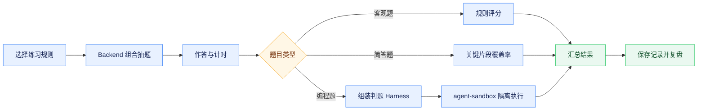

# 面试题库与模拟练习

## 能力范围

面试模块管理 LeetCode 编程题、选择题、判断题和简答题，并通过模拟练习提供组合抽题、限时作答、答案模式、提交评分和历史记录。`bank_type` 区分题库，取值统一使用英文标识：`leetcode` 表示算法题库，`qa` 表示问答题库；`category` 表示技术分类，`question_type` 表示题型。编程题的语言、函数签名、模板和测试用例保存在结构化 `codingMeta` 中。

练习创建接口接收 rules 策略数组，可按题库、分类、难度、题型和题数组合抽题。`showAnswer`、`durationMinutes` 和规则随练习记录保存，服务端返回剩余时间，前端可恢复进行中的倒计时。练习记录按租户和用户隔离，加载失败必须显示错误和重试入口，不能伪装成空列表。未提交答案目前属于页面会话草稿，刷新或重新登录后不保证恢复，离开前需要明确提示。

## 编程题执行

编程题支持 Python、Java 和 JavaScript。Java Backend 根据题目的结构化测试数据组装判题 Harness，并调用 agent-sandbox 隔离执行。标记 `sample=true` 的用例用于运行样例，全部正式用例用于提交评分。自定义调试允许修改输入和期望输出，但不参与最终评分；页面不能从题干或参考答案中用正则表达式推导测试数据。

算法题手动录入和 `POST /api/interview/questions/import` 导入必须提供 `language`、`functionName`、`parameterCount`、`template` 和非空 `tests`，每个测试包含 `args` 与 `expected`。Backend 统一校验契约，缺失时拒绝入库。Python 判题兼容全局函数和 LeetCode 常见的 `class Solution` 同名方法。

## 页面与接口

主要接口包括 `/api/interview/questions`、`/questions/meta`、题目新增更新删除、`/questions/import`、`/questions/generate`、`/code/run`，以及 `/practices` 的列表、随机创建、详情和提交。题库维护中的管理操作受额外管理权限控制，普通练习使用 `practice:use`。

练习台采用页面级主滚动，桌面端以题目和作答区双栏展示，题号导航收敛到可展开概览，避免多层独立滚动。Markdown 代码块和编辑器提供复制操作，复制失败应有可见反馈。

## 风险与验证

代码执行必须经过 Sandbox 的文件、网络和子进程限制；服务不可用时应明确失败，不能回退 Backend 宿主机。选择和判断题按标准答案评分，简答题采用轻量规则评分，不能包装为语义级可靠评估。

测试应覆盖题库元数据、混合抽题、限时恢复、答案模式、三类评分、编程题正常与异常参数、Sandbox 失败、租户隔离和记录恢复。前端需执行 lint、test、build，并在真实页面验证创建练习、倒计时、样例、自定义调试、提交和复盘。
