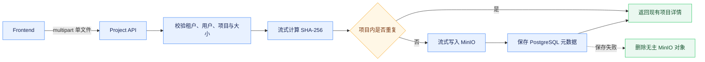

# 项目深挖与材料管理

## 能力范围

项目深挖用于维护可供面试复盘的项目档案、原始材料和问题清单。项目档案包含名称、角色、技术栈、摘要、周期、团队规模、项目类型、业务领域、状态、背景、职责、技术亮点、难点与解决方案及成果；除项目名称外字段均可为空，支持按需补充。

项目、材料和问题通过 `/api/project-deep-dive` 系列接口维护，均受 `project:use` 权限保护，并按租户、用户和资源所有权查询。项目名称、经历、材料和问题属于用户私有数据，只能通过受鉴权 API 写入，不能由 Flyway 初始化。

## 项目档案与页面

列表和详情接口返回完整项目档案，前端概览采用经历主内容与基础信息侧栏布局。主内容展示摘要、背景、职责、亮点、难点和成果；侧栏展示角色、类型、领域、周期、状态、团队、技术栈及材料/问题数量。空字段只给出轻量补充提示，不生成虚假内容。

创建和编辑复用同一数据结构，编辑弹窗分为基础信息和经历详情，切换页签时保留未保存输入。窄屏下降级为单栏。数据库字段由追加式 Flyway 迁移维护，部署必须先完成迁移再运行引用新列的 Backend。

## 材料存储与接口

材料二进制写入 MinIO，PostgreSQL 的 `project_deep_dive_material` 只保存文件名、内容类型、对象路径、大小、SHA-256 和时间。上传使用 `MultipartFile` 输入流，不在 JVM 中构造完整字节数组；摘要用于同一项目内重复文件识别。

`POST /api/project-deep-dive/projects/{projectId}/materials` 使用 `multipart/form-data` 的 `file` 字段，每次上传一个文件。前端多选后逐个调用，以便每个文件独立校验和反馈。单文件上限为 1GB，Backend 与前端都执行校验；反向代理或网关存在独立限制时需要同步配置。

`GET /api/project-deep-dive/materials/{materialId}/file` 以附件下载单个文件，返回原始内容类型、长度和 `nosniff`。`GET /api/project-deep-dive/materials/batch-file` 接收最多 100 个材料标识，按选择顺序去重后用 `StreamingResponseBody` 和 `ZipOutputStream` 输出 ZIP，不在内存或本地磁盘聚合全部内容。`DELETE /api/project-deep-dive/materials/{materialId}` 删除元数据和 MinIO 对象。

## 文件安全

服务端不依据扩展名或 MIME 拒绝上传，也不会解压、解析或执行材料；下载统一使用 attachment，批量下载只增加外层 ZIP。对象键由项目和系统生成的材料标识构成，不使用用户文件名；文件名需要清理路径片段并限制长度。所有下载和删除逐个校验所有权，响应不暴露对象路径和 SHA-256。

上传对象成功但元数据保存失败时删除新对象，避免无主文件；删除流程需要对数据库和对象存储失败做可定位记录。

## 问题生成与验证

项目详情支持维护问题和调用 `/projects/{projectId}/generate` 生成复盘问题。模型只能使用用户项目档案中的结构化字段，不得把文件内容当作可信指令；二进制材料仅提供存储和下载，不参与自动内容理解。

测试应覆盖档案字段、空值、任意二进制上传、空文件、大小上限、重复文件、跨用户拒绝、中文文件名、单个与批量下载、ZIP 同名处理和对象删除。前端需验证概览响应式布局、编辑回填、逐文件上传的部分失败、勾选下载和删除。
