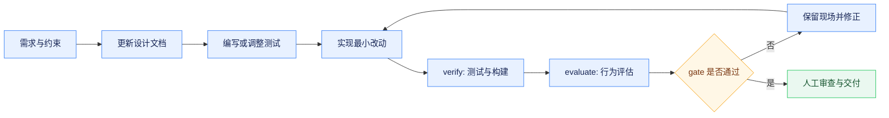

# AI 协作开发与质量验证规范

## 文档先行

job-buddy 将文档视为与代码同等重要的工程资产。架构边界、核心链路、接口、数据结构、权限、Prompt、工具、Trace、Checkpoint、Memory、Eval、Harness 或用户主流程发生关键变化时，应先更新 `agent-doc` 中对应的主题文档，再进入实现。主题文档使用能表达领域和能力的文件名；`agent-doc/README.md` 只承担索引职责。

文档必须基于代码、配置、数据库脚本和测试，说明能力目标、正式设计、涉及模块与接口、失败和安全边界及验证方法。禁止记录迭代历史、过渡方案、路线图、调研结论或未经代码验证的能力。接口、配置、端口、目录或启动命令变化时，同步更新主题文档、模块 README 和环境样例。

## 规范驱动与改动边界

任务开始前应明确目标、允许修改的目录、外部契约、禁止事项、验证命令和停止条件。改动保持单一目的，不顺手重构无关模块，不引入缺少必要性的框架或中间件。跨模块接口调整必须同步检查调用方、数据模型、配置、测试、文档和回滚路径。

敏感信息一律外置。真实密钥、Cookie、默认密码、生产地址、个人数据和完整敏感请求体不能进入代码、迁移、示例、日志、Trace 或文档。用户私有业务数据不能由 Flyway 初始化；已发布迁移脚本不可修改，只能追加更高版本。

## 测试与可验证目标

关键行为先形成可验证契约，再实现代码。测试至少覆盖主流程、边界条件和典型异常，不能只验证 happy path。完成标准必须是可执行命令或可观察状态，例如测试通过、构建成功、健康检查返回 200、接口契约匹配或浏览器路径得到预期结果；“更稳定”“更优雅”等描述不能单独作为验收条件。

前端用户可见改动除 lint、单元测试和构建外，还必须启动真实服务做浏览器验证。验证记录应包含访问地址、用户路径、观察结果和未覆盖项。外部平台、模型或对象存储无法联调时，应明确说明环境限制，不得用 Mock 结果宣称真实链路已走通。

## Harness 与 Eval

`.agent-harness` 是自动化开发闭环，不是附属脚本。`doctor.sh` 检查环境，`verify.sh` 执行测试和构建，`evaluate.sh` 执行行为评估，`gate.sh` 组合为交付门禁。Goal 与 Loop 用于定义可验证目标和受预算约束的自动执行。

启动命令、测试命令、目录、健康检查或依赖管理方式变化时，同步维护 Harness 脚本。Agent 核心链路、SSE、Intent、风险、工具、Trace 或输出结构变化时，同步检查 `agent-eval/app/grader.py`、`agent-eval/cases/`、测试和 `evaluate.sh`。数据库迁移规则变化时同步维护 Flyway 检查脚本和 Backend Gate。

## 长任务与交付

长任务必须设置最大轮次、最长时间、预算、允许修改范围和软着陆方式。并行 Agent 应使用隔离上下文，涉及代码写入时使用独立 worktree，避免冲突。失败时保留执行命令、日志摘要、修改范围和下一步，不循环宣称完成。

交付前审阅 Git diff，确认没有无关文件、构建产物、调试信息、敏感内容或失效链接。按修改范围执行最小必要 Gate；无法运行的验证必须列出原因和风险。测试通过是最低门槛，人工仍需审查架构边界、并发安全、资源释放、错误可解释性和文档一致性。
