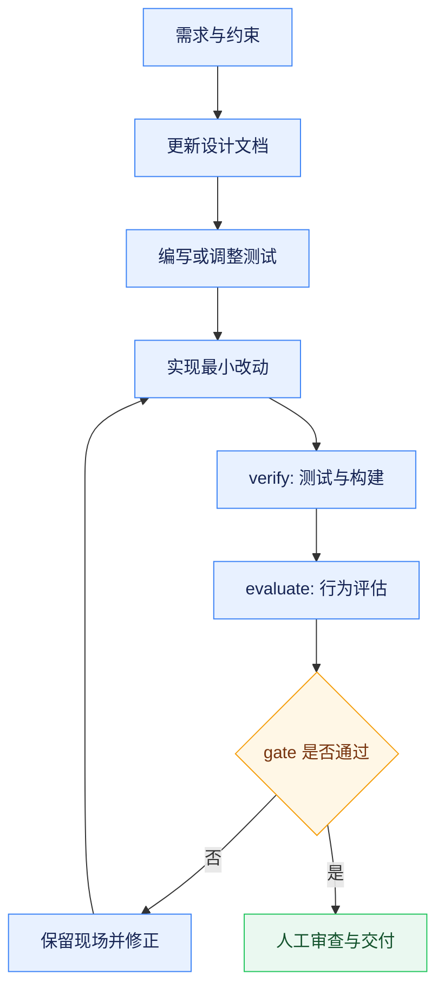

# AI 协作开发与质量验证规范

## 文档先行

job-buddy 将文档视为代码资产。架构、核心链路、接口、数据、权限、Prompt、工具、Trace、Checkpoint、Memory、Eval、Harness 或用户主流程发生关键变化时，先更新对应主题文档再实现。主题文件使用领域化名称，`agent-doc/README.md` 只承担索引。

文档必须基于代码、配置、数据库脚本和测试，说明能力目标、正式设计、涉及模块与接口、失败和安全边界及验证方法。

文档不记录迭代历史、过渡方案、路线图、调研结论或未经验证的能力。接口、配置、端口、目录或启动命令变化时，同步更新主题文档、模块 README 和环境样例。

## 规范驱动与改动边界

任务开始前明确目标、范围、外部契约、禁止事项、验证命令和停止条件。改动保持单一目的，不顺手重构或引入非必要框架；跨模块接口同时检查调用方、模型、配置、测试、文档和回滚。

敏感信息一律外置，真实密钥、Cookie、生产地址、个人数据和完整敏感请求体不得进入代码、迁移、示例、日志、Trace 或文档。默认账号只允许受控 Flyway 身份迁移保存密码哈希，公开部署后立即轮换；用户私有数据不得由 Flyway 初始化，已发布迁移只能追加，不能修改。

## 测试与可验证目标

关键行为先形成契约，测试覆盖主流程、边界和异常。完成标准必须是可执行命令或可观察状态，例如测试、构建、健康检查、接口契约或浏览器结果；“更稳定”“更优雅”不能单独验收。

用户可见前端改动除 lint、测试和构建外，还要启动真实服务做浏览器验证，记录地址、路径、结果和未覆盖项。外部平台、模型或对象存储无法联调时明确环境限制，不用 Mock 冒充真实链路。

## Harness 与 Eval

`.agent-harness` 是开发闭环：`doctor.sh` 检查环境，`verify.sh` 执行测试和构建，`evaluate.sh` 执行行为评估，`gate.sh` 形成交付门禁；Goal 与 Loop 定义可验证目标和受预算约束的自动执行。

```mermaid
graph TD
    A[需求与约束] --> B[更新设计文档]
    B --> C[编写或调整测试]
    C --> D[实现最小改动]
    D --> E[verify: 测试与构建]
    E --> F[evaluate: 行为评估]
    F --> G{gate 是否通过}
    G -->|否| H[保留现场并修正]
    H --> D
    G -->|是| I[人工审查与交付]

    classDef process fill:#E8F1FF,stroke:#3B82F6,color:#172554;
    classDef decision fill:#FFF7E6,stroke:#F59E0B,color:#78350F;
    classDef result fill:#EAF8F0,stroke:#22C55E,color:#14532D;
    class A,B,C,D,E,F,H process;
    class G decision;
    class I result;
```

启动、测试、目录、健康检查或依赖管理变化时同步 Harness。核心链路、SSE、Intent、风险、工具、Trace 或输出结构变化时同步 grader、Eval 用例、测试和 `evaluate.sh`；迁移规则变化时同步 Flyway 检查与 Backend Gate。

## 长任务与交付

长任务设置轮次、时间、预算、修改范围和软着陆；并行 Agent 使用隔离上下文，写代码时使用独立 worktree。失败时保留命令、日志摘要、改动与下一步，不循环宣称完成。

交付前审阅 diff，排除无关文件、产物、调试信息、敏感内容和失效链接，并按范围执行 Gate。无法运行的验证列出原因和风险；测试通过只是最低门槛，仍需审查架构、并发、资源释放、错误解释和文档一致性。
