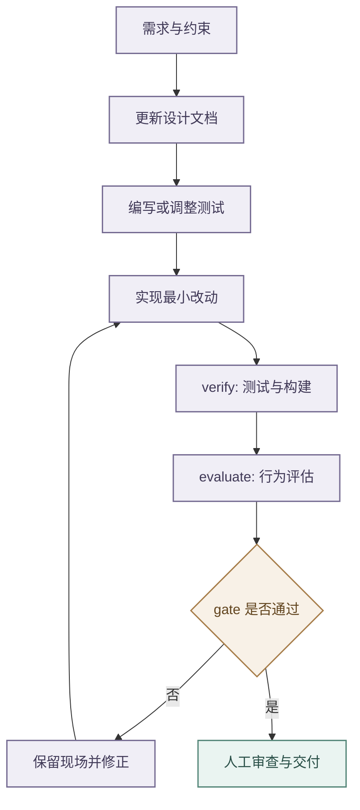

# AI 协作开发与质量验证规范

## 文档先行

- job-buddy 将文档视为代码资产。
- 架构、核心链路、接口、数据、权限、Prompt、工具、Trace、Checkpoint、Memory、Eval、Harness 或用户主流程发生关键变化时，先更新对应主题文档再实现。
- 主题文件使用领域化名称，`agent-doc/README.md` 只承担索引。

文档必须基于代码、配置、数据库脚本和测试，说明能力目标、正式设计、涉及模块与接口、失败和安全边界及验证方法。

文档不记录迭代历史、过渡方案、路线图、调研结论或未经验证的能力。接口、配置、端口、目录或启动命令变化时，同步更新主题文档、模块 README 和环境样例。

## 规范驱动与改动边界

任务开始前明确目标、范围、外部契约、禁止事项、验证命令和停止条件。改动保持单一目的，不顺手重构或引入非必要框架；跨模块接口同时检查调用方、模型、配置、测试、文档和回滚。

- 敏感信息一律外置，真实密钥、Cookie、生产地址、个人数据和完整敏感请求体不得进入代码、迁移、示例、日志、Trace 或文档。
- 默认账号只允许受控 Flyway 身份迁移保存密码哈希，公开部署后立即轮换；
- 用户私有数据不得由 Flyway 初始化，已发布迁移只能追加，不能修改。

## 测试与可验证目标

关键行为先形成契约，测试覆盖主流程、边界和异常。完成标准必须是可执行命令或可观察状态，例如测试、构建、健康检查、接口契约或浏览器结果；“更稳定”“更优雅”不能单独验收。

用户可见前端改动除 lint、测试和构建外，还要启动真实服务做浏览器验证，记录地址、路径、结果和未覆盖项。外部平台、模型或对象存储无法联调时明确环境限制，不用 Mock 冒充真实链路。

## Harness 与 Eval

- `.agent-harness` 是开发闭环：`doctor.sh` 检查环境，`verify.sh` 执行测试和构建，`evaluate.sh` 执行行为评估，`gate.sh` 形成交付门禁；
- Goal 与 Loop 定义可验证目标和受预算约束的自动执行。

```mermaid
graph TD
    A[需求与约束] --> B[更新设计文档]
    B --> C[编写或调整测试]
    C --> D[实现最小改动]
    D --> E[verify: 测试与构建]
    E --> F[evaluate: 行为评估]
    F --> G{gate 是否通过}
    G -->|否| H[保留现场并修正]
    H --> D
    G -->|是| I[人工审查与交付]

    classDef process fill:#F0EEF6,stroke:#746A91,color:#403957,stroke-width:1.5px;
    classDef decision fill:#F8F1E7,stroke:#A67C48,color:#62451F,stroke-width:1.5px;
    classDef result fill:#EAF4F1,stroke:#548678,color:#294F47,stroke-width:1.5px;
    class A,B,C,D,E,F,H process;
    class G decision;
    class I result;
```

- 启动、测试、目录、健康检查或依赖管理变化时同步 Harness。
- 核心链路、SSE、Intent、风险、工具、Trace 或输出结构变化时同步 grader、Eval 用例、测试和 `evaluate.sh`；
- 迁移规则变化时同步 Flyway 检查与 Backend Gate。

## 长任务与交付

长任务设置轮次、时间、预算、修改范围和软着陆；并行 Agent 使用隔离上下文，写代码时使用独立 worktree。失败时保留命令、日志摘要、改动与下一步，不循环宣称完成。

- 交付前审阅 diff，排除无关文件、产物、调试信息、敏感内容和失效链接，并按范围执行 Gate。
- 无法运行的验证列出原因和风险；
- 测试通过只是最低门槛，仍需审查架构、并发、资源释放、错误解释和文档一致性。

## 单元测试与覆盖率

测试按模块独立运行，Python 使用 pytest，Java 使用 JUnit 5 / Mockito，前端使用 Vitest / Vue Test Utils。用例名称描述输入条件和预期行为，遵循准备、执行、断言三个阶段；相同契约的输入边界使用参数化测试。共享 fixture 只封装必要的环境隔离和测试数据，不隐藏业务断言。

测试目录必须体现被测职责，禁止将各业务域测试集中堆放在根包。Java 单元测试的包路径与被测生产类保持一致（`common/<职责>`、`modules/<业务域>/<分层>`）；跨模块契约测试归入 `contract/<主题>`，需要 Spring 上下文或数据库的集成测试归入 `integration/<主题>` 并保留 `integration` 标签。移动测试时同步修改 package、显式导入和路径引用；使用 clean 后的完整测试发现验证，防止旧 class 残留造成重复执行或漏测。前端和 Python 测试同样按被测能力或业务域分组，共享测试辅助代码集中管理。

单元测试不得依赖真实模型、Boss 平台、部署数据库或用户凭据。HTTP、数据库、时钟和子进程等外部边界使用可控替身；临时文件使用测试临时目录，环境变量和全局状态在用例结束后恢复。Spring 上下文、数据库和多组件协作用例属于集成测试，覆盖率报告必须说明统计范围，不能把集成覆盖率称为纯单元覆盖率。

覆盖率统计包含未被测试导入的生产代码，Python 统计 app，Java 统计 src/main/java，前端统计 src 下 JavaScript 和 Vue 文件。不得通过排除低覆盖业务代码、空断言、批量调用 getter 或吞掉异常来提高指标。覆盖率报告同时保留行和分支数据，重点检查权限拒绝、参数边界、超时、失败恢复和资源清理；指标达标不替代行为断言。

各模块生产代码的单元测试行覆盖率必须达到 80%。Python 门禁根据报告中的总行数与未覆盖行数精确检查 80% 阈值，Java 和前端使用对应工具的行覆盖率门禁；分支覆盖率独立报告。不可达代码必须先证明不可达并审查调用链，不能通过排除统计或伪造运行条件使指标达标。

### 测试目录分组

前端 `tests/` 按 `api`、`auth`、`chat`、`jobs`、`interview`、`resume`、`project`、`settings`、`markdown`、`common` 和 `infrastructure` 分组。Python 各模块在 `tests/` 内按实际能力组织，例如 Runtime 的 `execution`、`intent`、`planner`、`tools`、`mcp`、`web`、`checkpoint`、`context` 等；小模块仅建立自身需要的分组。Harness 测试按 `quality`、`lifecycle` 和 `metadata` 分组。

测试根目录只保留共享环境入口（Python `conftest.py`、Vitest `setup.js`）。共享 fixture 保持父目录作用域，业务测试不得反向导入其他测试文件。Pytest 和 Vitest 使用递归发现；Harness 的 unittest 子目录保留 `__init__.py`，确保默认 discover 不遗漏测试。引用测试文件的脚本、文档以及基于 `__file__` 定位资源的代码必须随迁移同步维护。
