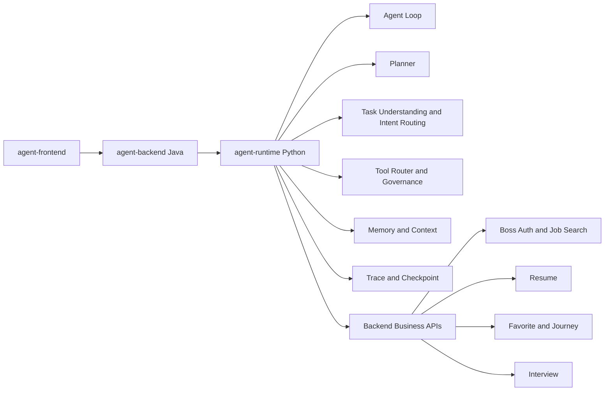

# Agent 核心逻辑迁移与 Runtime 职责边界方案

## 1. 背景

当前 `job-buddy` 仓库同时包含 Java Spring Boot 后端、Python Agent Runtime、意图识别、记忆、工具、沙箱、评估和前端等多个模块。随着功能演进，`agent-backend` 中逐步积累了部分 Agent 相关逻辑，例如任务理解、意图识别、SSE 编排、Prompt 组织、岗位推荐流程控制和工具调用前置判断。这会导致 Java 后端既承担业务系统职责，又承担 Agent 调度职责，模块边界变得模糊。

后续架构目标是让 `agent-backend` 回归业务后端和 BFF/API 网关角色，让涉及 Agent 思考、规划、工具选择、上下文组织和运行状态机的能力走代理执行，由 `agent-runtime` 负责承载。这样可以避免在 Java 代码中硬编码 Agent 核心逻辑，也便于复用 Python 生态中的 LangGraph、工具调度、Prompt 编排、上下文管理和模型适配能力。

## 2. 总体结论

当前阶段不建议新建顶层 `agent-core` 服务或模块。更合理的演进路线是：

```text
agent-backend = Java 业务后端 + Agent Runtime 代理
agent-runtime = 通用 Agent 运行时 + Agent Core 承载层
job-buddy 定制 = 通过 tools / profiles / workflows / prompts 注入 runtime
```

也就是说，`agent-runtime` 应该保持“通用内核 + 可插拔业务适配”的定位。它不应该被写成强定制的 Boss 求职 Agent，也不应该抽象成脱离业务、难以落地的纯框架。当前阶段应先把 Java 端已经混入的 Agent 逻辑迁移到 `agent-runtime/app/core` 内部。等 `agent-runtime` 的核心能力稳定、且存在多个运行时或服务复用需求时，再考虑从 `agent-runtime` 内部抽出独立的 Python package，例如 `agent_core`。

## 3. 推荐架构



该架构的关键点是：前端仍然优先访问 Java 后端，Java 后端负责用户、业务数据、文件、数据库、Boss 登录态和业务接口聚合；涉及 Agent 推理和调度的请求由 Java 后端代理到 `agent-runtime`；`agent-runtime` 根据 profile、workflow、prompt 和 tool 配置执行 Agent 逻辑，并通过工具调用 Java 后端暴露的业务能力。

## 4. 模块职责边界

### 4.1 agent-backend 的职责

`agent-backend` 应该保留业务系统和 BFF/API 网关职责，包括：

- 用户登录、账号体系和业务权限。
- Boss 登录态、Cookie 持久化、二维码登录、岗位搜索业务 API。
- 简历上传、解析结果存储、文件存储、MinIO 适配。
- 岗位收藏、投递旅程、面试题库、系统配置等业务 CRUD。
- 数据库访问、事务、迁移脚本、业务一致性保障。
- 面向前端的 API 聚合、统一响应、异常处理、SSE/WebSocket 代理。
- `agent-runtime` 代理客户端，例如 `AgentRuntimeClient` 或 `RuntimeProxyService`。

`agent-backend` 不应该继续承载以下逻辑：

- Agent Planner。
- Agent Loop。
- 意图识别和能力路由的核心规则。
- 工具选择和工具治理。
- Prompt 编排和系统提示词拼装。
- 上下文压缩、长期记忆装配和任务状态机。
- Agent Trace 语义生成逻辑。

Java 端可以保留业务错误提示和页面交互文案，例如“请先上传简历”“Boss 登录态已失效，请重新扫码”“岗位收藏成功”。这些属于业务接口或用户界面反馈，不属于 Agent 思考逻辑。

### 4.2 agent-runtime 的职责

`agent-runtime` 应该承载通用 Agent 运行时能力，包括：

- Agent Loop。
- Planner。
- Task Understanding / Intent Routing。
- Tool Registry、Tool Search、Tool Router。
- Tool Permission、Tool Governance、Tool Execution。
- Prompt Runtime 和 Prompt 模板加载。
- Profile / Workflow 加载与组合。
- Memory / Context 装配。
- Trace、Event、Checkpoint。
- LLM Client 和模型适配。
- 失败重试、预算控制、中断恢复。
- SSE 或事件流协议。

`agent-runtime` 内部可以有 `job-buddy` 业务 profile、workflow 和 prompt，但核心代码不应该直接写死 Boss 直聘、简历、岗位收藏等业务概念。业务能力应通过工具或后端 API 注入。

推荐目录演进方向：

```text
agent-runtime/
├── app/
│   ├── api/
│   ├── core/
│   │   ├── agent/
│   │   ├── intent/
│   │   ├── planner/
│   │   ├── tool/
│   │   ├── memory/
│   │   ├── observability/
│   │   └── llm/
│   ├── models/
│   └── server.py
└── config/
    ├── profiles/
    ├── workflows/
    └── prompts/
```

### 4.3 暂不新建顶层 agent-core 的原因

当前不建议直接新增顶层 `agent-core`，原因如下：

第一，仓库已经包含多个服务模块，如果过早新增 `agent-core`，会增加部署、测试、接口、版本和依赖管理成本。第二，如果把核心逻辑过早移到 `agent-core`，`agent-runtime` 容易退化成一个 HTTP 壳子，而当前项目尚未明确需要多个运行时共同复用同一个核心库。第三，当前最重要的问题是从 Java 后端移出 Agent 核心逻辑，而不是进一步拆分 Python Runtime。

只有在以下条件满足时，才建议考虑独立 `agent-core`：

- `agent-runtime/app/core` 已经足够稳定，HTTP 层和核心调度层明显互相干扰。
- 需要 CLI Runtime、HTTP Runtime、Worker Runtime、Evaluation Runtime 等多个运行时复用同一核心。
- `agent-core` 可以作为纯 Python package，不依赖 FastAPI、不依赖具体数据库、不依赖 Web 框架。
- 具备清晰的包边界、测试边界和版本策略。

## 5. Prompt 和业务定制资料放置规则

定制提示词和业务规则应遵循“谁消费，谁拥有”的原则。

### 5.1 Agent 推理提示词放到 agent-runtime

以下内容应放到 `agent-runtime`：

- 系统 Prompt。
- Planner Prompt。
- 意图识别 Prompt。
- 工具选择 Prompt。
- 任务理解 Prompt。
- 反思、验证、上下文压缩 Prompt。
- 岗位推荐 Agent Prompt。
- 简历分析 Agent Prompt。
- 面试准备 Agent Prompt。

推荐目录：

```text
agent-runtime/config/prompts/job-buddy/
├── system.md
├── intent.md
├── planner.md
├── job_recommendation.md
├── resume_analysis.md
└── interview_prepare.md
```

或按通用能力分层：

```text
agent-runtime/config/prompts/
├── system/
├── planner/
├── intent/
├── tools/
└── domains/job/
```

### 5.2 业务 Profile 和 Workflow 放到 agent-runtime/config

业务偏好、领域规则、工作流策略、工具组合建议等内容应配置化，不应硬编码在 Java 中。例如：

```text
agent-runtime/config/profiles/job-buddy.yaml
agent-runtime/config/workflows/job_recommendation.yaml
agent-runtime/config/workflows/resume_review.yaml
agent-runtime/config/workflows/interview_prepare.yaml
```

示例：

```yaml
id: job-buddy
name: Boss 直聘求职 Agent
domain: job_search
preferences:
  prefer:
    - 大模型应用开发
    - Agent 工程
    - RAG
    - Java
    - Python
  avoid:
    - 外包
    - 培训机构
    - 驻场
ranking_rules:
  skill_match_weight: 0.35
  salary_weight: 0.25
  company_weight: 0.20
  commute_weight: 0.10
  risk_weight: 0.10
```

### 5.3 Java 端保留业务文案和业务错误提示

以下内容可以保留在 Java 或前端：

- 接口返回 message。
- 登录引导文案。
- 文件上传、简历解析、收藏、投递等业务错误提示。
- 前端按钮、表单、页面展示文案。

判断标准是：如果这段文本会影响 Agent 如何思考、规划、选择工具或组织上下文，就放到 `agent-runtime`；如果只是业务接口返回或页面展示，就留在 `agent-backend` 或 `agent-frontend`。

## 6. 迁移路线

### 6.1 第一阶段：Java 后端瘦身

将 Java 中的 Agent 核心逻辑逐步迁移到 `agent-runtime`。重点迁移对象包括：

- `IntentServiceImpl` 中的意图识别和能力路由逻辑。
- `ChatSseServiceImpl` 中的 Agent 流程编排逻辑。
- `AgentFlowServiceImpl` 中的计划、Trace、工具编排逻辑。
- Java 资源目录中影响 Agent 行为的 Prompt 和规则文件。

Java 端保留代理层、业务 API 和业务状态管理。

### 6.2 第二阶段：agent-runtime 接管核心链路

`agent-runtime` 提供统一运行接口，例如：

```text
POST /v1/agent/runs
POST /v1/agent/runs/stream
GET  /v1/agent/runs/{run_id}
POST /v1/agent/runs/{run_id}/cancel
GET  /v1/agent/runs/{run_id}/events
```

Java 后端向 runtime 传递结构化请求，而不是拼 Prompt：

```json
{
  "session_id": "xxx",
  "user_id": "u1",
  "message": "帮我筛选上海大模型应用开发 40-50K 岗位",
  "profile": "job-buddy",
  "workflow": "job_recommendation",
  "context": {
    "resume_id": "r1"
  }
}
```

### 6.3 第三阶段：Java 业务能力工具化

Java 后端将业务能力暴露为内部 API 或 MCP 工具，供 runtime 调用，例如：

```text
boss.search_jobs
boss.get_job_detail
resume.get_current
resume.parse
favorite.add
journey.create
interview.generate
```

runtime 只关心工具定义、参数、权限、返回结构和错误恢复策略，不直接访问 Java 后端数据库。

### 6.4 第四阶段：评估是否拆出 agent-core

当 `agent-runtime/app/core` 足够稳定，并出现多运行时复用需求时，再考虑拆分为：

```text
agent-core       # 纯 Python Agent 核心库
agent-runtime    # FastAPI Runtime 服务壳
```

在此之前，不新增顶层 `agent-core`。

## 7. 后续开发文档记录要求

后续关键改动必须记录到 `agent-doc/开发文档/`。关键改动包括但不限于：

- 架构边界变化。
- Agent 核心链路调整。
- 意图识别、能力路由、Planner、工具路由、Prompt、Workflow、Profile 的调整。
- Java 后端与 runtime 的接口契约变化。
- Trace、Checkpoint、Memory、Eval、Harness 的行为变化。
- 涉及用户可见主流程、登录态、SSE、工具执行、数据迁移的改动。

开发文档至少说明：

1. 为什么要做。
2. 方案是什么。
3. 具体怎么做。
4. 涉及哪些模块和接口。
5. 需要注意什么风险。
6. 如何验证。
7. 后续演进方向。

改代码前必须先阅读相关开发文档，尤其是本方案文档；如果现有文档与实际目标不一致，必须先更新文档或在交付说明中说明差异。

## 8. 实施状态（2026-06-12）

本方案第 6 节的迁移路线已基本落地，落地详情统一记录在《Agent核心链路重构落地记录.md》。各阶段状态如下：

- 第一阶段（Java 后端瘦身）：已完成。任务理解、意图识别、能力路由、Planner、Prompt 编排和 Agent Loop 已迁移到 `agent-runtime`；`ChatSseServiceImpl` 已收敛为按 Runtime directive action 分流（保留 intent 名称兼容兜底），`JobRuntimeServiceImpl` 已移除风险词表等策略性硬编码，Java 端只保留 BFF、业务 API 与 Runtime 代理职责。
- 第二阶段（agent-runtime 接管核心链路）：已完成。第 6.2 节规划的“runtime 提供统一运行接口”已实现，`/v1/agent/runs` 系列接口可用，并保留 `/v1/runtime/runs` 等兼容入口；Java 后端向 runtime 传递结构化 `AgentRunRequest` 而非拼 Prompt。运行时内核已完成结构治理：`loop_controller.py` 统一循环边界，`tool/gateway.py` 收口工具治理，`context/assembler.py` 负责上下文装配，原 `task_understanding.py` 已拆分为 `text_match.py` / `slot_extractor.py` / `task_result_builder.py`。
- 第三阶段（Java 业务能力工具化）：部分完成。稳定业务链路（岗位搜索、登录态、简历匹配等）仍由 BFF 按 directive 执行业务动作，`boss.search_jobs`、`resume.match` 等业务能力尚未全部包装为 Runtime 可治理工具，属于遗留事项。
- 第四阶段（评估是否拆出 agent-core）：未启动。`app/core` 已具备清晰层边界，但尚无多运行时复用需求，按本方案约定继续保持单 runtime 形态。

本方案第 5 节的 Prompt 与配置放置规则已落地为 `agent-runtime/config/profiles`、`config/prompts`、`config/workflows` 三层配置资产。

## 9. 业务元数据键去硬编码（2026-06-22）

为贯彻"runtime 核心代码不硬编码 Boss 直聘、简历、岗位收藏等业务概念"的边界约定，本轮把任务理解与上下文装配中残留的业务元数据键白名单从核心代码迁移到部署配置。`config/config.yaml` 的 `runtime.business_metadata_keys` 列出求职场景的业务键（当前为 `resume_id`、`current_jobs_count`、`boss_live_enabled`），对应配置模型 `RuntimeConfig.business_metadata_keys` 默认空列表，并通过 `RuntimeSettings.business_metadata_keys` 暴露访问器。

任务理解侧 `task_understanding.py` 的 `_safe_metadata` 不再内联具体业务键，而是把通用运行时键固化为类常量 `_GENERIC_METADATA_KEYS`（profile、entrypoint、previous_slots、max_turns、max_tool_calls、personal_context），再并入 `settings.business_metadata_keys` 得到透传白名单。上下文装配侧 `context/assembler.py` 的 `_long_term_refs` 同样以 `{"previous_slots"} ∪ settings.business_metadata_keys` 决定长期引用透出的请求元数据键。由此，核心代码只认识通用运行时概念，具体业务键完全由部署配置注入；未声明业务键的部署不会泄露求职语义，求职部署则在配置层显式声明，符合"配置驱动而非硬编码"原则。

对外行为保持兼容：在求职部署配置加载后，`resume_id` 等业务键透传与长期引用透出与此前一致。验证以 `cd agent-runtime && uv run python -m pytest` 为准，新增 `test_long_term_refs_use_config_driven_business_keys` 断言通用键 `previous_slots` 恒透出、业务键仅在配置声明后透出，全部用例通过。本改动属于 runtime 内部配置化重构，未改变 SSE 主流程、Trace 节点与工具事件结构，agent-eval 与 .agent-harness 无需同步调整。
