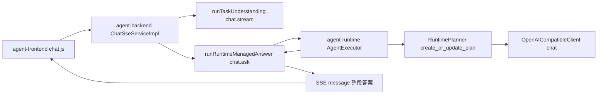
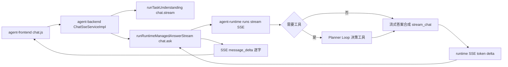

# 工作台问答 Token 流式输出方案

## 1. 背景

工作台的问答主流程当前由前端 `agent-frontend`、Java 后端 `agent-backend` 与 Python `agent-runtime` 三层协作完成。用户消息经前端发起 SSE 请求到达后端 `ChatSseServiceImpl`，后端先以 `chat.stream` 入口做一次任务理解并下发意图，随后对需要 Runtime 托管的问答调用 `runRuntimeManagedAnswer`，以 `chat.ask` 入口同步触发 Runtime 的完整 Planner Loop，等待 Runtime 返回最终答案后，再通过一个 `message` 事件把整段答案一次性推送给前端。

这一链路存在两个体验问题。其一是响应慢，模型为 deepseek 推理模型，单次调用耗时较长，用户在答案生成完成前长时间看不到任何内容。其二是缺乏真正的流式输出，过程与答案都不是逐字呈现，而是在 Runtime 全部执行完成后一次性下发，用户感知到的是长时间空白后突然出现整段文字。

本方案的目标是把工作台问答主流程升级为真正的 Token 级流式输出，让答案在模型生成的同时逐字到达前端，缩短首字时间，并保持既有上下文自动注入、意图分流、工具治理与可观测能力不被破坏。

## 2. 现状链路与核心阻碍

### 2.1 现状链路

后端与 Runtime 之间通过 Spring `RestTemplate` 同步调用，Runtime 的 `/v1/agent/runs` 与 `/v1/runtime/runs` 都只返回完整 JSON，`OpenAICompatibleClient.chat` 使用 `httpx.AsyncClient.post` 一次性拿到完整响应，全链路没有任何流式能力。

### 2.2 核心阻碍

最关键的阻碍是最终答案的产生方式。当前最终答案并不是一次独立的、可流式的 LLM 文本生成调用，而是被嵌入在 Planner 返回的 JSON 结构中，对应字段为 `plan.final_answer`。`graph.py` 的 `_finalize` 节点按固定优先级解析答案，其中 `plan.final_answer` 是通用问答场景的主要来源。Planner 调用模型时要求模型输出一个包含计划、下一步动作与最终答案的 JSON 对象，因此模型生成的是结构化 JSON，而不是可以直接逐字展示给用户的自然语言答案。

这意味着无法简单地把 Planner 的模型调用改成流式就完事。如果直接流式输出 Planner 的 JSON，前端拿到的是 JSON 片段而非可读答案;而且 JSON 必须完整解析后才能确定是否需要继续工具循环或澄清，无法在中途安全地决定流式内容。因此本方案必须把"可流式的答案合成"与"结构化的计划决策"在概念上分离。

## 3. 总体方案

### 3.1 方案选型

针对答案嵌入 JSON 的阻碍，存在两条可选路径。

第一条是为最终答案单独增加一次流式的自然语言合成调用。即 Planner 仍按原方式产出结构化计划与工具决策，待 Loop 判定任务可收尾时，再以已收集的上下文与观测结果为输入，发起一次专门的、纯文本的流式 LLM 调用来生成最终答案。其优点是职责清晰、对 Planner 既有逻辑零侵入、流式内容天然是可读文本;缺点是对需要联网或工具的任务会多一次模型调用,增加整体时延。

第二条是改造 Planner 提示词与解析方式，让模型先流式输出自然语言答案，再输出结构化决策，前端只渲染答案段。其优点是不增加调用次数;缺点是对模型输出格式约束强、解析脆弱、与现有 JSON 协议耦合深、回归风险高。

本方案采用第一条路径，并做关键优化以规避其时延缺点：对于不需要工具的纯生成类问答（工作台问答的主体场景，例如基于本人简历与项目的面试深挖、求职材料撰写、技术问答），跳过 Planner 的结构化往返，直接进入流式答案合成，使这类任务从"一次结构化调用"变为"一次流式调用"，不仅不增加时延，反而因为去掉了 JSON 结构化开销和首字等待而更快。对于确需工具的任务，保持原有 Planner Loop 决策工具调用，在 Loop 收尾阶段以流式合成生成最终答案，此时多出的一次调用换来逐字体验，是可接受的取舍。

### 3.2 目标链路

## 4. 详细设计

### 4.1 agent-runtime：流式 LLM 方法

在 `app/core/llm/openai_client.py` 的 `OpenAICompatibleClient` 中新增异步生成器方法 `stream_chat`。该方法复用现有的鉴权、超时、基址与模型配置，使用 `httpx.AsyncClient.stream` 发起 `stream=true` 的请求，逐行解析 OpenAI 兼容的 SSE 数据帧，从每个 `data:` 帧中提取 `choices[0].delta.content`，以异步生成器形式逐段 `yield` 文本增量，遇到 `data: [DONE]` 结束。

实现要求与既有规范保持一致。需设置与 `chat` 一致的超时边界与异常分支，网络异常、超时、非 200 响应必须抛出明确异常而非静默吞掉。出于缓存与可观测一致性，流式调用不复用一次性响应缓存（流式天然不命中字节级前缀缓存的返回值缓存），但请求构造的消息前缀必须与非流式路径保持稳定顺序，避免污染上游 KV 缓存命中率。日志需记录 run_id、session_id 等关键上下文与首字耗时、总耗时。

### 4.2 agent-runtime：流式答案合成

新增答案合成能力，输入为已装配的上下文摘要（含自动注入的 personal_context：求职画像、当前简历、求职进展、当前与收藏岗位）、用户目标，以及在工具路径下产生的观测结果。合成使用独立的、面向自然语言输出的提示词（不要求 JSON），通过 `stream_chat` 逐字产出最终答案。

提示词需明确：优先把 personal_context 当作一手证据直接生成，围绕用户自身简历、项目、经历的生成类任务直接依据既有信息作答，不要反过来要求用户重复提供已注入的信息。这与已落地的 Planner 提示词去联网化调整保持一致语义。

### 4.3 agent-runtime：流式 SSE 端点

在 `app/api/runtime.py`（或 `app/api/agent.py`）新增流式端点，例如 `POST /v1/agent/runs/stream`，返回 `text/event-stream`。请求体复用既有 `AgentRunRequest`，保证与非流式入口契约一致，仅返回形态不同。

端点内部流程如下。首先执行任务理解与上下文装配，与既有 `AgentExecutor` 共用同一组件，确保意图分流、澄清与安全拦截、上下文自动注入行为完全一致。随后判定是否需要工具：若任务声明无需工具且非澄清非拦截，直接进入流式答案合成，把 `stream_chat` 的每个增量包装为 SSE 事件下发;若需要工具，则先运行既有 Planner Loop 完成工具调用与观测收集，再进入流式答案合成。

Runtime 向后端下发的 SSE 事件至少包含：`token` 事件携带答案增量片段;`tool_status` 或既有 Trace 相关事件用于过程提示（可选，渐进增强）;`done` 事件标识结束并附带最终聚合答案、stop_reason、trace_id、metrics，便于后端落库与可观测对齐。非流式端点保持不变，作为兼容与回退路径。

### 4.4 agent-backend：流式中继

在 `AgentIntegrationServiceImpl` 新增流式调用变体，不再使用阻塞的 `RestTemplate.postForObject`，改用支持流式读取的客户端（如 Spring WebClient 或基于 `HttpURLConnection` 的逐行读取）消费 Runtime 的 `/v1/agent/runs/stream` SSE 输出，以回调或响应式流的方式把每个 token 增量向上传递。

在 `ChatSseServiceImpl` 中改造 `handleRuntimeManagedTask` 路径。原先调用同步的 `runRuntimeManagedAnswer` 并通过单个 `sendAssistant`（一个 `message` 事件）下发整段答案;改造后调用新增的流式变体 `runRuntimeManagedAnswerStream`，把 Runtime 下发的每个 token 增量包装为新的 SSE 事件 `message_delta` 实时转发给前端，并在 Runtime `done` 后发送一个携带完整答案的终态事件（沿用既有 `message` 事件作为最终一致性兜底，或在 `done` 事件中携带聚合文本），最后发送 `done`。

入口与预算保持不变：任务理解仍走 `chat.stream`，托管答案仍走 `chat.ask`（已在 `runtime_entrypoints` 白名单内），预算 runtimeMaxTurns/runtimeMaxToolCalls/runtimeMaxFailures 维持现值。personal_context 注入逻辑保持不变。

### 4.5 agent-frontend：增量渲染

前端 SSE 解析器 `src/api/chat.js` 的 `dispatchSse` 已是通用实现，会对任意事件名先调用 `handlers.onEvent(event, data)` 再调用 `handlers[event](data)`，因此新增事件无需改动解析层。

在 `src/stores/chat.js` 的 `send` 流程中新增 `message_delta` 事件处理：复用 `ensureAssistant` 锁定当前在途助手消息，新增一个不带换行拼接的增量追加方法（区别于现有按 `\n` 拼接的 `appendAssistant`），把每个 token 原样追加到在途助手消息内容尾部，实现逐字渲染。终态 `message` 或 `done` 事件用于最终内容校正与状态收尾（标记消息完成、清理在途标记）。其余事件（session、intent、tool_status、job_cards、resume_match、personal_context、auth_required、error）行为保持不变。

## 5. 涉及模块与接口

涉及模块为 agent-runtime、agent-backend、agent-frontend 三层。

新增或变更的接口与代码点如下。agent-runtime 新增 `OpenAICompatibleClient.stream_chat` 异步生成器、新增流式答案合成逻辑、新增 `POST /v1/agent/runs/stream` SSE 端点;非流式 `/v1/agent/runs` 与 `/v1/runtime/runs` 保持不变。agent-backend 在 `AgentIntegrationServiceImpl` 新增流式调用变体、在 `ChatSseServiceImpl` 新增 `runRuntimeManagedAnswerStream` 并在 `handleRuntimeManagedTask` 改为流式中继、新增 `message_delta` SSE 事件。agent-frontend 在 `src/stores/chat.js` 新增 `message_delta` 处理与不换行增量追加方法。

SSE 事件契约新增 `message_delta`，其 data 至少包含增量文本字段;`done` 事件建议补充聚合答案以便最终一致。字段命名在前端、后端、Runtime 之间保持一致。

## 6. 风险与对策

第一，工具路径下多一次模型调用带来的时延。对策是仅对需要工具的任务在收尾阶段做一次流式合成，纯生成类任务（工作台问答主体）直接流式合成、不经 Planner 结构化往返，整体不增反降;同时合成调用本身是流式的，首字时间显著优于原先的整段等待。

第二，提示词缓存命中率下降风险。对策是流式与非流式共用稳定的消息前缀顺序，动态时间戳、随机顺序绝不进入前缀，新增合成提示词作为稳定静态前缀的一部分，避免破坏上游 KV 缓存。

第三，流式中途失败与连接中断。对策是 Runtime 与后端均设置超时与异常分支，流式过程中任一层异常都要向前端发送 `error` 事件并正常发送 `done` 收尾，前端在 `error` 后停止在途追加并提示，避免加载态无法结束或错误循环。

第四，最终内容与逐字内容不一致。对策是 `done`/终态 `message` 事件携带服务端聚合的完整答案，前端以终态内容为准做一次校正，确保落库与展示一致。

第五，意图分流、澄清、安全拦截、上下文注入行为回归。对策是流式端点与非流式端点共用同一套任务理解与上下文装配组件，不复制分流逻辑，保证澄清、安全拦截、personal_context 注入行为完全一致。

第六，可观测与评估字段断裂。对策是流式 `done` 事件保留 stop_reason、trace_id、metrics，Trace 记录在 Runtime 侧照常写入;按 CLAUDE.md 要求，同步检查 `.agent-harness` 与 `agent-eval` 是否需要因 SSE 事件新增（`message_delta`）而更新评分器与用例。

## 7. 验证方案

代码层验证按模块最小必要执行。agent-runtime 执行 `uv run python -m pytest`，并针对 `stream_chat` 与流式端点补充单元/集成测试，覆盖正常逐字输出、`[DONE]` 结束、超时与非 200 异常分支。agent-backend 执行 `./mvnw test`，覆盖流式中继的正常转发与异常路径。agent-frontend 执行 `npm run lint` 与 `npm run build`。

行为层验证按 CLAUDE.md 要求做浏览器端到端验证，不能只跑单测或构建。启动后端时确保读取仓库根目录共享运行环境：在 `agent-backend` 目录执行 `BOSS_CLI_HOME="$(cd .. && pwd)/.run/boss-cli-home" mvn spring-boot:run`，在 `agent-frontend` 目录执行 `npm run dev`，Runtime 以本机虚拟环境启动在 8010 端口。浏览器验证至少覆盖：工作台问答能逐字出现、首字时间明显短于改造前、纯生成类问答（如基于本人简历项目的面试深挖）全程不联网且逐字流畅、需要工具的问答工具执行后答案逐字呈现、错误场景有可见提示且加载态能结束、personal_context 自动注入仍生效（用户无需重复提供画像/进展/简历）。

交付说明必须写明浏览器验证的访问地址、执行的用户路径、观察到的结果与无法覆盖项的原因。涉及 SSE 主流程与 Trace/事件变更，需同步说明 `.agent-harness`/`agent-eval` 是否需要更新及其理由。

## 8. 后续演进

第一，过程流式增强：在 `token` 答案流之外，把 Planner 的工具决策与观测过程也以结构化 `tool_status`/Trace 事件逐步下发，让用户在工具执行阶段也能看到实时进展。第二，统一流式契约：将 `/v1/agent/runs/stream` 沉淀为 Runtime 标准流式入口，逐步让岗位推荐、简历分析等定向能力也走流式 SSE。第三，取消与中断：补充 `POST /v1/agent/runs/{run_id}/cancel` 与前端中断按钮，支持长任务的人类中断与软着陆。第四，缓存与指标：把首字耗时、token 速率、cache hit rate 纳入可观测指标，作为流式体验的生产 SLO。

## 9. 首字延迟优化与流式补全（2026-06-11 增补）

本次增补针对两个遗留问题。第一个问题是首字延迟：每轮问答在流式合成之前都要先经过一次非流式的任务理解 LLM 往返，且理解提示词携带最近八条完整历史消息，长答案会显著放大该调用的 prefill 体积，导致用户感知"反应很慢"。第二个问题是流式残留：缺少目标 JD 或岗位列表时的通用简历匹配参考分析仍是整段生成后一次性下发，不符合"所有问答全链路流式"的验收标准。

针对第一个问题的改造分两层。其一，会话捷径前置：`TaskUnderstandingService.understand` 在调用 LLM 之前先尝试 Profile 中配置的 `conversation_shortcuts`（如"换一批"等高频稳定意图），命中即直接构造理解结果并以 `semantic_config_shortcut` 作为 router 返回，完整跳过理解阶段的 LLM 往返。该改动符合"高频稳定意图下沉到规则、强模型只处理长尾"的设计原则，捷径定义保持配置驱动，Runtime 核心不硬编码业务规则。其二，理解提示词瘦身：进入理解提示词的历史消息正文统一截断到四百字符，路由只需要近期意图线索而非完整答案正文，截断后理解调用的 prefill 与时延同步下降。配套地，`agent-eval/app/grader.py` 的 `llm_first` 检查将 `semantic_config_shortcut` 纳入合法 router 集合，并补充了对应评分用例。

针对第二个问题，`ChatSseServiceImpl` 将原 `runGeneralResumeMatchAnswer` 改造为 `streamGeneralResumeMatchAnswer`：复用托管问答的流式中继模式，通过 `runRuntimeStream` 携带 `runtime_execute` 元数据直达 Runtime 流式合成，逐字下发 `message_delta` 与 `reasoning_delta`；流式无产出时回退非流式托管调用，最终回退本地模板，推理过程与 `assistantId` 随终态助手消息一并落库，与主问答路径的持久化行为保持一致。

验证方面，agent-runtime 与 agent-eval 全量 pytest 通过，agent-backend `mvnw test` 通过，三个模块的 `.agent-harness/scripts/gate.sh <module> --quick` 门禁全部通过。修复了一处与本次目标无关但阻塞门禁的既有问题：`agent-eval/tests/test_judge.py` 在 api 模块重命名后仍导入已不存在的 `app.server`，已改为导入 `app.api`。

## 10. 理解调用关闭思考链与首字延迟实测（2026-06-12 增补）

本次增补处理上一轮交付后用户仍反馈"答案一次性出来"的问题。逐层实测（Runtime SSE 直连、Java 中继、Vite 代理三层分别用原始 HTTP 客户端计时逐事件到达时间）证明各层均已逐 token 下发，不存在缓冲或整段回放；体感"一次性出来"的真实根因是首个答案 token 之前的死等时间过长，而答案正文本身在约两秒内快速涌出，两者叠加形成"等很久然后一下子全出来"的观感。首字前耗时拆解为：新会话远程库初始化约 1.7 秒（既有会话命中缓存可免除）、任务理解 LLM 调用约 4 秒、合成调用 prefill 约 1.4 秒。

理解调用的 4 秒中大部分来自推理模型（deepseek-v4-pro 一类）的隐藏思考链：路由分类只需要输出结构化 JSON，不需要深度思考，但模型默认先做隐藏推理再输出结果。改造方案是为理解类调用按提供方关闭思考链：`OpenAICompatibleClient.chat` 新增 `disable_thinking` 参数，`_build_payload` 在 `provider == "deepseek_api"` 且配置项 `understanding_thinking_disabled` 开启时附加 `thinking: {"type": "disabled"}` 请求字段；`TaskUnderstandingService` 的理解调用固定传入 `disable_thinking=True` 并将 `temperature=0、max_tokens=1200`。合成路径 `stream_chat` 不受影响，保留可见推理流。配置项 `llm_service.understanding_thinking_disabled` 默认开启，可经环境变量 `JOB_BUDDY_LLM_UNDERSTANDING_THINKING_DISABLED` 关闭；非 DeepSeek 提供方自动忽略该字段，避免不兼容参数导致请求失败。

实测数据：理解调用（understanding_only）从 4.06 秒降至 2.0 至 2.4 秒；端到端新会话链路首个 `message_delta` 从 10.28 秒降至 6.55 秒，整轮 `done` 从 13.82 秒降至 9.34 秒。剩余首字耗时主要由新会话远程库初始化（约 1.7 秒，既有会话免除）与合成 prefill（约 1 秒）构成，列入后续演进。

验证方面，agent-runtime 全量 pytest（106 个用例）通过，`gate.sh agent-runtime --quick` 门禁通过；新增单测覆盖 `disable_thinking` 仅作用于 DeepSeek 路由调用、流式合成与非 DeepSeek 提供方均不附加该字段。浏览器端到端的体感验证（首字等待时间缩短、答案逐字渲染）需在真实工作台页面确认。

## 11. 前端流式交互修复：过程留存、防闪烁与明细可读性（2026-06-12 增补）

本次增补处理用户对前端流式交互的三项反馈：跑完之后思考与工具过程消失、流式期间界面持续闪烁、工具调用与思考过程的明细是一大段不可读的原始 JSON。

过程消失与闪烁的根因有五处。第一，`done` 之后 `syncCurrentMessagesFromServer` 用服务端行整体替换本地消息数组并生成全新消息 id，导致整个消息列表 DOM 重建，内存态的 toolEvents、reasoning 等服务端未落库字段被清空；修复为新增 `applyServerRowsInPlace`，在长度与角色逐一匹配时按索引原位合并（content 仅在非空且不同的情况下覆盖、reasoning 与 toolEvents 仅在服务端有值时覆盖），保持消息 id 与 DOM 稳定。第二，流式中与完成后是两套独立的过程面板 DOM，完成瞬间发生整块替换；修复为统一成一个挂在助手消息上的过程面板，由首个工具事件创建并贯穿始终。第三，推理折叠块用 `:open` 绑定加载态，完成瞬间被强制收起；修复为按消息 id 记忆用户的展开状态，默认在本轮流式消息上保持展开。第四，`.chat-scroll` 的 CSS `scroll-behavior: smooth` 与逐 token 的 scrollTop 写入叠加产生滚动动画抖动；修复为脚本滚动统一 `behavior: 'auto'`。第五，每个工具事件触发一次会话深拷贝快照，已移除。

明细可读性方面，原实现将后端 `tool_status` 事件的完整 payload 直接 `JSON.stringify` 展示。修复为键值摘要明细：对象型 payload 渲染为最多十二行的键值行（长字符串截断、数组显示条目数、嵌套对象单行压缩），原始 JSON 收入"查看原始 JSON"二级折叠且超长截断；模型推理作为面板内的一个流式步骤逐字渲染。

本轮另发现并修复一个渲染组件层面的卡死问题：`markstream-vue` 在 `:max-live-nodes="0"` 增量模式下默认开启 `smooth-streaming` 平滑排队，其消费速度远慢于真实 token 到达速度，且 `done` 时 `:typewriter` 由 true 切换为 false 会令内部队列被搁置，剩余文本永远不再渲染（实测服务端落库 186 字、前端渲染停在 105 字不再增长）。修复为显式设置 `:typewriter="false"` 与 `:smooth-streaming="false"`，使可见文本严格跟随真实 SSE chunk 节奏，后端已逐 token 下发，无需前端再做人工排速；修复后实测渲染字数与 store 内容字数始终一致，完成即全量呈现。

验证方面，`npm run build` 通过（仅既有 chunk 体积告警）。浏览器端到端验证在 http://localhost:5173/ 智能引擎工作台完成：发送问答后统一过程面板随首个工具事件出现并实时更新步骤与推理流；`done` 后面板、各步骤与"模型推理"折叠块全部留存且保持展开，无整屏闪烁；展开"Runtime 任务理解"步骤可见 type/domain/intent/confidence 等十二行键值明细与"查看原始 JSON"折叠块；答案逐字渲染并完整收尾，输入框正常复位。本次为纯前端展示层修改，不涉及 SSE 事件契约、Trace 节点与意图输出结构，`.agent-harness` 与 `agent-eval` 无需同步更新。

## 12. 贴底跟随滚动与过程元数据落库修复（2026-06-12 增补）

本次增补处理用户的两项后续反馈：流式输出期间用户向上滚动会被强行拉回底部导致无法回看历史，以及会话切换之后思考与工具过程面板消失。

滚动问题的根因有两层，且相互掩盖。第一层是 CSS 与脚本滚动的语义冲突：`.chat-scroll` 样式中残留 `scroll-behavior: smooth`，而 `Element.scrollTo` 的 `behavior: 'auto'` 并非"即时滚动"，规范语义是"沿用元素的 CSS scroll-behavior"，于是流式期间逐 token 触发的连续滚动每次都重启一段平滑动画，动画从当前位置出发尚未推进即被下一个 token 的调用打断，实测滚动位置永久停在顶部、scrollTop 写入完全无效。修复为删除该 CSS 声明，并将脚本滚动显式改为 `behavior: 'instant'`，杜绝未来样式回归引发同类问题。第二层是贴底跟随标志的更新时序竞争：跟随状态原本仅依赖 scroll 事件监听更新，但用户滚轮上滚后 scroll 事件回调尚未执行时，下一个 token 触发的 `scrollToBottom` 已抢先读取仍为真的跟随标志并把视图拉回底部，用户感知就是"滚不上去"。修复为在面板已有的捕获阶段 wheel 处理器中同步关闭跟随（wheel 事件先于 scroll 事件触发，且仅在 deltaY 为负且容器确实可滚动时生效），scroll 监听则继续负责在用户滚回底部四十八像素阈值内时恢复跟随；新消息加入与会话切换时强制回底并恢复跟随。

会话切换后过程面板丢失的根因同样有两层。后端层面，`JsonCodec` 使用裸 `new ObjectMapper()` 且 `toJson` 在异常时静默返回 `"{}"`：通用简历匹配路径的助手消息元数据中嵌有简历摘要，其中 `uploadedAt` 字段为 `java.time.Instant`，未注册 JavaTimeModule 的 ObjectMapper 对其序列化直接抛出异常，整份元数据（含 reasoning 与 toolEvents）被静默替换为空对象落库，会话冷加载时自然无过程可恢复（实测受影响会话的 `metadata_json` 列值为字面量 `{}`）。修复为 ObjectMapper 构造时 `findAndRegisterModules()` 并禁用 `WRITE_DATES_AS_TIMESTAMPS`，同时在 toJson 失败分支补充告警日志使未来同类失败可见，并新增 `JsonCodecTest` 回归用例锁定含 Instant 的元数据可完整序列化。前端层面，`openSession` 的强制重载会经 `cacheSessionRows` 用服务端行整体覆盖会话快照，服务端行缺过程字段时（落库尚未完成或历史脏数据元数据为空）内存中已有的过程数据被一并清除；修复为覆盖快照前按同位置同角色将既有快照的 reasoning、toolEvents、jobCards 合并为兜底，仅在服务端行缺失对应字段时生效，服务端有值时仍以服务端为准。

验证方面，agent-backend 全量 `mvn test`（含新增 JsonCodecTest 共十三个用例）通过，前端 `npm run build` 通过（仅既有 chunk 体积告警）。浏览器端到端验证在 http://localhost:5173/ 智能引擎工作台完成：重启后端后重放此前必现丢失的"分析当前简历是否匹配 Agent 应用开发岗位"路径，数据库中该轮助手消息的 `metadata_json` 完整包含 resumeMatch、reasoning（一千余字）与三条 toolEvents；流式期间自动贴底跟随正常，模拟滚轮上滚后位置在内容持续增长约六百字的过程中保持不动未被拉回，发送新消息后强制回底并恢复跟随；会话切换至另一会话再切回，四条助手消息的过程面板（任务理解步骤、工具步骤、模型推理折叠块）全部留存，页面冷加载后打开新会话过程面板亦能从服务端完整恢复。本次改动不涉及 SSE 事件契约、Trace 节点与意图输出结构，`.agent-harness` 与 `agent-eval` 无需同步更新；JsonCodec 属通用工具类修复，行为变化仅为"序列化成功率提升与失败可见"，无接口契约变更。
