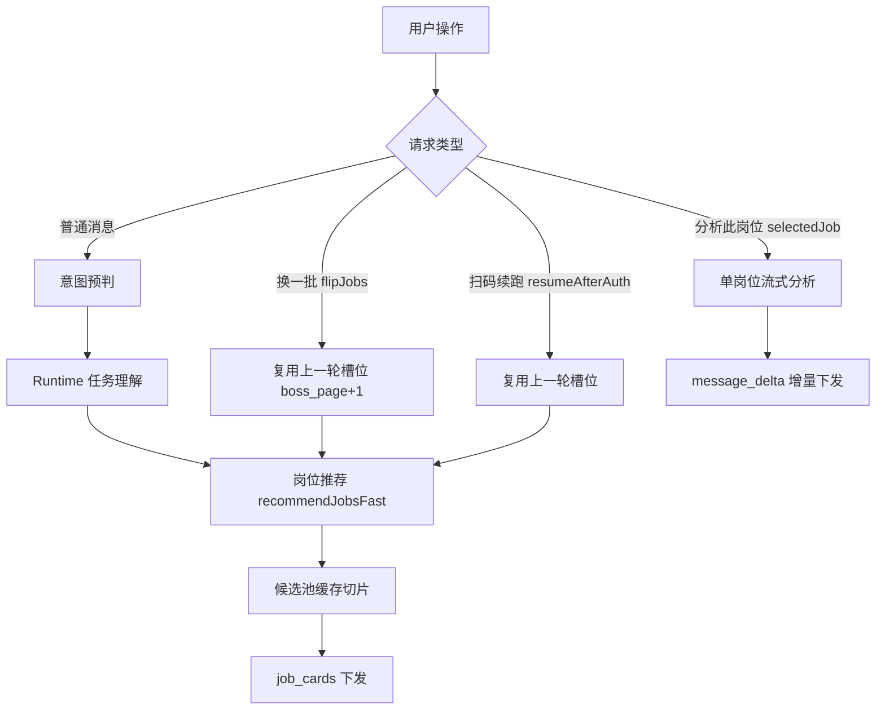

# 扫码登录续跑与换一批即时检索性能优化方案

## 背景与动机

岗位推荐主链路在前一阶段完成了跨页候选池、换一批缓存切片与薪资过滤之后，仍暴露出四个直接影响交互体感的问题，它们都集中在登录续跑与换一批两条路径上。

第一，扫码登录完成之后，前端并没有把"登录"与"登录后的搜索结果"呈现为同一段连续过程，而是先后出现了两个独立的"思考与工具执行过程"框，用户会误以为系统又重新发起了一次请求，破坏了"这本来就是一次会话"的语义。第二，登录信息的持久化在扫码这条路径上事实上是失效的：扫码成功时本地登录标记文件尚未生成，落库逻辑读到空凭证后只更新了状态字段、并没有把凭证写进数据库，导致用户感觉"刚登录完，下一次请求又要重新登录"。第三，搜索整体偏慢，尤其是换一批仍然要先走一遍 Runtime 任务理解的模型往返，再进入检索。第四，点击换一批本质上是一个确定性动作，应当直接复用上一轮检索条件立即翻页取数，但当前实现把它当成一条普通用户消息重新跑了完整对话管线，既慢又容易在中途被打断或触发不必要的重新登录。

这四个问题相互交织，根因可以归纳为两点：换一批与扫码续跑这两条确定性路径没有从重的对话管线里短路出来；扫码登录这条路径上的登录态持久化与前端过程展示存在缺口。本方案针对性地修复这两点。

## 方案总览

整体思路是为"换一批"与"扫码登录续跑"建立确定性短路通道，让它们跳过意图预判与 Runtime 任务理解的模型往返，直接复用上一轮的检索槽位进入岗位推荐；同时在前端把扫码续跑的过程事件与最终结果合并回触发登录的同一条助手消息上，使其呈现为一段连续过程；最后补齐扫码登录路径上的数据库持久化缺口，确保登录标记被可靠落库并可在重启后回填。

## 具体实现

### 一、换一批即时检索（对应问题 3、4）

在 `ChatStreamRequest` 中新增布尔字段 `flipJobs`，作为前端显式声明"这是一次换一批翻页、而非新的自然语言查询"的信号。后端 `ChatSseServiceImpl.handle` 在取得会话状态之后、进入正常意图管线之前，新增换一批短路分支：当 `flipJobs` 为真且会话内存在上一轮检索槽位 `state.lastSlots` 时，读取其中的 `boss_page`（缺省视为第 1 批）并加一，复用其余检索条件构造新的槽位，直接合成 `job.recommend` 指令调用 `handleJobRecommend`，整个过程不再触发 `intentService.classify` 与 `runTaskUnderstanding` 的模型往返。由于换一批的页码递增只改变候选池的切片偏移、不改变候选池缓存键（缓存键在前一阶段已剔除 `boss_page`），命中缓存时换一批是零 Boss 请求的即时刷新，只有候选池被翻完且上游仍有更多岗位时才按需追抓一批。

前端 `ChatPanel.vue` 的 `requestMoreJobs` 改为以 `{ replay: true, flipJobs: true, assistantId }` 选项发送固定文案"换一批"。`replay` 用于绕过重复提交防抖（允许连续点击换一批）并跳过用户气泡落库，`flipJobs` 透传到后端触发短路，`assistantId` 指向当前岗位卡片所在的助手消息。`stores/chat.js` 的 `send` 接收 `flipJobs` 选项并随 `streamChat` 请求体一并发送，同时复用该助手消息，保留旧岗位直到新 `job_cards` 到达后原位替换。这样换一批不再产生"换一批"用户气泡，也不再在聊天区追加新的助手过程框，而是在当前岗位卡片区域直接切换到下一批结果。

为避免误导，后端在换一批短路分支里下发的是 `job_flip`（"换一批"）过程事件而非 `runtime_understanding`（"Runtime 任务理解"）。"正在理解你的问题"的运行态提示被移动到正常路径分支之后下发，确保确定性短路路径不再出现"任务理解中"的过程框。

### 二、扫码登录续跑合并为一段连续过程（对应问题 1）

第二个过程框的根因是前端在扫码续跑的重发里通过 `crypto.randomUUID()` 生成了一个全新的助手消息标识，于是新一段过程与岗位结果被绑定到一条全新的助手消息上，与触发登录的那条助手消息并列展示。修复方式是让扫码续跑复用触发登录的同一条助手消息标识：`handleBossAuthRequired` 在登记待续跑请求时一并保存当前 `assistantId`，`resumeAfterAuth` 重发时通过选项把它透传回 `send`，`send` 在 `resumeAfterAuth` 且带有该标识时复用它、不再新建消息，并清空该消息上残留的"需要登录"占位文案与过期过程事件，让续跑的过程事件与岗位结果重新填充到同一个框里，呈现为"登录 → 登录后继续执行 → 搜索完成"的连续过程。

后端侧与之配合：扫码续跑这条短路本就不需要"任务理解中"的运行态提示，把该提示移动到正常路径之后下发后，续跑路径只会依次下发"登录后继续执行"与岗位搜索过程事件，与前端复用消息框的展示顺序保持一致。

### 三、扫码登录的数据库持久化补齐（对应问题 2）

扫码成功时，`BossAuthServiceImpl.persistCurrentCredential` 读取 `bossCliService.readCredentialJson()` 得到的本地登录标记尚不存在，于是只调用了 `updateStatus` 更新状态、没有把凭证写进数据库的 `credential_json`。修复方式是在落库前先确保本地登录标记被物化：为 `BossCliService` 增加 `ensureLoginMarker()`，在本地标记缺失时写入一份最小化的 `logged_in` 标记并返回其内容；`persistCurrentCredential` 在读到空凭证时调用它补齐标记后再落库，使数据库 `credential_json` 在登录成功后可靠非空。这样既让"登录信息持久化到数据库"名副其实，也让进程重启后 `restorePersistedLoginState` 能从数据库回填出有效标记、短路掉一次无谓的重新登录。

需要明确边界：Java 侧落库与回填的始终是非敏感的登录标记，真实的 Boss Cookie 仍由 agent-tool 的 boss-cli 凭证库在 `.run/boss-cli-home` 内独立持有与持久化，二者不跨模块互读。因此当扫码登录已成功、但后续搜索仍返回 4001 时，根因是 boss-cli 侧 Cookie（如 `__zp_stoken__`）不完整或过期、静默刷新失败，属于 agent-tool 取数层的登录态完整性问题，不在本次 Java 改动的修复范围内；本次改动只保证 Java 侧登录标记的落库与回填不再丢失。

### 四、首次搜索首屏单页直出（对应问题 3 的首屏延迟根治）

第三个问题里最刺眼的表现是首次搜索长时间空白、等待上百秒仍无结果。其根因在 `JobRuntimeServiceImpl.buildInitialPool` 的首屏取数策略：旧实现首屏先同步抓取 `BOSS_SEARCH_MAX_PAGES`（默认 2）页构建候选池，随后只要严格筛选（例如薪资 40-50K 这类强约束）把池子过滤到不足单屏 `limit`，便无条件再走一轮 `ensurePoolCoversPage` 同步追抓第二批，最深可达四页取数，叠加页间两段约 5 秒的固定等待与候选池双倍超时窗口；当其中任一页命中 boss-cli 首次请求的登录态校验、限速等待或上游抖动，乃至 agent-tool 为补齐 Cookie 临时拉起一次性 headless Chromium 的冷启动，首屏空白便会被层层放大到上百秒，与前置的一次 Runtime 任务理解模型往返叠加后体感尤为糟糕。

修复方式是把首屏取数收敛为"单页直出"。`buildInitialPool` 现在只抓取一页（由 `BOSS_SEARCH_FIRST_PAINT_PAGES` 控制，默认 1、上限 3），过滤排序后立即入候选池缓存并返回，首屏因此只对应一次 Boss 请求、不再有页间固定等待；更深的候选池不再为了在首屏凑满 `limit` 而同步阻塞，而是整体下沉到换一批按需懒扩，由用户后续的翻页动作驱动追抓。唯一保留的兜底是：当首屏第一页过滤后为空、且上游未枯竭、未超过最大深度时，才追抓一批以避免"0 个岗位"的空白首屏；非空首屏一律直接返回当前批，哪怕数量不足单屏，也把"快出结果、可继续换一批"置于"首屏凑满"之上。这样首屏取数从最深四页、最多两段固定等待，降到一次 Boss 请求、零页间等待，单次请求即出结果，同时把 Boss 请求量压到最低、显著降低风控暴露。

需要明确边界与代价：本改动压缩的是首屏的 Boss 请求次数与人为叠加的多轮同步取数和固定等待，而单次 Boss 请求自身的耗时（含 agent-tool 侧可能的 headless Cookie 冷启动）以及一次 Runtime 任务理解模型往返，分别属于 agent-tool 取数层与运行时,不在本次 Java 改动可压缩的范围内。要让这唯一一次 Boss 请求真正快，前提是 Boss 登录态 Cookie 处于热态，即用户先在本机常用浏览器正常登录 Boss 网页端，使 boss-cli 直接复用现成 Cookie、不触发 headless 冷启动补齐。强约束筛选下首屏可能偏稀疏（非空但不足单屏），这是"先快出结果再换一批补量"的有意取舍，而非缺陷。

### 五、选中岗位分析流式化与 JD 空白行清洗

聊天岗位卡片上的"分析此岗位"原先会打开本地弹窗，并调用 `/jobs/favorites/analyze` 同步等待完整结果。该方式在分析耗时较长时没有可见增量反馈，弹窗也会把用户从当前对话上下文中打断。新的交互把"分析此岗位"改为直接发送一条携带 `selectedJob` 的聊天流式请求：前端不再打开弹窗，后端在 `ChatSseServiceImpl.handle` 识别到 `selectedJob` 后进入 `selected_job_analysis` 短路分支，跳过任务理解和整批岗位匹配工具，读取当前简历摘要与选中岗位信息后调用 Runtime 流式生成分析，并通过 `message_delta` 与 `reasoning_delta` 持续下发。最终助手消息仍按普通聊天消息落库，刷新后可回看分析过程与结论。

该路径的输出目标从"结构化弹窗字段"调整为"对话内自然语言分析"，要求模型先给出 0-100 匹配评分和一句结论，再分段说明匹配优势、主要差距、面试准备建议和是否建议投递。这样用户点击岗位卡片按钮后可以直接在当前聊天流中看到增量输出，不再经历同步弹窗的长时间空白；同时由于它不访问 Boss 详情或搜索接口，也不会额外消耗 Boss 查询额度或触发登录态误判。

职位描述展示也统一增加了空白行清洗。前端新增 `src/utils/jobText.js`，聊天卡片和收藏列表都通过 `normalizeJobDescriptionText` 展示完整 JD，通过 `compactJobSummaryText` 生成卡片摘要，统一去掉连续空行、制表符和多余空格，保留有效行之间的换行。后端向 Runtime 注入选中岗位上下文时也会清洗 JD 字段，避免大段空白行进入提示词影响分析质量。

## 涉及模块与接口

后端 `agent-backend` 改动集中在 `modules/chat/dto/request/ChatStreamRequest`（新增 `flipJobs`，复用既有 `selectedJob`）、`modules/chat/service/impl/ChatSseServiceImpl`（换一批短路、选中岗位流式分析短路、运行态提示位置调整、换一批成功后替换最近一条岗位助手消息而不是追加新消息）、`modules/chat/repository/ChatSessionRepository` 与 `ChatSessionMapper`（支持替换最近的岗位卡片消息元数据）、`modules/auth/service/BossCliService` 与其实现（新增 `ensureLoginMarker`）、`modules/auth/service/impl/BossAuthServiceImpl`（落库前物化标记），以及 `modules/chat/service/impl/JobRuntimeServiceImpl`（`buildInitialPool` 首屏单页直出、空首屏才兜底追抓，由 `BOSS_SEARCH_FIRST_PAINT_PAGES` 控制首屏页数）。前端 `agent-frontend` 改动集中在 `components/ChatPanel.vue`（换一批发送选项携带当前助手消息标识；分析此岗位改为发送 `selectedJob` 的流式聊天请求，不再打开同步弹窗）、`stores/chat.js`（`send` 透传 `flipJobs`、扫码续跑和换一批复用 `assistantId`，换一批失败时保留已有岗位并避免用旧服务端快照覆盖当前过程）、`components/JobCardList.vue` 与 `utils/jobText.js`（统一清洗 JD 空白行和岗位摘要）。SSE 事件序列对正常路径保持不变，为换一批新增 `job_flip` 过程事件，为选中岗位分析新增 `selected_job_analysis` 过程事件；二者都不改变 `intent`、`job_cards`、`done` 的既有契约。首屏单页直出不改变任何对外事件契约，只改变候选池的构建时机与首屏取数页数。

## 风险与约束

换一批短路依赖会话内存中的 `state.lastSlots`，进程重启或会话状态丢失时该字段为空，此时换一批会优雅回退到正常意图管线、按字面文案"换一批"走任务理解，属于可接受的少数派降级。换一批页码递增不改变候选池缓存键，命中缓存为零 Boss 请求；只有翻完池且未超深度上限时才追抓，单轮换一批最多追抓一批，避免一次点击放大风控暴露，这一约束沿用前一阶段的设计。登录标记物化只在 agent-tool 已确认 `logged_in` 的扫码成功路径上发生，不会凭空制造登录态假阳性。Boss 访问仍须串行、低频，命中验证码、安全验证或限速时立即停手。

## 如何验证

后端执行 `mvn -o test` 确认单元测试通过。`JobRuntimeServiceImplTest` 中首屏用例已对齐单页直出契约：在 Boss 单页返回的岗位数多于两屏 `limit` 时，首屏只调用一次 `searchJobsFirstPage`，换一批从同一候选池缓存切出下一批、零额外 Boss 请求（断言 `searchJobsFirstPage` 一次、`searchJobsPage` 从不调用、`rememberCurrentCredential` 一次）；薪资过滤、登录态兜底等既有用例在单页改动下保持通过。前端执行 `npm run lint` 与 `npm run build`，并补充换一批复用当前助手消息、原位替换岗位卡片的 store 测试，以及 JD 空白行清洗工具测试。Flyway 未新增迁移，无需校验；本次不改变意图分类输出、风险等级与既有 SSE 主事件契约，`agent-eval` 与 `.agent-harness` 评估规则无需同步更新，新增的 `job_flip` 与 `selected_job_analysis` 过程事件均为附加信息、不在既有断言范围内。最后必须启动后端与前端做浏览器端到端验证：覆盖首次搜索能在显著更短时间内出结果而非长时间空白、扫码登录完成后过程框合并为一段、登录后下一次请求不再要求重新登录、换一批点击后在当前岗位卡片区域原位切换下一批岗位且不再出现"任务理解中"的过程框、连续点击换一批顺序正确不重叠、点击"分析此岗位"后不出现弹窗而是在当前聊天流中逐字输出岗位匹配分析、职位描述展开后不再出现大量空白行。需要强调，验证首屏速度时应确保 Boss 登录态 Cookie 处于热态（先在本机常用浏览器登录 Boss），否则 agent-tool 侧 headless 冷启动会掩盖本次后端优化的实际收益。

## 后续演进

首屏单页直出已把 Boss 取数从最深四页压到一次请求，正常路径下首次搜索的剩余延迟主要由一次 Runtime 任务理解模型往返与这唯一一次 Boss 请求构成。前者后续可探索在高置信、槽位完整的预判结果上进一步收窄任务理解的调用，但需保持权威路由不被预判替换；当前 agent-intent 的规则槽位抽取尚不能识别"大模型应用开发"这类长尾岗位（`ROLE_HINTS` 无对应词条），因此这一往返暂不可省，贸然短路会降级槽位质量。后者的耗时取决于 boss-cli 是否复用热态 Cookie，根治需要在 agent-tool 的 boss-cli 适配层补齐搜索所需 Cookie 的静默刷新与完整性校验，并避免 headless 冷启动阻塞首屏；届时可在 Java 侧补充一次登录后的搜索就绪自检。更进一步，可考虑把首屏从"阻塞式一次性下发"演进为"边取边流式下发"，让第一批岗位卡片在 Boss 单页返回的瞬间即推送给前端，进一步压缩可感知等待，但这属于 SSE 主流程的更大改造，需独立评估。
