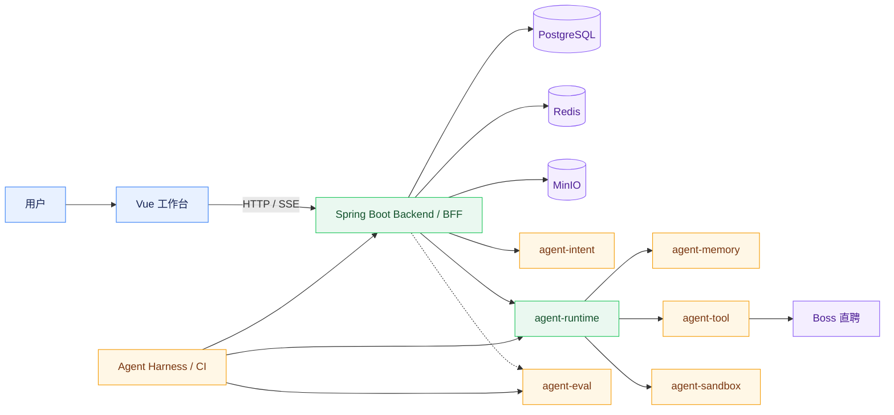
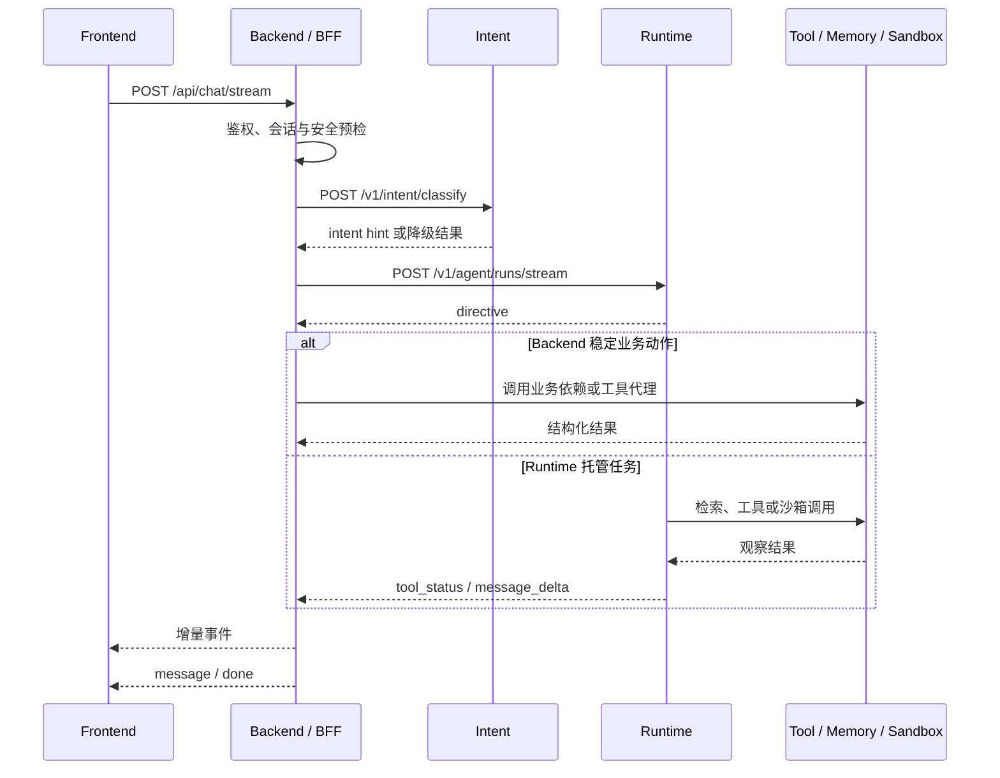
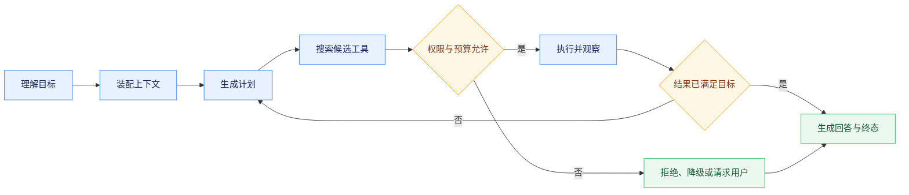

# 系统架构与核心链路

## 系统定位

job-buddy 是面向求职场景的本地 Agent 工作台。系统采用 Vue 前端、Spring Boot 业务后端、Python Agent Runtime 与独立能力服务组成的多服务架构：前端只访问 Java Backend/BFF；Backend 管理认证、业务事务、关系数据、对象文件和 SSE 会话；Runtime 承担任务理解、规划、模型调用、工具治理、上下文装配、Trace 与 Checkpoint；Intent、Memory、Tool、Sandbox 和 Eval 提供可独立部署的专项能力。

系统坚持“业务数据归 Backend、智能执行归 Runtime、外部能力通过工具注入”的边界。服务之间通过 HTTP 或 SSE 契约协作，不跨模块直接访问对方内部数据结构。Runtime Core 不直接依赖 Boss 直聘、收藏岗位等具体业务对象，业务语义由 Profile、Workflow、Prompt、Capability 与 Tool 配置注入。

## 总体架构

图中的实线表示在线主链路或明确的运行时依赖，虚线表示可选的评估调用。`agent-eval` 提供 Trace、运行结果、能力清单和 LLM Judge 评估，并由 Harness 与 CI 执行回归门禁；其失败不应使常规对话连接悬挂。`agent-memory` 在 Runtime 中默认关闭，启用后于上下文装配阶段检索长期记忆，连接失败时返回空引用并继续主链路。

## 服务职责

| 模块 | 默认端口 | 职责 |
| --- | ---: | --- |
| `agent-frontend` | 5173 | Vue 3 工作台、路由、状态管理、SSE 增量渲染与业务交互 |
| `agent-backend` | 8080 | 认证与 RBAC、业务 API、会话和数据持久化、文件管理、下游代理与 SSE 中继 |
| `agent-runtime` | 8010 | Agent 运行、任务理解、Planner、工具注册与权限、模型适配、上下文、Trace、Checkpoint |
| `agent-intent` | 8020 | 轻量意图分类、澄清门和高风险 Transcript 复核 |
| `agent-memory` | 8030 | 记忆写入、检索、更新、回滚、删除、TTL 和审计 |
| `agent-tool` | 8040 | 工具目录和执行入口，包含 `boss_browser` |
| `agent-eval` | 8050 | Trace、运行结果、能力清单和 Judge 评估 |
| `agent-sandbox` | 8061 | 基于 srt 的命令与代码隔离执行 |

后端使用 PostgreSQL 保存业务数据和认证状态，Redis 保存缓存及 Boss 访问限速状态，MinIO 保存简历资源与项目材料。各依赖均通过环境变量配置；MySQL、Elasticsearch、Milvus、Kafka 和 Kubernetes 不属于本项目的运行依赖。

## 对话与 Agent 执行链路

工作台通过 `POST /api/chat/stream` 建立 SSE。Backend 完成身份、业务配置和安全预检，并调用 Intent 获得前置分类提示；随后发起一次 Runtime 流式运行。Runtime 在同一条流中输出结构化 directive。Backend 根据 directive 决定接管登录、岗位推荐、简历匹配等稳定业务动作，或继续中继 Runtime 的规划、工具和答案事件，因此不需要为“理解”和“回答”建立两次串行 Runtime 请求。

Runtime 托管的复杂任务由状态图组织为“理解目标、装配上下文、生成计划、选择工具、权限检查、执行、观察、验证、收尾”。循环同时受最大轮次、工具调用数、连续失败次数和 Token 预算约束。每条成功、拒绝、中断和异常路径都必须产生明确终态；Checkpoint 保存可恢复状态，Context Compaction 折叠早期观察，Trace 记录理解、规划、工具、模型用量和终止原因。

## Runtime 内部结构

`agent-runtime/app/core/agent/` 实现执行器、状态图和 LoopController；`intent/` 负责 Runtime 内的权威任务理解；`planner/` 负责计划；`tool/` 提供注册表、候选搜索、权限、MCP 适配、注入探针和 ToolGateway；`context/` 与 `memory/` 负责上下文和可选长期记忆；`llm/` 处理 OpenAI 兼容及 Anthropic 风格请求、流式响应和用量归一；`checkpoint/` 与 `observability/` 负责持久化、Trace 和可选 OTLP 导出。业务资产位于 `config/profiles/`、`config/workflows/` 和 `config/prompts/`。

Runtime 内置文件、搜索、简历、Shell 和 Boss 代理等工具。`boss_browser` 的具体实现位于 agent-tool，Runtime 只保留元数据、权限参与和 HTTP 代理。`shell_exec` 默认调用 agent-sandbox 的 `/v1/shell`；沙箱不可用时失败关闭，不回退宿主机。仅在明确关闭沙箱开关的本地调试环境中存在宿主机执行路径。

Workflow 是跨服务稳定流程的声明式资产。Runtime 启动时加载并校验 `config/workflows/`，依据 `profile` 与 `entry_capability` 将只读流程元数据附加到 TaskUnderstanding、directive 和 Trace；`runtime_node` 由 Runtime 负责，`external_action` 仍由 Java Backend/BFF 在自身事务边界内执行，`external_event` 由前端消费。Workflow 注册与路由不等于 Runtime 越权执行 Backend 业务，也不应复制一套与现有 BFF 编排竞争的业务 DAG。

## 契约、降级与安全

Backend 对外响应采用统一信封，流式接口使用只允许追加式扩展的 SSE 事件。前端必须忽略未知事件，Backend 不得在 SSE 已开始后再写普通 JSON 错误响应。Runtime 流式路径必须保留状态图产生的 `status`、`stop_reason` 与终态答案；澄清、预算耗尽、权限拒绝、需要确认和连续失败不能进入成功答案合成。跨服务调用均应设置超时和错误分类；Intent、Memory、OTel 或 Eval 的旁路失败不得伪装成业务成功，也不得无界阻塞主流程。Tool、网页、记忆和 Shell 输出均视为不可信内容，进入模型上下文前需要限长、标注来源并执行风险探测。

响应类型按协议语义区分：普通结构化业务 API 使用包含 `code`、`message` 和 `data` 的 `ApiResponse`；单文件预览与下载使用 `ResponseEntity<Resource>`，并设置准确的 `Content-Type`、`Content-Length`、`Content-Disposition` 和必要安全响应头；批量文件下载使用 `ResponseEntity<StreamingResponseBody>`，避免在 JVM 内聚合完整 ZIP；聊天与异步任务进度使用 SSE，并在成功、失败、中断和超时路径发送明确终态。二进制流和 SSE 不嵌套 JSON 信封；SSE 握手前的非法请求使用 HTTP 4xx 拒绝，响应开始后则通过 SSE 的错误与终态事件表达。

认证令牌、Boss Cookie、模型密钥和对象存储凭据不得进入 Prompt、Trace 或普通日志。用户私有数据按租户和属主查询；文件读取由 Backend 校验资源所有权，不向前端暴露 MinIO 对象键。Flyway 只维护结构和共享基线，用户简历、岗位、聊天、项目、认证状态等私有数据不能作为迁移种子提交。

## 验证

架构或核心链路变更至少需要执行受影响模块的单元测试和 Harness Gate；SSE、Intent、工具事件或 Trace 契约变化还需同步检查 `agent-eval/app/grader.py`、评估用例与前端事件处理。涉及用户可见流程时，必须启动真实服务做浏览器验证。

Backend 对稳定业务动作执行确定性接管，Runtime 负责通用 Agent 执行，两者以业务事务边界和 HTTP/SSE 契约隔离。
