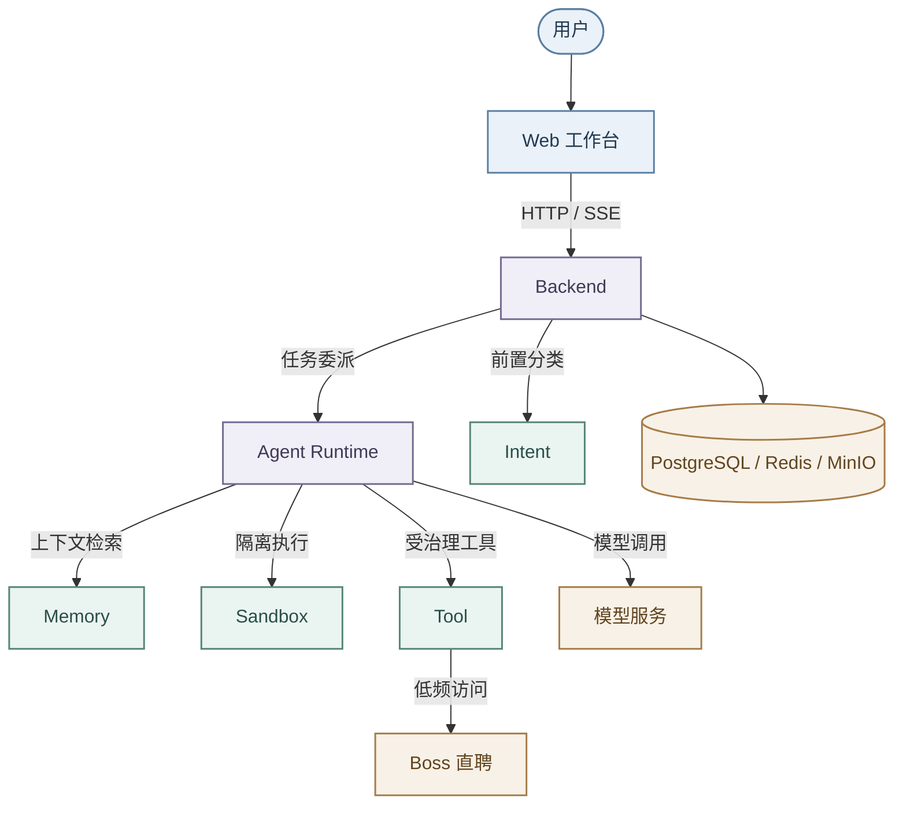
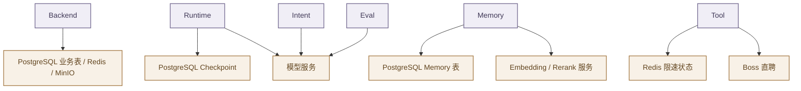
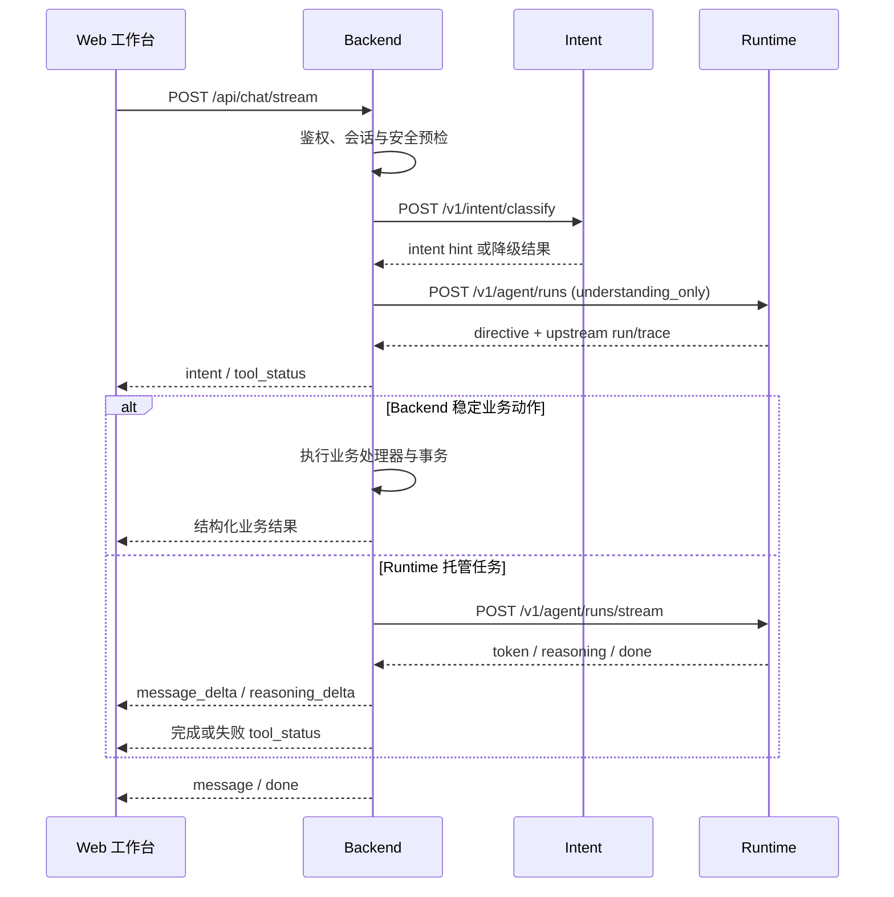
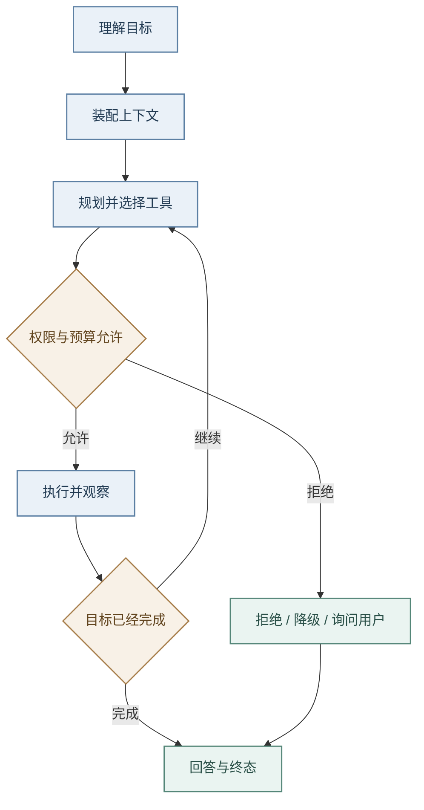

# 系统架构与核心链路

## 系统定位

- JobBuddy是面向求职场景的本地 Agent 应用，采用 Web 工作台、Spring Boot Backend、Python Agent Runtime 和独立能力服务。
- 浏览器只访问 Backend；
- Backend 管理认证、业务事务、关系数据、对象文件和 SSE 会话，Runtime 承担任务理解、规划、模型、工具治理、上下文、Trace 与 Checkpoint，Intent、Memory、Tool、Sandbox 和 Eval 提供专项能力。

- 系统边界是“业务数据归 Backend、智能执行归 Runtime、外部能力通过工具注入”。
- 服务只通过 HTTP/SSE 契约协作，不跨模块访问内部结构；
- Runtime Core 不硬编码 Boss、收藏岗位等业务对象，领域语义由 Profile、Workflow、Prompt、Capability 与 Tool 配置注入。

## 总体架构

总图只展示常规在线主链路，避免把专项调用、健康探测和离线评估挤在同一视图中；完整服务依赖在后续调用矩阵与依赖图中展开。

```mermaid
graph TD
    USER(["用户"]) --> FE["Web 工作台"]
    FE -->|HTTP / SSE| BE["Backend"]
    BE -->|任务委派| RT["Agent Runtime"]
    BE -->|前置分类| INTENT["Intent"]
    RT -->|上下文检索| MEMORY["Memory"]
    RT -->|隔离执行| SANDBOX["Sandbox"]
    RT -->|受治理工具| TOOL["Tool"]
    RT -->|模型调用| MODEL["模型服务"]
    TOOL -->|低频访问| BOSS["Boss 直聘"]
    BE --> DATA[("PostgreSQL / Redis / MinIO")]

    classDef access fill:#EAF1F8,stroke:#5B7FA3,color:#213A52,stroke-width:1.5px;
    classDef core fill:#F0EEF6,stroke:#746A91,color:#403957,stroke-width:1.5px;
    classDef capability fill:#EAF4F1,stroke:#548678,color:#294F47,stroke-width:1.5px;
    classDef resource fill:#F8F1E7,stroke:#A67C48,color:#62451F,stroke-width:1.5px;
    class USER,FE access;
    class BE,RT core;
    class INTENT,MEMORY,SANDBOX,TOOL capability;
    class MODEL,BOSS,DATA resource;
```

- Backend 通过 Runtime 执行通用 Agent 任务，直接调用 Memory 管理长期记忆，并在面试判题时直接调用 Sandbox。
- 确定性 Boss 业务由 Backend 编排，但工具请求统一经 Runtime 代理到 Tool。
- Harness 与 Eval 构成独立的离线质量链路，不进入常规对话同步链路；
- Tool 可调用 Memory 与 Sandbox，并使用 Redis 保存 Boss 限速和冷却。
- Runtime 记忆检索可降级为空引用，设置页显式记忆写入则必须失败关闭。

## 服务职责

| 模块             | 默认端口 | 职责                                                                               |
| ---------------- | -------: | ---------------------------------------------------------------------------------- |
| `agent-frontend` |     5173 | Web 工作台（Vue 3）、路由、状态管理、SSE 增量渲染与业务交互                        |
| `agent-backend`  |     8080 | 认证与 RBAC、业务 API、会话和数据持久化、文件管理、下游代理与 SSE 中继             |
| `agent-runtime`  |     8010 | Agent 运行、任务理解、Planner、工具注册与权限、模型适配、上下文、Trace、Checkpoint |
| `agent-intent`   |     8020 | 轻量意图分类、澄清门和高风险 Transcript 复核                                       |
| `agent-memory`   |     8030 | 长期记忆唯一内容存储，以及记忆写入、检索、更新、回滚、删除、TTL 和审计             |
| `agent-tool`     |     8040 | 工具目录和执行入口，包含 `boss_browser`                                            |
| `agent-eval`     |     8050 | Trace、运行结果、能力清单和 Judge 评估                                             |
| `agent-sandbox`  |     8061 | 基于 srt 的命令与代码隔离执行                                                      |

后端使用 PostgreSQL 保存业务数据和认证状态，Redis 保存缓存及 Boss 访问限速状态，MinIO 保存简历资源与项目材料，各依赖均通过环境变量配置。

## 部署与网络边界

应用网络按调用方列出同步依赖，避免用多对多连线掩盖服务边界。健康探测和离线评估不计入业务请求路径。

| 调用方              | 同步调用目标                     | 用途                                         |
| ------------------- | -------------------------------- | -------------------------------------------- |
| 浏览器 / Web 工作台 | Backend                          | 业务 API、文件和 SSE                         |
| Backend             | Intent、Runtime、Memory、Sandbox | 前置分类、任务委派、记忆管理和面试代码判题   |
| Runtime             | Intent、Memory、Tool、Sandbox    | 高风险复核、上下文检索、工具代理和隔离执行   |
| Tool                | Memory、Sandbox                  | 工具侧记忆能力与受限执行                     |
| Backend、Harness    | 各服务健康端点                   | 服务监控与交付验证，不参与常规对话的同步结果 |

数据与外部依赖按服务归属展开，避免共享依赖产生交叉连线。

```mermaid
graph TD
    BACKEND[Backend] --> BDATA["PostgreSQL 业务表 / Redis / MinIO"]
    RUNTIME[Runtime] --> CHECKPOINT["PostgreSQL Checkpoint"]
    MEMORY[Memory] --> MDATA["PostgreSQL Memory 表"]
    MEMORY --> RETRIEVAL_MODEL["Embedding / Rerank 服务"]
    TOOL[Tool] --> TDATA["Redis 限速状态"]
    TOOL --> BOSS["Boss 直聘"]
    RUNTIME --> MODEL[模型服务]
    INTENT[Intent] --> MODEL
    EVAL[Eval] --> MODEL

    classDef service fill:#F0EEF6,stroke:#746A91,color:#403957,stroke-width:1.5px;
    classDef resource fill:#F8F1E7,stroke:#A67C48,color:#62451F,stroke-width:1.5px;
    class BACKEND,RUNTIME,MEMORY,TOOL,INTENT,EVAL service;
    class BDATA,CHECKPOINT,MDATA,TDATA,MODEL,RETRIEVAL_MODEL,BOSS resource;
```

- 浏览器只访问 Web 工作台与 Backend，不持有内部服务令牌。
- 应用 Compose 的八个服务位于同一内部网络，Backend 调用 Python 服务时携带 `X-Internal-Service-Token` 并传播租户与操作者。
- PostgreSQL、Redis 和 MinIO 由独立基础设施 Compose 管理；
- Backend 先执行 Flyway，Memory 再初始化 `agent_memory_*` 表，Tool 就绪后 Runtime 启动。
- Runtime Checkpoint 通过 `AGENT_RUNTIME_DATABASE_URL` 写入 `agent_run_checkpoint`，完整栈不得退化为进程内存。
- Memory 可按配置把有界查询和候选正文发送给 Embedding / Rerank 服务；任一模型依赖失败时只降级检索排序，不改变 PostgreSQL 事实源、租户权限或 TTL 过滤。

## 对话与 Agent 执行链路

- Web 工作台通过 `POST /api/chat/stream` 建立一条浏览器 SSE。
- Backend 完成身份、业务配置和安全预检，并调用 Intent 获得提示；
- Backend 只为任务理解装配有界会话目录：前置规则明确命中的 `resume.match` 直接使用会话中已选择简历的可用性标记，不额外访问数据库；需要根据画像方向推荐岗位等意图，或前置结果不足以确定能力时，才按租户与用户精确读取当前简历的目标方向、当前职位和技能、项目、经历数量。目录同时可携带岗位引用和数量，完整简历数组、正文、JD、长期记忆与其他业务集合在能力确定后再加载。
- Backend 明确生成的新会话没有可承接的历史消息，任务理解只装配当前用户消息，不查询聊天消息表；客户端携带既有 `session_id` 的续聊仍加载受限近期历史，保证省略式追问语义不丢失。
- `job.recommend` 由 Backend 确定性接管后，只并行读取会参与筛选槽位计算的求职画像、当前简历和黑名单；不在首屏路径检索长期记忆。槽位补全后，匹配用的完整简历快照与 Boss 搜索重叠预取，质量门复用已完成的预取结果；Boss 外部请求仍保持串行，候选分批评分仍只对互不依赖的 Runtime 请求有界并行。推荐过程依次闭合上下文准备、Boss 候选搜索和简历预筛三个 SSE 阶段，并记录各阶段耗时。
- 随后以 `understanding_only=true` 调用 `POST /v1/agent/runs` 取得 directive。低风险稳定意图只有同时满足 Profile 白名单、前置规则置信度、单轮无附件、无历史槽位，以及 Runtime 本地语义 Top-1 一致时，才使用受校验 Hint 快路径；任一条件不满足仍由任务理解模型处理。
- 稳定业务由 Backend 接管，需要 Runtime 回答时再调用流式入口。
- 两次 run 共享 `session_id`，以 `upstream_run_id` 和 `upstream_trace_id` 关联，第二阶段只携带精简 directive。
- Task Understanding 的能力目录只向模型发送分类所需的稳定语义字段和联网能力边界，并使用紧凑 JSON 编码；执行模式、下一步动作、最终工具权限与证据规则由选中能力卡在模型返回后确定性回填，不能依赖模型复述。第二阶段对 directive 中的完整任务理解做结构、Profile 与能力契约一致性校验，校验通过后直接复用，校验失败才重新理解。

- 声明 `required_tools` 的能力进入完整状态图；纯知识问答和不要求外部证据的文本生成任务可以走 direct synthesis 以降低首字延迟。
- 已选简历优化把 Backend 按当前租户、用户和 `resume_id` 注入的 `personal_context.resume_summary` 作为权威输入，通过只读 `resume_context_read` 工具进入 Planner；不得再次构造 Runtime 本地 PDF 路径或要求用户提供系统路径。只有独立 PDF 解析入口才使用 `resume_parse`。
- Runtime 在任务理解阶段自主判断外部信息需求。用户明确要求联网，或问题依赖最新/近期的易变事实、事实核验、来源引用与官方链接时，在 Capability 既有工具白名单内把 `web_search` 提升为本轮必需工具；用户明确禁止联网时不调用。判定为必需后，Backend 在进入第二阶段 Runtime 调用前先下发 `runtime_web_search` 进行中事件，前端实时展示查询准备与来源状态；Runtime 返回真实工具结果后，同一事件再更新为成功或失败，并补充实际搜索词、供应商、去重数量和来源数量。第二阶段不得走 direct synthesis，取得包含标题和公网 URL 的真实结果后即可成功合成带来源回答；官方来源优先排序但不构成硬门槛，未命中时继续使用第三方结果直接回答。
- `latest` 联网计划在搜索供应商请求的同时，并发直验与查询主题匹配的配置化官方稳定入口。模型目录的当前快照和带发布日期的官方栏目必须分别满足对应 evidence strategy 才能声称当前最新；未命中可核验官方来源时，第三方说法必须标记为未经官方确认。当 `web_search` 证据已满足所有当前步骤时直接收口，不再重复 Tool Search、Planner 或工具调用。原始工具观察只作为答案合成证据，不得直接展示。流式错误不得由 Backend 改走非流式整任务重放，只能按原 `run_id` 使用 Checkpoint 恢复。
- 代码生成能力必须把 `sandbox_code_execute` 声明为必需工具，由 Planner 先生成候选代码及有界 Python 第三方依赖声明，再通过 Sandbox 隔离执行并基于结构化 stdout、stderr、退出码和 `sandboxed=true` 证据合成答案。Planner 的结构化调用关闭模型深度思考，普通计划输出最多 2048 token；只有硬性要求 `sandbox_code_execute` 的代码生成计划因需在结构化工具参数中携带完整候选代码，上限放宽为 4096 token。两者都必须在 30 秒内成功或产生可解释失败终态，不能占满 Backend 的流式读取超时。依赖只安装到单次执行目录，安装阶段限定固定 PyPI 域名，代码阶段仍关闭网络；公共包下载缓存位于独立、容量受限的 `noexec` tmpfs，不挤占普通 `/tmp`，可导入环境位于单次执行后销毁的专用 `exec,nosuid,nodev` tmpfs，用于加载 wheel 原生扩展，不改变系统 Python 或项目环境。仅返回代码文本不能标记为该能力执行成功。Runtime 在该工具结果的专用执行详情元数据中保留有界候选源码，Backend 将源码、标准输出和标准错误投影为 `runtime_sandbox_code_execute` 过程事件，前端在用户展开详情后分别展示“执行代码”和“代码产物”；详情随助手消息保存，刷新后仍可回看。
- 仅把用户已经提供的文本或代码原样包裹为 Markdown 代码围栏、代码块或其他指定格式时，属于无工具的内容格式化，不得误路由到代码生成能力，也不得调用文件搜索、Shell 或 Sandbox。要求编写、修改、补全或验证新代码时仍必须遵守上述沙箱执行契约，用户不能通过“不要执行工具”绕过验证边界。
- `understanding_only` 的正常成功路径是瞬时判定，不写可恢复 Checkpoint；若本轮失败，异常恢复只允许读取同一 `run_id` 的状态，禁止复用同会话上一轮 directive。完整执行 run 继续按节点保存 Checkpoint。
- 快路径仍执行 Token 预算、模型配置、Trace 终态和安全拦截。
- 无论内部如何分流，Backend 和前端只产生一条最终答案，浏览器 SSE 契约保持不变。

```mermaid
sequenceDiagram
    participant FE as Web 工作台
    participant BE as Backend
    participant IN as Intent
    participant RT as Runtime

    FE->>BE: POST /api/chat/stream
    BE->>BE: 鉴权、会话与安全预检
    BE->>IN: POST /v1/intent/classify
    IN-->>BE: intent hint 或降级结果
    BE->>RT: POST /v1/agent/runs (understanding_only)
    RT-->>BE: directive + upstream run/trace
    BE-->>FE: intent / tool_status
    alt Backend 稳定业务动作
        BE->>BE: 执行业务处理器与事务
        BE-->>FE: 结构化业务结果
    else Runtime 托管任务
        BE->>RT: POST /v1/agent/runs/stream
        RT-->>BE: token / reasoning / done
        BE-->>FE: message_delta / reasoning_delta
        BE-->>FE: 完成或失败 tool_status
    end
    BE-->>FE: message / done
```

- 需要工具的任务按“理解目标、装配上下文、生成计划、选择工具、权限检查、执行观察、验证收尾”运行，同时受最大轮次、工具调用数、连续失败和 Token 预算约束。
- 成功、拒绝、中断与异常都产生明确终态；
- Checkpoint 保存运行图恢复所需的执行级状态，Context Compaction 折叠早期观察，Trace 记录理解、规划、工具、模型用量和终止原因。
- 失败或中断运行可以按 `session_id + run_id` 派生新运行继续；Runtime 校验租户/用户、原 `turnId`、消息摘要、附件标识、终态、恢复阶段和单次领取，已完成工具不重复执行，执行前的写入型或破坏性工具不自动重放。`invalid_plan_dependency` 仅在此前没有成功写入型或破坏性工具时作为白名单结构化失败，清除坏计划后从 Planner 前的安全游标有界重规划；Graph 已完成而最终答案流失败时只重试答案合成。
- Backend 按当前用户和原 `turnId` 从数据库重建消息与附件上下文后调用续跑，前端只对携带可恢复 `runId` 的失败消息提供继续入口；点击按钮或在最新可恢复失败后精确输入“继续”均进入同一入口，不新增用户轮次。成功终态和任意历史快照不提供重放入口。

```mermaid
graph TD
    A[理解目标] --> B[装配上下文]
    B --> C[规划并选择工具]
    C --> D{权限与预算允许}
    D -->|允许| E[执行并观察]
    E --> F{目标已经完成}
    F -->|继续| C
    F -->|完成| G[回答与终态]
    D -->|拒绝| H["拒绝 / 降级 / 询问用户"]
    H --> G

    classDef phase fill:#EAF1F8,stroke:#5B7FA3,color:#213A52,stroke-width:1.5px;
    classDef decision fill:#F8F1E7,stroke:#A67C48,color:#62451F,stroke-width:1.5px;
    classDef terminal fill:#EAF4F1,stroke:#548678,color:#294F47,stroke-width:1.5px;
    class A,B,C,E phase;
    class D,F decision;
    class G,H terminal;
```

## Runtime 内部结构

- `app/core/agent/` 实现执行器、状态图和 LoopController，`intent/` 与 `planner/` 负责理解和计划，`tool/` 提供注册、搜索、权限、MCP、注入探针与 ToolGateway，`context/` 和 `memory/` 负责上下文，`llm/` 处理模型协议与用量，`checkpoint/` 和 `observability/` 负责状态与观测。
- 业务资产位于 `config/profiles/`、`config/workflows/` 和 `config/prompts/`。

- Runtime 内置文件、搜索、简历、受限代码执行、Shell 和 Boss 代理等工具。
- `boss_browser` 的实现位于 agent-tool；
- `sandbox_code_execute` 只接受固定语言枚举，由 Runtime 映射到受信任的解释器和文件后缀，并调用 Sandbox `/v1/code-file`；Python 可声明受格式、数量和超时约束的 PyPI 依赖，由 Sandbox 选择受信任系统 Python 与固定 `uv` 安装。它不接受模型提供任意解释器、索引地址、工作目录、文件系统或网络策略。
- `shell_exec` 默认调用 Sandbox 的 `/v1/shell`，服务不可用时失败关闭，只有明确关闭沙箱的本地调试模式才存在宿主机路径。

Workflow 是跨服务稳定流程的声明式资产。

- Runtime 启动时校验 `config/workflows/`，按 `profile` 与 `entry_capability` 把只读元数据附加到 TaskUnderstanding、directive 和 Trace。
- `runtime_node` 由 Runtime 执行，`external_action` 仍属于 Backend 事务，`external_event` 由前端消费。
- Workflow 不能重复定义 Backend 已有的业务 DAG。

## 契约、降级与安全

- 普通结构化 API 使用 `ApiResponse(code, message, data)`；
- 单文件预览和下载使用 `ResponseEntity<Resource>`，批量下载使用 `StreamingResponseBody`，二进制流不嵌套 JSON；
- 聊天和异步进度使用 SSE。
- SSE 事件只追加扩展，前端忽略未知事件，响应开始后只能通过事件表达错误与终态。
- `runtime_sandbox_code_execute` 只向当前鉴权会话返回有界候选源码、stdout 和 stderr，并携带原始字符数与截断标记。该用户可见执行详情不写入 Runtime Trace；Sandbox argv、解释器绝对路径、一次性工作目录、隔离策略和原始 HTTP 响应不得进入 SSE 或聊天记录。
- 握手前获取按进程、租户和用户划分的并发租约，超额或线程池饱和返回真实 429/503，租约在所有结束路径幂等释放。

- Runtime 流保留状态图的 `status`、`stop_reason` 和答案，澄清、预算耗尽、权限拒绝、待确认和连续失败不能进入成功合成。
- 跨服务调用设置超时和错误分类；
- Intent、Memory、OTel 等旁路故障不能伪装成功或无界阻塞，Eval 不属于同步对话依赖。
- Tool、网页、记忆和 Shell 输出进入上下文前必须限长、标源并执行风险探测。

- 认证令牌、Boss Cookie、模型密钥和对象存储凭据不得进入 Prompt、Trace 或普通日志。
- 用户数据按租户与属主查询，文件由 Backend 校验所有权且不暴露 MinIO 对象键；
- Flyway 只维护结构和共享基线，不写入用户私有业务数据。

## 验证

- 架构或核心链路变更至少执行受影响模块测试和 Harness Gate；
- SSE、Intent、工具或 Trace 契约变化还要检查 grader、评估用例和前端事件处理。
- 涉及用户可见流程时必须启动真实服务做浏览器验证。

Backend 对稳定业务动作执行确定性接管，Runtime 负责通用 Agent 执行，两者以业务事务边界和 HTTP/SSE 契约隔离。
