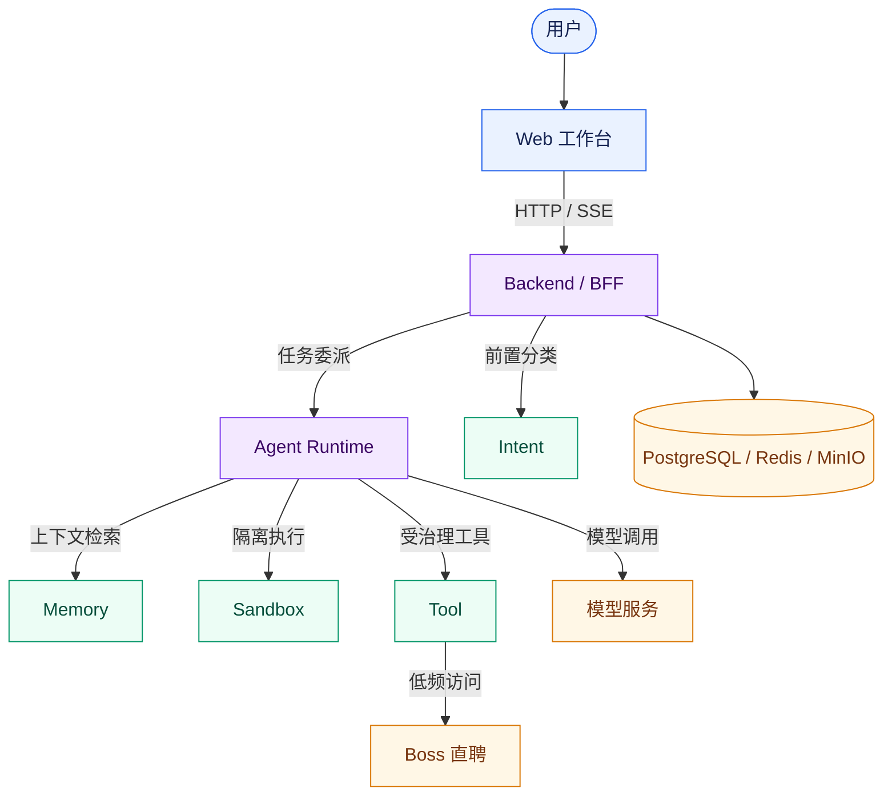
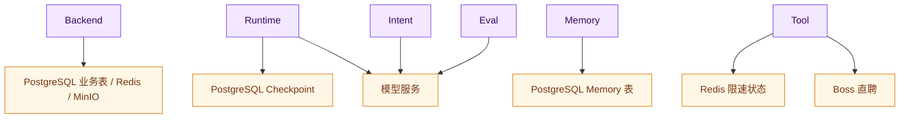
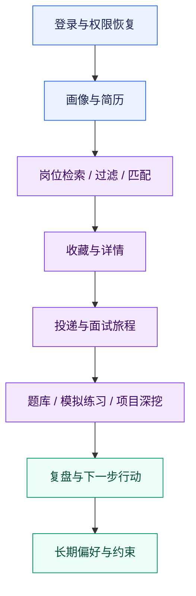
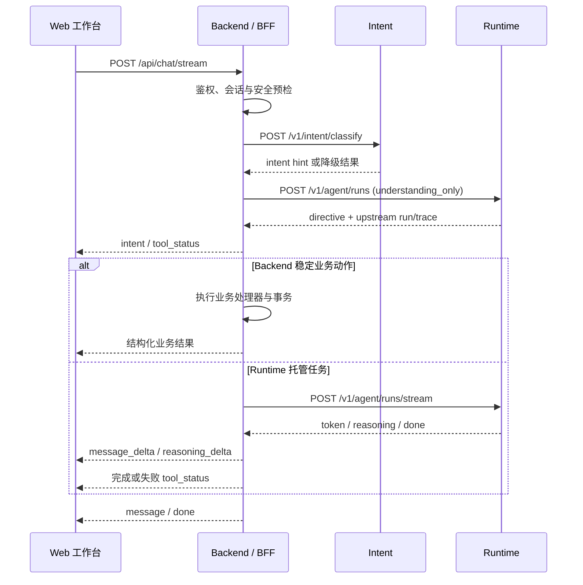
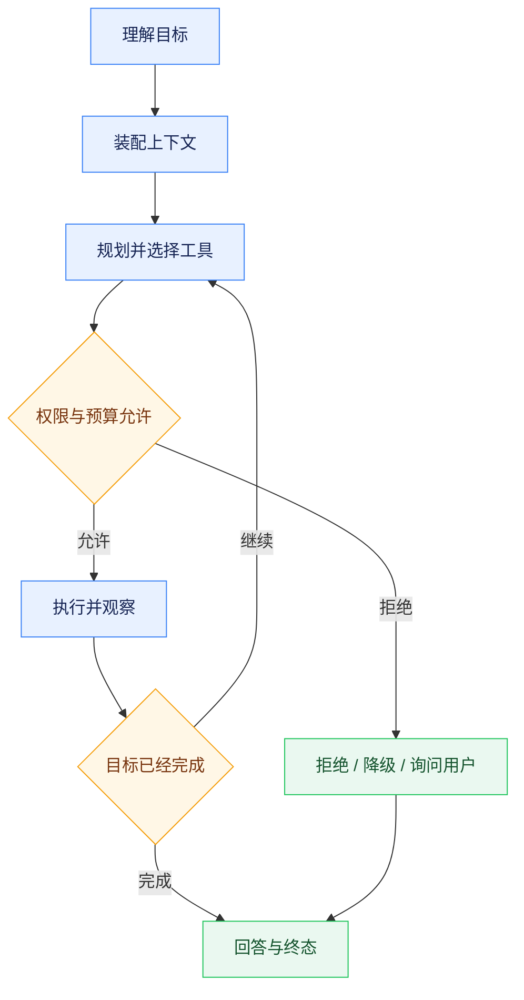

# 系统架构与核心链路

## 系统定位

JobBuddy（仓库名 `job-buddy`）是面向求职场景的本地 Agent 应用，采用 Web 工作台、Spring Boot Backend/BFF、Python Agent Runtime 和独立能力服务。浏览器只访问 Backend；Backend 管理认证、业务事务、关系数据、对象文件和 SSE 会话，Runtime 承担任务理解、规划、模型、工具治理、上下文、Trace 与 Checkpoint，Intent、Memory、Tool、Sandbox 和 Eval 提供专项能力。

系统边界是“业务数据归 Backend、智能执行归 Runtime、外部能力通过工具注入”。服务只通过 HTTP/SSE 契约协作，不跨模块访问内部结构；Runtime Core 不硬编码 Boss、收藏岗位等业务对象，领域语义由 Profile、Workflow、Prompt、Capability 与 Tool 配置注入。

## 总体架构

总图只展示常规在线主链路，避免把专项调用、健康探测和离线评估挤在同一视图中；完整服务依赖在后续调用矩阵与依赖图中展开。

```mermaid
graph TD
    USER(["用户"]) --> FE["Web 工作台"]
    FE -->|HTTP / SSE| BE["Backend / BFF"]
    BE -->|任务委派| RT["Agent Runtime"]
    BE -->|前置分类| INTENT["Intent"]
    RT -->|上下文检索| MEMORY["Memory"]
    RT -->|隔离执行| SANDBOX["Sandbox"]
    RT -->|受治理工具| TOOL["Tool"]
    RT -->|模型调用| MODEL["模型服务"]
    TOOL -->|低频访问| BOSS["Boss 直聘"]
    BE --> DATA[("PostgreSQL / Redis / MinIO")]

    classDef access fill:#EAF2FF,stroke:#2563EB,color:#172554;
    classDef core fill:#F3E8FF,stroke:#7C3AED,color:#3B0764;
    classDef capability fill:#ECFDF5,stroke:#059669,color:#064E3B;
    classDef resource fill:#FFF7E6,stroke:#D97706,color:#78350F;
    class USER,FE access;
    class BE,RT core;
    class INTENT,MEMORY,SANDBOX,TOOL capability;
    class MODEL,BOSS,DATA resource;
```

Backend 通过 Runtime 执行通用 Agent 任务，直接调用 Memory 管理长期记忆，并在面试判题时直接调用 Sandbox。确定性 Boss 业务由 Backend 编排，但工具请求统一经 Runtime 代理到 Tool。Harness 与 Eval 构成独立的离线质量链路，不进入常规对话同步链路；Tool 可调用 Memory 与 Sandbox，并使用 Redis 保存 Boss 限速和冷却。Runtime 记忆检索可降级为空引用，设置页显式记忆写入则必须失败关闭。

## 服务职责

| 模块             | 默认端口 | 职责                                                                               |
| ---------------- | -------: | ---------------------------------------------------------------------------------- |
| `agent-frontend` |     5173 | Web 工作台（Vue 3）、路由、状态管理、SSE 增量渲染与业务交互                        |
| `agent-backend`  |     8080 | 认证与 RBAC、业务 API、会话和数据持久化、文件管理、下游代理与 SSE 中继             |
| `agent-runtime`  |     8010 | Agent 运行、任务理解、Planner、工具注册与权限、模型适配、上下文、Trace、Checkpoint |
| `agent-intent`   |     8020 | 轻量意图分类、澄清门和高风险 Transcript 复核                                       |
| `agent-memory`   |     8030 | 长期记忆唯一内容存储，以及记忆写入、检索、更新、回滚、删除、TTL 和审计             |
| `agent-tool`     |     8040 | 工具目录和执行入口，包含 `boss_browser`                                            |
| `agent-eval`     |     8050 | Trace、运行结果、能力清单和 Judge 评估                                             |
| `agent-sandbox`  |     8061 | 基于 srt 的命令与代码隔离执行                                                      |

后端使用 PostgreSQL 保存业务数据和认证状态，Redis 保存缓存及 Boss 访问限速状态，MinIO 保存简历资源与项目材料，各依赖均通过环境变量配置。

## 部署与网络边界

应用网络按调用方列出同步依赖，避免用多对多连线掩盖服务边界。健康探测和离线评估不计入业务请求路径。

| 调用方              | 同步调用目标                     | 用途                                         |
| ------------------- | -------------------------------- | -------------------------------------------- |
| 浏览器 / Web 工作台 | Backend                          | 业务 API、文件和 SSE                         |
| Backend             | Intent、Runtime、Memory、Sandbox | 前置分类、任务委派、记忆管理和面试代码判题   |
| Runtime             | Intent、Memory、Tool、Sandbox    | 高风险复核、上下文检索、工具代理和隔离执行   |
| Tool                | Memory、Sandbox                  | 工具侧记忆能力与受限执行                     |
| Backend、Harness    | 各服务健康端点                   | 服务监控与交付验证，不参与常规对话的同步结果 |

数据与外部依赖按服务归属展开，避免共享依赖产生交叉连线。

```mermaid
graph TD
    BACKEND[Backend] --> BDATA["PostgreSQL 业务表 / Redis / MinIO"]
    RUNTIME[Runtime] --> CHECKPOINT["PostgreSQL Checkpoint"]
    MEMORY[Memory] --> MDATA["PostgreSQL Memory 表"]
    TOOL[Tool] --> TDATA["Redis 限速状态"]
    TOOL --> BOSS["Boss 直聘"]
    RUNTIME --> MODEL[模型服务]
    INTENT[Intent] --> MODEL
    EVAL[Eval] --> MODEL

    classDef service fill:#F3E8FF,stroke:#7C3AED,color:#3B0764;
    classDef resource fill:#FFF7E6,stroke:#D97706,color:#78350F;
    class BACKEND,RUNTIME,MEMORY,TOOL,INTENT,EVAL service;
    class BDATA,CHECKPOINT,MDATA,TDATA,MODEL,BOSS resource;
```

浏览器只访问 Web 工作台与 Backend，不持有内部服务令牌。应用 Compose 的八个服务位于同一内部网络，Backend 调用 Python 服务时携带 `X-Internal-Service-Token` 并传播租户与操作者。PostgreSQL、Redis 和 MinIO 由独立基础设施 Compose 管理；Backend 先执行 Flyway，Memory 再初始化 `agent_memory_*` 表，Tool 就绪后 Runtime 启动。Runtime Checkpoint 通过 `AGENT_RUNTIME_DATABASE_URL` 写入 `agent_run_checkpoint`，完整栈不得退化为进程内存。

## 核心业务流程

```mermaid
graph TD
    LOGIN[登录与权限恢复] --> PROFILE[画像与简历]
    PROFILE --> DISCOVER["岗位检索 / 过滤 / 匹配"]
    DISCOVER --> FAVORITE[收藏与详情]
    FAVORITE --> JOURNEY[投递与面试旅程]
    JOURNEY --> PREP["题库 / 模拟练习 / 项目深挖"]
    PREP --> REVIEW[复盘与下一步行动]
    REVIEW --> MEMORY[长期偏好与约束]

    classDef start fill:#EAF2FF,stroke:#2563EB,color:#172554;
    classDef process fill:#F3E8FF,stroke:#7C3AED,color:#3B0764;
    classDef outcome fill:#ECFDF5,stroke:#059669,color:#064E3B;
    class LOGIN,PROFILE start;
    class DISCOVER,FAVORITE,JOURNEY,PREP process;
    class REVIEW,MEMORY outcome;
```

登录后先恢复权限、菜单与会话，再由画像和 PDF 简历形成求职上下文。岗位检索只负责召回；Backend 对条件、薪资、经验和专项能力做确定性过滤，再调用 Runtime 完成简历匹配与推荐质量门。收藏岗位可按需补全 JD 并创建持久化分析任务，投递和面试结果进入求职旅程，题库、项目深挖与复盘形成准备材料。只有稳定偏好和约束写入长期记忆，并在后续会话中重新装配到求职上下文。

## 对话与 Agent 执行链路

Web 工作台通过 `POST /api/chat/stream` 建立一条浏览器 SSE。Backend 完成身份、业务配置和安全预检，并调用 Intent 获得提示；随后以 `understanding_only=true` 调用 `POST /v1/agent/runs` 取得 directive。稳定业务由 Backend 接管，需要 Runtime 回答时再调用流式入口。两次 run 共享 `session_id`，以 `upstream_run_id` 和 `upstream_trace_id` 关联，第二阶段只携带精简 directive。

声明 `required_tools` 的能力进入完整状态图，无工具生成任务走 direct synthesis 以降低首字延迟。快路径仍执行 Token 预算、模型配置、Trace 终态和安全拦截。无论内部如何分流，Backend 和前端只产生一条最终答案，浏览器 SSE 契约保持不变。

```mermaid
sequenceDiagram
    participant FE as Web 工作台
    participant BE as Backend / BFF
    participant IN as Intent
    participant RT as Runtime

    FE->>BE: POST /api/chat/stream
    BE->>BE: 鉴权、会话与安全预检
    BE->>IN: POST /v1/intent/classify
    IN-->>BE: intent hint 或降级结果
    BE->>RT: POST /v1/agent/runs (understanding_only)
    RT-->>BE: directive + upstream run/trace
    BE-->>FE: intent / tool_status
    alt Backend 稳定业务动作
        BE->>BE: 执行业务处理器与事务
        BE-->>FE: 结构化业务结果
    else Runtime 托管任务
        BE->>RT: POST /v1/agent/runs/stream
        RT-->>BE: token / reasoning / done
        BE-->>FE: message_delta / reasoning_delta
        BE-->>FE: 完成或失败 tool_status
    end
    BE-->>FE: message / done
```

需要工具的任务按“理解目标、装配上下文、生成计划、选择工具、权限检查、执行观察、验证收尾”运行，同时受最大轮次、工具调用数、连续失败和 Token 预算约束。成功、拒绝、中断与异常都产生明确终态；Checkpoint 保存可恢复状态，Context Compaction 折叠早期观察，Trace 记录理解、规划、工具、模型用量和终止原因。

```mermaid
graph TD
    A[理解目标] --> B[装配上下文]
    B --> C[规划并选择工具]
    C --> D{权限与预算允许}
    D -->|允许| E[执行并观察]
    E --> F{目标已经完成}
    F -->|继续| C
    F -->|完成| G[回答与终态]
    D -->|拒绝| H["拒绝 / 降级 / 询问用户"]
    H --> G

    classDef phase fill:#E8F1FF,stroke:#3B82F6,color:#172554;
    classDef decision fill:#FFF7E6,stroke:#F59E0B,color:#78350F;
    classDef terminal fill:#EAF8F0,stroke:#22C55E,color:#14532D;
    class A,B,C,E phase;
    class D,F decision;
    class G,H terminal;
```

## Runtime 内部结构

`app/core/agent/` 实现执行器、状态图和 LoopController，`intent/` 与 `planner/` 负责理解和计划，`tool/` 提供注册、搜索、权限、MCP、注入探针与 ToolGateway，`context/` 和 `memory/` 负责上下文，`llm/` 处理模型协议与用量，`checkpoint/` 和 `observability/` 负责状态与观测。业务资产位于 `config/profiles/`、`config/workflows/` 和 `config/prompts/`。

Runtime 内置文件、搜索、简历、Shell 和 Boss 代理等工具。`boss_browser` 的实现位于 agent-tool；`shell_exec` 默认调用 Sandbox 的 `/v1/shell`，服务不可用时失败关闭，只有明确关闭沙箱的本地调试模式才存在宿主机路径。

Workflow 是跨服务稳定流程的声明式资产。

Runtime 启动时校验 `config/workflows/`，按 `profile` 与 `entry_capability` 把只读元数据附加到 TaskUnderstanding、directive 和 Trace。`runtime_node` 由 Runtime 执行，`external_action` 仍属于 Backend 事务，`external_event` 由前端消费。Workflow 不能复制一套与 BFF 竞争的业务 DAG。

## 契约、降级与安全

普通结构化 API 使用 `ApiResponse(code, message, data)`；单文件预览和下载使用 `ResponseEntity<Resource>`，批量下载使用 `StreamingResponseBody`，二进制流不嵌套 JSON；聊天和异步进度使用 SSE。SSE 事件只追加扩展，前端忽略未知事件，响应开始后只能通过事件表达错误与终态。握手前获取按进程、租户和用户划分的并发租约，超额或线程池饱和返回真实 429/503，租约在所有结束路径幂等释放。

Runtime 流保留状态图的 `status`、`stop_reason` 和答案，澄清、预算耗尽、权限拒绝、待确认和连续失败不能进入成功合成。跨服务调用设置超时和错误分类；Intent、Memory、OTel 等旁路故障不能伪装成功或无界阻塞，Eval 不属于同步对话依赖。Tool、网页、记忆和 Shell 输出进入上下文前必须限长、标源并执行风险探测。

认证令牌、Boss Cookie、模型密钥和对象存储凭据不得进入 Prompt、Trace 或普通日志。用户数据按租户与属主查询，文件由 Backend 校验所有权且不暴露 MinIO 对象键；Flyway 只维护结构和共享基线，不写入用户私有业务数据。

## 验证

架构或核心链路变更至少执行受影响模块测试和 Harness Gate；SSE、Intent、工具或 Trace 契约变化还要检查 grader、评估用例和前端事件处理。涉及用户可见流程时必须启动真实服务做浏览器验证。

Backend 对稳定业务动作执行确定性接管，Runtime 负责通用 Agent 执行，两者以业务事务边界和 HTTP/SSE 契约隔离。
