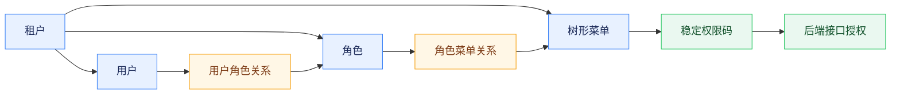
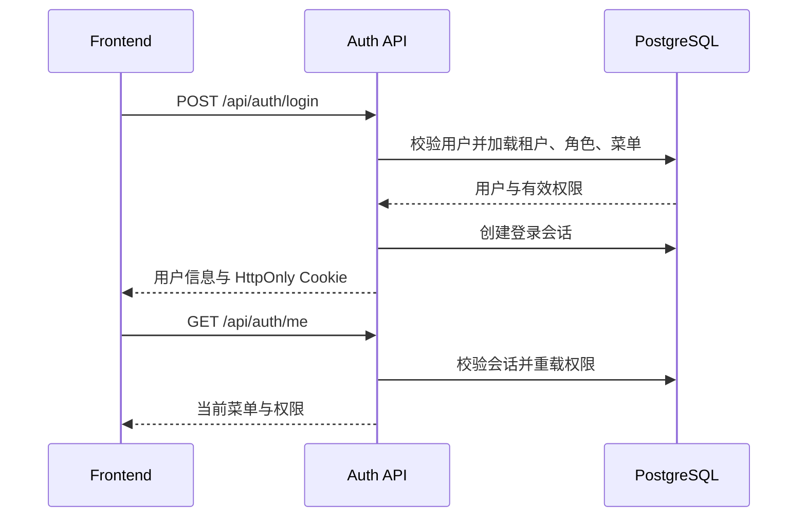

# 账号、认证与权限体系

## 设计目标

job-buddy 使用“租户、用户、角色、菜单、权限”组成的动态 RBAC 模型。租户是服务端数据隔离边界，但不作为普通用户的登录输入；用户使用全局唯一用户名和密码登录，后端从用户记录解析租户。授权判断以数据库中的角色和菜单关系为准，不依赖写死的 `admin` 或 `user` 角色名称。

规范基线创建共享租户、权限、角色、菜单目录，并通过受控身份种子迁移创建 `admin` 管理员和 `user` 普通用户及其角色关联。两个账号使用固定初始密码 `12345678`，Flyway 只保存 BCrypt 哈希，不创建会话或外部凭据；开发环境保留该首次登录能力，`JOB_BUDDY_ENVIRONMENT=prod` 或 `production` 时 Backend 启动会校验两个启用账号并拒绝未轮换的默认密码，同时拒绝 `JOB_BUDDY_AUTH_ENABLED=false`。已发布迁移保持不可变，密码仍通过用户管理能力重置。除该受控身份种子及其后续状态维护迁移外，其他用户及用户私有业务数据不得写入 Flyway。

## 数据模型与授权

`app_user` 保存用户及租户归属，`rbac_role` 保存租户内角色，`rbac_menu` 只保存与当前前端页面一致的目录、页面和外链菜单，`user_role` 与 `role_menu` 建立多对多关系，`permission_definition` 保存后端认可的稳定权限码。用户的有效菜单是其全部启用角色所授权、同时启用且可见的菜单并集；有效权限是这些菜单所关联权限码的去重集合。系统不保存用户直授权记录，避免角色菜单授权之外出现第二套权限来源。角色管理只提供树形菜单授权，不再创建或展示独立的功能权限节点。

当前菜单树包含智能引擎、求职画像、岗位收藏、求职进展、简历管理、项目深挖、练习中心和平台设置八个一级页面。平台设置是当前唯一包含二级菜单的页面，其子菜单固定对应用户管理、角色管理、菜单管理、运行参数、公司屏蔽、记忆管理和服务监控。父菜单和子菜单使用 `parent_id` 建立层级；选择子菜单时必须同时保留祖先节点，选择或取消父菜单时对子树执行级联更新。前端主侧栏只渲染根节点，平台设置内部导航只渲染当前用户实际获得的子节点，不能根据共享权限码推导出未授权页面。

菜单可以引用 `permission_definition` 中已有的权限码，但不能通过数据库配置创造新的后端执行能力。权限码是后端执行接口授权的内部映射，不作为角色管理中的第二套可配置授权项。所有 `/api/**` 端点先经过身份认证；管理能力和平台能力再由 `@RequirePermission` 与 `ApiAuthorizationInterceptor` 执行显式授权，使用 `users:manage`、`roles:manage`、`menus:manage` 和不可委派的 `platform:manage` 等权限码。用户自有的会话、分析任务和工作区接口以认证身份加“租户 + 用户 + 资源”所有权作为授权边界，不伪装成管理权限。Boss 直聘连接是所有已认证用户都具备的基础能力，不设置 `boss:use` 功能权限或对应菜单节点；相关业务数据仍按“租户 + 用户”隔离。练习中心页面包含题库维护、练习和考试的完整能力，不再用脱离页面的 `tenant:manage` 节点拆分操作。前端菜单隐藏和路由守卫只改善体验，不能替代服务端校验。

## 登录与会话

`POST /api/auth/login` 接收用户名和密码。认证成功后，Backend 创建数据库会话、签发随机访问令牌，并设置名为 `job_buddy_session` 的持久 Cookie，同时返回用户、租户、角色、权限和有序菜单。Cookie 默认有效期七天、路径为 `/`、使用 `HttpOnly` 和 `SameSite=Lax`，HTTPS 下启用 `Secure`。

浏览器工作台只使用 HttpOnly Cookie 作为凭据，不在 Web Storage、URL 或 JavaScript 状态中保存访问令牌；Bearer 仅保留给程序化 API 客户端。`sessionStorage` 只缓存非敏感展示信息。新标签页或浏览器重启后，由浏览器携带 Cookie 调用 `GET /api/auth/me` 恢复用户、角色、权限和菜单，后端会话始终是登录状态的权威来源。

认证拦截器支持 Authorization Bearer 和会话 Cookie；工作台、SSE 和同源文件访问统一使用 `credentials: include` 携带 Cookie。跨源部署必须配置明确 Origin 和凭据策略，不能使用通配 Origin 搭配凭据。Cookie 只承载随机会话令牌，不包含用户资料、权限或业务数据，也不延长服务端会话寿命。

`POST /api/auth/logout` 注销数据库会话并返回同名零有效期 Cookie。退出不以当前标签是否存在 Bearer 为前提；前端清理 Pinia 与 `sessionStorage` 后，通过同源 `BroadcastChannel` 发送不包含令牌、用户资料或权限的退出通知，其他标签同步进入登录页。

用户角色、角色菜单、角色或菜单启停发生变化后，服务端清理受影响用户的会话和短期缓存，使权限在重新登录后生效。任何用户、角色、菜单或授权变更都必须保留至少一个具备管理能力的启用用户，防止租户锁死自身。

动态 RBAC 采用权限委派上限。普通操作者只能把自己当前拥有且在权限目录中标记为可委派的能力授予角色或用户；不可委派权限不能由普通租户管理者新增。具备 `platform:manage` 的平台管理员可以显式委派自己拥有的受保护权限，因此可在用户管理中分配管理员角色，但仍不能修改自己的角色，也不能授予自己并不拥有的能力。修改受保护角色、给用户绑定角色、重置密码或替换既有角色时，还必须校验目标账号的有效权限不高于操作者，避免普通管理者接管平台控制主体。角色列表与可分配菜单同样按这一上限过滤，避免前端展示服务端最终会拒绝的目标。

## 管理能力与隔离边界

`/api/admin/users` 管理租户内用户、全局唯一用户名、状态、显示名、密码和角色；编辑用户名时继续由大小写不敏感的全局唯一索引校验，成功后立即失效该用户的既有会话。`/api/admin/rbac/roles` 管理角色的树形菜单授权；`/api/admin/rbac/menus` 管理菜单树、组件键、路由、外链、排序、启停与后端权限码映射。菜单类型仅允许目录、页面和外链，不允许新增脱离页面的操作权限节点。被用户引用的角色、含子节点或被角色引用的菜单不能直接删除，菜单不能形成父子循环。

所有管理查询从认证上下文取得 `tenant_id` 和操作者身份，管理员只能维护本租户且位于自身委派上限内的账号与授权元数据，不能因此读取其他用户的简历、聊天、岗位、练习、项目、Boss 凭据或工作区状态。业务资源进一步按“租户 + 用户 + 资源”校验所有权。平台全局设置不是租户资源，只允许不可委派的平台控制主体访问。前端侧边栏使用 `/api/auth/me` 返回的菜单动态渲染，受控 `component_key` 只能映射到构建时注册的 Vue 组件，数据库内容不能注入可执行代码。

## 登录防护与内部服务鉴权

公开登录在 BCrypt 校验前执行按规范化账号和网络来源划分的原子失败预算，并使用进程级信号量限制同时进行的密码哈希运算。失败预算固定为 300 秒窗口内单账号最多 8 次、单来源最多 60 次，同时最多执行 8 个密码哈希。生产环境使用 Redis 作为跨实例计数边界，Redis 暂时不可用时使用有界本地后备；不存在账号和错误密码使用一致的哈希与失败响应。命中预算返回 HTTP 429，凭据错误返回 HTTP 401，成功登录清理账号失败状态。

Backend 调用 Runtime、Intent、Memory、Tool、Eval 和 Sandbox 时使用 `X-Internal-Service-Token`。生产环境由 `AGENT_INTERNAL_SERVICE_TOKEN` 提供共享密钥；健康检查保持匿名，其他内部 API 未携带正确令牌时返回 401。服务令牌只证明调用方服务身份，不能替代 tenant、user、operator 业务作用域，各服务仍必须验证并传播属主信息。

## 验证与风险

认证与授权测试应覆盖 Cookie 属性、Bearer API 客户端、跨标签恢复与退出、默认账号及角色关联、默认普通角色最小权限、默认密码登录、创建与编辑时的全局用户名唯一性、多角色权限并集、树形菜单父子级联、平台设置子菜单与实际页面一致、Boss 能力无需独立授权、平台管理员角色委派、普通管理者委派上限、受保护账号密码重置、权限变化后的会话失效、菜单循环和引用保护、最后管理账号保护、跨租户隔离、登录失败预算、内部服务令牌和无权限接口拒绝。前端需验证登录恢复、动态侧边栏、按授权呈现的平台设置、用户/角色/菜单管理和无权限路由。公开部署必须启用 HTTPS、安全 Cookie、强密码策略、登录失败预算和审计，并在首次登录后立即轮换默认密码；RBAC 只解决授权，不替代 CSRF、限流和凭据轮换。
