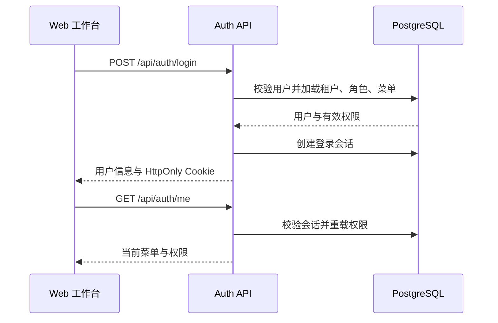

# 账号、认证与权限体系

## 设计目标

- job-buddy 使用“租户、用户、角色、菜单、权限”组成的动态 RBAC。
- 租户是服务端隔离边界，不作为普通用户的登录输入；
- 用户以全局唯一用户名和密码登录，Backend 从账号记录解析租户。
- 授权以数据库中的角色—菜单关系为准，不依赖写死的角色名称。

- 规范基线创建共享租户、权限、角色和菜单目录，并通过受控身份种子创建 `admin` 与 `user` 及其角色关联。
- 两个账号的初始密码均为 `12345678`，迁移只保存 BCrypt 哈希，不创建会话或外部凭据。
- 生产环境会拒绝未轮换的默认密码和 `JOB_BUDDY_AUTH_ENABLED=false`；
- 密码变更必须通过用户管理接口，已发布迁移保持不可变。
- 除受控默认身份外，用户私有数据不得进入 Flyway。

## 数据模型与授权

| 数据对象                 | 职责                                                       |
| ------------------------ | ---------------------------------------------------------- |
| `app_user`               | 保存用户与租户归属                                         |
| `rbac_role`              | 保存租户内角色                                             |
| `rbac_menu`              | 保存与前端一致的目录、页面和外链，以及后端认可的稳定权限码 |
| `user_role`、`role_menu` | 建立用户—角色—菜单关系                                     |
| `permission_definition`  | 定义 Backend 可执行的权限码及委派属性                      |

用户的有效菜单是全部启用角色所授权且启用、可见的菜单并集，有效权限是这些菜单关联权限码的去重集合。系统不保存用户直授权，角色管理也不展示第二套功能权限树。

- 当前根菜单为智能引擎、求职画像、岗位收藏、求职进展、简历管理、项目深挖、练习中心和平台设置。
- 平台设置下设用户、角色、菜单、运行参数、公司屏蔽、记忆和服务监控。
- 菜单通过 `parent_id` 建树：选择子节点必须保留祖先，变更父节点对子树级联；
- 主侧栏只渲染根节点，设置页只渲染用户实际获得的子节点。

下图描述一次授权解析链；用户、角色、菜单和两张关系表均受同一 `tenant_id` 约束。

```mermaid
graph LR
    T[租户] --> U[用户]
    U --> UR[用户角色关系]
    UR --> R[角色]
    R --> RM[角色菜单关系]
    RM --> M[树形菜单]
    M --> P[稳定权限码]
    P --> API[后端接口授权]

    classDef subject fill:#EAF1F8,stroke:#5B7FA3,color:#213A52,stroke-width:1.5px;
    classDef relation fill:#F0EEF6,stroke:#746A91,color:#403957,stroke-width:1.5px;
    classDef guard fill:#EAF4F1,stroke:#548678,color:#294F47,stroke-width:1.5px;
    class T,U,R,M subject;
    class UR,RM relation;
    class P,API guard;
```

- 菜单只能引用 `permission_definition` 中已存在的权限码，不能通过数据库创造 Backend 能力。
- 除健康检查和登录入口外，`/api/**` 先认证，管理与平台接口再由 `@RequirePermission` 和 `ApiAuthorizationInterceptor` 校验，例如 `users:manage`、`roles:manage`、`menus:manage` 和不可委派的 `platform:manage`。
- 用户自有资源按“租户 + 用户 + 资源”校验所有权；
- Boss 连接属于所有已认证用户的基础能力，不设置 `boss:use`；
- 练习中心按页面统一授权。
- 前端菜单和路由守卫只改善体验，不能替代服务端校验。

## 登录与会话

- `POST /api/auth/login` 接收用户名和密码。
- 成功后 Backend 创建数据库会话、签发随机令牌，并设置 `job_buddy_session` 持久 Cookie，同时返回用户、租户、角色、权限和有序菜单。
- Cookie 默认七天有效，路径为 `/`，使用 `HttpOnly` 与 `SameSite=Lax`，HTTPS 下启用 `Secure`。

- 浏览器只使用 HttpOnly Cookie，不把令牌保存到 Web Storage、URL 或 JavaScript 状态；
- Bearer 只供程序化客户端，`sessionStorage` 仅缓存非敏感展示信息。
- 新标签页或浏览器重启后通过 `GET /api/auth/me` 恢复身份和菜单，Backend 会话始终是权威来源。

```mermaid
sequenceDiagram
    participant FE as Web 工作台
    participant AU as Auth API
    participant DB as PostgreSQL

    FE->>AU: POST /api/auth/login
    AU->>DB: 校验用户并加载租户、角色、菜单
    DB-->>AU: 用户与有效权限
    AU->>DB: 创建登录会话
    AU-->>FE: 用户信息与 HttpOnly Cookie
    FE->>AU: GET /api/auth/me
    AU->>DB: 校验会话并重载权限
    AU-->>FE: 当前菜单与权限
```

- 认证拦截器同时支持 Bearer 与会话 Cookie。
- 工作台、SSE 和同源文件访问使用 `credentials: include`；
- 跨源部署必须声明明确 Origin，不能把通配 Origin 与凭据混用。
- Cookie 只保存随机令牌，不包含用户资料、权限或业务数据，也不延长服务端会话寿命。

- `POST /api/auth/logout` 注销数据库会话并清除 Cookie。
- 前端随后清理 Pinia 与 `sessionStorage`，再通过同源 `BroadcastChannel` 发送不含敏感信息的退出通知，使其他标签同步返回登录页。

- 用户角色、角色菜单、角色或菜单启停发生变化后，服务端只清理受影响用户的短期授权缓存，保留尚未过期的数据库会话；
- 下一次请求从数据库重建角色、权限与菜单，前端管理操作成功后同步刷新 `/api/auth/me`，使导航和授权立即生效且不要求重新登录。
- 账号停用、密码修改等身份安全变更仍须撤销该用户的全部会话。
- 任何用户、角色、菜单或授权变更都必须保留至少一个具备管理能力的启用用户，防止租户锁死自身。

- 动态 RBAC 采用委派上限：普通操作者只能授予自己拥有且标记为可委派的能力；
- `platform:manage` 主体可以委派自己拥有的受保护权限，但不能修改自己的角色或授予自身不具备的能力。
- 修改受保护角色、绑定角色或替换角色时，目标账号的有效权限不能高于操作者；
- 角色列表和可分配菜单也按同一上限过滤。
- 密码修改不受目标账号权限级别限制，具备 `users:manage` 的操作者在正确输入目标账号旧密码后，可以修改当前租户内任意账号（包括自己）的密码，修改后撤销目标账号的全部登录会话。

## 管理能力与隔离边界

- `/api/admin/users` 管理本租户用户、状态、显示名、密码和角色；
- 用户名由大小写不敏感的全局唯一索引约束，修改后立即失效该用户会话。
- `/api/admin/rbac/roles` 管理树形菜单授权，`/api/admin/rbac/menus` 管理目录、页面或外链的组件键、路由、排序、启停和权限码映射。
- 被引用的角色、含子节点或被角色引用的菜单不能直接删除，菜单不能形成循环。

- 管理接口从认证上下文取得租户与操作者，只能维护本租户且不超过委派上限的授权元数据，不能借此读取其他用户业务数据。
- 用户密码修改仍严格限制在当前租户，必须校验目标账号旧密码，但不受角色或权限层级限制。
- 平台全局设置只允许不可委派的平台控制主体访问。
- 前端使用 `/api/auth/me` 的菜单动态渲染，`component_key` 只能映射构建时注册的 Vue 组件，数据库内容不能注入代码。

## 登录防护与内部服务鉴权

- 公开登录在 BCrypt 前执行按规范化账号和网络来源划分的原子失败预算，并用进程级信号量限制并发哈希。
- 固定边界为 300 秒内单账号 8 次、单来源 60 次，最多同时执行 8 个哈希；
- 生产环境使用 Redis 跨实例计数，Redis 不可用时使用有界本地后备。
- 不存在账号和错误密码使用一致的哈希与响应，超预算返回 429，凭据错误返回 401，成功后清理账号失败状态。

- Python 内部服务通过 `AGENT_INTERNAL_SERVICE_TOKEN` 校验 `X-Internal-Service-Token`，健康检查保持匿名，其他接口无正确令牌时返回 401。
- 服务令牌只证明调用方身份，不能替代 tenant、user、operator 作用域，各服务仍须验证和传播属主信息。

## 验证与风险

- 自动化验证应覆盖 Cookie 与 Bearer、跨标签恢复和退出、默认身份、全局用户名唯一性、多角色并集、菜单级联、设置页子菜单、Boss 基础能力、两级委派上限、受保护账号、当前租户内任意账号的旧密码校验与密码修改、身份安全变更后的会话失效、授权变更后的缓存刷新与会话保留、循环与引用保护、最后管理账号、跨租户隔离、登录失败预算、内部服务令牌和无权限拒绝。
- 前端还需验证登录恢复、动态侧栏、设置页授权和用户/角色/菜单管理，尤其确认菜单保存后当前页面导航立即更新且不出现登录过期提示。

公开部署必须启用 HTTPS、安全 Cookie、强密码策略、登录失败预算和审计，并在首次登录后立即轮换默认密码。RBAC 只解决授权，不替代 CSRF、限流与凭据轮换。
