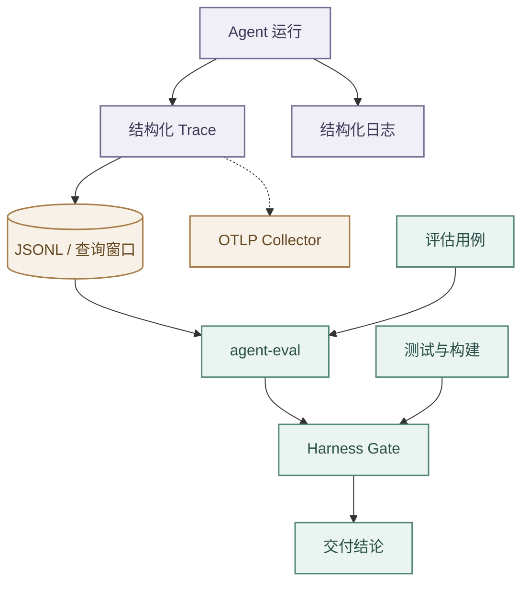

# Trace 可观测与质量评估

## Trace 与日志

- Runtime 用结构化 Trace 记录运行、理解、路由、计划、工具、模型用量、上下文压缩和终态。
- `task_understanding` 事件在顶层记录实测 `duration_ms`，结果元数据记录 `strategy` 与 `model_called`；Backend 日志分别记录 Intent 预判、会话目录装配、Runtime HTTP 调用和任务理解总耗时。
- `understanding_only` 性能评估必须调用生产使用的非流式 `POST /v1/agent/runs`，解析统一响应 envelope，并同时校验终态成功、路由正确和 `llm_calls=0`；不得用流式接口的事件终态替代该链路。
- JSONL 是本地回放与规则评估的数据源，内存窗口支持实时查询。
- 事件只追加扩展，payload 写入前限制深度和长度；
- 上下文只记录 section 与计数，不保存正文、密钥、完整凭据或非必要个人信息。
- 代码执行的候选源码、stdout 和 stderr 只作为鉴权聊天会话中的有界执行详情展示，不写入 Runtime Trace；Trace 仅记录工具名称、状态、时延、退出证据摘要和错误分类。
- JSONL 目录与文件仅属主可访问。

- FastAPI 中间件生成或透传 `X-Request-Id`，并通过上下文变量把 request、run、session 和 trace 标识注入 Loguru，再跨服务传播。
- `X-Request-Id` 只用于请求关联，不等同于 W3C TraceContext。

## OpenTelemetry

- OTelExporter 可把 TraceEvent 映射为 OTLP/HTTP Span，并异步发送到 `/v1/traces`。
- 该能力默认关闭且不重试；
- Collector 不可用只记录警告，不阻断 JSONL 或业务链路。
- 关键审计不能只依赖异步旁路，因为进程强制退出可能丢失尾部事件。

## Eval 与 Harness

agent-eval 提供 `/v1/eval/trace`、`/v1/eval/run`、`/v1/eval/capabilities`、`/v1/eval/latency` 和 `/v1/eval/judge`。

- 规则评分器检查必要事件、终态、工具错误结构、证据和模型用量；
- Judge 提供可选开放质量评审，未配置或失败不得视为通过。
- Backend 可以调用 Eval，但常规对话不能把它作为无降级的同步前置依赖。

`.agent-harness/scripts/verify.sh` 负责测试和构建，`evaluate.sh` 负责行为评估，`gate.sh` 组合两者形成交付门禁。

- `evaluate.sh` 同时运行评分器自检和真实 Runtime 代码契约，覆盖终态 Trace、Token 预算、Checkpoint 脱敏、高风险工具复核与受校验 Hint 快路径，避免把构造样例当作 Runtime 证据。
- 规则评分以结构化 `status`、`stop_reason`、终态 Trace 和错误字段判断运行成败，不以回答正文中的“失败”“错误”或“超时”等裸子串推断终态；
- Live Eval 的 Planner 类用例除通用事件外还必须出现 `tool_search` 与 `plan_created`，缺失时过程评分不得通过。
- Gate 摘要记录 Git 状态、依赖清单摘要、运行环境与资源信息；真实模型、浏览器、容器启动和远程 CI 仍需独立证据，不能由确定性 Gate 代替。
- Trace、SSE、意图、工具或输出契约变化时，必须同步检查评分器、用例和 Harness。

## 鉴权、降级与验证

- 内部 Python 接口通过 `AGENT_INTERNAL_SERVICE_TOKEN` 校验 `X-Internal-Service-Token`；
- production/prod 必须配置，缺失会阻止 Runtime 启动，本地开发可留空。
- 配置后 Backend 的普通 HTTP 与 Runtime SSE 都发送该请求头，健康检查以外的接口拒绝匿名访问。
- Collector、Eval 或日志下游故障不能覆盖原业务错误，也不能让连接失去终态。

测试应覆盖 JSONL 持久化和重载、OTel 开关与失败降级、字段映射、LLM usage、请求关联、内部鉴权，以及 grader 对成功和异常运行的判断。
