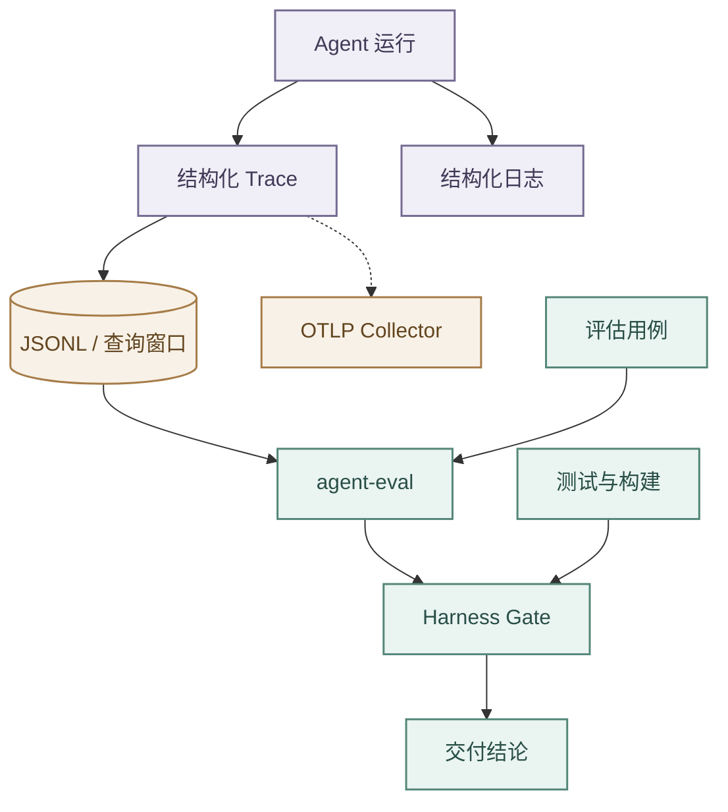

# Trace 可观测与质量评估

## Trace 与日志

- Runtime 用结构化 Trace 记录运行、理解、路由、计划、工具、模型用量、上下文压缩和终态。
- `task_understanding` 事件在顶层记录实测 `duration_ms`，结果元数据记录 `strategy` 与 `model_called`；Backend 日志分别记录 Intent 预判、会话目录装配、Runtime HTTP 调用和任务理解总耗时。
- `understanding_only` 性能评估必须调用生产使用的非流式 `POST /v1/agent/runs`，解析统一响应 envelope，并同时校验终态成功、路由正确和 `llm_calls=0`；不得用流式接口的事件终态替代该链路。
- JSONL 是本地回放与规则评估的数据源，内存窗口支持实时查询。
- 事件只追加扩展，payload 写入前限制深度和长度；
- 上下文只记录 section 与计数，不保存正文、密钥、完整凭据或非必要个人信息。
- 代码执行的候选源码、stdout 和 stderr 只作为鉴权聊天会话中的有界执行详情展示，不写入 Runtime Trace；Trace 仅记录工具名称、状态、时延、退出证据摘要和错误分类。
- JSONL 目录与文件仅属主可访问。

- FastAPI 中间件生成或透传 `X-Request-Id`，并通过上下文变量把 request、run、session 和 trace 标识注入 Loguru，再跨服务传播。
- `X-Request-Id` 只用于请求关联，不等同于 W3C TraceContext。

## OpenTelemetry

- OTelExporter 可把 TraceEvent 映射为 OTLP/HTTP Span，并异步发送到 `/v1/traces`。
- 该能力默认关闭且不重试；
- Collector 不可用只记录警告，不阻断 JSONL 或业务链路。
- 关键审计不能只依赖异步旁路，因为进程强制退出可能丢失尾部事件。

## Eval 与 Harness

agent-eval 提供 `/v1/eval/trace`、`/v1/eval/run`、`/v1/eval/capabilities`、`/v1/eval/latency` 和 `/v1/eval/judge`。

- 规则评分器检查必要事件、终态、工具错误结构、证据和模型用量；
- Judge 提供可选开放质量评审，未配置或失败不得视为通过。
- Backend 可以调用 Eval，但常规对话不能把它作为无降级的同步前置依赖。

`.agent-harness/scripts/verify.sh` 负责测试和构建，`evaluate.sh` 负责行为评估，`gate.sh` 组合两者形成交付门禁。

- `evaluate.sh` 同时运行评分器自检和真实 Runtime 代码契约，覆盖终态 Trace、Token 预算、Checkpoint 脱敏、高风险工具复核与受校验 Hint 快路径，避免把构造样例当作 Runtime 证据。
- 规则评分以结构化 `status`、`stop_reason`、终态 Trace 和错误字段判断运行成败，不以回答正文中的“失败”“错误”或“超时”等裸子串推断终态；
- Live Eval 的 Planner 类用例除通用事件外还必须出现 `tool_search` 与 `plan_created`，缺失时过程评分不得通过。
- Gate 摘要记录 Git 状态、依赖清单摘要、运行环境与资源信息；真实模型、浏览器、容器启动和远程 CI 仍需独立证据，不能由确定性 Gate 代替。
- Trace、SSE、意图、工具或输出契约变化时，必须同步检查评分器、用例和 Harness。

```mermaid
graph TD
    RUN[Agent 运行] --> TRACE[结构化 Trace]
    RUN --> LOG[结构化日志]
    TRACE --> JSONL[("JSONL / 查询窗口")]
    TRACE -.-> OTEL[OTLP Collector]
    JSONL --> EVAL[agent-eval]
    CASES[评估用例] --> EVAL
    EVAL --> GATE[Harness Gate]
    TESTS[测试与构建] --> GATE
    GATE --> RESULT[交付结论]

    classDef runtime fill:#F0EEF6,stroke:#746A91,color:#403957,stroke-width:1.5px;
    classDef quality fill:#EAF4F1,stroke:#548678,color:#294F47,stroke-width:1.5px;
    classDef store fill:#F8F1E7,stroke:#A67C48,color:#62451F,stroke-width:1.5px;
    class RUN,TRACE,LOG runtime;
    class EVAL,GATE,RESULT,CASES,TESTS quality;
    class JSONL,OTEL store;
```

## 鉴权、降级与验证

- 内部 Python 接口通过 `AGENT_INTERNAL_SERVICE_TOKEN` 校验 `X-Internal-Service-Token`；
- production/prod 必须配置，缺失会阻止 Runtime 启动，本地开发可留空。
- 配置后 Backend 的普通 HTTP 与 Runtime SSE 都发送该请求头，健康检查以外的接口拒绝匿名访问。
- Collector、Eval 或日志下游故障不能覆盖原业务错误，也不能让连接失去终态。

测试应覆盖 JSONL 持久化和重载、OTel 开关与失败降级、字段映射、LLM usage、请求关联、内部鉴权，以及 grader 对成功和异常运行的判断。

## 评估分层与样本契约

评估分为评分器校准、Runtime 真实回归、人工开放质量复核三层。校准样本是明确标记的合成输入，只用于验证评分器能否识别已知好坏结果；不得计入产品通过率。Runtime 用例通过生产 HTTP/SSE 入口执行，覆盖路由、上下文、工具执行证据、安全边界和输出约束。Backend 业务规格 `business-job.yaml` 不作为 Runtime 可执行用例，业务事务与浏览器结果需要独立验收。

可执行用例必须包含唯一 ID、类别、输入和非空期望，未知断言拒绝加载。Runtime 事件断言只使用 Runtime SSE 名称，不能使用 Backend 的 intent/message 等事件。前置条件由运行人员通过命令行显式声明满足，未满足时记录跳过原因；跳过与未选中均不计为通过。空选集、未知 ID、非法重复次数均以非零退出码失败。默认禁止真实 Boss 请求，显式开启时只允许单次采样，遇到异常立即停止后续请求。

规则以结构化终态、实际工具执行、工具输出和附件事实作为主要证据。拒绝不能通过正文中的“无法”一词推断；提到 Boss 也不等于调用 Boss。输出逐字约束只用于格式化和确定性结果，开放答案采用带任务、证据和评分标准的可选 Judge；Judge 不可用时启用 Judge 的评估失败关闭，且其结论不能覆盖规则失败。

## 统计、报告与验收

每例保留全部尝试及失败原因，汇总经验 pass@1（成功次数 / 总次数）、观测 pass@k（至少一次成功）、观测 pass^k（所有尝试成功），并明确 k 为该例采样次数，不把一次成功称为稳定性证据。报告同时给出 Wilson 95% 区间、最近秩 p95 时延、分类覆盖及所有失败尝试。小样本区间和 p95 只能作诊断，不能代替生产 SLO。重复运行仅在相同配置、独立会话下可比较；显式 session_id 的用例反映会话内重复。

报告元数据记录评估代码 Git SHA 与脏状态、用例及依赖锁摘要、Python 版本、Runtime 地址与操作人员提供的部署/模型标签。不能从评估端 Git 推断远端部署版本；未知标签必须如实保留。报告使用唯一文件名避免覆盖，结果包含答案和工具证据，作为含敏感内容的本地产物管理。

验收包括用例加载校验、正反评分校准、runner 断言与统计回归、服务接口测试及 Harness Gate。离线 Gate 成功只证明评分与契约实现通过，真实模型效果和 Judge 人工一致性仍须通过独立运行与复核确认。

## 统一用例目录契约

`agent-eval/cases/` 中的数据集统一使用 YAML 和 `schema_version: 1`。套件固定包含 `id/name/description/kind/defaults/fixtures/contracts/cases`；单例固定包含 `id/category/description/input/expected`，执行约束放在 `options`，开放质量标准放在 `rubric`。输入与期望始终为对象，禁止以文件格式区分执行语义。

`kind` 明确区分 `runtime`（真实请求）、`calibration`（合成结果校准）、`business`（待人工或业务端验收的规格）和 `memory`（真实记忆引擎基线）。公共加载器校验结构、唯一 ID、适用字段、预算与引用；Runtime runner 只执行 runtime 类型，校准测试只执行 calibration 类型，Memory runner 读取 memory 类型。业务规格通过格式门禁不代表业务已验证。

Runtime 输入使用 `input.message`，历史和注入数据放在 `input.messages/metadata`；校准输入使用 `input.run_overrides`，期望使用 `expected.passed/checks`；记忆检索使用 `input.operation/query` 与 `expected.ids`，更新使用 `input.fact_id/content/query` 与 `expected.content/previous_content_absent`。共享数据置于 fixtures，默认预算与门槛置于 defaults，协议说明置于 contracts。字段含义由 kind 决定，不能把一种类型的输入默默当作另一种执行。

全目录校验自动发现 YAML 文件，拒绝旧 JSON、重复 YAML 键、空用例、重复 ID、未知字段与错误类型。覆盖清单按套件类型与类别输出；回归新增重点包括联网许可正反边界、附件及多轮隔离、权限与预算终止、Checkpoint 恢复血缘、证据评分，以及业务登录失效、筛选边界与缺失数据。正反样本配对验证规则，失败标签不能由待测评分器生成。
