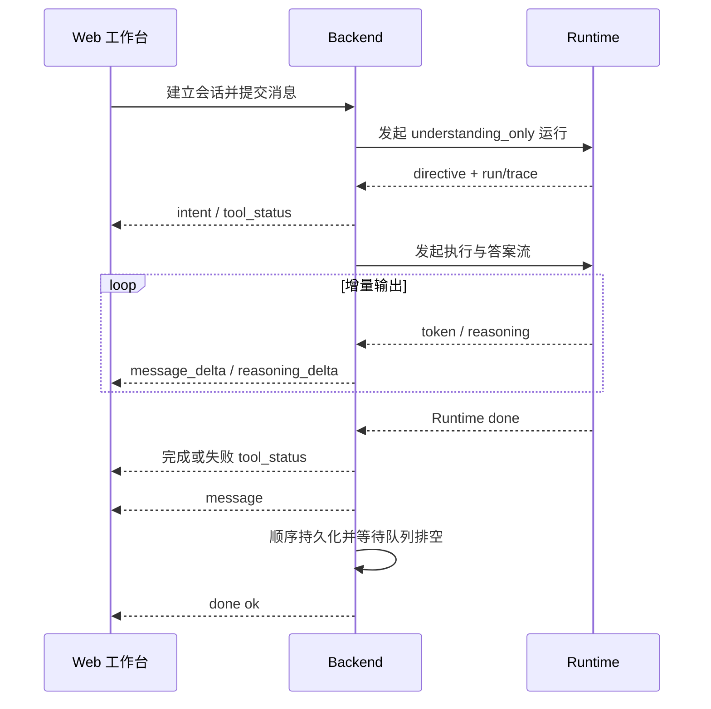

# 对话流式输出与状态恢复

## 前端单流与后端两阶段路由

浏览器始终只建立一条 SSE，Backend 与 Runtime 内部采用两阶段编排。前端向 `POST /api/chat/stream` 提交消息和结构化上下文；Backend 完成鉴权、会话与 Intent 预分类后，先用 Runtime 的非流式 `understanding_only` 请求取得 directive，再接管确定性业务动作，或发起第二次 Runtime 流。Backend 生成业务与工具生命周期事件，并把 Runtime 的 `token`、`reasoning` 翻译为浏览器侧的答案与推理增量。

两次 run 共享 `session_id`，通过 `upstream_run_id` 和 `upstream_trace_id` 关联，第二阶段不复制第一阶段完整响应。`selectedJob` 和“换一批”等结构化操作直接进入对应处理器，避免重复分类。Backend 持久化业务数据和最终消息，Runtime 负责智能执行，二者不能同时生成同一答案。

## SSE 契约

| 事件组     | 事件与语义                                                                                      |
| ---------- | ----------------------------------------------------------------------------------------------- |
| 会话与路由 | `session`、`intent_precheck`、`intent`；directive 只在 Backend 内部使用，其摘要通过现有事件呈现 |
| 过程       | `tool_status`、`reasoning_delta`、`message_delta`、`heartbeat`                                  |
| 结构化结果 | `job_cards`、`resume_match`、`auth_required`                                                    |
| 终态       | `message` 校正最终答案，`error` 表达失败，`done` 只携带 `ok` 并表示消息与状态已完成落库         |

Trace、终止原因、指标和持久化元数据保存在消息、工具事件与会话状态中，不重复塞入 `done`。

事件只能追加扩展，前端必须忽略未知事件；Backend 不得为聚合全文阻塞增量转发。SSE 启动后不能再写普通 JSON，成功、拒绝、中断和错误都要发送明确终态并释放资源。

`stream-read-timeout` 约束单次 Runtime 读取，`stream-session-timeout` 约束浏览器整轮会话，后者默认 15 分钟。Backend 取二者较大值，并预留 10 秒发送终态，避免多批评分被提前截断。心跳不延长硬期限；到期、断开或发送失败时必须取消相关任务并释放并发租约。

声明 `required_tools` 的任务进入状态图，无工具生成任务可走 direct synthesis。两条路径共享有限 Token 预算、明确的 `run_end` 状态和相同安全终态，不能把失败、预算耗尽或待确认合成为成功答案。

## 前端并发与恢复

每个在途 SSE 按 `sessionId` 独立维护控制器、请求状态和事件归属。切换或新建会话不会取消后台会话；只有主动停止、删除、刷新或关闭页面才断开相应请求。Broken pipe 属于连接生命周期事件，Backend 应停止关联任务、清理 emitter 并降低日志噪声。

用户消息应在进入模型和外部工具前进入顺序持久化流程。

前端为每次用户动作生成稳定 `turnId`；同一次认证续跑、网络重试或恢复必须复用，相同文本的新主动提问则生成新 ID。Backend 以租户、用户、会话、角色和 `turnId` 做幂等，相同 ID 只落库一次。历史接口返回消息 ID 与 `turnId`，前端据此合并乐观消息；只有旧数据中连续、同角色、同内容且中间没有助手回复的未完成行可以兼容折叠，不能按文本永久去重。

会话保存最终答案、reasoning、tool events、岗位卡片或 `selectedJob`、上下文来源、Trace 与终止原因。岗位搜索进入登录引导前先保存槽位和当前轮次，以便扫码后续跑。历史读取与异步落库竞争时，空结果不能覆盖非空快照；缺少新过程字段的旧记录可以降级展示。

## 异步分析任务

简历和收藏岗位分析使用独立的持久化后台任务。提交接口立即返回 `taskId`，前端通过 `/api/analysis-tasks/{taskId}/stream` 订阅 `snapshot`、`progress`、`partial_result`、`result`、`cancelled`、`error`、`done` 和 `heartbeat`。关闭弹窗或断流只停止观察；显式取消调用 `POST /api/analysis-tasks/{taskId}/cancel`，中断后台执行并禁止写入最终结果。重新进入页面时通过最近任务接口恢复状态与部分结果。

## 风险与验证

验证重点是事件乱序、双终态、断流后的任务泄漏、答案重复、重复用户轮次、快照回退和消息未落库。自动化测试覆盖 Runtime 事件序列、Backend 分流与中继、同一 `turnId` 并发提交、认证续跑、异常收尾和前端恢复；用户可见改动还必须用真实浏览器验证开放域问答、业务动作、工具问答、扫码续跑单气泡、会话切换、主动中断和错误提示。
