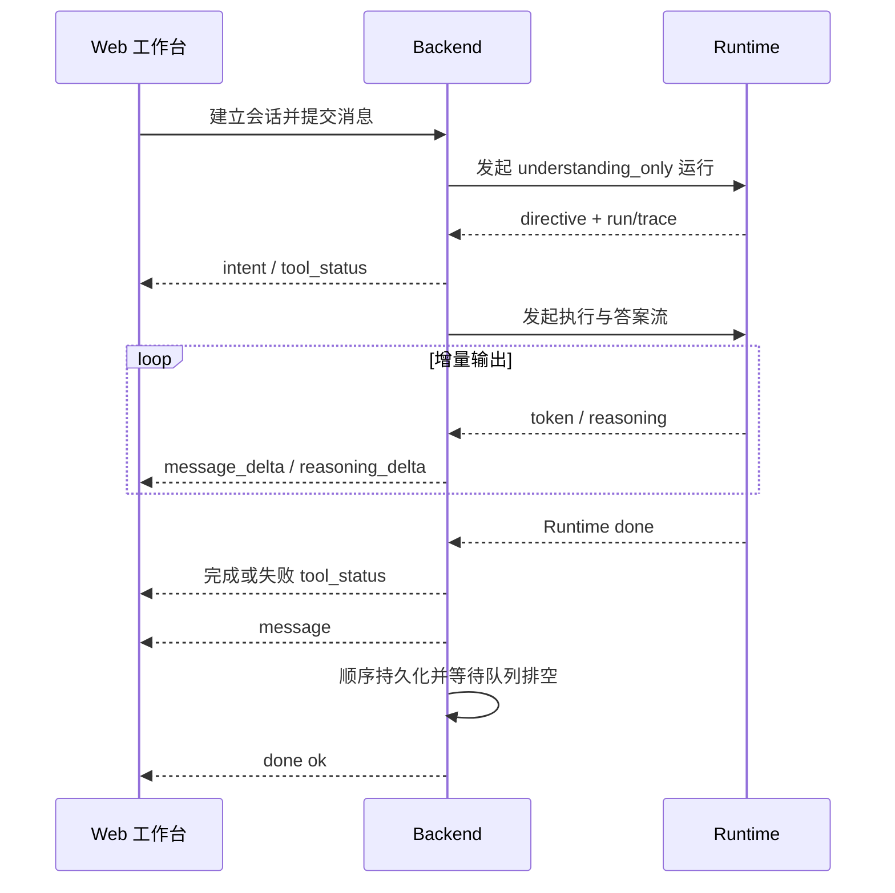

# 对话流式输出与状态恢复

## 前端单流与后端两阶段路由

- 浏览器始终只建立一条 SSE，Backend 与 Runtime 内部采用两阶段编排。
- 前端向 `POST /api/chat/stream` 提交消息和结构化上下文；
- Backend 完成鉴权、会话与 Intent 预分类后，先用 Runtime 的非流式 `understanding_only` 请求取得 directive，再接管确定性业务动作，或发起第二次 Runtime 流。
- Backend 生成业务与工具生命周期事件，并把 Runtime 的 `token`、`reasoning` 翻译为浏览器侧的答案与推理增量。

- 两次 run 共享 `session_id`，通过 `upstream_run_id` 和 `upstream_trace_id` 关联，第二阶段不复制第一阶段完整响应。
- 第二阶段携带第一阶段生成的完整任务理解对象时，Runtime 必须先做结构校验、Profile 校验和能力契约一致性校验；校验通过后复用该对象，避免再次调用任务理解模型。字段缺失、Profile 不存在或契约不一致时回退到正常任务理解，不能用性能快路径绕过澄清、安全或工具权限。
- `selectedJob` 直接进入对应处理器；“换一批”在消息层是新的用户轮次，必须追加用户消息和独立助手消息，旧批次助手消息不被覆盖。
- “换一批”在执行层复用上一轮检索条件、候选池和消费游标，并短路重复分类与任务理解；若本轮失败，失败说明写入新的助手轮次，旧岗位消息保持可见。
- Backend 持久化业务数据和最终消息，Runtime 负责智能执行，二者不能同时生成同一答案。

## SSE 契约

| 事件组     | 事件与语义                                                                                      |
| ---------- | ----------------------------------------------------------------------------------------------- |
| 会话与路由 | `session`、`intent_precheck`、`intent`；directive 只在 Backend 内部使用，其摘要通过现有事件呈现 |
| 过程       | `tool_status`、`reasoning_delta`、`message_delta`、`heartbeat`                                  |
| 结构化结果 | `job_cards`、`resume_match`、`auth_required`                                                    |
| 终态       | `message` 校正最终答案，`error` 表达失败，`done` 只携带 `ok` 并表示消息与状态已完成落库         |

Trace、终止原因、指标和持久化元数据保存在消息、工具事件与会话状态中，不重复塞入 `done`。

事件只能追加扩展，前端必须忽略未知事件；Backend 不得为聚合全文阻塞增量转发。请求参数在 SSE 建立前校验，校验失败固定返回 HTTP 400、`application/json` 和统一 `ApiResponse` 错误信封，即使客户端只声明接受 `text/event-stream` 也不进入流式生命周期。SSE 启动后不能再写普通 JSON，成功、拒绝、中断和错误都要发送明确终态并释放资源。

- `stream-read-timeout` 约束单次 Runtime 读取，`stream-session-timeout` 约束浏览器整轮会话，后者默认 15 分钟。
- Backend 取二者较大值，并预留 10 秒发送终态，避免多批评分被提前截断。
- 心跳不延长硬期限；
- 到期、断开或发送失败时必须取消相关任务并释放并发租约。

- 声明 `required_tools` 的任务进入状态图，无工具生成任务可走 direct synthesis。
- 复用上游任务理解只消除重复分类；声明 `required_tools` 的任务仍进入完整状态图，继续执行 Planner、工具权限、证据校验和失败终态。Boss 工具保持单请求串行、零自动重试与人工低频验证，禁止为降低延迟并发翻页或自动重放请求。
- 当当前计划的所有工具步骤已成功或跳过时，Reflect 直接进入 Finalize，不再为同一个已满足的单步任务重复 Tool Search 和 Planner；仍有待执行依赖步骤时才允许重规划。
- 工具观察只是 Runtime 内部证据，流式和非流式成功终态都必须经过答案合成后再返回用户，禁止将 `工具 ... 执行成功` 和原始结果字典当作用户答案。流式合成未产出文本时只能在已有工具证据上重试一次合成，不得重新执行工具。
- Backend 已注入非空 `personal_context.long_term_memory` 时，Runtime 不再对同一轮重复检索 Memory；没有可用上游记忆时仍按租户与操作者作用域检索并保持失败降级。
- 两条路径共享有限 Token 预算、明确的 `run_end` 状态和相同安全终态，不能把失败、预算耗尽或待确认合成为成功答案。

## 前端并发与恢复

- 每个在途 SSE 按 `sessionId` 独立维护控制器、请求状态和事件归属。
- 每个用户轮次的工具事件只能写入本轮请求缓冲和对应助手消息。过程面板的步骤、计数、当前运行项和耗时都从所属助手消息读取；新轮次开始后，已完成轮次保持只读，不得被会话级全局投影、迟到的历史同步或后续 `tool_status` 重新计数和重绘。
- 历史同步返回时若同一会话已有新请求在途，只缓存服务端结果，不投影到当前流式状态；新请求终态后再执行权威校准。
- 切换或新建会话不会取消后台会话；
- 岗位卡片的“分析中”状态必须同时匹配当前 `sessionId` 与当前请求的 `selectedJobKey`；其他会话的后台请求、当前会话的普通问答或其他岗位分析都不能污染该按钮文案。
- 只有主动停止、删除、刷新或关闭页面才断开相应请求。
- Broken pipe 属于连接生命周期事件，Backend 应停止关联任务、清理 emitter 并降低日志噪声。

用户消息应在进入模型和外部工具前进入顺序持久化流程。

- 前端为每次用户动作生成稳定 `turnId`；
- 同一次认证续跑、网络重试或恢复必须复用，相同文本的新主动提问则生成新 ID。
- Backend 以租户、用户、会话、角色和 `turnId` 做幂等，相同 ID 只落库一次。
- 历史接口返回消息 ID 与 `turnId`，前端据此合并乐观消息；
- 只有旧数据中连续、同角色、同内容且中间没有助手回复的未完成行可以兼容折叠，不能按文本永久去重。

- 会话保存最终答案、reasoning、tool events、岗位卡片或 `selectedJob`、上下文来源、Trace 与终止原因。
- 岗位搜索进入登录引导前先保存槽位和当前轮次，以便扫码后续跑。
- 历史读取与异步落库竞争时，空结果不能覆盖非空快照；
- 缺少新过程字段的旧记录可以降级展示。

## Runtime Checkpoint 断点续跑

Checkpoint 续跑是原运行的受控派生运行，不是重新提交同一段文本。Runtime 为每次续跑生成新的
`run_id` 与 `trace_id`，同时记录 `resumed_from_run_id` 和恢复阶段；原运行保持只读，便于审计和回放。

- 调用方通过 `resume_from_run_id` 指定来源运行，Runtime 必须按 `session_id + run_id` 精确读取，禁止读取同会话的“最新任意运行”；
- Backend 必须按当前用户和原 `turnId` 从数据库重建本轮消息与附件引用；Runtime 再用 `turnId`、消息摘要和附件标识校验来源。Checkpoint 不保存消息正文、附件解析正文或个人上下文，只恢复计划、工具选择、已完成结果、观察、计数器与恢复游标；
- Checkpoint 中的租户和用户与当前认证上下文必须一致，任一侧缺失或不一致时失败关闭；
- 只允许恢复 `runtime_error`、`interrupted`、尚未进入终态的节点快照，以及 Runtime 明确标记为可修复的结构化失败。成功终态和未列入白名单的失败终态不能重放。`invalid_plan_dependency` 在工具执行前被依赖校验拦截，且此前没有成功的写入型或破坏性工具时，属于可修复结构化失败：恢复保留原任务理解、脱敏上下文、候选工具、观察和已完成结果，清除非法计划、工具选择与终止字段，从 `tool_search` 已完成位置进入 Planner 重新规划；最多允许两次重规划，防止同一坏计划无限循环。若 Graph 已完成且仅最终答案流中断，异常快照进入 `synthesis_only` 模式，只重新合成答案，不重新进入 Graph 或调用工具；
- 同一个来源运行只能领取一次恢复权。续跑再次中断时，调用方应从新运行产生的 Checkpoint 继续，避免并发点击重复执行；
- 节点快照表示该节点已经完成，恢复从下一节点开始。`execute_tool` 后的快照复用已落盘结果，不再次调用工具；
- 若最后安全快照位于工具执行前，只允许自动重放只读工具。写入型、破坏性工具或参数已经按安全策略摘要化的工具失败关闭，要求人工重新发起并确认；
- Runtime SSE 首个 `processing` 事件携带 `run_id`、`trace_id` 和 `session_id`。异常或取消路径保存 `runtime_error` / `interrupted` Checkpoint，并在错误事件中返回该运行标识。错误 `message` 必须非空；Backend 收到空错误文本时使用稳定失败语义，且只要 directive 声明了 `required_tools`，就禁止通过非流式接口重放整个任务；
- PostgreSQL Checkpoint 的节点写入和会话保留上限清理在同一条 SQL 中完成，避免远程数据库为每个节点额外增加一次网络往返。

Backend 只接受当前登录用户所属会话的 `resumeRunId`，按原 `turnId` 读取数据库中的原用户消息与附件，跳过 Intent
预分类、任务理解、长期记忆写入与重复用户消息落库，直接调用 Runtime 续跑。助手失败消息保存
`runId`、`stopReason` 与 `resumable`；前端仅在存在可恢复运行标识时展示“从断点继续”，保留失败记录并追加续跑助手消息，
不会生成第二条相同用户消息。用户在最新助手消息存在可恢复运行时精确输入“继续”，与点击按钮进入同一恢复入口；“继续分析”等更长文本仍作为普通新消息。Checkpoint 查询接口只返回当前租户和用户的摘要，必须提供归属请求头，且不返回状态正文。

Boss 登录失效后的扫码续跑只复用触发登录的当前新助手轮次：扫码成功后继续补全该轮的工具事件、岗位卡片或失败说明，不回写或替换更早的岗位批次消息。

## 异步分析任务

- 简历和收藏岗位分析使用独立的持久化后台任务。
- 提交接口立即返回 `taskId`，前端通过 `/api/analysis-tasks/{taskId}/stream` 订阅 `snapshot`、`progress`、`partial_result`、`result`、`cancelled`、`error`、`done` 和 `heartbeat`。
- 关闭弹窗或断流只停止观察；
- 显式取消调用 `POST /api/analysis-tasks/{taskId}/cancel`，中断后台执行并禁止写入最终结果。
- 重新进入页面时通过最近任务接口恢复状态与部分结果。

## 风险与验证

- 验证重点是事件乱序、双终态、断流后的任务泄漏、答案重复、重复用户轮次、快照回退和消息未落库。
- 自动化测试覆盖 Runtime 事件序列、按 run 精确恢复、属主隔离、单次领取、工具不重复执行、非法计划有界重规划、Backend 分流与中继、同一 `turnId` 并发提交、认证续跑、异常收尾，以及前端按钮/精确“继续”恢复；
- 用户可见改动还必须用真实浏览器验证开放域问答、业务动作、工具问答、扫码续跑单气泡、会话切换、主动中断和错误提示。
