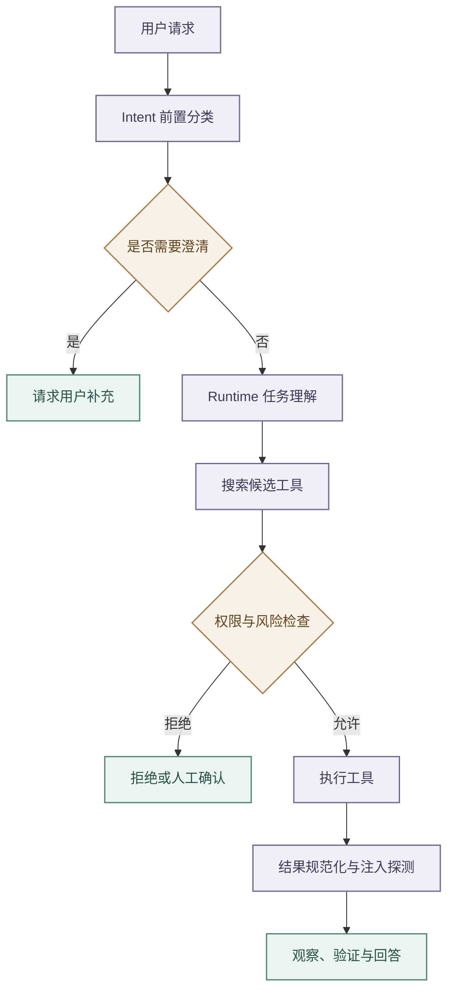

# 意图路由与工具安全

## 分层职责

- job-buddy 将前置分类、执行期理解、业务路由和动作授权分开。
- `agent-intent` 由 Backend 调用，通过规则、加权评分和可选 LLM 生成 `domain`、`intent`、`confidence`、`secondary`、`risk`、`needs_clarification`、`next_action`、`slots` 与 `router`；
- 该结果只作路由提示和安全辅助，Runtime 的任务理解才是执行期权威，也只有权限链路能够授予工具调用。
- Profile 可为少量低风险 `STABLE_WORKFLOW` 能力声明 `intent_hint_fast_path`。Runtime 仅在前置结果来自规则层、置信度达标、字段与本地 Capability 完全一致、当前请求为无附件且无历史槽位的单轮消息，并且本地语义 Top-1 再次命中同一能力时，跳过任务理解模型。
- 快路径结果的风险、动作、工具范围和 Capability Contract 全部从 Runtime 本地 Profile 重建，不接受 Hint 携带的工具或权限字段；Profile 默认关闭该策略，未入白名单、存在歧义或需要澄清时回退模型链路。

- Runtime 在能力分类前重写上下文。
- Backend 只提供受限的近期消息、结构化 `previous_slots` 和有界会话目录。前置规则明确命中的 `resume.match` 使用会话中的简历可用性标记，不为任务理解额外查询简历；需要目标方向辅助路由或前置结果不足以确定能力时，简历目录只允许一次按 `resume_id + tenant_id + user_id` 精确读取，向 Runtime 输出短文本目标字段与集合数量。任务理解阶段不得调用画像、长期记忆、收藏、旅程或黑名单，也不得传输完整简历、项目正文与 JD。
- 省略式输入会被改写为独立任务并记录引用来源；
- 历史只能补全本轮请求，不能覆盖新目标，无法唯一解析时必须澄清。

- Profile 的 `conversation_shortcuts` 只承载高频、稳定且具有结构化前置条件的跨轮捷径。
- 捷径可以声明锚定正则、必需历史槽位、槽位复用、查询改写、上下文类型和次级意图；
- 只有全部前置槽位存在且整句匹配时才能跳过理解模型。
- 例如“现在这个 6 年的简历呢”仅在 `_selected_job` 存在时进入 `resume.match`，否则回到正常理解或澄清。

- 低置信且非高风险结果进入 Clarification Gate。
- 高风险或破坏性工具在权限策略允许后，还需调用 `POST /v1/intent/review-transcript`，仅用用户消息和拟执行调用判断批准、人工确认或拒绝。
- 超时、连接失败或 5xx 只做一次有界重试，仍失败则拒绝；
- 低风险工具不增加该依赖。
- Transcript 复核不能替代参数校验和沙箱。

## 工具治理链路

- Runtime 工具定义自描述名称、用途、输入 Schema、风险、只读属性、超时和结果上限。
- Tool Search 使用 BM25 式词项排序，并对工具名称、别名、搜索提示、标签和描述字段进行匹配，再以 RRF 融合并稳定排序，避免把全量 Schema 放入 Prompt；
- 当前实现不包含 Embedding 或向量语义召回。
- ToolGateway 统一完成范围收窄、权限检查、执行、结果规范化和注入风险探测。
- 工具、网页、记忆与 Shell 输出一律视为不可信内容。

- 工具结果统一保留状态、摘要、结构化数据、警告、下一步、Trace 标识，以及错误的 `retryable` 和建议动作。
- 注入探针命中时只打标告警，不宣称已净化；
- 调用方仍须限长、保留来源，并阻止外部内容提升为系统指令。

- Capability 的工具范围只有 `none`、`allowlist` 和显式 `unrestricted`。
- 空列表表示不允许工具，不表示全量放行；
- 候选发现和实际执行使用同一规则，Profile 加载时校验范围、必需工具与允许工具的一致性。
- Runtime 在任务理解阶段输出可审计的 `web_search_decision`。用户明确要求联网，或问题依赖最新/近期的易变外部事实、事实核验、来源引用与官方链接时，Runtime 在既有 Capability allowlist 内把 `web_search` 提升为本轮 `required_tools`；任务理解模型负责开放语义判断，确定性策略覆盖时效性、来源核验等高价值回归场景。用户明确禁止联网只按原始消息判定并优先遵守，防止改写绕过；时效与易变事实信号同时检查已消解的 `resolved_query` 和 `retrieval_query`，使“最新的呢”等省略式追问在主体消解后仍能强制联网。该决策不得扩大能力卡权限，并会阻止 Backend 的 `runtime_execute` 直达合成快路径跳过搜索。
- 稳定原理解释、用户已提供内容、围绕当前简历/当前岗位/附件的总结改写不强制联网；“当前”不能作为单一触发词。决策元数据记录 `mode`、`trigger`、`reason` 与命中信号，用于 Trace 和 Eval 区分显式要求、自主判断、禁止联网与权限不足。
- Tool Search 对连续中文查询抽取有界 2-4 gram，使“联网查找openai最新模型”等无空格输入能够召回 `web_search`，同时继续用稳定排序与候选上限控制 Prompt Schema。

- Web Search 仅使用环境变量配置的 Bocha Web Search，不调用其他搜索提供方。主查询与官方域名范围补充查询均由 Bocha 执行，再统一合并、去重和重排。真实 API Key 只通过环境变量注入，不进入 Prompt、Trace、工具过程事件或仓库配置。配置的官方稳定入口只用于非 latest 查询在 Bocha 未命中官方页时补充一手来源；`selection_mode=latest` 不再直抓官网目录或执行栏目级最新性认证，只通过当前年份补充查询、官方域名范围、发布时间与相关性完成有界召回和排序。
- 任务理解必须把运行时当前日期作为动态上下文提供给模型；用户只表达“最新、最近发布、最晚发布、当前、今年”等相对时间且没有明确年份时，模型不得补入过期年份。Runtime 使用共享选择语义在任务理解、Planner 与 Web Search 三层统一识别这些表达，对 `resolved_query`、`retrieval_query` 和 `planner_query` 执行确定性年份校正，并把最新选择结构化为 `selection_mode=latest`、`as_of_date`、`source_preference=official_first` 和可识别的 `content_scope`；历史自然年使用当年末作为上界，当前年必须截断到 Runtime 当日，禁止把尚未发生的年末当作可观测截止日。只有显式 `截至/as of`，或与 latest 表达在同一分句中邻接的日期/年份才能形成时间范围；模型版本号、个人经历年份和其他分句日期不得绑定。“2024 年内最新”同时设置 `time_range_start=2024-01-01` 与 `as_of_date=2024-12-31`，“截至 2024 年最新”只设置截止上界。跨轮时间只从高置信 `recent_dialogue` 指代的 `resolved_to` 继承，不扫描裸历史消息猜测年份。
- `resolved_query` 用于解释已消解的独立任务，`retrieval_query` 用于工具召回并作为确定性 Web Search 的主查询，`planner_query` 只描述执行目标。任何降级计划都不得把整段 `planner_query` 原样复制为搜索引擎 query。
- 对“最新、近期、当前、发布”等时效性查询，Web Search 在主查询之外最多生成一条补充查询；补充查询携带当前年份和 `official` 意图信号，该年份只用于召回，不能作为最新性证明。Runtime 优先按官方策略中的主体别名识别域名，再把补充查询的 `include_domains` 作为结构化搜索范围传给 Bocha；显式 `site:` 和未知主体推断只能收窄搜索，不能自动升级为官方信任。扩展数量必须有界，禁止无上限改写或重复调用。
- 多查询与可选官方补充结果进入回答前按官方域名、文本相关性、发布时间和提供方原始顺序稳定排序，再按规范 URL 和近重复标题去重。每条结果标记 `source_tier=official|official_out_of_scope|third_party`；同一官方域名下不属于目标内容范围的页面必须标记为范围外。整体保留 `query_scopes`、来源数量、`preferred_source_trusted_hosts` 与 `official_verification`，供 Trace、Backend、前端过程面板和 Eval 审计；不再生成或投影官网最新性认证字段。
- `preferred_source_found` 必须由返回 URL 的实际主机名重新校验，官方证据还必须精确命中配置派生的 `preferred_source_trusted_hosts`，社区或未列出的子域不得视为官方声明。非 latest 查询使用配置入口补充官方来源时，仍须满足 HTTPS、无凭据、默认端口、精确主机、禁止跨目标重定向和响应体预算约束。
- 明确联网任务只要 `web_search` 返回至少一个带标题与公网 HTTP/HTTPS URL 的结果就具备基础来源。官方来源参与排序与可信度加权但不是回答硬门槛；未命中官方来源时必须保留第三方结果继续合成，不能改为拒答或只提示用户查阅官网。回答不得把第三方内容伪装成官方声明，来源冲突或证据较弱时按搜索结果本身谨慎合成；“最新”只能表述为本轮搜索结果中的判断。
- Backend 将搜索词、提供方、内部来源计数以及最多五条标题和 URL 投影为 `runtime_web_search` 过程事件，网页摘要和原始响应不进入过程面板；官方/第三方分层仅用于内部排序与审计，前端不展示来源分层、官方命中或降级提示。过程摘要只说明取得的可引用来源数量。最终答案由 Runtime 合成并使用 `[来源标题](https://...)` 形式保留可点击来源链接，前端只对模型偶发输出的残缺 URL 起始方括号做有界修复。

- Web Fetch 对每次重定向重新验证公网地址，并把实际连接绑定到已验证地址，同时保留原 Host、TLS SNI 和证书校验。
- 响应流式读取并限制声明长度、传输与解码字节、压缩扩张比例和总耗时，敏感响应头不进入结果。

- MCP 目录在进入共享注册表前限制工具数量、名称、描述、Schema 深度、节点和总字符。
- 单个来源先在临时集合完成校验，再原子替换旧目录；
- 禁用或加载失败时移除旧条目。
- 结果在拼接、JSON 解析和对象转换前执行条数、字节、深度和节点预算，超限返回明确协议错误。

## Shell 与代码沙箱

- `sandbox_code_execute` 用于执行模型生成的候选代码，固定支持部署镜像已验证的语言枚举，并由 Runtime 映射解释器与后缀后调用 Sandbox 的 `POST /v1/code-file`。Python 调用可额外声明最多 8 个 PyPI 依赖，每项只允许包名或精确版本，不接受 URL、VCS、本地路径、extras、marker 或安装参数。
- 该工具只能使用 Sandbox 创建的一次性临时目录，不接受调用方指定 cwd、解释器、索引地址、文件系统白名单或网络白名单。依赖安装使用镜像内固定 `uv`、固定 PyPI 域名和二进制 wheel，只有安装子阶段可联网并写入执行目录与受限下载缓存；候选代码执行阶段恢复无网络策略。依赖目标目录位于专用的 `exec,nosuid,nodev` tmpfs，以支持 wheel 原生扩展，只向本次代码执行开放只读访问并在返回前删除；普通 `/tmp` 与下载缓存保持 `noexec`。该机制不写系统 Python、项目 `.venv` 或用户 site-packages；依赖安装与代码执行分别使用独立的 90 秒和 25 秒超时，依赖数量、参数数量、代码长度与返回内容均有上限。
- 代码生成能力把 `sandbox_code_execute` 作为 `required_tools`。成功回答必须具备 ToolResult 成功、`sandboxed=true`、`exit_code=0` 的执行证据，评估层同时校验 `tool_execute_start` 与 `tool_execute_end` Trace；Sandbox 不可用、非零退出或缺少必需工具证据时必须返回失败终态。
- 候选源码与原始 stdout/stderr 只在当前执行、答案合成和当前鉴权用户的聊天执行详情中使用。Runtime 在 ToolResult 专用元数据中提供有界源码预览，Backend 再次限制长度后把源码、stdout 和 stderr 投影到聊天工具事件，并记录原始字符数、截断标记和 SHA-256 摘要；Checkpoint 与 Trace 仍只保存执行摘要，失败错误使用固定分类。Sandbox argv、临时目录、隔离策略和原始响应不得进入聊天执行详情。
- `shell_exec` 默认调用 Sandbox 的 `POST /v1/shell`。
- Runtime 先校验工作区、参数和危险模式，Sandbox 再通过 srt 以默认只读、无网络策略执行，并约束敏感目录与子进程。
- Compose 把 `runtime-workspace` 只读挂载到 `/workspace`，Runtime 通过 `options.cwd` 传递同一绝对路径；
- 未显式传 cwd 时由 Sandbox 创建并回收一次性目录；显式 cwd 只允许位于管理员配置的 `AGENT_SANDBOX_WORKSPACE_DIR` 内，拒绝调用方选择共享临时目录。
- Linux 容器采用外层容器与内层 srt 双重边界：服务进程以固定非 root 身份运行，外层丢弃全部 capability、使用只读根文件系统和受限临时目录，内层由 bubblewrap、network namespace 与 apply-seccomp 约束不可信进程。
- Docker 默认 seccomp 会阻止内层创建所需 namespace，因此 Compose 只对 Sandbox 容器关闭外层 seccomp，并启用 srt 的容器兼容模式；该模式不得脱离上述补偿边界单独使用，也不得改成 `privileged`、挂载 Docker socket 或注入业务凭据。
- `/health` 只表示服务进程存活，`/ready` 必须通过真实 srt 最小执行后才返回成功；Backend 服务监控、Compose 健康检查和本地启动等待统一使用 `/ready`。

- 服务不可达、超时或 5xx 时只做一次有界重试，失败后关闭，不回退宿主机。
- `shell_sandbox_enabled=false` 仅供明确的本地调试，结果标记 `sandboxed=false`，生产不得使用。
- 字符串黑名单只是快速拦截，真正边界必须同时覆盖文件、网络、子进程和凭据。

## Boss 与其他工具

- `boss_browser` 在 Runtime 中是代理工具，具体实现位于 agent-tool，并通过 `/v1/tools/boss_browser/execute` 调用；
- Runtime 不保存 Boss 凭据。
- MCP 适配器存在于 Core，但默认关闭，只有部署配置与工具权限共同允许时才启用，代码存在不代表已经接入外部市场。

## 降级与验证

- Intent 不可用时 Backend 使用受控降级并记录标记；
- 高风险规则、权限或 Transcript 复核失败不能静默放行。
- 测试覆盖规则与 LLM 降级、澄清阈值、三类复核结果、空范围关闭、候选收窄、权限拒绝、明确联网请求的必需工具提升、省略式最新追问、跨轮年份继承、自然年与截止日区分、三类查询改写的相对时间校正、结构化 latest 参数、latest 查询跳过官网直验、结果去重重排与来源证据、Web Fetch 地址绑定和流式预算、MCP 原子替换和结果预算、统一错误、注入标记、Sandbox 不可用时不回退及 `sandboxed` 标识。

任何风险规则或工具契约变化都必须同步更新 Capability、Eval 用例和安全审计。
