# 意图路由与工具安全

## 分层职责

- job-buddy 将前置分类、执行期理解、业务路由和动作授权分开。
- `agent-intent` 由 Backend 调用，通过规则、加权评分和可选 LLM 生成 `domain`、`intent`、`confidence`、`secondary`、`risk`、`needs_clarification`、`next_action`、`slots` 与 `router`；
- 该结果只作路由提示和安全辅助，Runtime 的任务理解才是执行期权威，也只有权限链路能够授予工具调用。

- Runtime 在能力分类前重写上下文。
- Backend 只提供受限的近期消息、结构化 `previous_slots` 和上下文目录，完整简历、项目正文与 JD 延迟到能力确定后加载。
- 省略式输入会被改写为独立任务并记录引用来源；
- 历史只能补全本轮请求，不能覆盖新目标，无法唯一解析时必须澄清。

- Profile 的 `conversation_shortcuts` 只承载高频、稳定且具有结构化前置条件的跨轮捷径。
- 捷径可以声明锚定正则、必需历史槽位、槽位复用、查询改写、上下文类型和次级意图；
- 只有全部前置槽位存在且整句匹配时才能跳过理解模型。
- 例如“现在这个 6 年的简历呢”仅在 `_selected_job` 存在时进入 `resume.match`，否则回到正常理解或澄清。

- 低置信且非高风险结果进入 Clarification Gate。
- 高风险或破坏性工具在权限策略允许后，还需调用 `POST /v1/intent/review-transcript`，仅用用户消息和拟执行调用判断批准、人工确认或拒绝。
- 超时、连接失败或 5xx 只做一次有界重试，仍失败则拒绝；
- 低风险工具不增加该依赖。
- Transcript 复核不能替代参数校验和沙箱。

## 工具治理链路

- Runtime 工具定义自描述名称、用途、输入 Schema、风险、只读属性、超时和结果上限。
- Tool Search 使用 BM25 式词项排序，并对工具名称、别名、搜索提示、标签和描述字段进行匹配，再以 RRF 融合并稳定排序，避免把全量 Schema 放入 Prompt；
- 当前实现不包含 Embedding 或向量语义召回。
- ToolGateway 统一完成范围收窄、权限检查、执行、结果规范化和注入风险探测。
- 工具、网页、记忆与 Shell 输出一律视为不可信内容。

```mermaid
graph TD
    A[用户请求] --> B[Intent 前置分类]
    B --> C{是否需要澄清}
    C -->|是| D[请求用户补充]
    C -->|否| E[Runtime 任务理解]
    E --> F[搜索候选工具]
    F --> G{权限与风险检查}
    G -->|拒绝| H[拒绝或人工确认]
    G -->|允许| I[执行工具]
    I --> J[结果规范化与注入探测]
    J --> K["观察、验证与回答"]

    classDef process fill:#F0EEF6,stroke:#746A91,color:#403957,stroke-width:1.5px;
    classDef decision fill:#F8F1E7,stroke:#A67C48,color:#62451F,stroke-width:1.5px;
    classDef terminal fill:#EAF4F1,stroke:#548678,color:#294F47,stroke-width:1.5px;
    class A,B,E,F,I,J process;
    class C,G decision;
    class D,H,K terminal;
```

- 工具结果统一保留状态、摘要、结构化数据、警告、下一步、Trace 标识，以及错误的 `retryable` 和建议动作。
- 注入探针命中时只打标告警，不宣称已净化；
- 调用方仍须限长、保留来源，并阻止外部内容提升为系统指令。

- Capability 的工具范围只有 `none`、`allowlist` 和显式 `unrestricted`。
- 空列表表示不允许工具，不表示全量放行；
- 候选发现和实际执行使用同一规则，Profile 加载时校验范围、必需工具与允许工具的一致性。

- Web Fetch 对每次重定向重新验证公网地址，并把实际连接绑定到已验证地址，同时保留原 Host、TLS SNI 和证书校验。
- 响应流式读取并限制声明长度、传输与解码字节、压缩扩张比例和总耗时，敏感响应头不进入结果。

- MCP 目录在进入共享注册表前限制工具数量、名称、描述、Schema 深度、节点和总字符。
- 单个来源先在临时集合完成校验，再原子替换旧目录；
- 禁用或加载失败时移除旧条目。
- 结果在拼接、JSON 解析和对象转换前执行条数、字节、深度和节点预算，超限返回明确协议错误。

## Shell 与代码沙箱

- `shell_exec` 默认调用 Sandbox 的 `POST /v1/shell`。
- Runtime 先校验工作区、参数和危险模式，Sandbox 再通过 srt 以默认只读、无网络策略执行，并约束敏感目录与子进程。
- Compose 把 `runtime-workspace` 只读挂载到 `/workspace`，Runtime 通过 `options.cwd` 传递同一绝对路径；
- Sandbox 只接受临时目录或显式工作区根。

- 服务不可达、超时或 5xx 时只做一次有界重试，失败后关闭，不回退宿主机。
- `shell_sandbox_enabled=false` 仅供明确的本地调试，结果标记 `sandboxed=false`，生产不得使用。
- 字符串黑名单只是快速拦截，真正边界必须同时覆盖文件、网络、子进程和凭据。

## Boss 与其他工具

- `boss_browser` 在 Runtime 中是代理工具，具体实现位于 agent-tool，并通过 `/v1/tools/boss_browser/execute` 调用；
- Runtime 不保存 Boss 凭据。
- MCP 适配器存在于 Core，但默认关闭，只有部署配置与工具权限共同允许时才启用，代码存在不代表已经接入外部市场。

## 降级与验证

- Intent 不可用时 Backend 使用受控降级并记录标记；
- 高风险规则、权限或 Transcript 复核失败不能静默放行。
- 测试覆盖规则与 LLM 降级、澄清阈值、三类复核结果、空范围关闭、候选收窄、权限拒绝、Web Fetch 地址绑定和流式预算、MCP 原子替换和结果预算、统一错误、注入标记、Sandbox 不可用时不回退及 `sandboxed` 标识。

任何风险规则或工具契约变化都必须同步更新 Capability、Eval 用例和安全审计。
