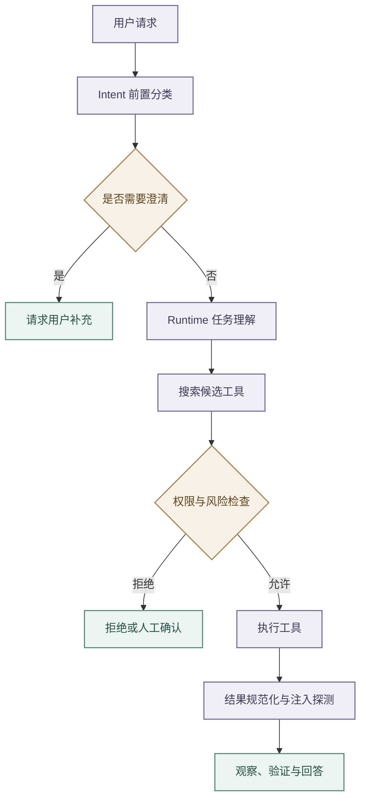

# 意图路由与工具安全

## 分层职责

- job-buddy 将前置分类、执行期理解、业务路由和动作授权分开。
- `agent-intent` 由 Backend 调用，通过规则、加权评分和可选 LLM 生成 `domain`、`intent`、`confidence`、`secondary`、`risk`、`needs_clarification`、`next_action`、`slots` 与 `router`；
- 该结果只作路由提示和安全辅助，Runtime 的任务理解才是执行期权威，也只有权限链路能够授予工具调用。
- Profile 可为少量低风险 `STABLE_WORKFLOW` 能力声明 `intent_hint_fast_path`。Runtime 仅在前置结果来自规则层、置信度达标、字段与本地 Capability 完全一致、当前请求为无附件且无历史槽位的单轮消息，并且本地语义 Top-1 再次命中同一能力时，跳过任务理解模型。
- 快路径结果的风险、动作、工具范围和 Capability Contract 全部从 Runtime 本地 Profile 重建，不接受 Hint 携带的工具或权限字段；Profile 默认关闭该策略，未入白名单、存在歧义或需要澄清时回退模型链路。

- Runtime 在能力分类前重写上下文。
- Backend 只提供受限的近期消息、结构化 `previous_slots` 和有界会话目录。前置规则明确命中的 `resume.match` 使用会话中的简历可用性标记，不为任务理解额外查询简历；需要目标方向辅助路由或前置结果不足以确定能力时，简历目录只允许一次按 `resume_id + tenant_id + user_id` 精确读取，向 Runtime 输出短文本目标字段与集合数量。任务理解阶段不得调用画像、长期记忆、收藏、旅程或黑名单，也不得传输完整简历、项目正文与 JD。
- 省略式输入会被改写为独立任务并记录引用来源；
- 历史只能补全本轮请求，不能覆盖新目标，无法唯一解析时必须澄清。

- Profile 的 `conversation_shortcuts` 只承载高频、稳定且具有结构化前置条件的跨轮捷径。
- 捷径可以声明锚定正则、必需历史槽位、槽位复用、查询改写、上下文类型和次级意图；
- 只有全部前置槽位存在且整句匹配时才能跳过理解模型。
- 例如“现在这个 6 年的简历呢”仅在 `_selected_job` 存在时进入 `resume.match`，否则回到正常理解或澄清。

- 低置信且非高风险结果进入 Clarification Gate。
- 高风险或破坏性工具在权限策略允许后，还需调用 `POST /v1/intent/review-transcript`，仅用用户消息和拟执行调用判断批准、人工确认或拒绝。
- 超时、连接失败或 5xx 只做一次有界重试，仍失败则拒绝；
- 低风险工具不增加该依赖。
- Transcript 复核不能替代参数校验和沙箱。

## 工具治理链路

- Runtime 工具定义自描述名称、用途、输入 Schema、风险、只读属性、超时和结果上限。
- Tool Search 使用 BM25 式词项排序，并对工具名称、别名、搜索提示、标签和描述字段进行匹配，再以 RRF 融合并稳定排序，避免把全量 Schema 放入 Prompt；
- 当前实现不包含 Embedding 或向量语义召回。
- ToolGateway 统一完成范围收窄、权限检查、执行、结果规范化和注入风险探测。
- 工具、网页、记忆与 Shell 输出一律视为不可信内容。

- 工具结果统一保留状态、摘要、结构化数据、警告、下一步、Trace 标识，以及错误的 `retryable` 和建议动作。
- 注入探针命中时只打标告警，不宣称已净化；
- 调用方仍须限长、保留来源，并阻止外部内容提升为系统指令。

- Capability 的工具范围只有 `none`、`allowlist` 和显式 `unrestricted`。
- 空列表表示不允许工具，不表示全量放行；
- 候选发现和实际执行使用同一规则，Profile 加载时校验范围、必需工具与允许工具的一致性。
- 用户明确要求“联网查找、联网搜索、上网查询”或等价英文表达时，Runtime 只能在既有 Capability allowlist 内把 `web_search` 提升为本轮 `required_tools`，不得借此扩大能力卡权限。该约束会阻止 Backend 的 `runtime_execute` 直达合成快路径跳过搜索；普通技术问答仍保持联网可选和低延迟直达合成。
- Tool Search 对连续中文查询抽取有界 2-4 gram，使“联网查找openai最新模型”等无空格输入能够召回 `web_search`，同时继续用稳定排序与候选上限控制 Prompt Schema。

- Web Search 优先使用环境变量配置的 Bocha Web Search，主提供方无结果或不可用且允许降级时使用 DuckDuckGo HTML 搜索；当 Bocha 已返回第三方结果但未命中推断的官方域名时，也使用同一条站点定向查询做一次 DuckDuckGo 有界降级，再统一合并、去重和重排。真实 API Key 只通过环境变量注入，不进入 Prompt、Trace、工具过程事件或仓库配置。
- 任务理解必须把运行时当前日期作为动态上下文提供给模型；用户只表达“最新、近期、当前、今年”等相对时间且没有明确年份时，模型不得补入过期年份。Runtime 会对模型生成的检索词执行确定性校正，防止相对时间查询携带非当前年份。
- `resolved_query` 用于解释已消解的独立任务，`retrieval_query` 用于工具召回并作为确定性 Web Search 的主查询，`planner_query` 只描述执行目标。任何降级计划都不得把整段 `planner_query` 原样复制为搜索引擎 query。
- 对“最新、近期、当前、发布”等时效性查询，Web Search 在主查询之外最多生成一条补充查询；补充查询携带当前年份。查询包含可识别英文实体时，Runtime 从显式 `site:` 条件或主体名推断一个有界官方域名候选，并使用 `site:<domain>` 定向检索；无法推断时才补充通用“最新进展”信号。扩展数量必须有界，禁止无上限改写或重复调用。
- 多查询结果进入回答前按规范 URL 和近重复标题去重，并综合实体域名匹配、文本相关性、发布时间和提供方原始顺序稳定重排。结果中保留实际执行的查询列表、原始数量、去重后数量、推断的官方域名及是否命中，供 Trace、前端过程面板和 Eval 审计。未命中推断的官方域名时，结果只允许作为第三方线索，答案合成必须明确未找到官方确认，不得把媒体传闻表述为官方发布。
- 明确联网任务只有在 `web_search` 返回至少一个带标题与公网 HTTP/HTTPS URL 的结果时，才满足必需工具证据；空结果、缺少来源 URL 或工具失败不能以模型常识答案伪装为联网成功。
- Backend 将搜索词、提供方、来源数量以及最多五条标题和 URL 投影为 `runtime_web_search` 过程事件，网页摘要和原始响应不进入过程面板；最终答案由 Runtime 合成并保留可点击来源链接。

- Web Fetch 对每次重定向重新验证公网地址，并把实际连接绑定到已验证地址，同时保留原 Host、TLS SNI 和证书校验。
- 响应流式读取并限制声明长度、传输与解码字节、压缩扩张比例和总耗时，敏感响应头不进入结果。

- MCP 目录在进入共享注册表前限制工具数量、名称、描述、Schema 深度、节点和总字符。
- 单个来源先在临时集合完成校验，再原子替换旧目录；
- 禁用或加载失败时移除旧条目。
- 结果在拼接、JSON 解析和对象转换前执行条数、字节、深度和节点预算，超限返回明确协议错误。

## Shell 与代码沙箱

- `sandbox_code_execute` 用于执行模型生成的候选代码，固定支持部署镜像已验证的语言枚举，并由 Runtime 映射解释器与后缀后调用 Sandbox 的 `POST /v1/code-file`。
- 该工具只能使用 Sandbox 创建的一次性临时目录，不接受调用方指定 cwd、解释器、文件系统白名单或网络白名单；网络保持关闭，执行超时、参数数量、代码长度与返回内容均有上限。
- 代码生成能力把 `sandbox_code_execute` 作为 `required_tools`。成功回答必须具备 ToolResult 成功、`sandboxed=true`、`exit_code=0` 的执行证据，评估层同时校验 `tool_execute_start` 与 `tool_execute_end` Trace；Sandbox 不可用、非零退出或缺少必需工具证据时必须返回失败终态。
- 候选源码与原始 stdout/stderr 只在当前执行和答案合成期间使用；Checkpoint、Trace 与聊天工具事件只持久化语言、退出码、耗时、输出长度和 SHA-256 摘要，失败错误使用固定分类。
- `shell_exec` 默认调用 Sandbox 的 `POST /v1/shell`。
- Runtime 先校验工作区、参数和危险模式，Sandbox 再通过 srt 以默认只读、无网络策略执行，并约束敏感目录与子进程。
- Compose 把 `runtime-workspace` 只读挂载到 `/workspace`，Runtime 通过 `options.cwd` 传递同一绝对路径；
- 未显式传 cwd 时由 Sandbox 创建并回收一次性目录；显式 cwd 只允许位于管理员配置的 `AGENT_SANDBOX_WORKSPACE_DIR` 内，拒绝调用方选择共享临时目录。
- Linux 容器采用外层容器与内层 srt 双重边界：服务进程以固定非 root 身份运行，外层丢弃全部 capability、使用只读根文件系统和受限临时目录，内层由 bubblewrap、network namespace 与 apply-seccomp 约束不可信进程。
- Docker 默认 seccomp 会阻止内层创建所需 namespace，因此 Compose 只对 Sandbox 容器关闭外层 seccomp，并启用 srt 的容器兼容模式；该模式不得脱离上述补偿边界单独使用，也不得改成 `privileged`、挂载 Docker socket 或注入业务凭据。
- `/health` 只表示服务进程存活，`/ready` 必须通过真实 srt 最小执行后才返回成功；Backend 服务监控、Compose 健康检查和本地启动等待统一使用 `/ready`。

- 服务不可达、超时或 5xx 时只做一次有界重试，失败后关闭，不回退宿主机。
- `shell_sandbox_enabled=false` 仅供明确的本地调试，结果标记 `sandboxed=false`，生产不得使用。
- 字符串黑名单只是快速拦截，真正边界必须同时覆盖文件、网络、子进程和凭据。

## Boss 与其他工具

- `boss_browser` 在 Runtime 中是代理工具，具体实现位于 agent-tool，并通过 `/v1/tools/boss_browser/execute` 调用；
- Runtime 不保存 Boss 凭据。
- MCP 适配器存在于 Core，但默认关闭，只有部署配置与工具权限共同允许时才启用，代码存在不代表已经接入外部市场。

## 降级与验证

- Intent 不可用时 Backend 使用受控降级并记录标记；
- 高风险规则、权限或 Transcript 复核失败不能静默放行。
- 测试覆盖规则与 LLM 降级、澄清阈值、三类复核结果、空范围关闭、候选收窄、权限拒绝、明确联网请求的必需工具提升、查询改写实际透传、相对时间校正、查询扩展、结果去重重排与来源证据、Web Fetch 地址绑定和流式预算、MCP 原子替换和结果预算、统一错误、注入标记、Sandbox 不可用时不回退及 `sandboxed` 标识。

任何风险规则或工具契约变化都必须同步更新 Capability、Eval 用例和安全审计。
