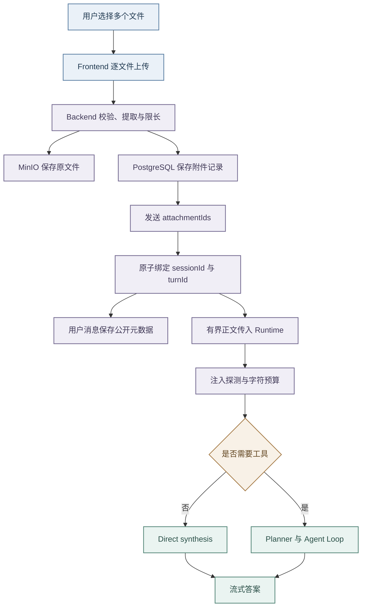

# 智能引擎多文件上下文

## 能力目标

- 智能引擎允许用户在发送消息前上传多份参考文档。
- 文件的公开元数据随当前消息参与路由和来源展示，抽取正文只在 Runtime 托管阶段进入受治理上下文：需要工具的任务可供 Planner 与 Agent Loop 使用，无工具任务直接供答案合成。
- 首版支持 PDF、DOC、DOCX、TXT 与 MD，一次请求最多关联五个文件，单文件最大 128MB。
- 当前简历仍是会话级求职业务上下文，通用附件是消息级证据，二者不互相替代。

## 正式方案

- 浏览器先逐文件调用 Backend 附件上传接口。
- 逐文件上传便于展示独立进度、删除和失败重试，也避免批量请求中单个坏文件导致全部回滚。
- 输入区采用渐进式交互：底部左侧使用独立的加号按钮打开文件菜单，已选择文件以卡片形式显示在输入框上方，卡片明确区分上传中、已就绪和失败状态；
- 格式、大小或数量错误在附件区域就近完整展示，不能挤占底栏或以单行省略。
- Backend 校验扩展名和 MIME；
- PDF、DOC 与 DOCX 还会校验二进制签名，TXT 与 MD 必须是有效 UTF-8 文本。
- 校验通过后提取纯文本，将原文件写入 MinIO，并把属主、对象路径、哈希、解析状态和有界文本写入 PostgreSQL。
- 上传结果只向前端返回附件标识、文件名、类型、大小和解析摘要，不暴露对象存储路径。

- 发送消息时，前端在既有 JSON 请求中追加 `attachmentIds`。
- Backend 最多接受五个去重后的标识，逐个校验租户、用户、解析状态和绑定状态，再将附件原子绑定到当前 `sessionId + turnId`。
- 同一轮次重放允许复用相同附件；
- 已经绑定到其他轮次的附件拒绝复用。
- 用户消息的 `metadata.attachments` 保存公开元数据，历史接口据此恢复附件标签。

- Backend 的前置 `understanding_only` 请求只传递附件引用，不传递正文；
- 选定 Runtime 托管路径后，Backend 才以结构化 `attachments` 元数据传入正文。
- 每份文档保留文件名、类型、字符数、是否截断和有界正文，Runtime 将其作为不可信参考资料加入上下文，不能把文档中的文字当作系统指令或动作授权。
- 该约束同时适用于完整 Agent Loop 和 `runtime_execute` 直达合成路径；
- 任何为了降低首字延迟而跳过 Planner 或工具阶段的路径，都不能跳过附件整理、注入检测和 Prompt 注入。
- 对象路径、内部凭据和原始二进制不得进入 Runtime、Prompt、Trace 或日志。

## 模块与接口

- Frontend 在输入框中维护待发送附件，支持多选、逐项状态、删除和重试。
- 文件菜单只负责选择来源，已上传文件与入口分区展示；
- 附件卡片必须持续显示文件类型、完整文件名提示、大小和状态，发送期间由用户消息气泡继续展示本轮文件来源。
- 新会话选择附件时只生成客户端会话标识，不提前创建空历史记录；
- 首次消息进入发送流程后再按既有流程创建会话条目。
- 前端把已提交附件从待发送区移入乐观用户消息，消息保存附件公开元数据。

Backend 提供以下接口：

- `POST /api/chat/attachments`：上传并解析单个文件。
- `DELETE /api/chat/attachments/{attachmentId}`：删除尚未绑定消息的附件。
- `POST /api/chat/stream`：通过 `attachmentIds` 绑定并使用附件。
- `GET /api/chat/sessions/{sessionId}/messages`：在用户消息中返回附件公开元数据。

- `chat_attachment` 是附件权威记录。
- 文件归 Backend 管理，Runtime 不直接访问数据库或 MinIO。
- 删除会话时同步删除该会话附件的对象与记录；
- 尚未绑定消息的附件只能在发送前通过删除接口移除。
- 当前代码没有按生命周期自动回收未绑定附件的定时任务，不能把它描述为已具备的自动清理能力。

## 风险边界

- 文件上传必须校验大小、扩展名与 MIME；
- PDF、DOC、DOCX 还必须校验二进制签名，TXT 与 MD 必须校验 UTF-8 编码。
- 文件名需要移除客户端路径和控制字符。
- 加密 PDF、损坏的 Word、非 UTF-8 文本和没有可提取文字的扫描件明确失败，首版不提供 OCR。
- Spring 全局 multipart 上限不能替代智能引擎附件端点的 128MB 限制；
- 面试资料等其他入口继续使用各自独立上限。

- 共享解析器当前会在 JVM 内读取完整文件字节后再做签名校验和文本提取，因此 128MB 是接口准入上限，不表示解析过程已经实现常量内存流式处理。
- 部署时需要为并发上传保留足够堆内存，并通过请求并发和超时限制避免多个大文件同时占满 Backend；
- 文档不得把该链路描述为流式解析。

- 多文件正文不能无界拼入 Prompt。
- Backend 每份最多保存 20000 个抽取字符；
- Runtime 最多接收五份附件，根据附件数量为每份正文保留 1200 至 4000 个字符，附件正文合计预算约为 6000 个字符，并继续受 ContextAssembler 的 8000 字符摘要预算与模型 Token 预算约束。
- 文件名与边界标记必须保留，以便答案区分来源。
- 附件内容经过 Prompt Injection 探测并标记为不可信；
- 命中风险模式时正文不进入模型上下文，附件内容也不能提升工具权限或触发其中的命令。

## 验证方法

- Backend 定向测试覆盖五种格式的入口约束、共享解析器的格式与签名校验、128MB 边界、属主隔离、数量上限、消息绑定、公开元数据落库和 Runtime 正文透传。
- Frontend 定向测试覆盖加号菜单、格式说明、大小错误、附件卡片、发送载荷、发送后迁移和历史恢复。
- Runtime 定向测试覆盖附件上下文装配、公平字符预算、注入风险拦截，并使用唯一哨兵正文验证生产 `runtime_execute` 直达合成路径构造出的实际模型消息包含附件正文；
- 只验证 metadata 或附件数量不构成“文件已被模型使用”的证据。
- 跨轮次复用、幂等重放、删除未绑定附件和会话级对象清理还应通过仓储或服务测试单独验证。

交付前执行 Flyway 不可变检查、Backend/Runtime/Frontend 定向测试与对应 Harness Gate，并在真实浏览器验证上传多个文件、发送问答、刷新会话和错误提示。
