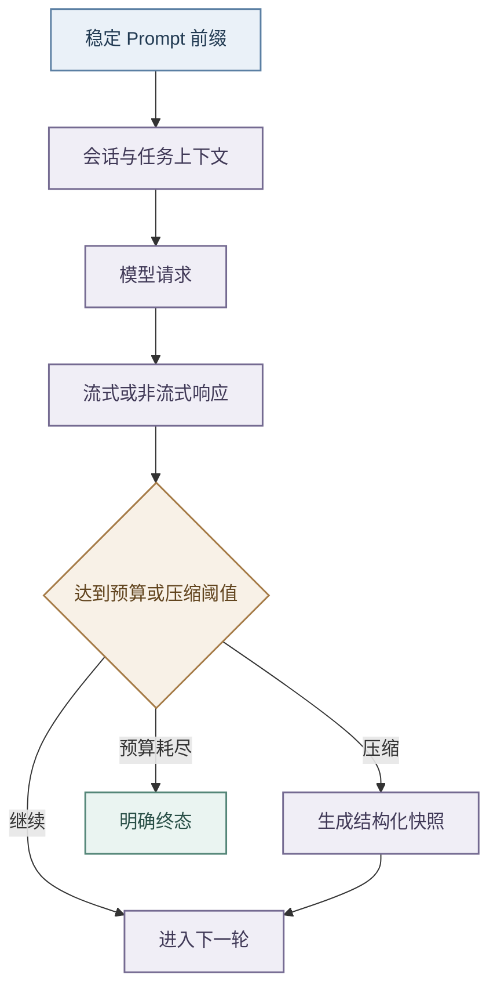

# 模型接入与上下文治理

## 能力边界

- 模型调用集中在 `agent-runtime/app/core/llm/`。
- 业务模块不拼接供应商请求，Backend 只保存平台配置，并按需通过 `metadata.llm_service` 传递 provider、端点、模型、鉴权、缓存、超时和预算；
- 没有请求级连接时，Runtime 使用部署环境和 `config/config.yaml`。

客户端支持 OpenAI 风格 Chat Completions，并处理 Anthropic 风格请求和流式用量字段。

- 单个 run 的任务理解、Planner 和答案合成使用同一连接，Backend 两阶段产生的理解与执行 run 也必须透传相同模型配置。
- API Key、Token 和 Endpoint 全部外置，不得进入 Prompt、Trace、日志、Checkpoint 或默认配置。

## Prompt 与缓存

- Prompt、Profile 和 Workflow 分别位于 `config/prompts/`、`config/profiles/` 与 `config/workflows/`。
- CapabilityRegistry 和 WorkflowRegistry 负责加载与校验；
- Profile 声明的 Planner Prompt 由任务理解结果透传给 RuntimePlanner，Planner 不固定绑定默认文件；
- Workflow 只以只读元数据参与理解、directive 与 Trace，外部动作仍由 Backend 执行。

- 请求按“稳定系统说明—工具定义—项目规则—会话上下文—当前消息”组织，动态时间、随机顺序和请求 ID 不进入稳定前缀，工具目录保持稳定排序。
- 任务理解的 Capability 目录只在稳定 system 消息中出现一次，动态 user payload 不重复携带同一目录；受校验的低风险规则 Hint 命中时不发起任务理解模型调用。
- Runtime 请求缓存以 provider、model 和完整载荷的稳定哈希为键，命中后返回隔离副本；
- 服务端 Prompt Cache 则依赖字节级前缀，两者分别观测。
- 不同 provider、model 或关键参数不共享缓存，命中缓存不产生本次模型 Token 用量。

## Token 预算与上下文压缩

- 每个 run 使用独立累计器，统一记录 `prompt_tokens`、`completion_tokens`、`total_tokens` 和 `llm_calls`。
- 非流式从 usage 读取，OpenAI 兼容流从末帧读取，Anthropic 风格流按累计字段归一。
- `BudgetConfig.max_tokens` 默认 32768，请求省略或传 0 时回落到 `JOB_BUDDY_RUNTIME_MAX_TOKENS`；
- 耗尽后 LoopController 以明确原因终止，direct synthesis 的输出上限取模型上限与剩余预算的较小值。

- 上下文按近期消息、当前目标、观察、长期记忆引用、工具引用和本轮附件分层。
- 任务理解同时接收受限近期消息与结构化 `previous_slots`：前者处理自然语言承接，后者稳定引用上一轮业务对象。
- Backend 的 `understanding_only` 请求优先只携带当前简历可用标记与岗位引用、数量；前置规则明确命中的 `resume.match` 不为分类额外读取简历，只有需要目标方向辅助路由或前置结果不足以确定能力时，才在租户与用户范围内读取当前职位及集合数量。分类前不装配完整个人上下文或传输简历正文。
- 新会话的任务理解消息只有当前用户输入，不访问不存在的历史；既有会话继续读取、去重并裁剪最近消息，以支持自然语言承接。
- Backend 保证当前消息只出现一次且位于末尾，Runtime 将省略式输入改写为 `resolved_query`、`retrieval_query` 与 `planner_query`，并记录依赖、类型和引用。
- 当前消息的新对象与条件始终覆盖历史，无法唯一解析时必须澄清。
- 附件的来源、字符预算和不可信内容处理统一遵循 [智能引擎多文件上下文](智能引擎多文件上下文.md)，不在模型适配层另建一套规则。

- 观察超过数量或字符阈值后，ContextCompactor 把早期内容折叠为至少包含目标、修改、决策、失败和下一步的结构化快照，近期观察保留原文。
- 结果进入状态与 Checkpoint，并由 Trace 记录前后体积，不能用简单截断替代。

## 风险与验证

供应商对流式 usage、工具调用和缓存参数的支持并不一致，不能对所有 OpenAI 兼容端点强制发送相同扩展字段。

请求级凭据不得进入长期状态，模型发现、鉴权、限流和超时必须返回可归因错误。并发任务用 `contextvars` 隔离 run 用量，线程池执行必须显式传播上下文。

测试应覆盖请求级配置覆盖、流式和非流式响应、供应商字段归一、缓存键隔离、Token 预算、并发隔离、压缩触发、多轮去重、五要素快照及敏感信息保护。
