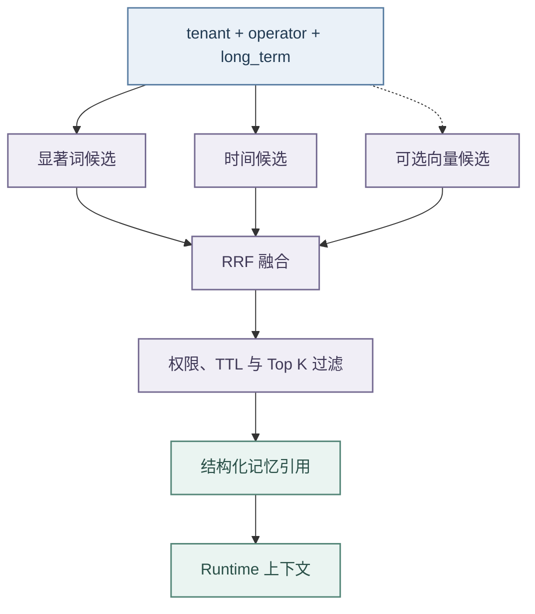

# 记忆管理与混合检索

## 记忆边界

- 系统把信息分为当前步骤、当前任务、跨任务长期记忆和跨会话语义信息。
- 消息、`ChatSessionState` 与 Checkpoint 承载当前会话；
- 只有稳定偏好、约束、面试复盘和用户明确保存的内容才能进入长期库。
- 短期观察不能无筛选写入，召回内容也不能覆盖当前会话中的明确事实。

- `agent-memory` 是用户长期记忆正文的唯一存储。
- 平台设置页和对话自动捕获都由 Backend 的 `AgentMemoryClient` 调用 `/v1/memories`；
- Backend 的 `platform_setting/global/settings` 只保存启用、自动保存、自动使用和容量上限等策略。
- 历史 `user-memory:*` 记录在用户首次访问时迁入 Memory，全部写入成功后才删除旧记录。

- Runtime 在 `ContextAssembler` 中检索 `long_term` 引用。
- 独立 Runtime 配置默认关闭记忆，完整本地栈通过根 `.env.example` 显式开启。
- 检索超时、连接失败或响应非法时以空引用继续；
- 设置页的显式写入、删除和清空失败则直接报错，不能写入 Backend 副本。

| 调用或存储路径           | 正式行为                                                                    | 失败边界                                                           |
| ------------------------ | --------------------------------------------------------------------------- | ------------------------------------------------------------------ |
| Backend 列表、检索       | 独立连接 2 秒、读取 10 秒超时；只重试连接/读取异常、408、429 和 5xx         | 401、403、404 不重试，也不计入可用性熔断                           |
| Backend 创建、删除、清空 | 直接调用 Memory                                                             | 写入结果可能有歧义，失败后不自动重放                               |
| `long_term`              | 始终使用 agent-memory 的本地事实源；已配置 PostgreSQL 时必须使用 PostgreSQL | 数据库故障不得动态切换到进程内存                                   |
| 其他 scope               | 配置 `TDAI_MEMORY_GATEWAY_URL` 时优先调用 Gateway                           | 网关失败时当次有界降级到启动时选定的本地后端，并进入默认 60 秒冷却 |

进程内存只用于未配置数据库的快速本地验证，不属于正式持久化方案。本地后端在服务启动时确定，运行期间不切换。

## 检索与排序

- agent-memory 先构造显著词候选和时间兜底候选，再以 BM25 和时间衰减信号进行 RRF 融合。
- 启用 Embedding 时，服务调用 OpenAI 兼容的 `/v1/embeddings` 计算候选相似度，达到阈值后作为第三路信号；
- Embedding 未配置、超时或异常时退化为词法与时间融合。

检索契约不包含图数据库召回。Embedding 客户端使用批量请求和进程内内容哈希缓存，地址、模型和密钥必须由环境变量或 Secret 提供。

## 生命周期与安全

- 记忆模型包含 `kind`、`scope`、`source`、`enabled`、operator、version 和 TTL。
- 工作台固定使用 `scope=long_term`、`kind=long_term`，所有长期记忆采用统一模型，不按偏好、约束、面试复盘或对话分类；
- 更新前保存历史版本，rollback 恢复最近修订，关闭或过期记录不参与召回，purge 清理到期记录及历史。

- 所有读写根据受信的租户与 `X-Operator-Id` 隔离，并记录操作者、动作、结果、标识和版本。
- 记忆正文可能包含个人信息或提示注入，日志不得无必要输出全文；
- 进入 Prompt 前必须标注来源、限制长度并经过 Runtime 注入探针。

- PostgreSQL 启动时仅对建池和幂等 Schema 初始化中的瞬时断连、连接超时或临时不可用执行有界指数退避，并在每次失败后销毁半初始化连接池。
- 密码、库名、权限、SSL 校验和非法配置等确定性错误立即失败；
- 重试耗尽后终止启动，日志只保留脱敏目标、尝试次数和异常类型。
- `/health` 同时验证数据库连接与服务自有表；
- 若外部的项目级数据库重置发生在服务进程存活期间，健康检查会在进程内加锁并幂等恢复 `agent_memory_` Schema，恢复失败时返回 HTTP 503，禁止出现进程健康但长期记忆不可读的假就绪状态。

## 验证

- 验证分三层：接口层覆盖请求头映射、旧记录迁移、自动保存去重、容量裁剪、列表、清空、TTL、回滚、operator 隔离和审计；
- 检索层覆盖中英文词法、BM25、时间衰减、RRF、向量阈值与失败降级；
- 存储层覆盖 Gateway scope 分流与冷却恢复，以及 PostgreSQL 瞬时恢复、运行期 Schema 恢复、健康检查失败、重试耗尽、确定性错误、连接池清理和错误脱敏。
- 测试必须证明 `long_term` 不经 Gateway，数据库故障也不会被解释成动态内存降级。
