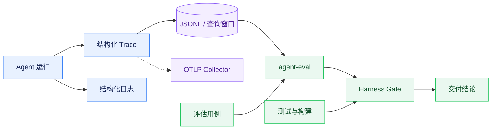

# Trace 可观测与质量评估

## Trace 与日志

Runtime 使用结构化 Trace 记录运行、任务理解、路由、计划、工具、模型用量、上下文压缩和终态事件。JSONL 是本地回放与规则评估的基础数据源，内存窗口支持实时查询；事件只允许追加式扩展，payload 在写入前限制深度和长度，不记录密钥、完整凭据或不必要的个人信息。

FastAPI 中间件生成或透传 `X-Request-Id`，并通过上下文变量把 request、run、session 和 trace 标识注入 Loguru。跨服务透传关联标识；`X-Request-Id` 用于请求关联，不等同于 W3C TraceContext 分布式追踪。

## OpenTelemetry

Runtime 的 OTelExporter 可将 TraceEvent 映射为 OTLP/HTTP Span，并异步发送到配置的 `/v1/traces` 端点。该能力默认关闭且不执行重试；Collector 不可用只记录警告，不阻断 JSONL 和业务链路。关键审计不能只依赖异步旁路，因为进程强制退出时尾部事件可能丢失。

## Eval 与 Harness

agent-eval 提供 `/v1/eval/trace`、`/v1/eval/run`、`/v1/eval/capabilities`、`/v1/eval/latency` 和 `/v1/eval/judge`。规则评分器检查必要事件、终态、工具错误结构、证据和模型用量；Judge 是可选的开放质量评审，未配置或调用失败不得视为通过。Backend 集成层可以调用 Eval，但常规对话不能把评估服务当作无降级的同步前置依赖。

`.agent-harness/scripts/verify.sh` 负责测试和构建，`evaluate.sh` 负责行为评估，`gate.sh` 组合两者形成交付门禁。Trace、SSE、意图、工具或输出契约变化时，必须同步检查评分器、评估用例和 Harness 脚本。

## 鉴权、降级与验证

内部 Python 接口通过 `AGENT_INTERNAL_SERVICE_TOKEN` 启用 `X-Internal-Service-Token` 校验；`JOB_BUDDY_ENVIRONMENT` 为 `production` 或 `prod` 时该令牌必须配置，缺失会阻止 Runtime 启动。本地开发环境可留空以保留单机联调能力；配置后 Backend 的普通 HTTP 与 Runtime SSE 调用都会发送同一请求头，健康检查以外的 Runtime 接口拒绝匿名访问。Collector、Eval 或日志下游不可用不得覆盖原始业务错误，也不得造成连接无终态。

测试应覆盖 JSONL 持久化和重载、OTel 开关与失败降级、字段映射、LLM usage、请求关联、内部鉴权，以及 grader 对成功和异常运行的判断。
