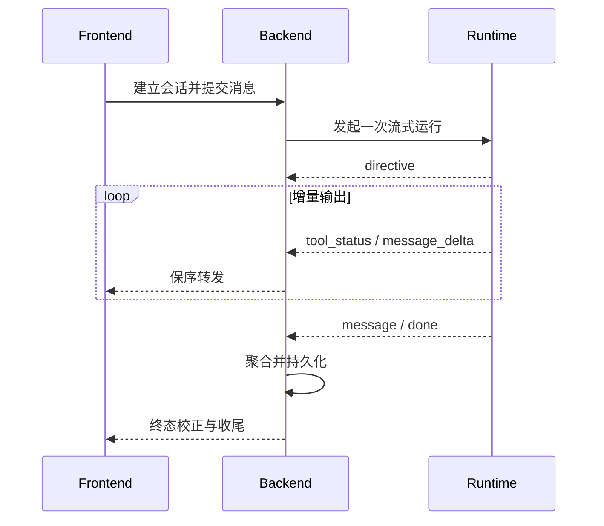

# 对话流式输出与状态恢复

## 单流路由

工作台问答采用“Backend 建立 SSE、Runtime 在同一流内理解和执行、Backend 按 directive 分流”的单流架构。前端向 `POST /api/chat/stream` 提交消息和结构化上下文；Backend 完成鉴权、会话创建和 Intent 前置分类后调用 Runtime 的流式入口。Runtime 先输出 directive，Backend 据此接管确定性业务动作，或继续中继 Runtime 的规划、工具状态与答案增量。

`selectedJob` 定向分析和“换一批”等操作携带结构化上下文及会话状态进入对应处理器，避免重复分类和无关模型调用。Backend 负责业务数据和最终消息持久化，Runtime 负责智能执行；双方不能同时生成同一条最终答案。

## SSE 契约

当前链路使用 `session`、`intent_precheck`、`directive`、`intent`、`tool_status`、`reasoning_delta`、`message_delta`、`message`、`auth_required`、`error` 和 `done` 等事件。`directive` 携带意图、置信度、风险、澄清标记、下一动作和槽位；`message_delta` 与 `reasoning_delta` 分别承载答案和过程增量；`message` 用于终态校正；`done` 携带 Trace、终止原因、指标和持久化元数据。

事件只能追加式扩展，前端必须安全忽略未知事件。Backend 不得为聚合完整文本而阻塞增量转发。成功、拒绝、中断和错误路径都必须发送明确终态并释放资源，防止加载状态悬挂。SSE 已开始后不能再由全局异常处理器写普通 JSON 响应。

## 前端并发与恢复

每个在途 SSE 按 `sessionId` 独立维护控制器、请求状态和事件归属。切换历史会话或新建会话不等于取消后台会话；只有用户主动停止、删除会话、刷新或关闭页面时才断开相应请求。浏览器断开导致的 Broken pipe 等异常属于连接生命周期事件，Backend 应停止相关任务、清理 emitter 并降低日志噪声。

用户消息应在进入模型和外部工具前进入顺序持久化流程。最终答案、reasoning、tool events、岗位卡片或 selectedJob、上下文来源、Trace 和终止原因随会话保存。历史接口与异步落库可能竞争，前端不得用空结果覆盖已有非空快照；历史记录缺少新增过程字段时允许降级展示。

## 异步分析任务

简历和收藏岗位分析使用独立的持久化后台任务。提交接口立即返回 `taskId`，前端通过 `/api/analysis-tasks/{taskId}/stream` 订阅 `snapshot`、`progress`、`partial_result`、`result`、`error`、`done` 和 `heartbeat`。关闭弹窗或断开 SSE 只停止观察，不取消任务；重新进入页面时通过最近任务接口恢复状态和已持久化部分结果。

## 风险与验证

流式链路重点防止事件乱序、双重终态、下游断开后的任务泄漏、答案重复、快照回退和消息未落库。自动化测试需覆盖 Runtime 事件序列、Backend 中继和分流、异常收尾、前端增量合并与恢复；用户可见改动必须用真实浏览器验证开放域问答、业务动作、工具问答、会话切换、主动中断和错误提示。
