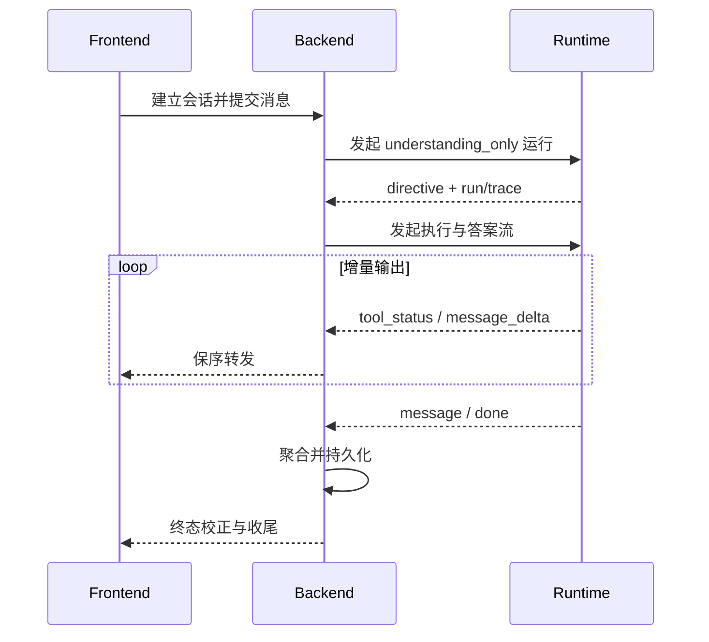

# 对话流式输出与状态恢复

## 前端单流与后端两阶段路由

工作台问答对浏览器保持一条 SSE，但 Backend 与 Runtime 采用两阶段编排。前端向 `POST /api/chat/stream` 提交消息和结构化上下文；Backend 完成鉴权、会话创建和 Intent 前置分类后，先调用 Runtime 非流式 `understanding_only` 请求取得 directive，再据此接管确定性业务动作，或发起第二次 Runtime 流式请求并中继工具状态与答案增量。两次 Runtime run 使用同一会话标识，并以 `upstream_run_id` 和 `upstream_trace_id` 关联；第二阶段不得回传或持久化第一阶段完整响应副本。

`selectedJob` 定向分析和“换一批”等操作携带结构化上下文及会话状态进入对应处理器，避免重复分类和无关模型调用。Backend 负责业务数据和最终消息持久化，Runtime 负责智能执行；双方不能同时生成同一条最终答案。

## SSE 契约

当前链路使用 `session`、`intent_precheck`、`directive`、`intent`、`tool_status`、`reasoning_delta`、`message_delta`、`message`、`auth_required`、`error` 和 `done` 等事件。`directive` 携带意图、置信度、风险、澄清标记、下一动作和槽位；`message_delta` 与 `reasoning_delta` 分别承载答案和过程增量；`message` 用于终态校正；`done` 携带 Trace、终止原因、指标和持久化元数据。

事件只能追加式扩展，前端必须安全忽略未知事件。Backend 不得为聚合完整文本而阻塞增量转发。成功、拒绝、中断和错误路径都必须发送明确终态并释放资源，防止加载状态悬挂。SSE 已开始后不能再由全局异常处理器写普通 JSON 响应。

SSE 会话总生命周期与单次 Runtime 流式读取使用独立超时。`stream-read-timeout` 约束一次下游 Runtime 响应读取，`stream-session-timeout` 约束浏览器到 Backend 的整轮会话，后者默认 15 分钟。Backend 实际使用两者中的较大值，并为读取超时预留 10 秒终态下发时间，避免岗位推荐的多批串行评分和缺失批次补偿被单次读取上限提前截断。心跳只负责保持空闲连接可观测，不延长硬会话期限；达到会话期限、客户端断开或发送失败时仍须取消后台任务并释放并发配额。

声明 `required_tools` 的任务由 Runtime 状态图执行；无工具纯生成任务允许走 direct synthesis 快路径。两条路径必须使用同一有限 Token 预算、明确 `run_end` 顶层状态和相同的安全终态语义，不能把失败、预算耗尽或需要确认合成为成功答案。

## 前端并发与恢复

每个在途 SSE 按 `sessionId` 独立维护控制器、请求状态和事件归属。切换历史会话或新建会话不等于取消后台会话；只有用户主动停止、删除会话、刷新或关闭页面时才断开相应请求。浏览器断开导致的 Broken pipe 等异常属于连接生命周期事件，Backend 应停止相关任务、清理 emitter 并降低日志噪声。

用户消息应在进入模型和外部工具前进入顺序持久化流程。每次用户动作由前端生成稳定 `turnId`；同一次认证续跑、网络重试或状态恢复必须复用该 ID，相同文本的下一次主动提问则生成新 ID。Backend 以租户、用户、会话、角色和 `turnId` 作为消息幂等边界，相同 ID 只能落库一次；认证续跑可以继续原动作，但不得再次写入用户气泡。历史接口返回消息 ID 与 `turnId`，前端按稳定 ID 合并乐观消息和服务端记录。兼容登录墙丢失上下文和旧数据时，只折叠连续、同角色、同内容且中间没有助手回复的未完成用户行；已经出现助手回复后，同文本的新 `turnId` 仍是独立问题，不能按文本永久去重。

最终答案、reasoning、tool events、岗位卡片或 selectedJob、上下文来源、Trace 和终止原因随会话保存。岗位搜索进入登录引导前必须先保存已经解析的槽位和当前轮次，使扫码完成后能够继续原任务。历史接口与异步落库可能竞争，前端不得用空结果覆盖已有非空快照；历史记录缺少新增过程字段时允许降级展示。

## 异步分析任务

简历和收藏岗位分析使用独立的持久化后台任务。提交接口立即返回 `taskId`，前端通过 `/api/analysis-tasks/{taskId}/stream` 订阅 `snapshot`、`progress`、`partial_result`、`result`、`cancelled`、`error`、`done` 和 `heartbeat`。关闭弹窗或断开 SSE 只停止观察，不取消任务；用户显式停止时调用 `POST /api/analysis-tasks/{taskId}/cancel`，任务以 `cancelled` 终态结束并中断后台执行，不再写入最终结果。重新进入页面时通过最近任务接口恢复状态和已持久化部分结果。

## 风险与验证

流式链路重点防止事件乱序、双重终态、下游断开后的任务泄漏、答案重复、重复用户轮次、快照回退和消息未落库。自动化测试需覆盖 Runtime 事件序列、Backend 中继和分流、同一 `turnId` 并发提交、认证续跑、异常收尾、前端增量合并与恢复；用户可见改动必须用真实浏览器验证开放域问答、业务动作、工具问答、扫码续跑前后只有一个用户气泡、会话切换、主动中断和错误提示。
