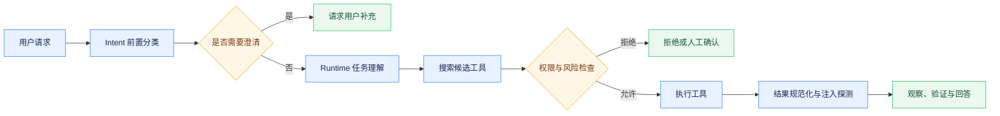

# 意图路由与工具安全

## 分层职责

job-buddy 将任务理解、业务路由和动作授权分层处理。`agent-intent` 是 Backend 调用的轻量前置服务，使用规则、加权评分和可选 LLM 兜底生成 `domain`、`intent`、`confidence`、`secondary`、`risk`、`needs_clarification`、`next_action`、`slots` 和 `router`。Runtime 内部任务理解仍是执行路由的权威依据；Intent 的结果作为提示和安全辅助，不能直接授予工具权限。

低置信且非高风险结果由 Clarification Gate 转为澄清；高风险结果保持确认或拒绝语义。`POST /v1/intent/review-transcript` 只读取用户消息和拟执行工具调用，剥离 assistant 解释，返回批准、要求人工确认或拒绝。该复核只判断用户证据与动作的一致性，最终执行还需经过 ToolGateway、权限策略、参数校验和沙箱。

## 工具治理链路

Runtime 工具通过定义自描述名称、用途、输入 Schema、风险、是否只读、超时和结果上限。Tool Search 先以词项和语义字段召回候选，再通过 RRF 融合并稳定排序，避免把全部工具 Schema 放入 Prompt。ToolGateway 负责候选收窄、权限检查、执行、结果规范化和注入风险探测。工具、网页、记忆与 Shell 输出均按不可信内容处理。

工具结果应保留可判定的成功状态、摘要、结构化数据、警告、下一步和 Trace 标识；错误需区分是否可重试及建议动作。当前注入探针命中特征时执行打标和告警，不自动宣称已经完成内容净化；调用方仍需限制长度、保留来源并避免将外部指令视为系统指令。

## Shell 与代码沙箱

`shell_exec` 默认调用 agent-sandbox 的 `POST /v1/shell`。Runtime 在提交前校验工作区、参数和危险模式；Sandbox 使用 srt 执行命令，默认只读、无网络，并限制敏感目录和子进程继承。服务不可达、超时或返回异常时失败关闭，不允许自动回退宿主机。

`JOB_BUDDY_SANDBOX_BASE_URL` 配置服务地址，`shell_sandbox_enabled=false` 只保留给明确的本地调试，此时结果标记 `sandboxed=false`，生产部署不得使用。字符串黑名单仅是快速拦截，不是安全边界；文件系统、网络、子进程和凭据必须同时隔离。

## Boss 与其他工具

`boss_browser` 在 Runtime 中是延迟加载的代理工具，具体实现位于 agent-tool，并通过 `/v1/tools/boss_browser/execute` 调用。Runtime 不保存 Boss 凭据。MCP 适配能力存在于 Runtime Core，但默认配置关闭；是否启用应由部署配置和工具权限共同决定，代码中存在适配器不代表部署已连接外部 MCP 市场。

## 降级与验证

Intent 不可用时 Backend 使用受控降级并记录标记；高风险规则、工具权限或 Transcript 复核失败不能静默放行。测试应覆盖规则与 LLM 降级、澄清阈值、三类复核决策、候选工具收窄、权限拒绝、统一结果、超时、注入标记、沙箱不可用时不回退及 `sandboxed` 标识。

任何风险规则或工具契约变化都必须同步更新 Capability、Eval 用例和安全审计。
