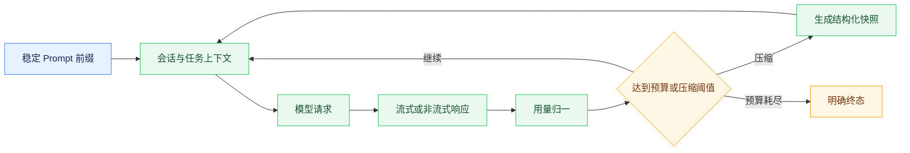

# 模型接入与上下文治理

## 能力边界

模型调用集中在 `agent-runtime/app/core/llm/`。业务模块不直接拼接供应商请求，Backend 只负责保存平台配置，并在请求需要时通过 `metadata.llm_service` 传递 provider、端点、模型、鉴权方式、缓存策略、超时和预算。未提供请求级连接时，Runtime 使用部署环境和 `config/config.yaml` 中的默认配置。

客户端支持 OpenAI 风格 Chat Completions，并处理 Anthropic 风格请求和流式用量字段。任务理解、Planner 与答案合成在同一次 run 中使用同一连接，避免阶段间切换模型。API Key、Token 和 Endpoint 必须外置，不得写入 Prompt、Trace、日志、Checkpoint 或默认配置。

## Prompt 与缓存

Prompt 资产位于 `agent-runtime/config/prompts/`，Profile 与 Workflow 分别位于 `config/profiles/` 和 `config/workflows/`。Profile 由 CapabilityRegistry 加载，Workflow 由 WorkflowRegistry 加载并校验 `profile`、`entry_capability` 与步骤类型；命中的 Workflow 仅以只读元数据参与任务理解、directive 和 Trace，外部业务动作仍由声明的 Backend/BFF 执行。请求按“稳定系统说明、工具定义、项目规则、会话上下文、当前消息”组织，动态时间、随机顺序和请求标识不得进入稳定前缀。工具注册与搜索结果按稳定顺序输出，减少无意义的缓存失效。

Runtime 的请求级缓存以 provider、model 和完整请求载荷的稳定序列化哈希为键，命中后返回隔离副本；模型服务端 Prompt Cache 则依赖字节级稳定前缀，两者需要分别观测。不同 provider、model 或关键参数之间不得复用缓存。缓存命中不产生实际模型用量，因此不计入本次 run 的 Token 消耗。

## Token 预算与上下文压缩

每个 run 使用独立用量累计器，统一记录 `prompt_tokens`、`completion_tokens`、`total_tokens` 和 `llm_calls`。非流式响应从 usage 读取，OpenAI 兼容流从末帧读取，Anthropic 风格流按其累计字段归一。`BudgetConfig.max_tokens` 为 0 时不设置 Token 上限；达到上限后 LoopController 以明确的预算终止原因停止后续执行。

上下文装配按最近消息、当前目标、观察结果、长期记忆引用和工具引用分层。历史观察超过数量或字符阈值时，ContextCompactor 把早期内容折叠为结构化快照，至少保留目标、修改、决策、失败和下一步；近期观察保持原文。压缩结果进入状态和 Checkpoint，并通过 Trace 记录前后体积，不能用简单截断代替。

## 风险与验证

供应商对流式 usage、工具调用和缓存参数的支持并不一致，不能对所有 OpenAI 兼容端点强制发送相同扩展字段。请求级凭据不得进入长期状态；模型发现、鉴权、限流和超时必须返回可归因错误。并发任务依赖 `contextvars` 隔离 run 用量，线程池执行必须显式传播上下文。

测试应覆盖请求级配置覆盖、流式和非流式响应、供应商字段归一、缓存键隔离、Token 预算、并发隔离、压缩触发、多轮去重、五要素快照及敏感信息保护。
