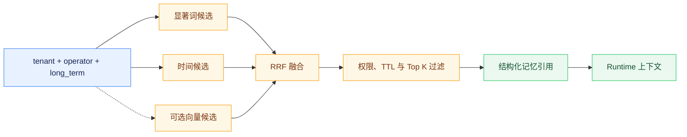

# 记忆管理与混合检索

## 记忆边界

系统区分当前步骤、当前任务、跨任务长期记忆和跨会话语义信息。当前会话由消息、ChatSessionState 和 Checkpoint 承载；稳定偏好、约束、面试复盘和用户明确保存的内容才进入 agent-memory。短期观察不能无筛选写入长期库，长期召回也不能覆盖当前会话事实。

agent-memory 是用户长期记忆的唯一内容存储。平台设置页通过 Backend 的 `AgentMemoryClient` 调用 `/v1/memories` 完成列表、新增、删除和清空；对话中的自动捕获同样写入该服务。Backend 只在 `platform_setting/global/settings` 保存启用、自动保存、自动使用和最大条数等策略，不再保存记忆正文。历史 `user-memory:*` 设置记录在用户首次访问记忆时迁入 agent-memory，全部成功后删除旧记录。

Runtime 通过 MemoryClient 在 ContextAssembler 中检索 `long_term` scope 的长期引用。代码和 `config/config.yaml` 的独立服务默认值为关闭，可通过 `JOB_BUDDY_MEMORY_ENABLED` 开启；仓库根目录 `.env.example` 面向完整本地栈联调而显式设为 `true`。Runtime 检索超时、连接失败或返回非法结构时使用空引用继续运行；设置页的显式增删失败则返回错误，不能回退到 Backend 本地副本。

Backend 的 `AgentMemoryClient` 使用独立于通用 Agent 长任务的短 HTTP 超时，默认连接 2 秒、单次读取 10 秒，分别由 `AGENT_MEMORY_CLIENT_CONNECT_TIMEOUT` 和 `AGENT_MEMORY_CLIENT_READ_TIMEOUT` 配置。列表与检索只对连接/读取异常、HTTP 408、429 和 5xx 执行统一预算内的有界重试；401、403、404 等确定性 4xx 不重试也不计入可用性熔断。创建、删除与清空可能产生歧义写入，因此失败后不自动重放。

`long_term` 始终由 agent-memory 的本地事实源处理：配置 PostgreSQL 时使用 PostgreSQL，只有未配置数据库的快速本地验证才使用进程内存。其他 scope 在 `TDAI_MEMORY_GATEWAY_URL` 已配置且网关未处于冷却期时优先调用 Gateway；网关超时、传输失败或返回错误时，当次请求有界降级到启动时已经选定的本地后端，并通过 `TDAI_MEMORY_GATEWAY_COOLDOWN_SECONDS` 控制后续探测冷却，默认冷却 60 秒。本地后端不会在运行中切换：配置了 PostgreSQL 后，其启动或运行故障不得动态降级为进程内存。

## 检索与排序

agent-memory 先构造显著词候选和时间兜底候选，再使用 BM25 与时间衰减信号通过 RRF 融合。启用 Embedding 时，服务调用 OpenAI 兼容 `/v1/embeddings` 计算候选相似度，达到阈值后作为第三路信号参与排序；Embedding 未配置、超时或响应异常时退化为词法和时间融合。

检索契约由 BM25、时间衰减和可选向量信号组成，不包含图数据库召回。Embedding 客户端使用批量请求和进程内内容哈希缓存，地址、模型和密钥必须由环境变量或 Secret 提供。

## 生命周期与安全

记忆支持 kind、scope、category、source、enabled、operator、version、TTL、更新、回滚、删除和过期清理。工作台用户记忆固定使用 `scope=long_term` 和 `kind=long_term`，`category` 区分 preference、constraint、interview 与 conversation。更新前保存历史修订，rollback 恢复最近版本；关闭或过期记录不参与召回，purge 清理到期记录及历史。创建、列表、检索、更新、回滚、删除和清理均记录操作者、动作、结果、标识和版本。

接口优先从 `X-Operator-Id` 获取身份，不能跨用户搜索或修改。记忆文本可能包含个人信息或提示注入内容，日志不得输出不必要的全文；进入 Prompt 前需要标明来源、限制长度并通过 Runtime 的注入探针。

PostgreSQL 持久化服务启动时，对建池与幂等 Schema 初始化中的瞬时断连、连接超时和数据库临时不可用执行有界指数退避重试，并在每次失败后销毁半初始化连接池。密码、库名、权限、SSL 校验和非法配置等确定性错误必须立即失败；达到重试上限后也必须终止启动，禁止静默切换到进程内存储。启动日志只记录脱敏后的目标地址、尝试次数和异常类型，不记录连接串、密码或原始异常文本。

## 验证

测试应覆盖设置页到 agent-memory 的请求头和字段映射、旧设置记忆迁移、自动保存去重、容量裁剪、列表与清空、中英文词法处理、BM25、时间衰减、RRF、向量阈值与失败降级、TTL、版本回滚、operator 隔离和审计；Gateway 路径还应覆盖 scope 分流、成功响应、失败降级和冷却恢复，并证明 `long_term` 不经 Gateway；PostgreSQL 启动路径还应覆盖瞬时故障恢复、重试耗尽、确定性错误快速失败、半初始化连接池清理和错误信息脱敏，且不得把数据库故障解释为动态内存降级。
