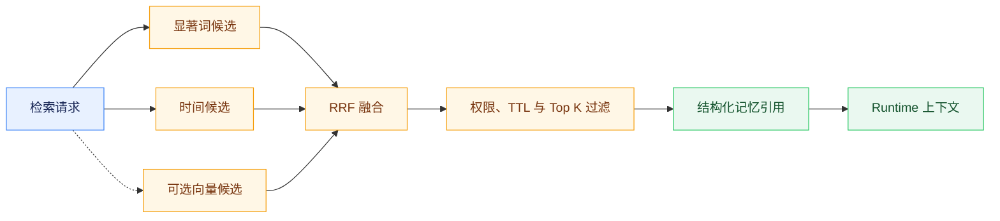

# 记忆管理与混合检索

## 记忆边界

系统区分当前步骤、当前任务、跨任务长期记忆和跨会话语义信息。当前会话由消息、ChatSessionState 和 Checkpoint 承载；稳定偏好、约束和目标才进入 agent-memory。短期观察不能无筛选写入长期库，长期召回也不能覆盖当前会话事实。

Runtime 通过 MemoryClient 在 ContextAssembler 中检索长期引用。代码和 `config/config.yaml` 的独立服务默认值为关闭，可通过 `JOB_BUDDY_MEMORY_ENABLED` 开启；仓库根目录 `.env.example` 面向完整本地栈联调，因需要实际覆盖 Memory 路径而显式设为 `true`，两者不是同一部署场景的冲突默认值。检索超时、连接失败或返回非法结构时使用空引用继续运行。记忆缺失是可观测降级，不应伪装成命中，也不能阻断普通对话。

## 检索与排序

agent-memory 先构造显著词候选和时间兜底候选，再使用 BM25 与时间衰减信号通过 RRF 融合。启用 Embedding 时，服务调用 OpenAI 兼容 `/v1/embeddings` 计算候选相似度，达到阈值后作为第三路信号参与排序；Embedding 未配置、超时或响应异常时退化为词法和时间融合。

检索契约由 BM25、时间衰减和可选向量信号组成，不包含图数据库召回。Embedding 客户端使用批量请求和进程内内容哈希缓存，地址、模型和密钥必须由环境变量或 Secret 提供。

## 生命周期与安全

记忆支持 kind、scope、operator、version、TTL、更新、回滚、删除和过期清理。更新前保存历史修订，rollback 恢复最近版本；过期记录不参与召回，purge 清理到期记录及历史。创建、检索、更新、回滚、删除和清理均记录操作者、动作、结果、标识和版本。

接口优先从 `X-Operator-Id` 获取身份，不能跨用户搜索或修改。记忆文本可能包含个人信息或提示注入内容，日志不得输出不必要的全文；进入 Prompt 前需要标明来源、限制长度并通过 Runtime 的注入探针。

## 验证

测试应覆盖中英文词法处理、BM25、时间衰减、RRF、向量阈值与失败降级、TTL、版本回滚、operator 隔离和审计。
